# 第一章：创建虚拟机

## 1.1 概述

* 创建虚拟机，本质上就类似购买一台没有安装操作系统的`裸机`。

## 1.2 创建虚拟机

* ① 文件 → 新建虚拟机：


* ② 选择`自定义`类型的配置：


* ③ 虚拟机硬件兼容性：下一步即可。


* ④ 选择`稍后安装操作系统`：


* ⑤ 选择虚拟机将安装的操作系统：


* ⑥ 设置虚拟机的`名称`和`安装位置`：

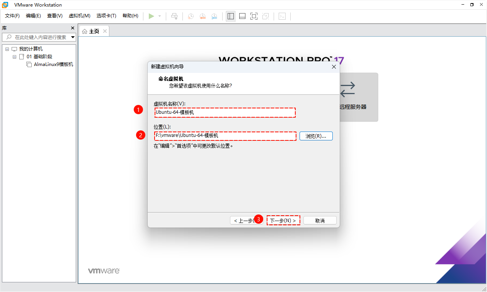

> [!WARNING]
>
> 一个虚拟机一个安装目录（文件夹），防止引起文件冲突问题！！！

* ⑦ 虚拟机中处理器的配置：下一步即可。

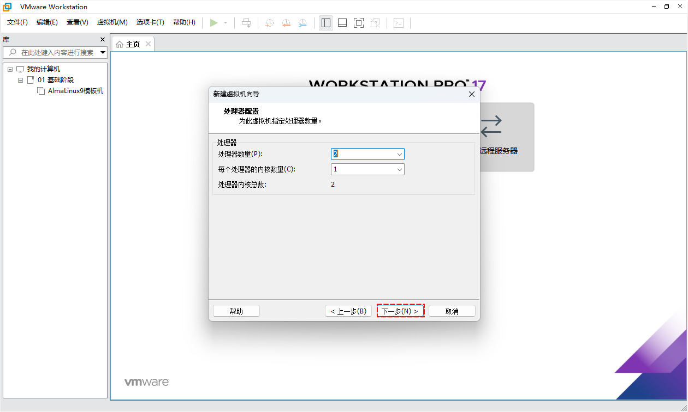

* ⑧ 设置虚拟机的`内存`：至少 2048 MB以上。

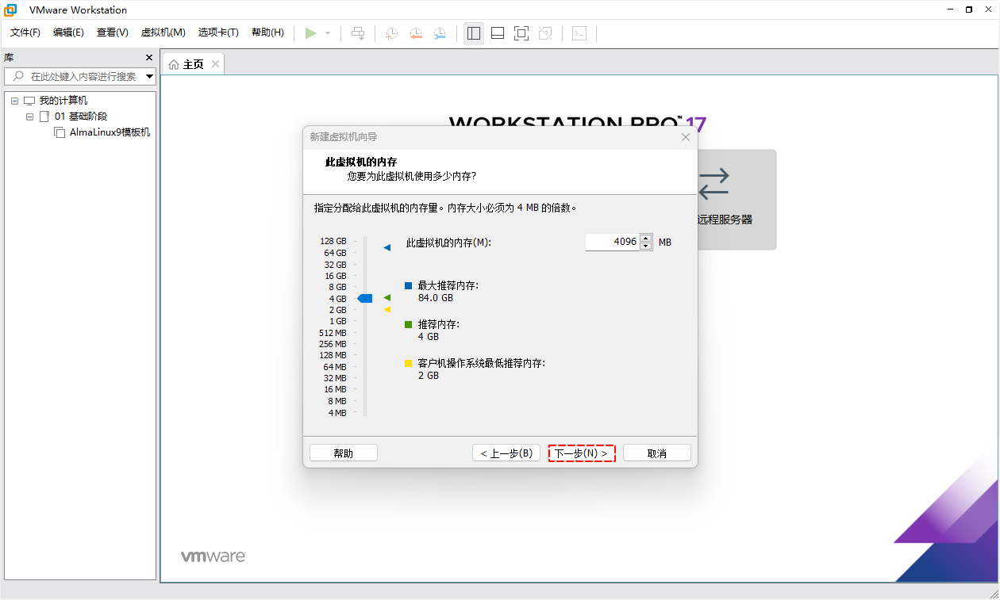

* ⑨ 设置虚拟机的`网络类型`：下一步即可。


* ⑩ 设置 I/O 控制器类型：下一步即可。


* ⑪ 选择磁盘类型：下一步即可。

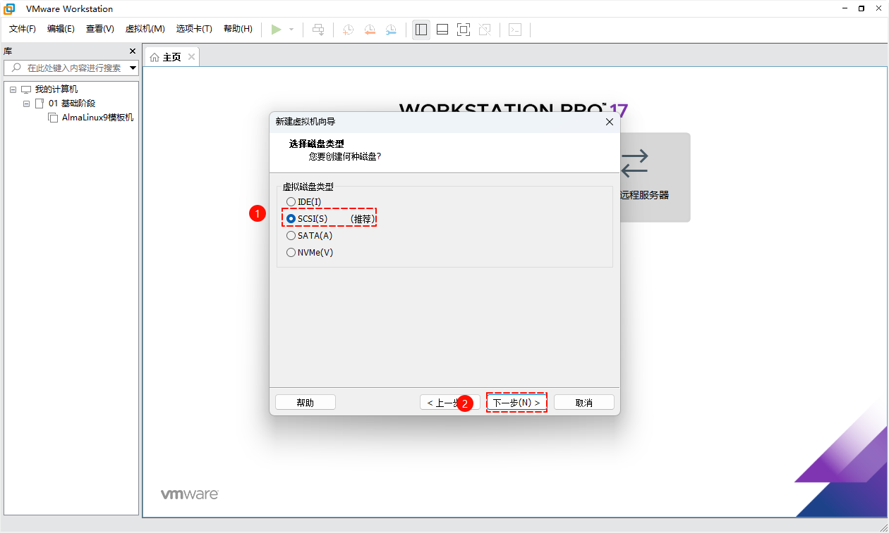

* ⑫ 选择磁盘：下一步即可。

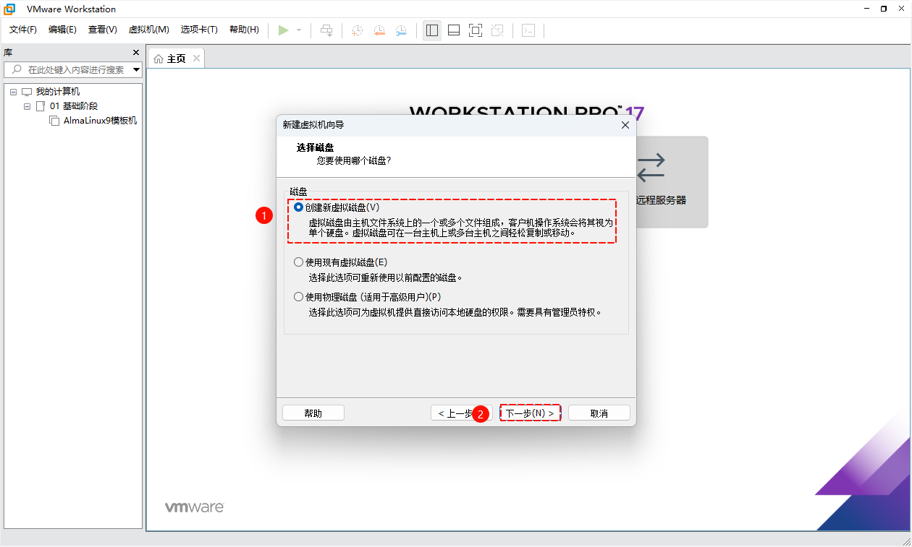

* ⑬ 选择磁盘容量：调整为 40 GB。

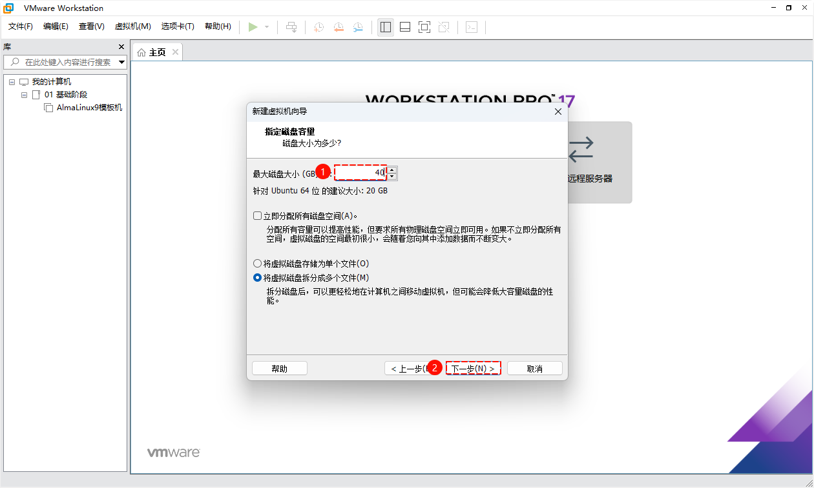

* ⑭ 指定磁盘文件：下一步即可。

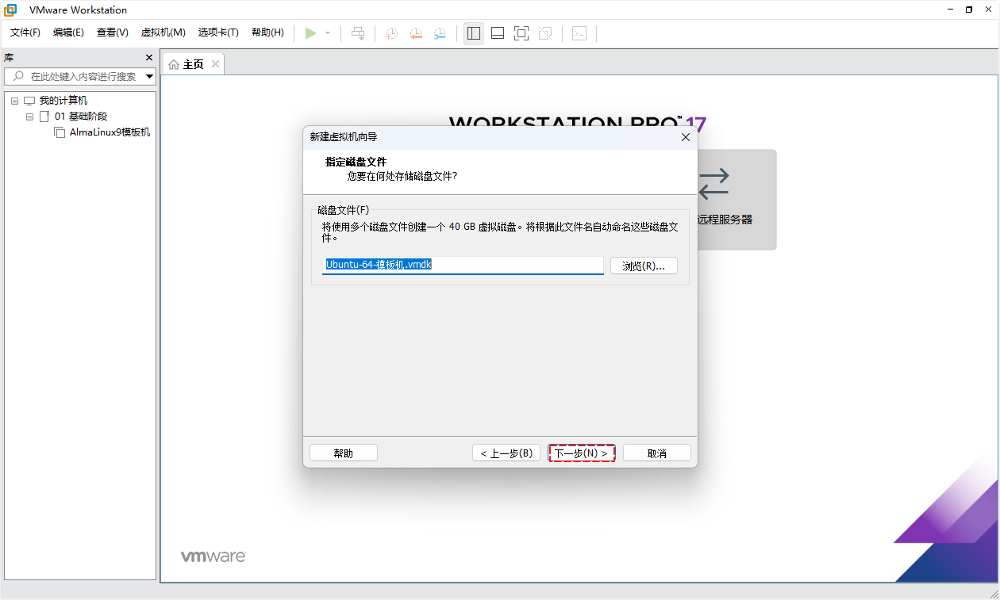

* ⑮ 创建虚拟机完毕：


* ⑯ 查看是否创建虚拟机成功：

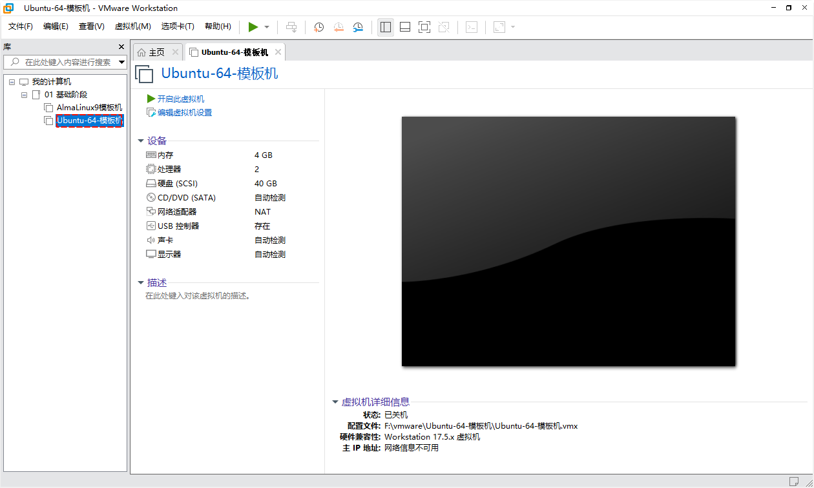

## 1.3 设置 CD/DVD

* 以前，我们在一台裸机上安装操作系统的时候，需要通过 DVD 或 U 盘将操作系统的 ISO 镜像文件，安装到裸机上；
* 同理，在使用虚拟机软件的时候，也需要此类步骤；其步骤如下：
* ① 编辑虚拟机设置：


* ② 选择硬盘上的 ISO 镜像文件：

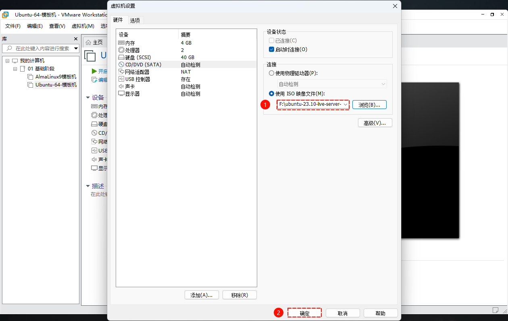

* ③ 查看是否配置成功：


# 第二章：安装 Ubuntu

## 2.1 概述

* Ubuntu 是一个基于 Debian 的开源 Linux 发行版，由 Canonical Ltd. 开发和维护。它以其用户友好的界面、强大的社区支持和广泛的软件库而受到欢迎。Ubuntu 提供了多种桌面环境，如 Unity、GNOME 和 KDE，以满足不同用户的需求。Ubuntu 系统不仅适用于个人用户，也被许多企业和教育机构采用。
* Ubuntu 的应用场景非常广泛，包括但不限于：
  * ① **个人桌面使用**：Ubuntu 提供了一个直观的图形用户界面，适合日常的办公、上网、娱乐和学习使用。
  * ② **服务器部署**：Ubuntu Server 版本是构建服务器的理想选择，支持各种服务器应用，如网站托管、数据库服务、邮件服务器等。
  * ③ **开发环境**：Ubuntu 提供了丰富的开发工具和库，适合软件开发者进行编程、测试和部署应用程序。
  * ④ **科学计算和数据分析**：Ubuntu 支持多种科学计算软件，如 MATLAB、Python、R 语言等，适用于数据科学、机器学习等领域。
  * ⑤ **教育和研究**：许多教育机构使用 Ubuntu 作为教学平台，因为它易于管理且成本低廉。
  * ⑥ **多媒体制作**：Ubuntu 上有许多多媒体制作工具，如音频编辑器 Audacity、视频编辑器 Kdenlive 和图形设计软件 Inkscape。
  * ⑦ **游戏**：虽然 Linux 游戏生态不如 Windows 丰富，但 Ubuntu 通过 Steam 和 Lutris 等平台支持许多游戏。
  * ⑧ **网络安全和渗透测试**：Ubuntu 社区提供了许多网络安全工具，如 Kali Linux，它是基于 Ubuntu 的专门用于网络安全和渗透测试的发行版。
  * ⑨ **物联网（IoT）**：Ubuntu Core 是为物联网设备设计的轻量级操作系统，适用于嵌入式系统和智能设备。
  * ⑩ **云计算和虚拟化**：Ubuntu 支持多种虚拟化技术，如：KVM、QEMU 和 Docker，适合构建云基础设施。

* Ubuntu 的灵活性和可定制性使其成为多种应用场景的理想选择，无论是个人用户还是专业开发者。

## 2.2 安装

* ① `开启此虚拟机`：


* ② `鼠标点击`进去之后，通过键盘上的`Enter`来确认：


> [!WARNING]
>
> 键盘上的`Enter`在这里，如下所示：
>
> 

* ③ 设置操作系统的`语言`环境为`English`：

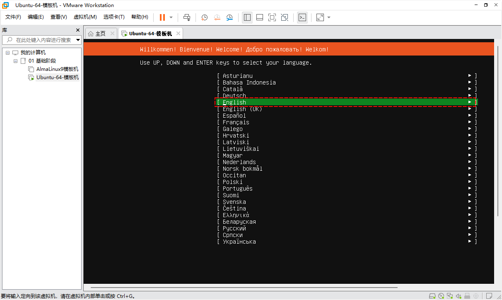

* ④ 键盘配置，通过键盘上的`Enter`来确认：


* ⑤ 选择系统安装的类型，通过键盘上的`Enter`来确认：


* ⑥ 设置静态 IP 地址，通过键盘上的`方向键`来选择，修改之后，通过键盘上的`Enter`来选择：


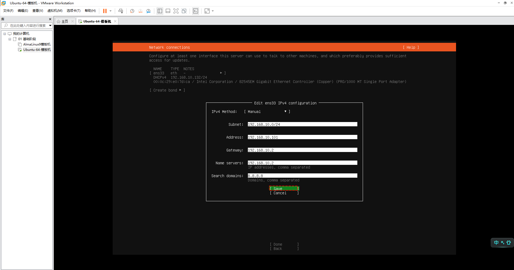

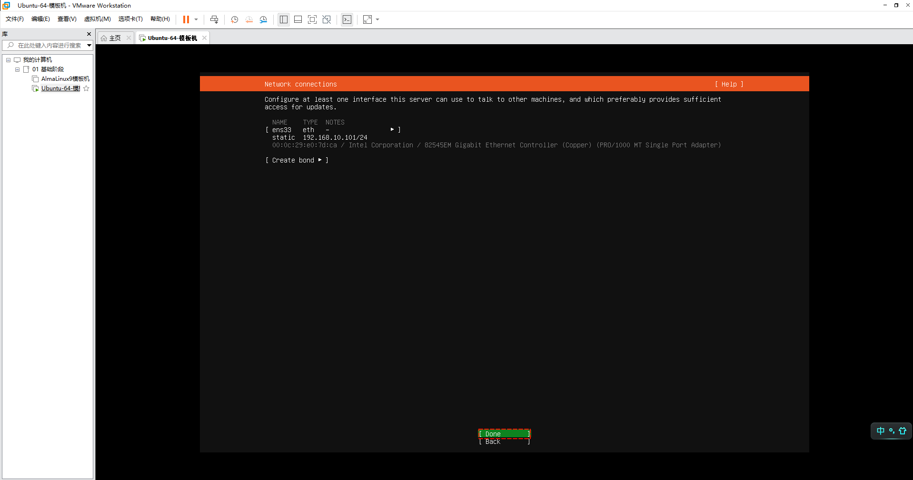

* 需要注意的是，本人的`网关`和`子网`配置如下：

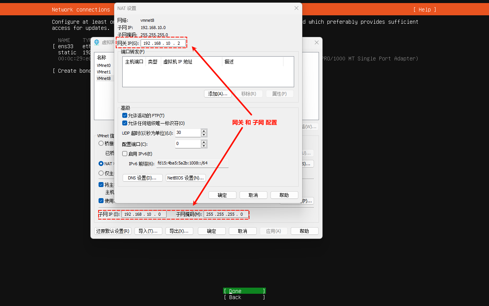

* ⑦ 配置代理，下一步即可：


* ⑧ 配置 Ubuntu 系统镜像源地址，下一步即可：

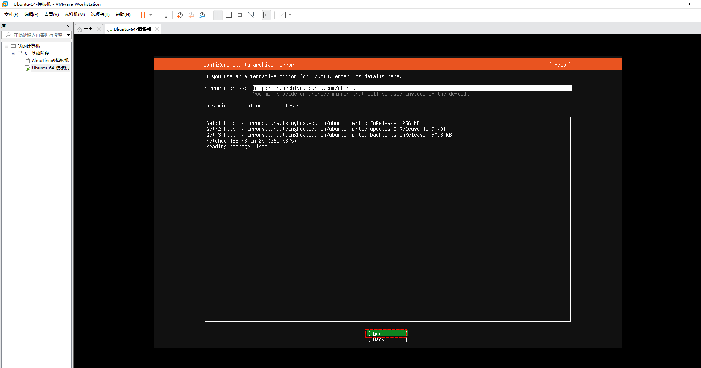

* ⑨ 引导式存储布局配置，保持默认，下一步即可：

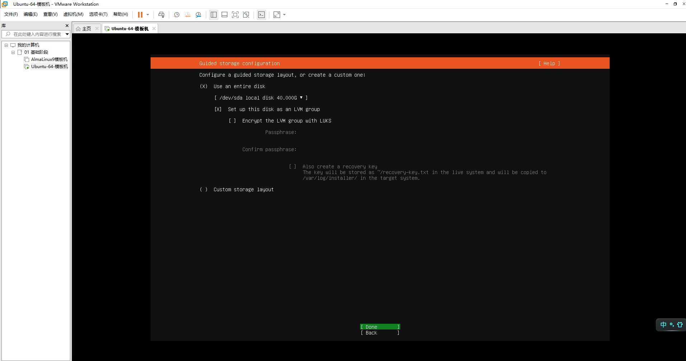


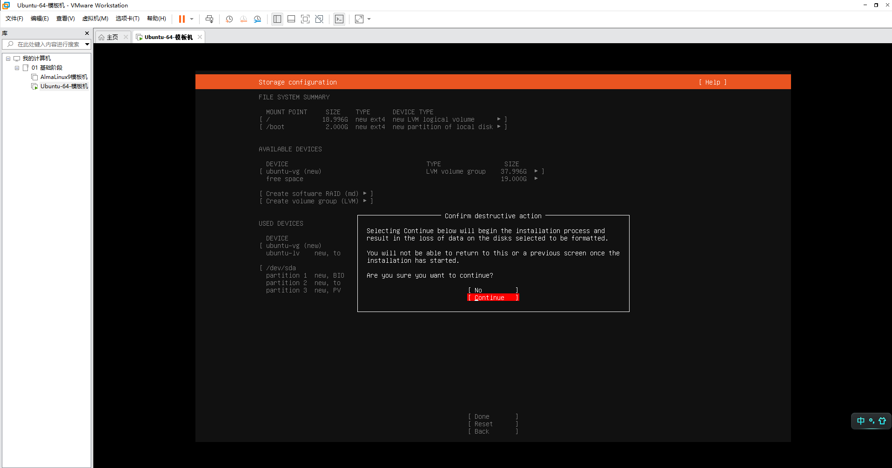

* ⑩ 配置用户名、密码等：

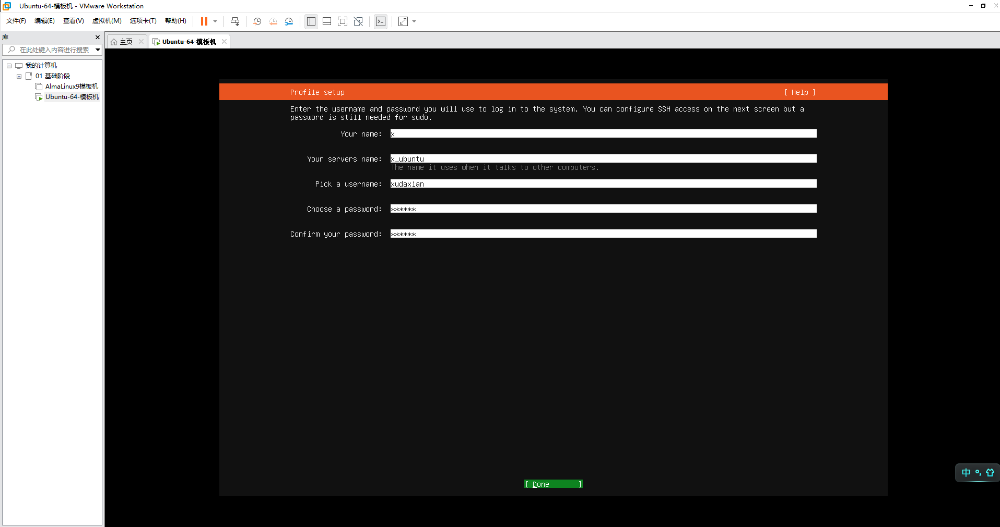

* ⑪安装 SSH 服务：


* ⑪ 一些精选的流行服务软件包，根据个人情况选择，下一步：


* ⑫ 配置完成，正式开始安装系统，漫长的等待……

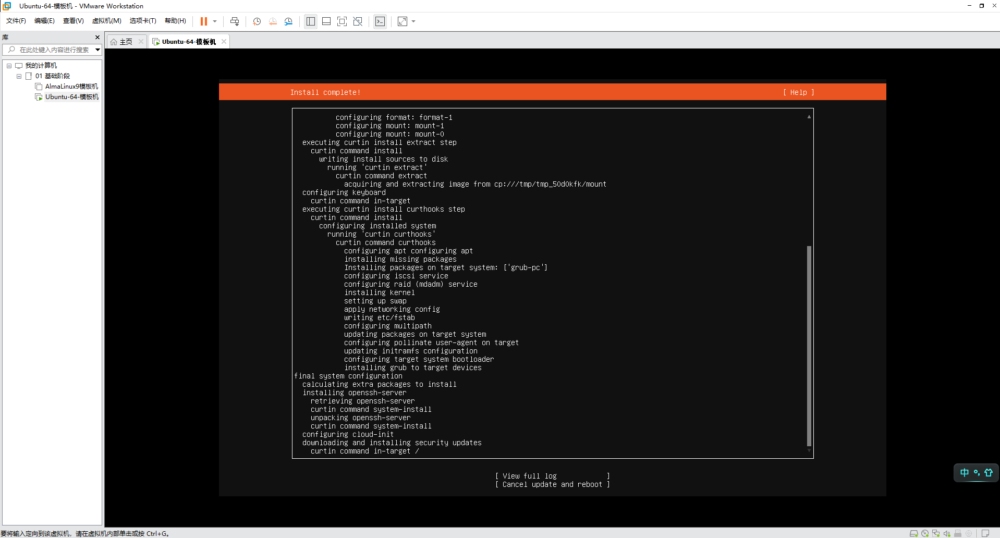

* ⑬ 安装完成之后，会提示`重启系统`，那就重启吧：


## 2.3 配置 root 密码以及开启远程访问

* ① 通过`用户名`和`密码`登录到系统中：

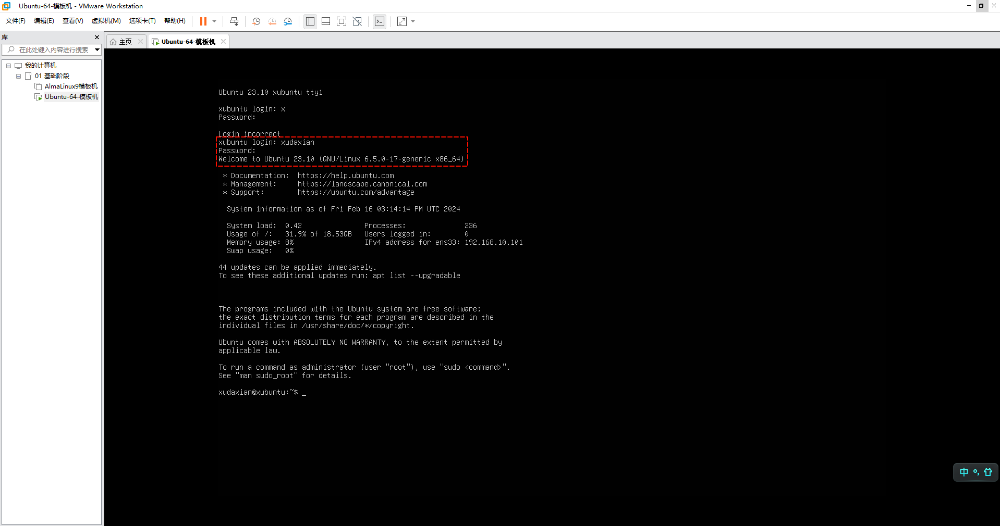

* ② 通过 `sudo passwd root` 修改 root 的密码：


* ③ 通过如下命令修改 ssh 配置文件，以便开启 root 远程访问：

```shell
sudo vim /etc/ssh/sshd_config
```

```shell
PermitRootLogin yes # 36 行
```


* ④ 重启 SSH 服务：

```shell
sudo apt-get -y install openssh-server
```

```shell
sudo systemctl enable --now ssh
```

```shell
sudo systemctl restart sshd
```

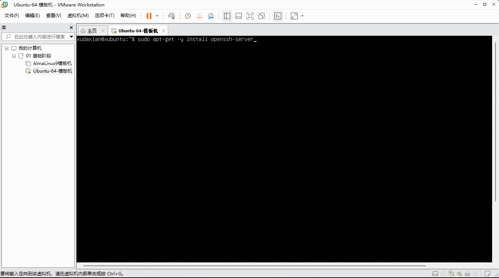

* ⑤ 通过 xshell 远程连接 Ubuntu ：

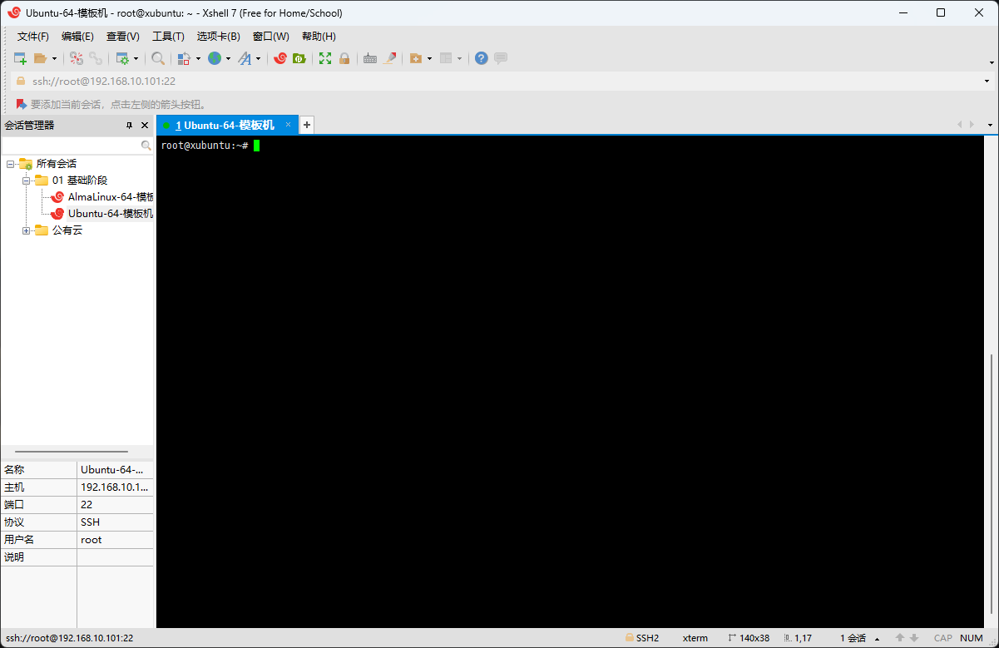