# 第一章：计算机介绍

## 1.1 家用计算机

### 1.1.1 家用台式电脑

* `家用台式电脑`（个人台式机）是专为`家庭用户`设计的计算机系统，通常包括：主机、显示器、键盘、鼠标等基本组件。


* 家用台式电脑的优点：
  * ① **性能稳定**：品牌台式机通常由专业技术人士配置，各个硬件搭配合理，经过多次专业检测，性能稳定，兼容性好。
  * ② **售后服务**：品牌台式机通常提供较好的售后服务，如：三年上门服务，这对于不熟悉电脑维修的用户来说是一个很大的优势。
  * ③ **定制化**：用户可以根据自己的需求和预算，选择不同的硬件配置，甚至在购买时进行定制，以满足特定的使用需求，如：游戏、视频编辑等。
  * ④ **升级方便**：台式机的主板通常预留有多个扩展插槽，方便用户日后升级硬件，如：增加内存、更换显卡等。
  * ⑤ **散热性能**：台式机由于体积较大，散热条件通常比笔记本电脑更好，有助于硬件长期稳定运行。
* 家用台式机电脑的缺点：
  * ① **价格**：品牌台式机由于品牌附加值和严格的品控，价格可能相对较高，尤其是国际知名品牌，如：联想、惠普、戴尔等。
  * ② **体积和便携性**：台式机体积较大，不便于搬运，缺乏笔记本电脑的便携性。
  * ③ **耗电量**：台式机尤其是高性能机型，耗电量可能较大，长时间使用会增加电费支出。
  * ④ **噪音问题**：由于散热需求，台式机可能需要使用风扇，这可能会产生一定的噪音，尤其是在高负载时。
  * ⑤ **组装成本**：如果用户选择自行组装台式机，虽然可以节省成本，但需要一定的电脑知识和组装技能，且可能面临兼容性和售后服务的问题。

> 温馨提示ℹ️：
>
> * ① 在选择家用台式电脑时，用户应根据自己的实际需求、预算以及对电脑知识的了解程度来决定购买品牌台式机还是自行组装。
> * ② 品牌台式机更适合对售后服务有较高要求、不太熟悉电脑硬件的用户，而自行组装则适合对电脑有一定了解、追求性价比和个性化配置的用户。

### 1.1.2 笔记本电脑

* `笔记本电脑`是一种`便携式计算机`，设计用于在不同地点使用。它们通常具有内置的显示屏、键盘和触摸板，以及可充电电池，使得用户可以在没有外部电源的情况下使用。


* 笔记本电脑的优点：
  * ① **便携性**：笔记本电脑的最大优点是便携，用户可以轻松地将其从一个地点移动到另一个地点，非常适合需要经常出差或在外工作的用户。
  * ② **一体化设计**：笔记本电脑集成了所有必要的硬件，如：CPU 、内存、硬盘、显示屏和电池，用户无需额外购买或连接外部设备即可使用。
  * ③ **低能耗**：由于设计紧凑，笔记本电脑通常具有较低的能耗，适合长时间使用而不必担心电池续航问题。
  * ④ **成套能力强**：笔记本电脑通常预装操作系统和必要的软件，用户开机即可使用，无需进行复杂的设置。
  * ⑤ **多样化选择**：市场上有各种品牌和型号的笔记本电脑，用户可以根据自己的需求选择不同的配置和设计。

* 笔记本电脑的缺点：
  * ① **性能限制**：由于体积和散热的限制，笔记本电脑的性能通常不如台式机，尤其是在高端游戏和专业级应用方面。
  * ② **升级困难**：笔记本电脑的硬件升级相对困难，许多组件如：CPU 和显卡，通常是焊接在主板上的，无法更换。
  * ③ **散热问题**：紧凑的设计可能导致散热不佳，长时间高负载运行可能会导致过热。
  * ④ **维修成本**：笔记本电脑的维修通常比台式机更昂贵，因为更换部件或修理可能需要专业工具和技术。
  * ⑤ **屏幕尺寸和分辨率**：虽然笔记本电脑的屏幕尺寸有多种选择，但通常无法与台式机的大屏幕和高分辨率显示器相比。

> 温馨提示ℹ️：
>
> * ① 在选择笔记本电脑时，用户应考虑自己的使用场景、性能需求、预算以及对便携性的需求。
> * ② 对于需要在外工作或学习的用户，笔记本电脑的便携性是一个重要的考虑因素；而对于追求高性能和大屏幕体验的用户，台式机可能是更好的选择。

## 1.2 服务器

### 1.2.1 概述

* 什么是服务器？
  * 服务器是一种高性能的计算机系统，它被设计用来处理多个客户端的请求，提供数据、资源、服务和应用程序。
  * 服务器在网络环境中充当中心节点，支持各种业务流程和网络服务。
  * 与个人电脑（客户端）相比，服务器通常具有更高的性能、更强的稳定性和可靠性，以及更高级的网络连接能力。
  * 服务器在网络环境中扮演着核心角色，它们可以是物理服务器，也可以是虚拟服务器，运行在云计算环境中。

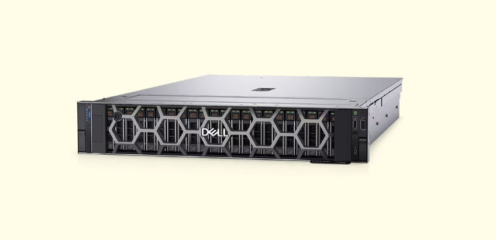

* 服务器的功能：
  * ① **数据管理**：存储、备份和恢复数据，确保数据的安全性和可靠性。
  * ② **网络服务**：提供网络连接、路由、防火墙、VPN 等网络相关服务。
  * ③ **应用托管**：运行各种应用程序，如数据库、邮件服务器、Web服务器等，供客户端访问。
  * ④ **虚拟化**：通过虚拟化技术，可以在单个物理服务器上创建多个虚拟服务器（VM），每个 VM 都可以运行不同的操作系统和应用程序。
  * ⑤ **计算服务**：提供高性能计算资源，如：科学计算、数据分析、图形渲染等。
  * ⑥ **安全性**：提供安全服务，如：入侵检测、防病毒、访问控制等，保护网络和数据不受威胁。
  * ⑦ **远程访问**：允许用户通过远程桌面或其他远程访问工具，从任何地方连接到服务器。
  * ⑧ **负载均衡**：在多个服务器之间分配网络流量，提高系统的可用性和响应速度。

> 温馨提示ℹ️：服务器的配置和功能可以根据不同的业务需求进行定制，以满足特定的性能和可靠性要求。

### 1.2.2 服务器的尺寸

* `笔记本电脑`通常是按照`显示器屏的大小`来划分，如：14 英寸、16 英寸等。


* 笔记本电脑的 `14` 英寸是按照`显示器屏`的`对角线长度`来计算的，并且 `1` 英寸是 `2.54` 厘米（cm），那么 14 英寸的笔记本电脑的`显示器屏`的`对角线长度`大约是 `14 * 2.54 cm = 35.56 cm`。

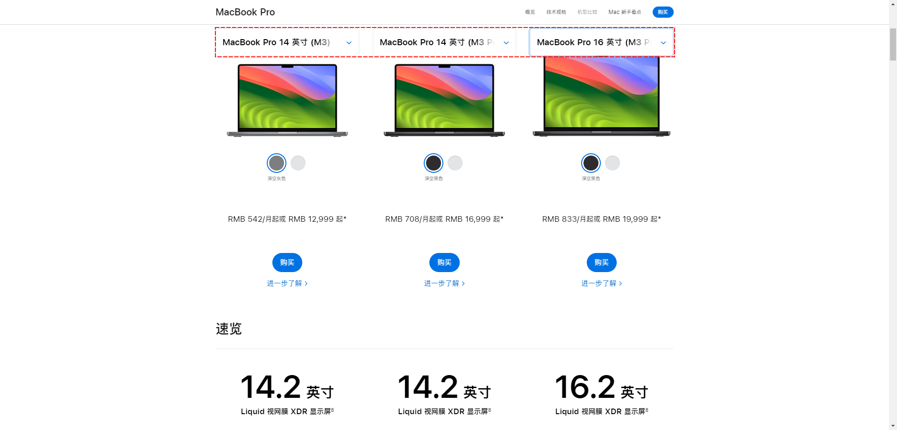

* 笔记本电脑的 `14 英寸`、`16 英寸`并不能直接反应实际屏幕的宽度和高度，因为屏幕的`宽高比`，如：`16:9` 、`16:10` 或 `4:3` 等，会`影响`实际的宽度和高度尺寸。

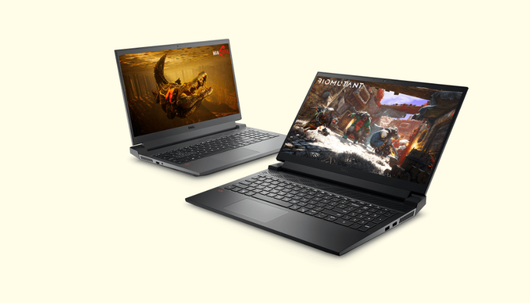

* 对于 `14` 英寸，宽高比是 `16:9` 的计算如下：

```
假设宽度使用 w 表示，高度使用 h 表示，对角线使用 d 表示，
根据勾股定理：
	w ^ 2 + h ^ 2 = d ^2
又因为对角线长度是 d = 14 * 2.54 cm = 35.56 cm，那么
	w ^ 2 + h ^ 2 = 35.56 ^2
又因为宽高比是 16:9 ，那么
   w : h = 16 : 9 => w = (16/9)h
那么，
  ((16/9)h) ^ 2 + h ^ 2 = 35.56 ^ 2
所以，h = 16.53 cm ，而 w = 25.41 cm  
```

* 对于 `14` 英寸，宽高比是 `4:3` 的计算如下：

```
假设宽度使用 w 表示，高度使用 h 表示，对角线使用 d 表示，
根据勾股定理：
	w ^ 2 + h ^ 2 = d ^2
又因为对角线长度是 d = 14 * 2.54 cm = 35.56 cm，那么
	w ^ 2 + h ^ 2 = 35.56 ^2
又因为宽高比是 4:3 ，那么
   w : h = 4 : 4 => w = (4/3)h
那么，
  ((4/3)h) ^ 2 + h ^ 2 = 35.56 ^ 2
所以，h = 15.65 cm ，而 w = 20.87 cm  
```

* 但是，对于`服务器`的`尺寸`，通常使用 `U` 来表示（1 U = 1.75 英寸 = 4.45 cm），这是根据美国电子工业协会（EIA）的标准来定义的，并且一般是用来`描述服务器的高度`，对于宽度则通常是 19 英寸（19 * 2.54 = 48.26 cm），这是机架式设备的通用宽度，也是机柜的标准尺寸。

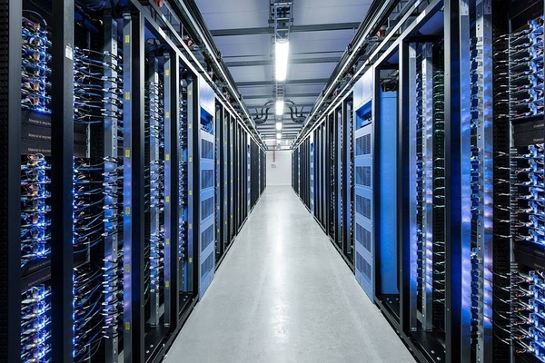

* 以下是一些常见的服务器尺寸：

  * **1U 服务器**：高度为 4.45 厘米（1.75 英寸），宽度为 19 英寸。1U 服务器体积较小，适合空间有限的环境，但扩展性有限。
  * **2U 服务器**：高度为 8.89 厘米（3.5 英寸），宽度为 19 英寸。2U 服务器提供了更多的空间来安装额外的硬件组件，如：更多的硬盘驱动器或扩展卡。
  * **4U 服务器**：高度为 17.78 厘米（7 英寸），宽度为 19 英寸。4U 服务器提供了大量的空间，适合需要大量存储或高性能计算的应用。

### 1.2.3 服务器的分类

* 服务器可以根据不同的标准进行分类，以下是一些常见的服务器分类方式：

* 按应用层次划分：

  * ① **入门级服务器**：通常只使用一块 CPU，适用于小型企业或个人使用，处理能力有限。
  * ② **工作组级服务器**：支持 1 - 2 个处理器，适用于中等规模的网络环境，提供较好的性能和可靠性。

  * ③ **部门级服务器**：支持 2 - 4 个处理器，适用于大型企业中的部门或工作组，具有较高的可靠性和性能。
  * ④ **企业级服务器**：支持 4 个或更多处理器，适用于大型企业的核心应用，提供最高级别的可靠性、性能和可扩展性。

* 按用途划分：

  * ① **通用型服务器**：没有为特定服务专门设计，可以提供多种服务功能。
  * ② **专用型服务器**（或功能型服务器）：专门为某一种或几种功能专门设计的服务器，如：数据库服务器、邮件服务器等。

* 按机箱结构划分：

  * ① **塔式服务器**：塔式服务器不是机架式的，它们通常直立放置在地面或桌子上。塔式服务器的高度和宽度可以根据具体型号而变化，但通常比机架式服务器要大。

  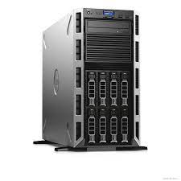

    * ② **刀片式服务器**：刀片式服务器是一种高度集成的服务器，它们可以插入到一个大型的机架中，每个刀片服务器都有自己的 CPU、内存和存储，但共享电源和冷却系统。

  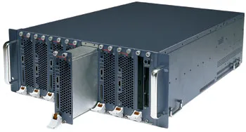

    * ③ **机架式服务器**：设计为安装在标准的 19 英寸机架内，节省空间，便于集中管理。

  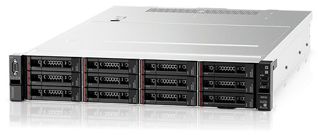

  * ④ **机柜式服务器**：大型服务器，通常包含多个服务器单元，适用于需要大量计算资源的场景。

  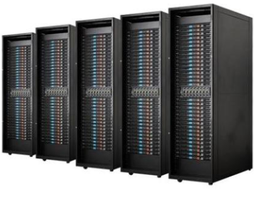

* 按处理器架构划分：
  * ① **CISC 架构服务器**：复杂指令集计算机，如：Intel x86 架构。
  * ② **RISC 架构服务器**：精简指令集计算机，如：ARM 架构。
  * ③ **VLIW 架构服务器**：超长指令集架构，如：IA-64。
* 按网络规模划分：
  * ① **小型服务器**：适用于小型网络或个人使用。
  * ② **中型服务器**：适用于中型企业或部门级应用。
  * ③ **大型服务器**：适用于大型企业或数据中心，处理大量数据和高并发请求。
* 按品牌划分：不同的服务器品牌，如：IBM、HP、Dell、Lenovo、Huawei 等，各自提供不同系列和配置的服务器产品。

>温馨提示ℹ️：
>
>* ① 选择服务器尺寸时，需要考虑服务器的用途、所需的扩展能力、机房空间以及机柜的尺寸。
>* ② 在`数据中心`或`企业级`环境中，通常会使用`机架式`服务器，因为它们可以有效地利用空间，便于管理和维护。
>* ③ `塔式`服务器则更适合`小型办公室`或`家庭环境`。
>* ④ `刀片式服务器`则适用于需要`高密度计算资源`的场景；目前，对于互联网企业来说，使用的不是很多。


# 第二章：计算机硬件介绍

## 2.1 个人计算机硬件

* 个人计算机（Personal Computer，简称 PC）是为个人用户设计的计算机系统，它包括了一系列硬件组件，这些组件共同工作以执行各种计算任务。

* 以下是个人计算机的主要硬件组件介绍：

  * ① **中央处理器（CPU）**：CPU 是计算机的大脑，负责执行程序指令和处理数据。

  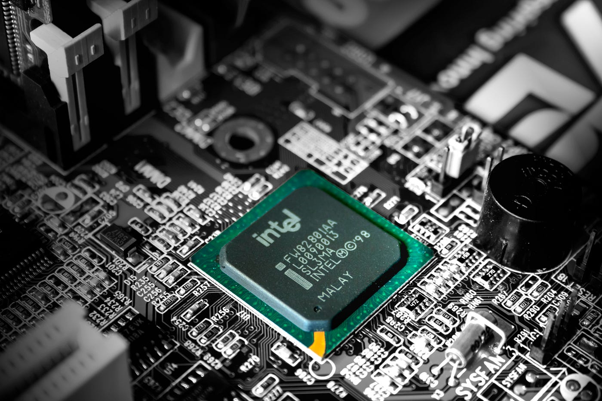

  * ② **内存（RAM）**：内存是计算机的短期记忆，用于临时存储正在运行的程序和数据。

  

  * ③ **硬盘驱动器（HDD）和固态驱动器（SSD）**：用于长期存储数据和程序。

  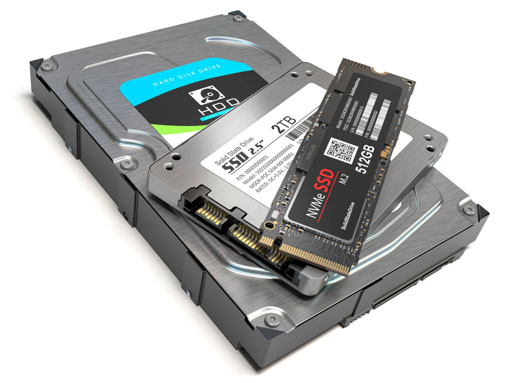

  * ④ **主板（Motherboard）**：主板是连接和集成所有其他硬件组件的平台。

  

  * ⑤ **电源供应器（PSU）**：为计算机的各个组件提供稳定的电力。

  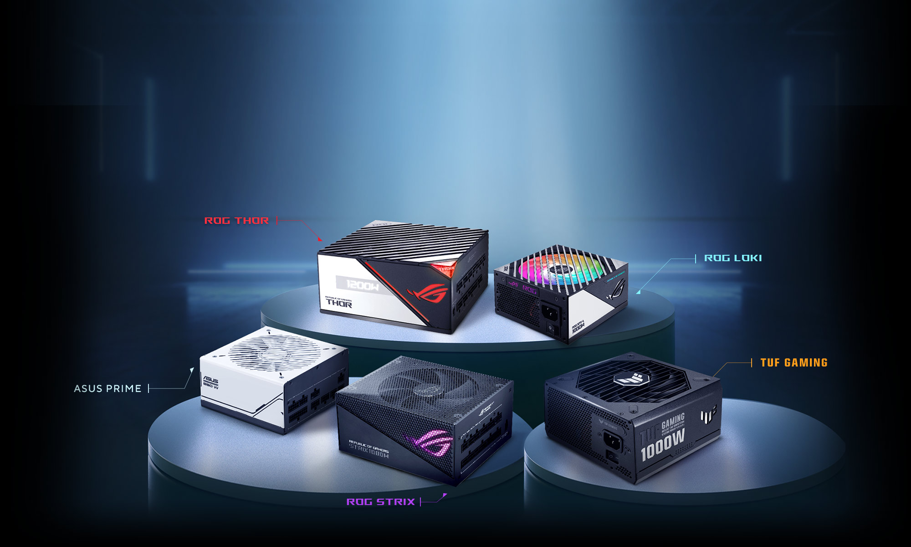

  * ⑥ **显卡（GPU）**：处理视频输出，加速图形和图像处理。

  

  * ⑦ **外围设备**：

    - **显示器**：显示计算机生成的图像和视频。

    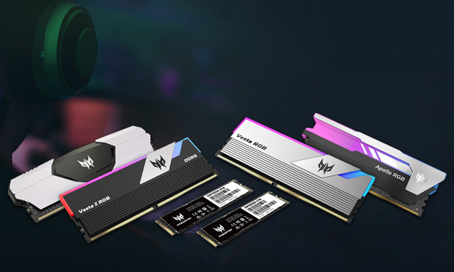

    - **键盘和鼠标**：用户输入设备。

    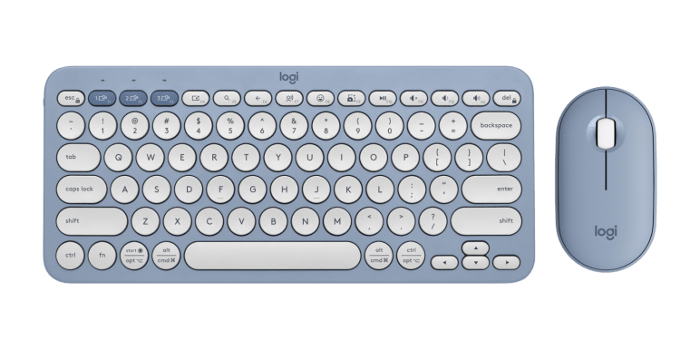

    - **打印机**：打印文档和图像。

    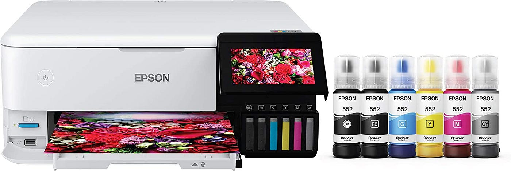

    - **外部存储设备**：如：USB 闪存驱动器、外部硬盘（移动硬盘）等，用于数据传输和备份。

    

    - **网络接口**：如：以太网卡、Wi-Fi 适配器，用于连接网络。

    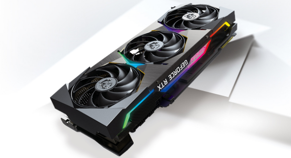

  * ⑧ **散热系统**：保持硬件组件在适宜的温度下运行，防止过热。

  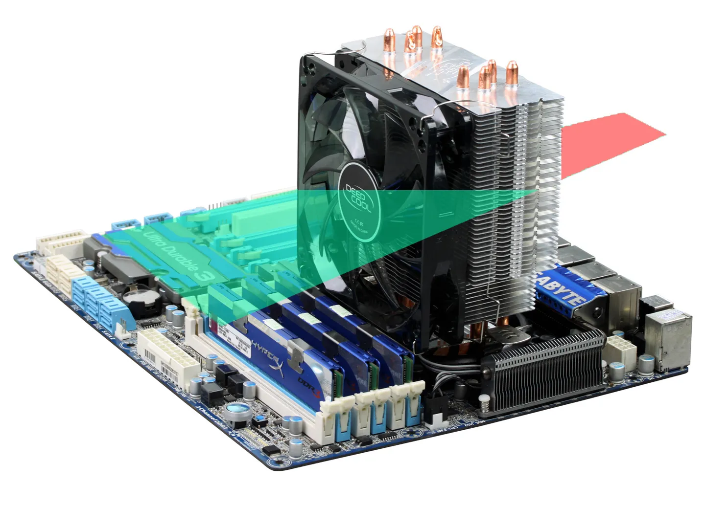

  * ⑨ **声卡（Audio Card）**：处理音频信号，提供声音输出。

  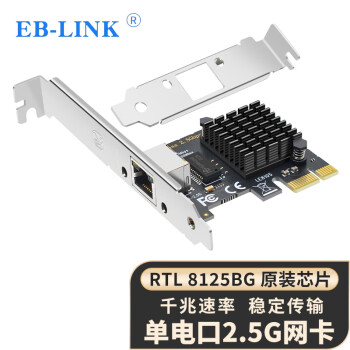

  * ⑩ **外围接口**：通常都位于主板之上
    * **USB**：用于连接各种外部设备。
    * **HDMI/DP**：用于传输视频和音频信号到显示器。

> 温馨提示ℹ️：
>
> * ① 这些硬件组件共同工作，使得计算机能够执行复杂的任务，从简单的文档编辑到复杂的图形渲染和数据处理。
> * ② 随着技术的发展，硬件的分类和功能也在不断演进。

## 2.2 服务器硬件

* 服务器是设计用来处理大量数据和请求的高性能计算机，它们通常在网络环境中提供资源、服务和数据管理。

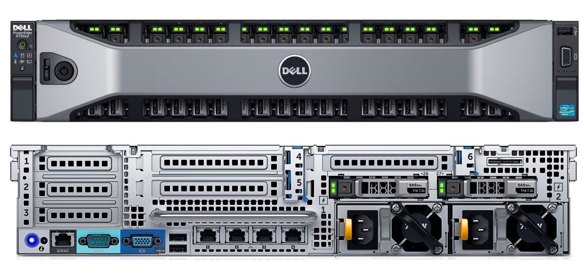

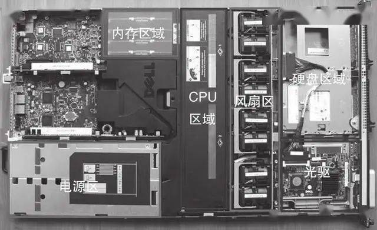

> 温馨提示ℹ️：通常而言，服务器是没有鼠标、键盘、显示器等输入输出设备的，都是通过远程软件控制服务器的。

* 以下是服务器的主要硬件组件介绍：
  * ① **中央处理器（CPU）**：
    * 服务器的 CPU 通常比个人电脑的 CPU 更强大，能够处理更多的并发任务和更高的计算负载。
    * 它们可能包含多个核心，以支持多线程处理和更高的处理速度。
  * ② **内存（RAM）**：
    * 服务器需要大量内存来支持多用户访问和高并发数据处理。
    * 内存的速度和容量直接影响服务器的响应速度和处理能力。
  * ③ **存储系统**：
    * 硬盘驱动器（HDD）：用于存储大量数据，通常用于存储不常访问的数据。
    * 固态驱动器（SSD）：提供更快的数据访问速度，常用于操作系统、应用程序和频繁访问的数据。
    * **`RAID 阵列`**：通过将多个硬盘组合在一起，提高数据的冗余性和可靠性，防止数据丢失。
  * ④ **主板（Motherboard）**：服务器主板支持更多的扩展卡和接口，以适应不同的硬件需求和扩展性。
  * ⑤ **电源供应器（PSU）**：
    * 为服务器提供稳定和可靠的电力。
    * 服务器的 PSU 通常具有冗余特性，以确保在硬件故障时仍能继续供电。
  * ⑥ **网络接口卡（NIC）**：
    * 提供高速网络连接，支持服务器与客户端之间的数据传输。
    * 服务器可能配备多个 NIC 以实现负载均衡和冗余。
  * ⑦ **散热系统**：
    * 服务器在高负载下运行时会产生大量热量，因此需要高效的散热系统来保持硬件的稳定运行。
    * 这可能包括：风扇、液冷系统或热管。
  * ⑧ **冗余和备份系统**：为了确保服务的连续性和数据的安全性，服务器可能配备冗余电源、冗余风扇和备份存储解决方案。
  * ⑨ **扩展卡和接口**：服务器主板上的扩展卡插槽允许添加额外的功能，如：更多的网络连接、额外的存储控制器或其他专用硬件。
  * ⑩ **机箱和机架**：服务器机箱和机架设计用于容纳和保护内部硬件，同时提供良好的散热和易于维护的结构。

> 温馨提示ℹ️：
>
> * ① 服务器是有`远程管理卡`的，我们可以通过它来远程管理服务器，如：设置 IP、远程开关机、在线重装系统等。
> * ② 服务器一定会有 `RAID 阵列`的，其通过将多个硬盘组合在一起，提高数据的冗余性和可靠性，防止数据丢失。


# 第三章：计算机系统基础

## 3.1 冯·诺依曼体系结构

* `冯·诺依曼`是一位多才多艺的科学家，他在数学、物理学、计算机科学、经济学等领域都有杰出的贡献。


* `冯·诺依曼`的主要成就：
  * 在计算机科学领域的最著名贡献是提出了`冯·诺依曼`体系结构，这是现代计算机设计的基础。
  * 促进了计算机的可编程性和通用性，使得计算机能够执行各种复杂的任务。
  * 对核武器设计、自动化控制系统、人工智能等领域的发展产生了重要影响。
  * ……
* `冯·诺依曼`体系结构的特点如下：
  * ① **存储程序**：程序指令和数据都存储在计算机的内存中，这使得程序可以在运行时修改。
  * ② **二进制逻辑**：所有数据和指令都以二进制形式表示。
  * ③ **顺序执行**：指令按照它们在内存中的顺序执行，但可以有条件地改变执行顺序。
  * ④ **五大部件**：计算机由`运算器`、`控制器`、`存储器`、`输入设备`和`输出设备`组成。
  * ⑤ **指令结构**：指令由操作码和地址码组成，操作码指示要执行的操作，地址码指示操作数的位置。
  * ⑥ **中心化控制**：计算机的控制单元（CPU）负责解释和执行指令，控制数据流。


## 3.2 计算机数据记录单位

* 计算机数据记录单位是根据数据大小和处理需求而定义的一系列标准化的度量单位。
* 以下是一些常见的计算机数据记录单位，从最小的位（bit）到较大的数据单位：
  * ① **位（bit）**：`位`是`计算机数据`的`最小单位`，代表一个二进制数字，即 0 或 1 。
  * ② **字节（byte）**：通常情况下，1 字节等于 8 位。`字节`是计算机`处理`和`存储`数据时`基本单位`。
  * ③ **千字节（KB）**：1 KB 等于 1024 B 。
  * ④ **兆字节（MB）**：1 MB 等于 1024 KB 。
  * ⑤ **吉字节（GB）**：1 GB 等于 1024 MB 。
  * ⑥ **太字节（TB）**：1 TB 等于 1024 GB 。
  * ⑦ **拍字节（PB）**：1 PB 等于 1024 TB 。
  * ⑧ **艾字节（EB）**：1 EB 等于 1024 PB 。

> 温馨提示ℹ️：
>
> * ① 在实际使用中，尤其是在硬盘和存储设备的宣传中，有时会使用十进制换算，即 1 KB = 1000 字节，1 MB = 1000 KB，1 GB = 1000 MB等。这种换算方式与二进制换算不同，可能会导致实际存储容量与标称容量之间的差异。
> * ② 在办理`网络带宽（宽带）`的时候，我们会经常听到 `百兆网（100M）` 或 `千兆网（1000M）`这样的字眼；实际上，在网络传输中是以 Mb/s 为单位，那么换算过来就是 100 Mb/s = 100 Mb/s ÷ 8 = 12.5 MB/s ，并且这只是理论下载速度的峰值，实际还会受传输设备、线路、服务器带宽影响，实际下载速度也就在 3 MB/s - 10 MB/s 。

## 3.3 操作系统

* 操作系统（Operating System，简称 OS）是管理计算机硬件与软件资源的系统软件，它为用户和其他软件提供了一个与硬件交互的界面，同时也是计算机系统的核心和基石。

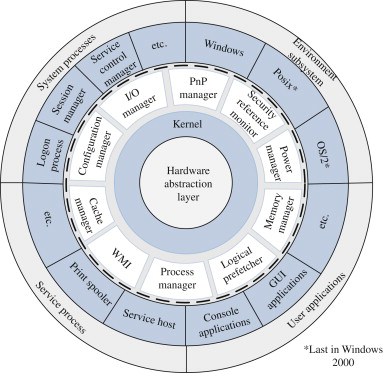

* 操作系统的功能：
  * ① **资源管理**：
    - 操作系统负责管理计算机的硬件资源，如：CPU、内存、存储设备和输入输出设备。
    - 它通过分配和回收资源来确保多个程序和进程能够有效地共享这些资源。
  * ② **进程管理**：
    - 操作系统通过创建、调度和终止进程来管理程序的执行。
    - 它使用进程表来跟踪每个进程的状态，并根据调度算法决定哪个进程应该获得 CPU 时间。
  * ③ **内存管理**：
    - 操作系统负责分配和回收内存空间，确保每个进程都有足够的内存来执行。
    - 它使用内存管理单元（MMU）来处理虚拟内存和物理内存之间的映射。
  * ④ **文件系统**：
    - 操作系统提供文件系统来组织、存储和检索数据。
    - 它允许用户创建、读取、写入、删除和移动文件，同时维护文件的权限和属性。
  * ⑤ **设备控制**：
    - 操作系统通过设备驱动程序与硬件设备通信，控制设备的输入输出操作。
    - 它为硬件设备提供了标准化的接口，使得应用程序无需关心具体的硬件细节。
  * ⑥ **用户界面**：
    - 操作系统提供了用户界面，可以是命令行界面（CLI）或图形用户界面（GUI）。
    - 用户界面使得用户能够与操作系统交互，执行各种任务。
  * ⑦ **安全性**：
    - 操作系统负责系统的安全性，包括：用户认证、访问控制、防病毒和防恶意软件等。
    - 它通过权限管理和安全策略来保护系统不受未授权访问和破坏。
  * ⑧ **错误处理**：
    - 操作系统能够检测、记录和处理错误，确保系统的稳定性和可靠性。
    - 它提供了错误报告和调试工具，帮助开发者和用户解决问题。
  * ⑨ ……

> 温馨提示ℹ️：
>
> * ① 操作系统涉及多任务处理、并发控制、同步与互斥、死锁处理等多个方面。
> * ② 现代操作系统，如：Windows、MacOS、Linux 等都遵循这些基本原理，但它们在实现细节、用户界面和特定功能上有所不同。
> * ③ 操作系统的设计和实现对于提高计算机系统的性能、可靠性和易用性至关重要。

## 3.4 ISA、ABI 和 API

* ISA 、ABI 和 API 的参考模型如下：

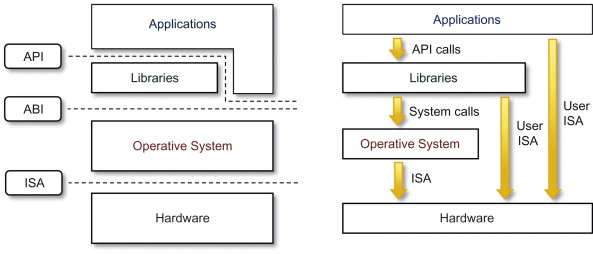

* 在底层，硬件模型以指令集架构 （ISA） 表示，该架构定义了处理器、寄存器、存储器和中断管理的指令集。ISA 是硬件和软件之间的接口，对于操作系统 （OS） 开发人员 （System ISA） 和直接管理底层硬件的应用程序 （User ISA） 的开发人员来说非常重要。应用程序二进制接口 （ABI） 将`操作系统层`与由操作系统管理的`应用程序`和`库`分开。

> 温馨提示ℹ️：
>
> * ① ISA 是计算机体系结构中定义的一组指令，它规定了处理器能够执行的操作。ISA 包括指令的编码、寄存器的使用、内存访问模式等。不同的处理器可能有不同的 ISA，例如：x86、ARM、MIPS 等。
> * ② 在设计一个新的操作系统时，开发者需要确保操作系统能够支持特定的 ISA ，以便在特定的硬件上运行。例如：如果操作系统旨在运行在 ARM 架构的处理器上，那么它必须能够理解和执行 ARM ISA 定义的指令集。

* ABI 涵盖了低级数据类型、对齐方式和调用约定等详细信息，并定义了可执行程序的格式。系统调用在此级别定义。此接口允许应用程序和库在实现相同 ABI 的操作系统之间移植。

> 温馨提示ℹ️：
>
> * ① ABI 是指在二进制级别上，应用程序与操作系统、库或应用程序的不同部分之间的接口。它定义了数据类型的大小、布局、对齐方式，以及函数调用的约定（如参数如何传递、返回值如何处理等）。ABI 确保了编译后的二进制文件能够在特定的操作系统和硬件平台上正确地运行。
> * ② 当开发者在 Linux 系统上编写 C 语言程序，并使用特定的编译器（如：GCC）编译时，编译器会遵循 Linux 平台的 ABI 规范来生成二进制文件。这样，生成的可执行文件就可以在任何遵循相同 ABI 规范的 Linux 系统上运行。

* 最高级别的抽象由应用程序编程接口 （API） 表示，它将`应用程序`连接到`库`或`底层操作系统`。

> 温馨提示ℹ️：
>
> * ① API 是一组预定义的函数、协议和工具，用于构建软件和应用程序。API 允许不同的软件系统相互交互，它定义了软件组件之间如何相互通信。API 可以是库、框架、协议或服务。
> * ② 在 Web 开发中，开发者可能会使用 JavaScript 的 Fetch API 来与服务器进行通信，获取数据或提交表单。这个 API 提供了一种标准化的方式来发送 HTTP 请求和处理响应，而不需要开发者关心底层的网络协议细节。