# 第一章：Linux

## 1.1 Linux 概述

* Linux 是一种开源的操作系统，最初由芬兰的林纳斯·托瓦兹（Linus Torvalds）开发。它基于 UNIX 操作系统，并且具有高度的可定制性和灵活性。Linux 操作系统被广泛应用于`服务器`、嵌入式系统和个人计算机等领域。
* 它具有稳定性、安全性和可靠性，并且支持多用户、多任务和多线程。Linux 拥有众多的发行版，如：Ubuntu、Red Hat、Debian 等，每个发行版都有自己的特点和优势。
* 由于其开源性质，Linux 操作系统受到了全球开发者的广泛支持和贡献，成为了计算机行业中的重要组成部分。

## 1.2 Linux 的发展史

* Linux 的发展历史可以分为以下几个阶段：

  * ① 初始阶段（1991 - 1994 年）：林纳斯·托瓦兹在 1991 年发布了 Linux 内核的第一个版本，并将其开源。在接下来的几年里，Linux 逐渐吸引了一些开发者的关注和参与，开始逐步完善和扩展功能。
  * ② 发展阶段（1995 - 2000 年）：在这个阶段，Linux 开始受到更多人的关注和认可。许多开发者和公司开始为 Linux 开发应用程序和驱动程序，为其增加更多的功能和兼容性。同时，一些发行版如：Red Hat、Debian 等也开始出现，为用户提供了更方便的安装和使用方式。
  * ③ 商业化阶段（2001 - 至今）：随着 Linux 的成熟和广泛应用，越来越多的公司开始将 Linux 作为服务器和嵌入式设备的操作系统。一些大型科技公司，如：IBM、Oracle 等也开始投入大量资源支持 Linux 的发展。同时，一些商业化的 Linux 发行版，如：SUSE、Ubuntu 等也崭露头角，为企业和个人用户提供了更专业的支持和服务。
  * ④ 社区发展阶段：Linux 的发展一直依赖于全球开发者社区的贡献和支持。Linux 社区不断壮大，吸引了众多的开发者和爱好者参与其中。通过社区的力量，Linux 不断更新迭代，推出了许多新的版本和功能。

* 总的来说，Linux 的发展历程是一个由个人项目逐渐发展为全球开源社区支持的过程。它的成功得益于开源模式的优势，以及全球开发者的共同努力和贡献。

## 1.3 Linux 的组成（⭐）

* Linux 主要由以下几个组成部分构成：

  * ① `Linux 内核`：Linux 内核是整个操作系统的核心，负责管理硬件设备、内存管理、进程调度等核心功能。它是由林纳斯·托瓦兹及其他开发者编写和维护的。
  * ② `Shell 解释器`：Shell 解释器是用户与操作系统交互的接口，它接收用户输入的命令并将其解释执行。常见的 Shell 解释器有 Bash、Zsh 等，它们提供了命令行界面和脚本编程功能。
  * ③ `外围的应用程序`：命令、应用程序、图形化界面……
  
* 其图示如下：

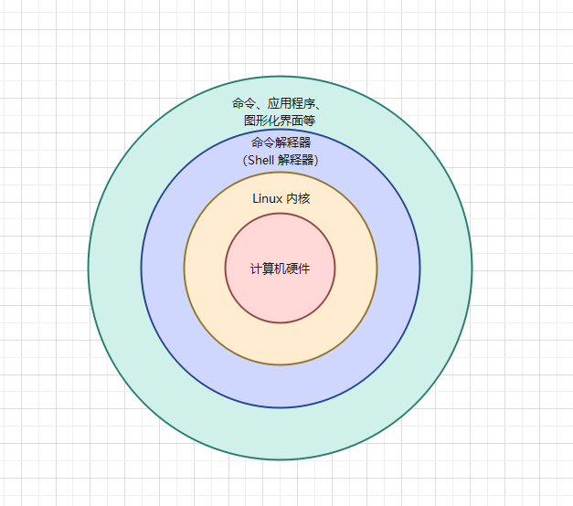

* 上述的组成部分共同构成了一个完整的 Linux 操作系统，为用户提供了丰富的功能和灵活性。

## 1.4 Linux 发行版本（⭐）

* Linux `发行版本`就是：`Linux 内核` + `命令解释器` + `应用程序（桌面）`。
* 主流的 Linux 发行版本如下：

| Linux 系统类别 | Linux 系统                        | 备注                                                         |
| -------------- | --------------------------------- | ------------------------------------------------------------ |
| Debian 系列    | `Debian`                          | 更新频率较低，较为稳定和安全，可以用于企业生产环境。         |
|                | `Ubuntu`                          | 桌面美观，使用方便，开发使用。有桌面版和企业版本（服务器版本）。 |
| Redhat 系列    | RedHat Enterprise Linux（`RHEL`） | 红帽企业版本                                                 |
|                | CentOS                            | 基于 Red Hat  Enterprise Linux（RHEL）源代码构建的免费开源操作系统。它提供了企业级的稳定性和安全性，广泛用于服务器环境。 |
|                | Fedora                            | Fedora 是由 Red Hat 赞助的社区驱动的 Linux 发行版，注重最新的软件和技术。它提供了一个先进的桌面环境和开发者工具。 |
|                | `Rocky Linux`                     | 用来替代 CentOS 系统的，也是基于 Red Hat Enterprise Linux（RHEL）源代码构建的免费开源操作系统。 |
|                | `Alma Linux`                      | 用来替代 CentOS 系统的，也是基于 Red Hat Enterprise Linux（RHEL）源代码构建的免费开源操作系统。 |
| 其它系列       | SUSE、OpenSUSE                    | OpenSUSE 是一个用户友好且功能强大的 Linux 发行版，具有稳定性和灵活性。它提供了多种桌面环境和服务器选项。 |

* 当然，除了以上几个主流的 Linux 发行版，还有许多其他的发行版，如：Arch Linux、Gentoo、Mageia 等，它们各自有着不同的特点和适用场景。
* 选择适合自己需求的发行版是根据个人或组织的需求和偏好来决定的。

## 1.5 Linux 版本选择（⭐）

* 推荐选择 `LTS 版`或`稳定版`。

> [!NOTE]
>
> * LTS 是 `"Long-Term Support"` 的缩写，意为长期支持。在软件开发领域，LTS 通常用来描述某个版本或发行版的长期支持周期。
> * 对于 Linux 发行版或其他软件，LTS 版本通常会提供更长时间的支持和维护，以确保稳定性和安全性。这意味着在 LTS 版本的支持周期内，开发者会持续提供安全补丁、错误修复和其他重要更新，以保持系统的稳定性和可靠性。
> * LTS 版本通常适用于企业和组织等需要长期稳定性和可靠性的环境。相比于非 LTS 版本，LTS 版本的更新频率较低，更注重于提供长期支持和维护。

* 本次选择：

| 系统版本                                                  | 说明                     |
| --------------------------------------------------------- | ------------------------ |
| [Ubuntu](https://cn.ubuntu.com/)                          | LTS 18.04 、LTS 20.04 等 |
| [AlmaLinux](https://almalinux.org/zh-hans/get-almalinux/) | 9.1、9.2、9.3 等         |


# 第二章：工作和学习环境部署（⭐）

## 2.1 服务器

* `服务器`是一种专门用于提供服务的计算机系统。它通常具有更高的性能、可靠性和稳定性，以满足处理大量请求和提供持续服务的需求。
* `服务器`的主要功能是接收来自客户端的请求，并提供相应的服务或资源。这些服务可以包括：网站托管、数据库管理、文件存储、电子邮件、应用程序运行等。服务器通过网络与客户端进行通信，处理请求并返回相应的数据或结果。
* `服务器`通常采用高性能的硬件配置，如:多核处理器、大容量内存、高速存储设备等，以确保能够处理大量的并发请求。它们还通常具有冗余的设计，包括冗余电源、冗余网络连接和冗余存储等，以提高可靠性和可用性。
* `服务器`可以是物理服务器，即实际的硬件设备，也可以是虚拟服务器，即在物理服务器上通过虚拟化技术创建的虚拟机。无论是物理服务器还是虚拟服务器，它们都扮演着提供服务和资源的角色。
* 在企业和组织中，`服务器`通常由专门的 IT 团队进行管理和维护。他们负责服务器的配置、安全性、性能优化、备份和恢复等工作，以确保服务器的稳定运行和数据的安全性。

> [!IMPORTANT]
>
> 实际工作的时候，`Linux` 系统会运行在`服务器`上。

## 2.2 虚拟机概述

* 虚拟机（Virtual Machine，简称 VM）是一种软件实现的`计算机系统`，它在物理计算机上`模拟`出一个`完整的计算环境`。虚拟机可以在同一台物理计算机上同时运行多个独立的操作系统和应用程序。


* 虚拟机的工作原理是通过`虚拟化技术`将物理计算机的硬件资源（如：处理器、内存、存储等）进行抽象和分配，为每个虚拟机提供一部分资源。每个虚拟机都被视为一个独立的计算机系统，可以运行自己的操作系统和应用程序。
* 虚拟机的优势在于它可以提供`隔离性`和`灵活性`。通过虚拟机，可以在同一台物理计算机上同时运行多个操作系统，实现资源的共享和最大化利用。同时，虚拟机还可以提供快速部署、快速备份和恢复等功能，方便管理和维护。
* 常见的虚拟机软件，包括：`VMware`、VirtualBox、KVM 等。它们提供了虚拟化平台和管理工具，使用户可以轻松创建、配置和管理虚拟机。虚拟机广泛应用于开发和测试环境、服务器虚拟化、云计算等领域。

> [!NOTE]
>
> `虚拟机软件`和`虚拟机`的概念不同：
>
> * ① `虚拟机软件`是用来模拟硬件一个`软件`，如：VMware 等。
> * ② 而`虚拟机`是通过虚拟机软件模拟出来的`计算机硬件`，其实是文件的集合，相当于一台没有安装 Windows 操作系统的`裸机`。
> * ③ 在现实交谈的时候，我们有时候会模糊`虚拟机软件`和`虚拟机`的概念，甚至会使用`虚拟机`来代替`虚拟机软件`；此时，就需要根据`上下文环境（语境）`来判断到底说的是`虚拟机软件`还是`虚拟机`了。

## 2.3 安装虚拟机软件

### 2.3.1 前提条件

* 需要在 BIOS 中开启`虚拟化`功能。


### 2.3.2 安装步骤

* ① 双击打开 VMware 安装程序 。


* ② 进行下一步安装：


* ③ 同意许可协议，单击下一步：


* ④ 根据需要决定是否需要更改软件的安装位置（建议放置于除 C 盘以外任意盘符下）：


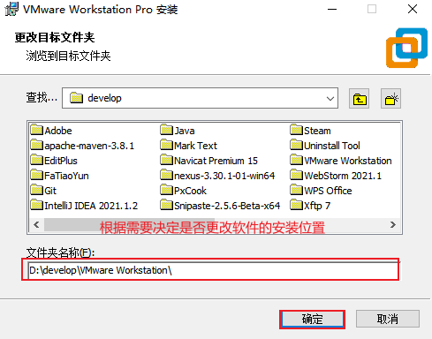

* ⑤ 更改成功后，单击确定，下一步继续安装：


* ⑥ 用户体验设置，如下图所示，单击下一步继续安装：

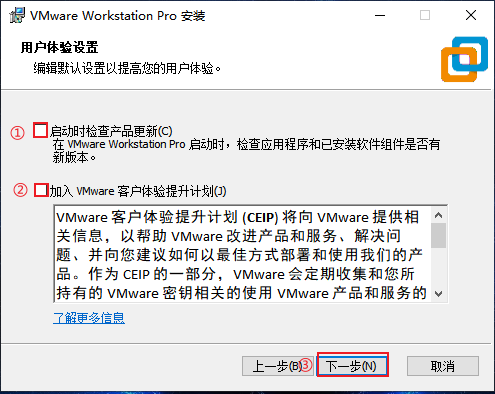

* ⑦ 快捷方式设置，单击下一步继续安装：


* ⑧ 单击安装按钮：


* ⑨ VMware 输入许可证：


* ⑩ 安装结束后，单击完成按钮：


* ⑪ 检查虚拟机软件是否安装了虚拟网卡：

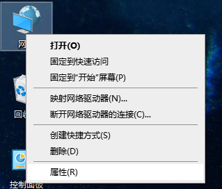


### 2.3.2 配置网络

* ① 打开 VMware 虚拟机软件：


* ② 编辑 → 虚拟网络编辑器：

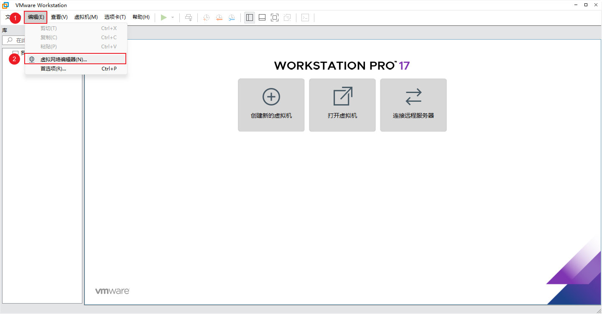

* ③ Vmnet8 → 更改设置：

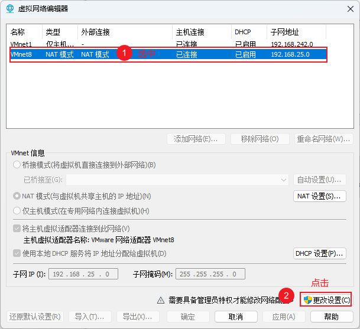

* ④ 更改子网 IP 地址为 ：`192.168.10.0` ，其目的是为了将 IP 固定。


* ⑤ DHCP 设置：


* ⑤ 通过 `cmd` ，输入 `ipconfig` 命令，查看是否配置成功：

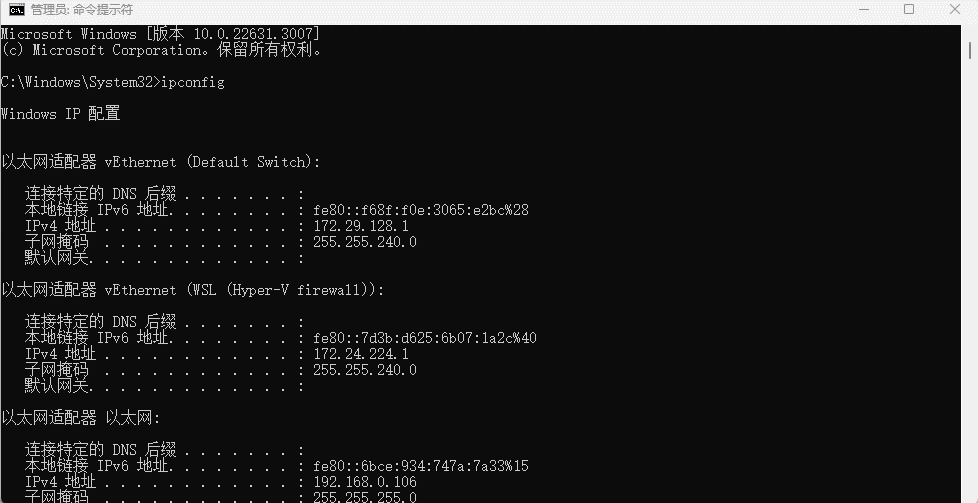

## 2.4 创建虚拟机

### 2.4.1 概述

* 创建虚拟机，本质上就类似购买一台没有安装操作系统的`裸机`。

### 2.4.2 创建虚拟机

* ① 文件 → 新建虚拟机：


* ② 选择`自定义`类型的配置：


* ③ 虚拟机硬件兼容性：下一步即可。


* ④ 选择`稍后安装操作系统`：

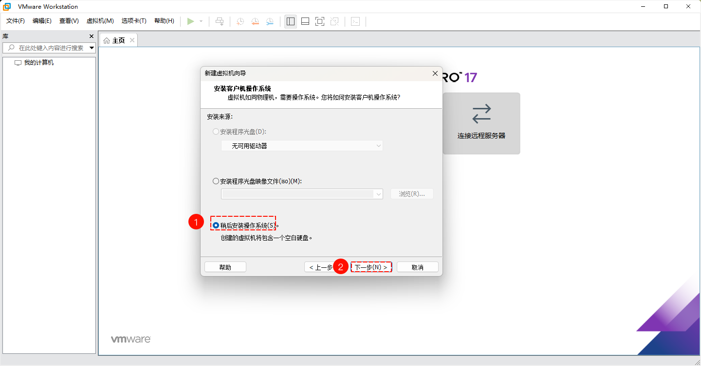

* ⑤ 选择虚拟机将安装的操作系统：


* ⑥ 设置虚拟机的`名称`和`安装位置`：

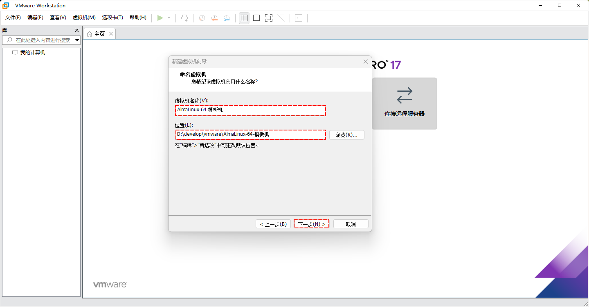

> [!NOTE]
>
> 一个虚拟机一个安装目录（文件夹），防止引起文件的冲突。

* ⑦ 虚拟机中处理器的配置：下一步即可。


* ⑧ 设置虚拟机的`内存`：至少 2048 MB以上。

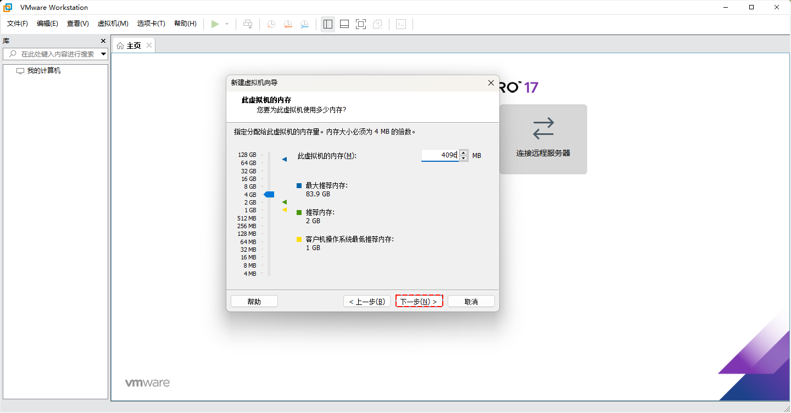

* ⑨ 设置虚拟机的`网络类型`：下一步即可。


* ⑩ 设置 I/O 控制器类型：下一步即可。


* ⑪ 选择磁盘类型：下一步即可。


* ⑫ 选择磁盘：下一步即可。

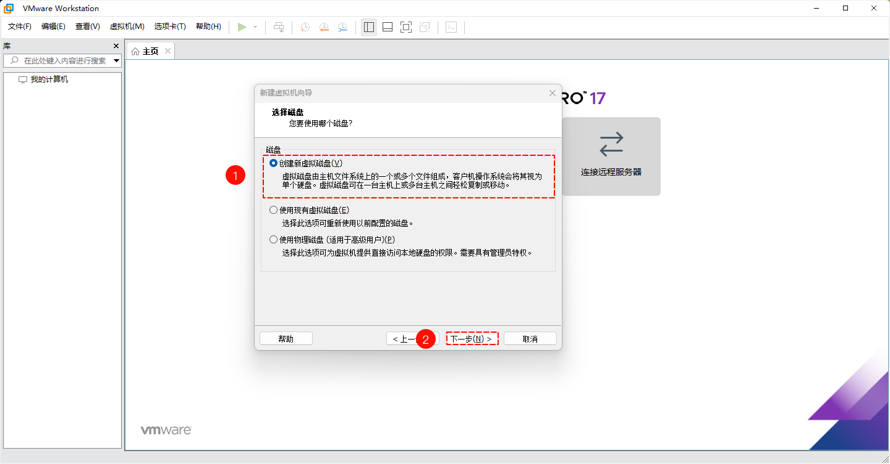

* ⑬ 选择磁盘容量：调整为 40 GB。


* ⑭ 指定磁盘文件：下一步即可。

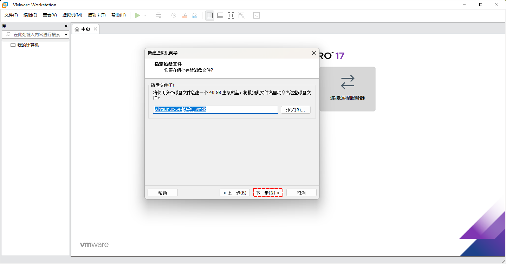

* ⑮ 创建虚拟机完毕：


* ⑯ 查看是否创建虚拟机成功：

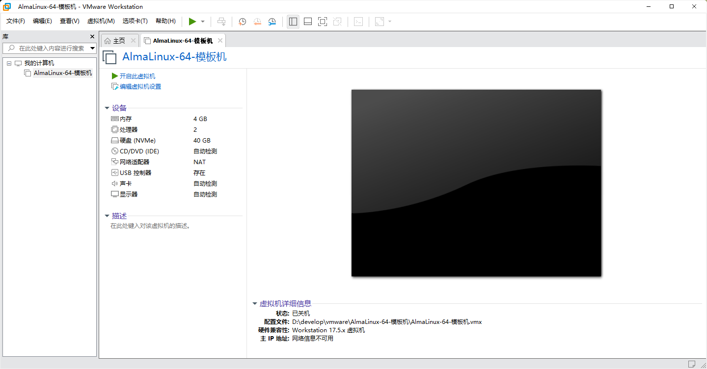

### 2.4.3 虚拟机归类（分类）

* 实际情况下，我们可能会创建很多`虚拟机`，VMware 提供了`文件夹`的功能来管理虚拟机；其步骤如下所示：
* ① 鼠标右键 → 创建文件夹：


* ② 修改文件夹的名称：


* ③ 将刚才创建的虚拟机`拖`到该文件夹下：


### 2.4.4 设置 CD/DVD

* 以前，我们在一台裸机上安装操作系统的时候，需要通过 DVD 或 U 盘将操作系统的 ISO 镜像文件，安装到裸机上；
* 同理，在使用虚拟机软件的时候，也需要此类步骤；其步骤如下：
* ① 编辑虚拟机设置：


* ② 选择硬盘上的 ISO 镜像文件：

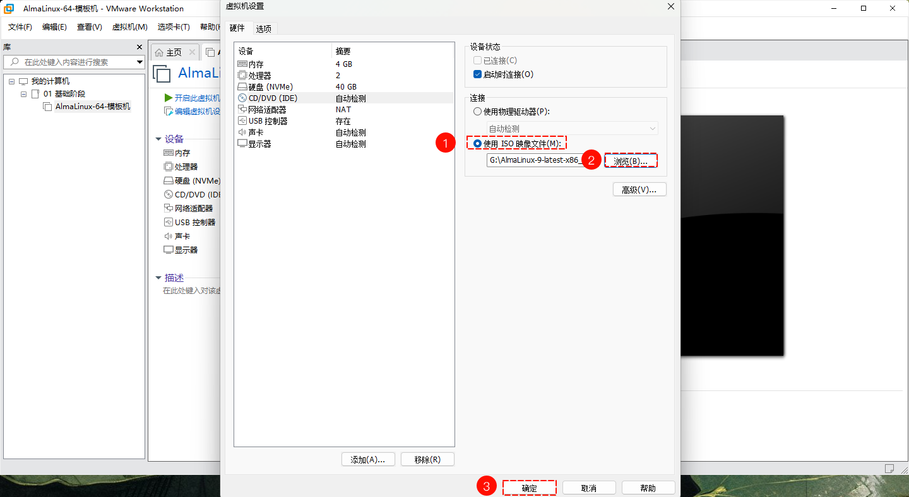

* ③ 查看是否配置成功：


## 2.5 安装 Linux

* ① `开启此虚拟机`：


* ② `鼠标点击`进去之后，通过键盘上的`方向键`来选择：


* 注意⚠️：键盘上的`方向键`在这里


* ③ 设置操作系统的`语言`环境为`中文`：


* ④ 设置系统`安装目的地`：


* ⑤ 设置`软件选择`：默认即可


* ⑥ 设置 root 的密码：`123456`即可


> [!CAUTION]
>
> 学习阶段无所谓设置什么密码，但是生产环境，必须复杂并且经常更换！！！

* ⑦ 配置`网络和主机名`：


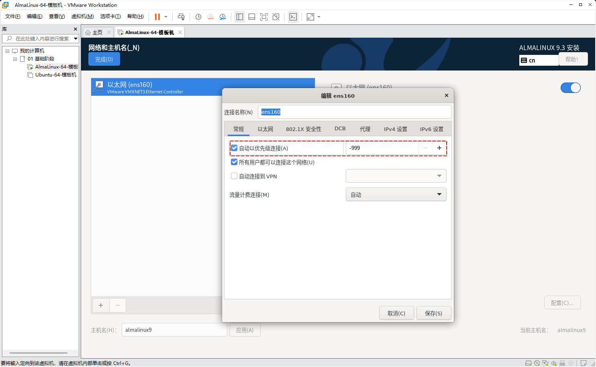


* ⑧ 查看`配置网络和主机名`是否成功：


* ⑨ 点击`开始安装`：漫长的等待……


* ⑩ 安装完成之后，会提示`重启系统`，那就重启吧：


## 2.6 远程连接 Linux

### 2.6.1 查看 Linux 的 IP 地址

* 通过 `ifconfig` 命令来查看 Linux 的 IP 地址：

```shell
ifconfig
```


### 2.6.2 远程连接 Linux

* 可以通过 xshell 之类的远程连接工具来连接 Linux ，其步骤如下：
* ① 新建会话：


* ② 输入 Linux 的 IP 地址：


* ③ 输入用户名和密码：


* ④ 接收和保存远程 Linux 的密钥：


* ⑤ 查看是否登录成功：

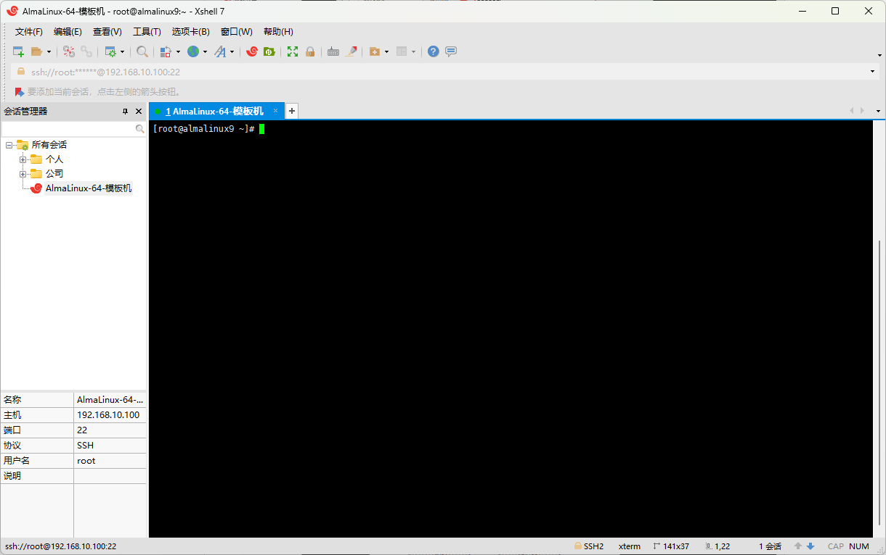


