# 第一章：扫清概念（⭐）


## 1.1 IP 地址

### 1.1.1 概述

* 在早期，没有`即时通讯工具`的情况下，如：微信、QQ 等，人们都是使用`信件`来进行交流的，如下所示：

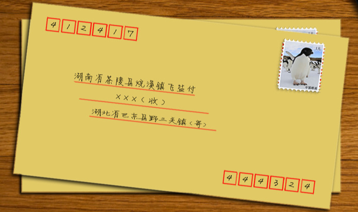

> 注意⚠️：从上图中，我们可以得知，如果要将信件发送到对方，至少需要知道对方的姓名和`家庭地址`等。

* 同理，在信息交流发达的今天，很多设备，如：手机、电脑、平板、手表等，都会接入到互联网上，如下所示：

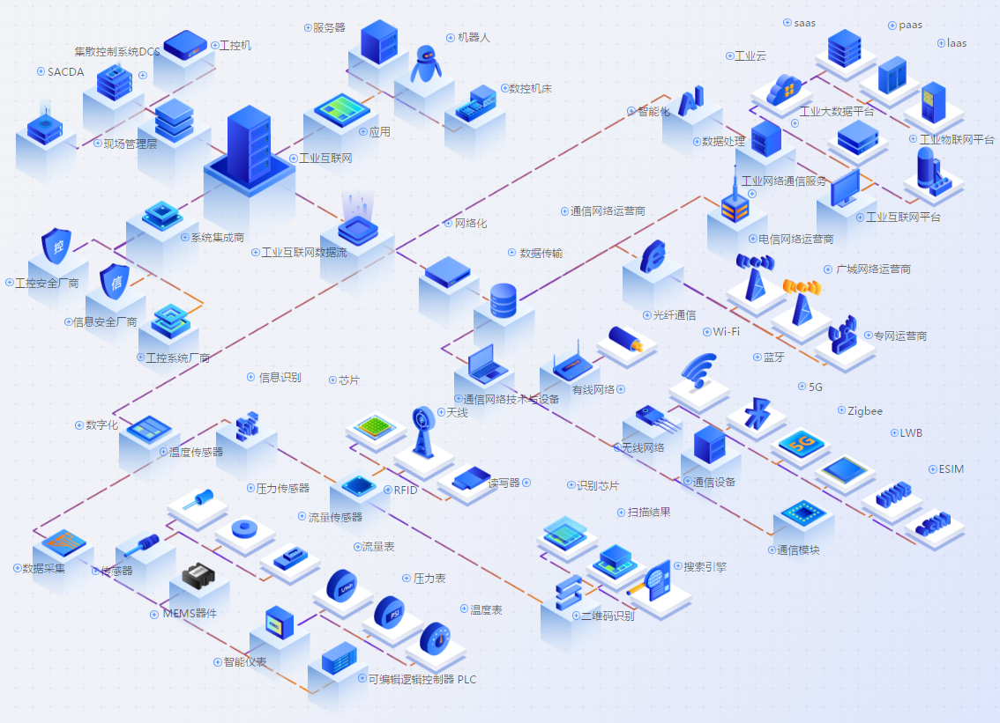

* 针对互联网上的各种设备，我们如何定位？就是给它们分配一个唯一的 `IP` 地址；类似于写信的时候，需要填写的`家庭地址`。

> 维基百科：
>
> * **`IP地址`**（英语：IP Address，全称Internet Protocol Address），又译为**网际协议地址**、**互联网协议地址**。是 `互联网协议` 中用于标识`发送`或`接收`数据报的设备的`一串数字`。
> * 常见的 IP 地址分为 `IPV4` 和 `IPV6`：
>   * `IPV4` 为 `32` 位，通常使用`四`组`十`进制数字表示，以点（`.`）分隔，如：`172.16.254.1`。
>   * `IPV6` 为 `128` 位，通常使用`八`组`十六`进制数字表示，以冒号（`:`）分隔，如：`2001:db8:0:1234:0:567:8:1`。

### 1.1.2 IP 地址的分类

* IP 地址可以根据`其分配和使用的范围`来划分为：
  * ① `私网 IP（内网 IP）`
  * ② `公网 IP`。
* 它们之间的区别如下：

| IP 分类            | 特点                                                         | 备注                                                         |
| ------------------ | ------------------------------------------------------------ | ------------------------------------------------------------ |
| 私网 IP（内网 IP） | 私网 IP 地址是在私有网络内部使用的 IP 地址，用于内部通信和资源共享。 | 通常由网络设备分配，如：路由器等，一般不固定。               |
| 公网 IP            | 公网 IP 地址是可以在公共互联网上进行通信的 IP 地址。         | 公网 IP 地址是全球唯一的，可以被其他网络和设备访问到，并且需要购买！！！ |

> 注意⚠️：常见的私网 IP 有：`10.0.0.0 ~ 10.255.255.255`、`172.16.0.0 ~ 172.31.255.255`、`192.168.0.0 ~ 192.168.255.255`。

## 1.2 端口

* 端口（port）是计算机网络中用于`标识`不同`应用程序`或`服务`的`数字标识符`。在 `TCP/IP` 协议中，端口号是一个 16 位的数字，范围从 `0 ~ 65535` 。

> 注意⚠️：为什么说端口号是一个 16 位的数字？那是因为计算机底层是 2 进制，而 2^16 = 65535 。

* 端口的作用：是在一个主机上`同时`运行`多个`网络应用程序时，通过`端口号`来`区分`和`定位`不同的`应用程序`或`服务`。每个应用程序或服务都可以`绑定`到一个`特定`的端口号上，以便其他计算机或设备可以通过该`端口`与该`应用程序`进行`通信`。

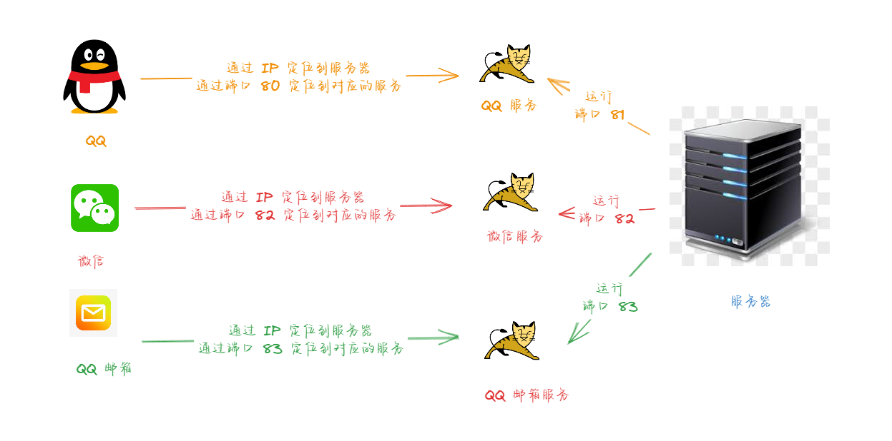

* 常见的端口号是一些预留的标准端口，如：`HTTP` 的端口是 `80` ，`HTTPS` 的端口是 `443`，`FTP` 的端口是 `21`，`SMTP` 的端口是 `25` 等。
* 当然，操作系统在启动之后，为了完成某些功能，也会启动一些应用程序，而这些应用程序会占用一部分端口，其范围是 `0 ~ 1023` ，如：
  * 20 和 21：用于FTP（文件传输协议）数据和控制连接。
  * `22`：用于 SSH（安全外壳协议）远程登录和安全文件传输。
  * 25：用于SMTP（简单邮件传输协议）发送电子邮件。
  * `80`：用于 HTTP（超文本传输协议）网页浏览。
  * `443`：用于 HTTPS（安全HTTP）加密的网页浏览。
  * 110：用于 POP3（邮局协议版本3）接收电子邮件。
  * 143：用于 IMAP（Internet邮件访问协议）接收电子邮件。

> 注意⚠️：上述的端口是通常大家约定的，并不是绝对固定的。某些情况下，操作系统可能使用其他的端口号或动态分配端口号来满足特定的需求。

* 总而言之，通过`端口号`，计算机可以将传入的数据包或连接路由到正确的`应用程序`或`服务`，实现`网络通信`和`数据交换`。端口号在网络编程和网络安全中起着重要的作用，帮助实现应用程序之间的通信和数据传输。

## 1.3 协议

* 只有 `IP` 地址和`端口`还不行，`客户端`上的`应用程序`和`服务器`的`应用程序`还必须借助`通信协议`来进行`通信`。

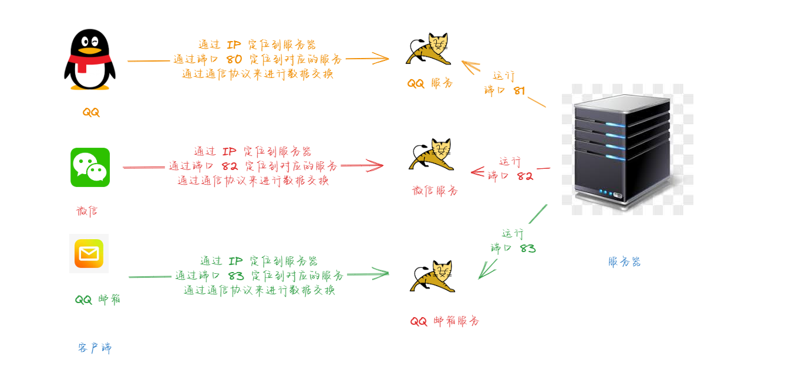

* 在现实生活中，人和人之间的交流必须借助于`某种语言`：


* 其实，语言就是一种协议，一种规定，一种标准，一种大家都必须遵守的规则；那么，通信协议是什么？

> 维基百科：
>
> * `通信协议`是在任何物理介质中允许`两个`或`多个`在`传输系统`中的`终端`之间传播`信息`的系统`标准`，也是指计算机通信或网络设备的共同语言。
> * 通信协议定义了`通信` 中的`语法学`、`语义学`和`同步`规则以及可能存在的`错误检测与纠正`。
> * 通信协议在`硬件`、`软件`或`两者之间`皆可实现。


# 第二章：远程连接排错（⭐）

## 2.1 概述

* 远程连接排错，主要分为三步：
  * ① 确认网络是否通畅。
  * ② 确认防火墙、SELinux 等。
  * ③ 确认端口是否开放。

* 目前的架构是这样的：

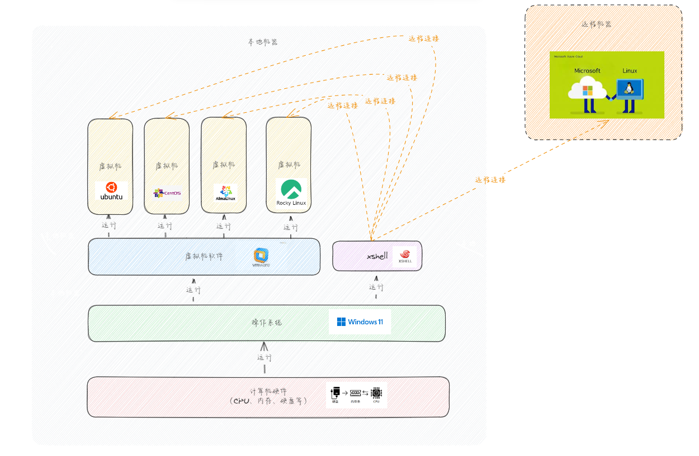

* 所以，我们是在 `win` 系统中来进行`远程连接`排错的。

## 2.2 确认网络是否通畅

* 命令：

```shell
ping 域名|IP地址
```


* 示例：

```shell
ping www.baidu.com
```

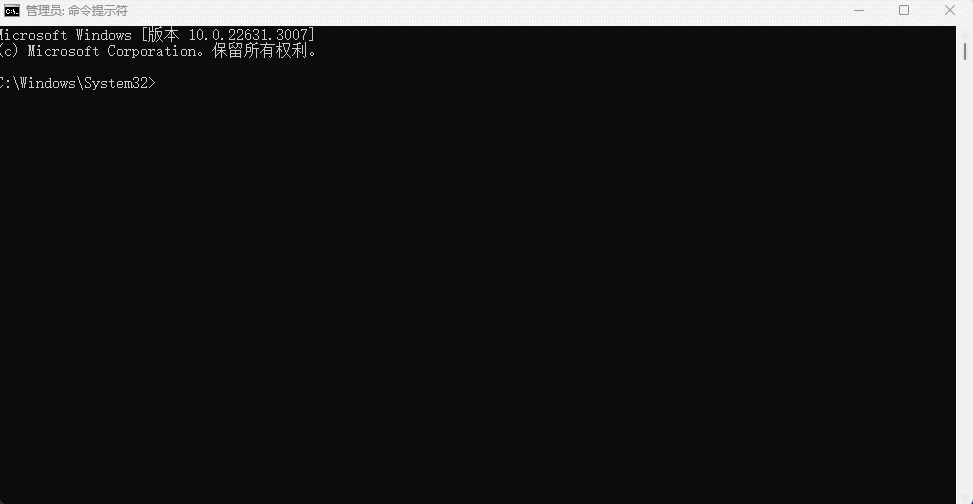


* 示例：

```shell
ping 192.168.10.100
```

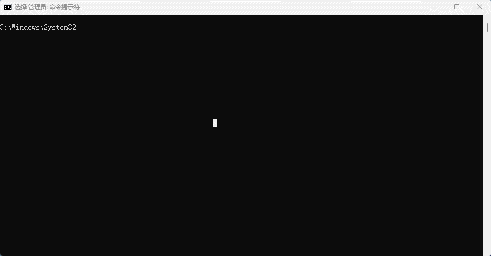

## 2.3 确认防火墙、SELinux

* 目前而言，防火墙和 SELinux 不是问题，所以暂时不演示。


* 示例：略。

## 2.4 确认端口是否开放

* 命令：

```shell
telnet 域名|IP地址 端口
```


* 示例：

```shell
telnet 192.168.68.10 22
```

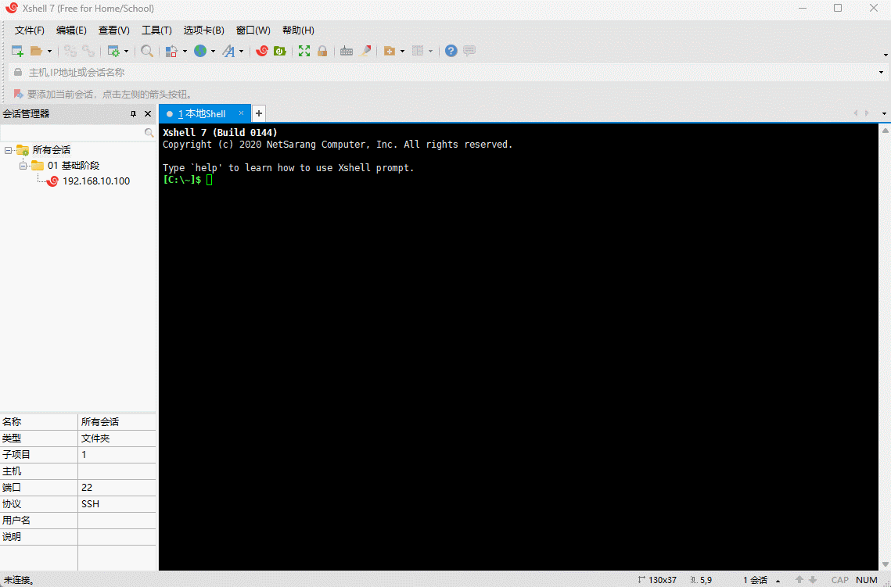


* 示例：

```shell
telnet 192.168.68.10 12345
```

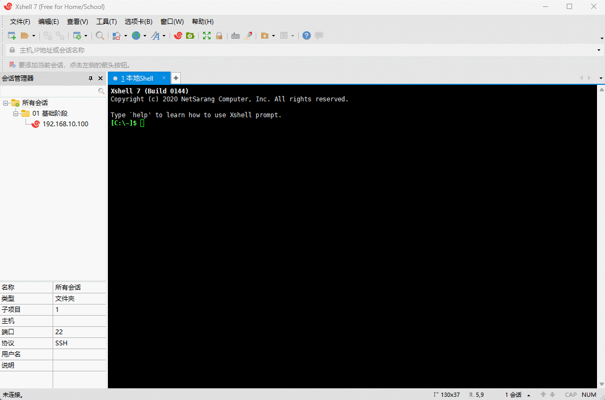


# 第三章：Linux 基础（⭐）

## 3.1 Linux 命令提示符

* 当通过远程工具，如：xshell 等，连接到远程 Linux 的时候，就会出现`命令提示符`；如下所示：

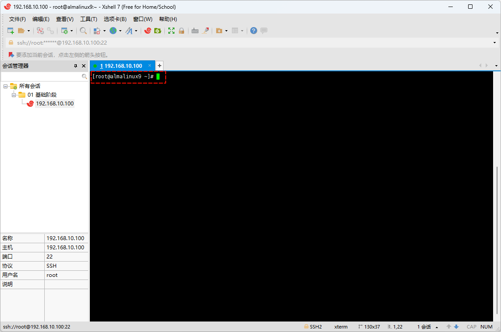

* 我们可以将其分解一下：

```shell
[root@almalinux9 ~]# 
```

* 解释：
  * `root` 表示`当前登录到 Linux 中的用户`，即`用户名`。
  * `@` 没有特殊含义，仅仅用来表示`分隔`的意思。
  * `almalinux9` 表示`主机的名称`，默认是 `localhost` 。
  * `~` 表示`当前所在路径（目录）`，其中 `~` 表示`家目录`。
  * `#` 表示`用户身份`；如果是`管理员`，就是 `#` ；如果是`普通用户`，就是 `$`。

* 其对应的图示如下：

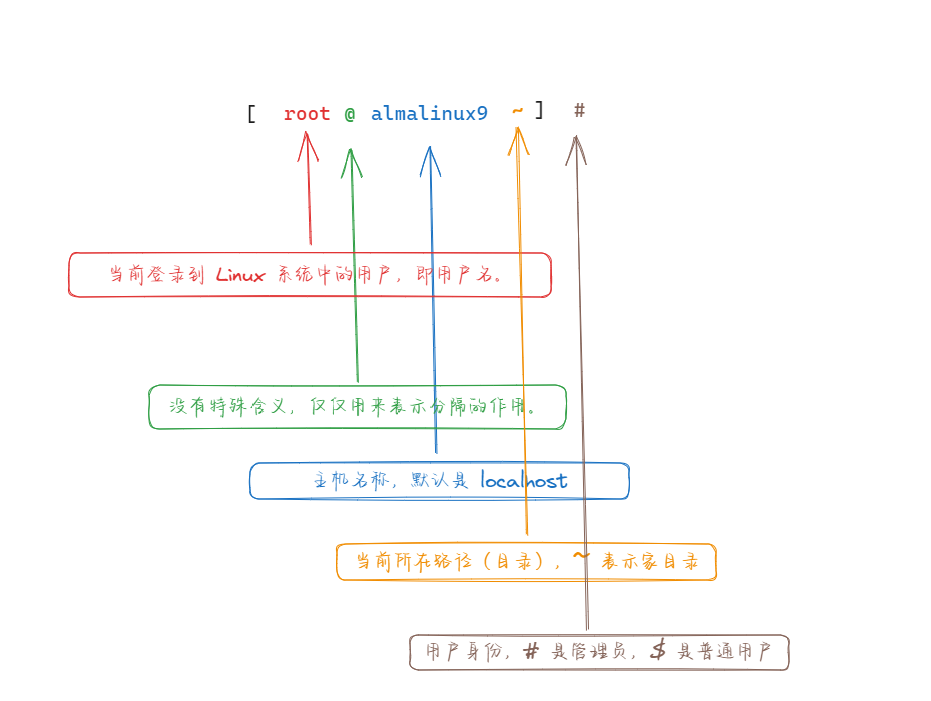

## 3.2 Linux 命令格式

* Linux 命令格式：

```shell
命令（command） 选项(option) 参数(arguments/parameter)
```

* 其命令格式说明：

| 类别 | 说明                                       | 备注                                        |
| ---- | ------------------------------------------ | ------------------------------------------- |
| 命令 | Linux 中通过`命令`控制整个操作系统。       | 通常而言，命令是单词或单词缩写。            |
| 选项 | 就是`功能`，不同的`选项`对应不同的`功能`。 | 通常而言，选项会使用加上 `-` 或 `--` 前缀。 |
| 参数 | 命令处理的`目标`                           |                                             |

* 其理解如下：

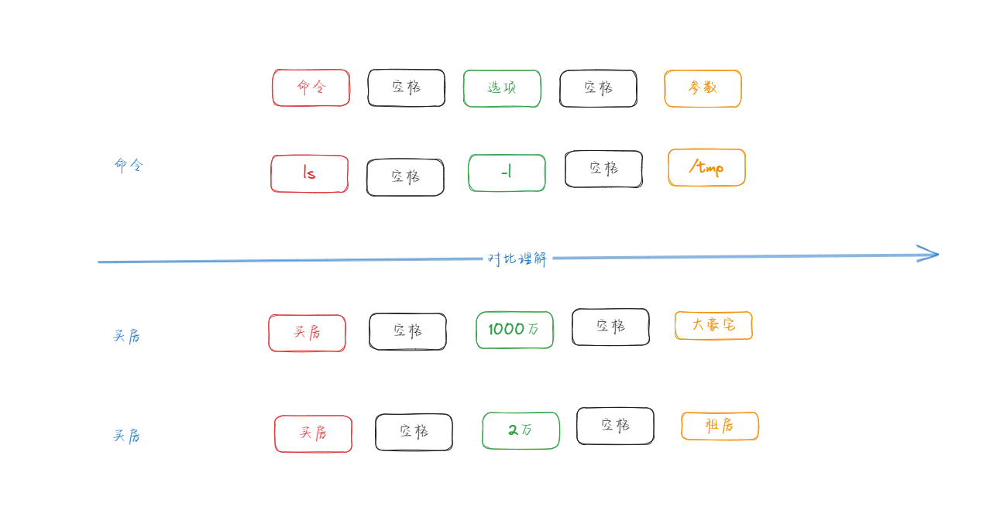

> 注意⚠️：
>
> * 在实际交流的时候，我们有的时候，会模糊`选项`和`参数`的区别，统一使用`参数`来`代替`。
> * 并不是所有的命令`都遵循`上述的格式，有些命令就只有命令，而没有选项或参数，如：`pwd` 等。

## 3.3 Linux 目录 VS Windows 目录

* Linux 目录 和 Windows 目录有一些区别：
  * ① 分隔符：
    * 在 Linux 中，目录路径使用正斜杠（`/`）作为分隔符，例如：`/home/user/documents`。
    * 在 Windows 中，目录路径使用反斜杠（`\`）作为分隔符，例如：`C:\Users\user\Documents`。
  * ② 根目录：
    * 在 Linux 中，根目录表示整个文件系统的起点，用 `/` 表示。
    * 在 Windows 中，每个驱动器都有自己的根目录，例如：`C:\`表示 `C 驱动器`的`根目录`。
  * ③ 目录命名规则：
    * Linux 对目录和文件的命名是`区分大小写`的，例如：`Documents` 和 `documents` 是`不同`的目录。
    * Windows 对目录和文件的命名是`不区分大小写`的，例如：`Documents` 和 `documents` 被视为`相同`的目录。
  * ④ 特殊目录：
    * Linux 有一些特殊的目录，如：`/bin`、`/etc`、`/home`、`/tmp` 等，用于存放系统文件、配置文件、用户主目录和临时文件等。
    * Windows 也有一些特殊的目录，如：`Program Files`、`Windows`、`Users` 等，用于存放程序文件、系统文件和用户文件等。

* 总体而言，Linux 的目录结构`更加统一和规范`，而 Windows 的目录结构则`更加分散和多样化`。


# 第四章：Linux 入门

## 4.1 查询帮助

* 有的时候，我们不知道，一些命令的常规用法，此时就需要查询帮助了。
* 总体而言，Linux 提供了如下的两种常用方式，来帮助我们对命令进行查询：

| 命令帮助方式  | 备注                                  |
| ------------- | ------------------------------------- |
| `man 命令`    | 会显示命令的详细信息。使用 `q` 退出。 |
| `命令 --help` | 会显示命令的精简信息。                |

* 当然，也可以使用[命令行帮助网站](https://wangchujiang.com/linux-command/)。


* 示例：

```shell
man cd
```


* 示例：

```shell
cd --help
```

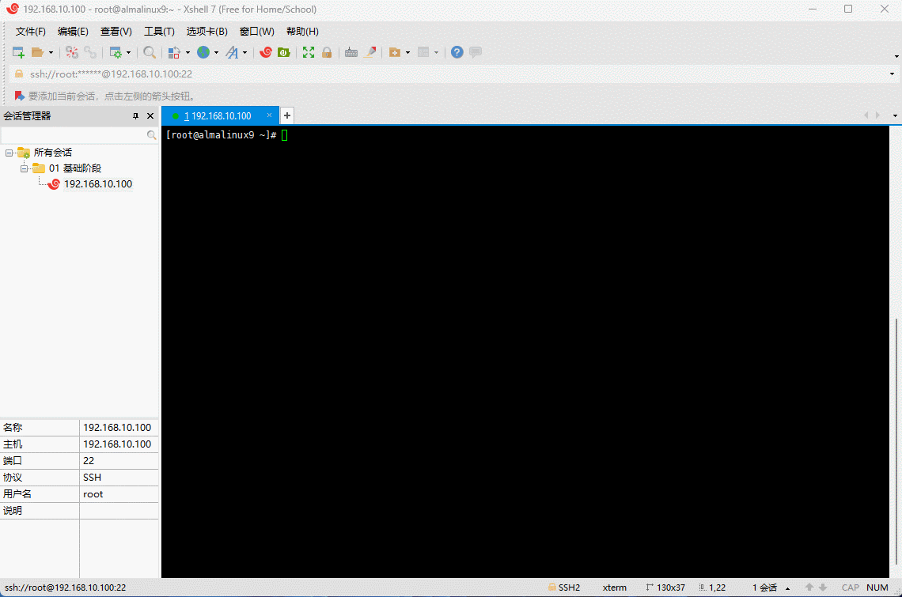

## 4.2 Linux 命令行快捷键（⭐）

### 4.2.1 概述

* 主要`目的`就是为了提高在命令行中`操作`的效率。
* 光标移动到`行首`：`ctrl + a` ；其中 `a` 是 `ahead` 的缩写。

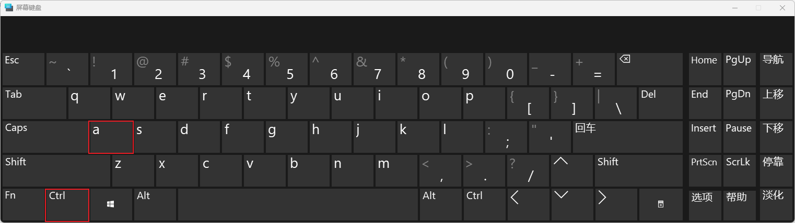

* 光标移动到`行尾`：`ctrl + e` ；其中，`e` 是 `end` 的缩写。

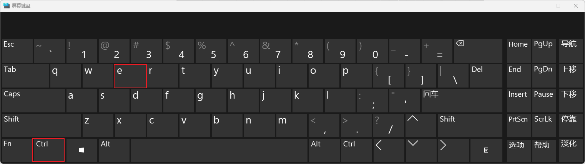

* 将`光标所在位置`到`行首`的内容`剪切（删除）`：`ctrl + u` ；其中，u 来源于 Unix，是 kill-line 的意思，即杀死整行。

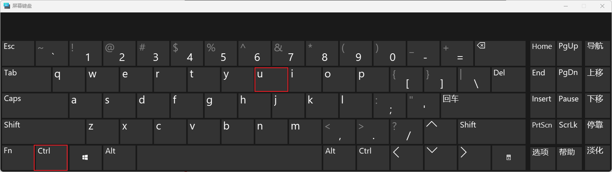

* 将`光标所在位置`到`行尾`的内容`剪切（删除）`：`ctrl + k` ；其中，k 来源于 Unix，是 kill-line 的意思，即杀死整行。

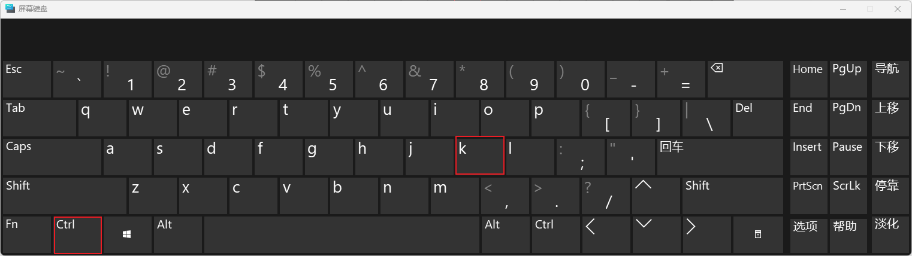

* 清屏：`ctrl + l`；相当于 `clear` 命令。

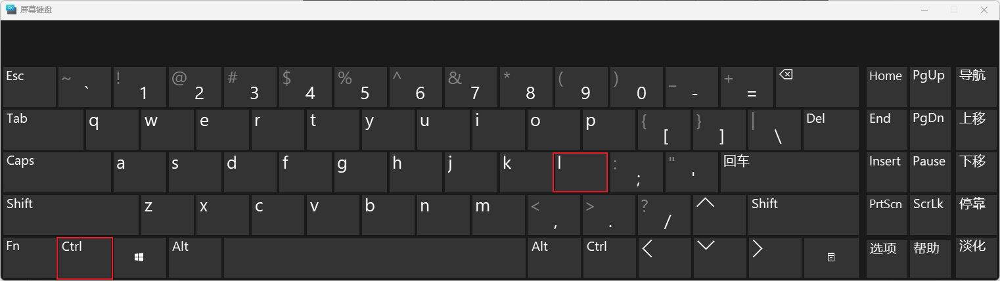

* `取消`当前的命令：`ctrl + c` ；其中，`c` 是 `cancel` 的缩写。

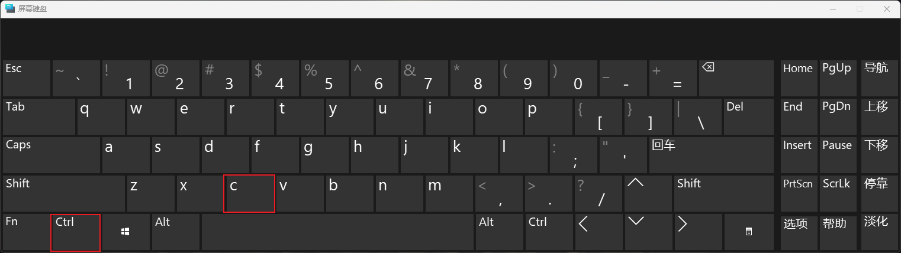

### 4.2.2 案例

* 示例：光标移动到`行首`

```shell
ctrl + a 
```

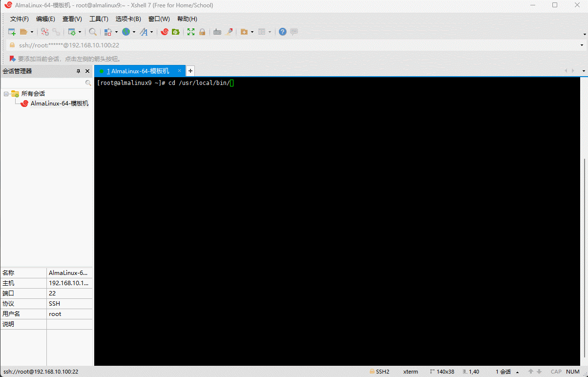


* 示例：光标移动到`行尾`

```shell
ctrl + e
```

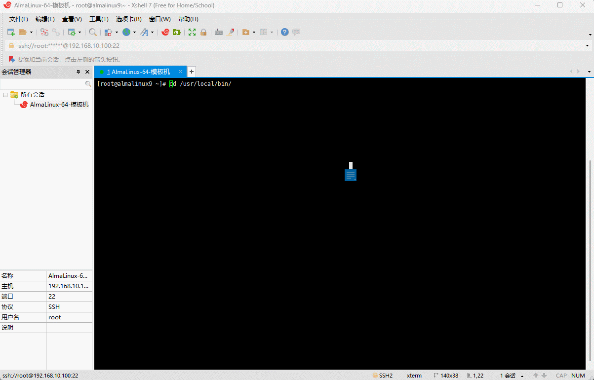


* 示例：将`光标所在位置`到`行首`的内容`剪切（删除）`

```shell
ctrl + u
```


* 示例：将`光标所在位置`到`行尾`的内容`剪切（删除）`

```shell
ctrl + k
```


* 示例：清屏

```shell
ctrl + l 
```

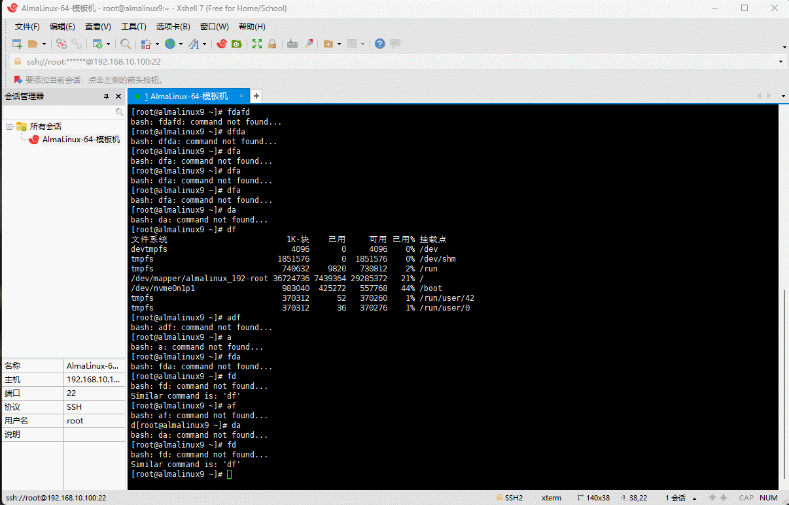


* 示例：`取消`当前的命令

```shell
ctrl + c
```


### 4.2.3 坑

* 有些快捷键，在 Linux 中和 Windows 中，不是很一样，需要特别小心：

| 快捷键     | Linux                            | Windows |
| ---------- | -------------------------------- | ------- |
| `ctrl + s` | 锁屏                             | 保存    |
| `ctrl + q` | 解锁（解除锁屏）                 |         |
| `ctrl + z` | 让当前正在运行的命令，在后台挂起 | 撤销    |

> 注意⚠️：这些`坑`快捷键并不需要记忆，只需要遇到的时候，能想起并解决即可。

## 4.3 Linux 关机和重启

### 4.3.1 概述

* Linux 并不总是需要关机和重启的，Linux 追求的是 7 * 24 小时不间断的服务。
* 但是，某些情况下，我们还是需要对 Linux 进行关机和重启，所以需要`知道`对应的命令。

### 4.3.2 关机

* 立刻关机：

```shell
shutdown -h now
```

* 延迟关机：单位是`分钟`

```shell
shutdown -h 10
```

* 取消关机：

```shell
shutdown -c
```


* 示例：

```shell
# 延迟关机
shutdown -h 10
# 取消关机
shutdown -c
# 立刻关机
shutdown -h now
```


### 4.3.3 重启

* 立刻重启：

```shell
shutdown -r now
```

```shell
reboot
```

* 延迟重启：单位是`分钟`

```shell
shutdown -r 10
```


* 示例：

```shell
# 延迟重启
shutdown -r 10
# 取消重启
shutdown -c
# 立刻重启
reboot
```


