# 第一章：æ问的艺术

## 1.1 æ问的艺术

* æ问的艺术是指能够æ出æ°å½“的问题，以è·å¾—所需的信æ¯ã€å¯å‘他人æ€è€ƒæˆ–促进对è¯ã€‚æ问的艺术ä¸ä»…在人际沟通中很é‡è¦ï¼Œåœ¨å­¦ä¹ ã€å·¥ä½œå’Œç ”究等领域也å‘挥ç€é‡è¦ä½œç”¨ã€‚
* 以下是一些æ问的艺术技巧：
  - **æ˜ç¡®ä½ çš„目的。** 在æ问之å‰ï¼Œå…ˆæƒ³æ¸…楚你想è¦è·å¾—什么信æ¯æˆ–达到什么目的。这将帮助你æ出更具体和有针对性的问题。
  - **使用开放å¼é—®é¢˜ã€‚** 开放å¼é—®é¢˜ä»¥â€œä»€ä¹ˆâ€ã€â€œä¸ºä»€ä¹ˆâ€ã€â€œå¦‚何â€ç­‰è¯è¯­å¼€å¤´ï¼Œå¯ä»¥é¼“励对方æ供更详细和深入的å›ç­”。
  - **é¿å…使用å°é—­å¼é—®é¢˜ã€‚** å°é—­å¼é—®é¢˜ä»¥â€œæ˜¯â€æˆ–“å¦â€å›ç­”，é™åˆ¶äº†å¯¹æ–¹çš„å›ç­”范围，也å¯èƒ½è®©å¯¹æ–¹æ„Ÿåˆ°è¢«å®¡é—®ã€‚
  - **关注细节。** æ出具体和详细的问题，以è·å¾—更准确和有用的信æ¯ã€‚
  - **使用积æçš„æªè¾ã€‚** é¿å…使用负é¢æˆ–带有攻击性的æªè¾ï¼Œä»¥å…引起对方的å感或抵触情绪。
  - **注æ„你的语气和æ€åº¦ã€‚** æ问时è¦ä¿æŒç¤¼è²Œå’Œå°Šé‡ï¼Œå¹¶æ³¨æ„你的语气和æ€åº¦ã€‚
  - **学会倾å¬ã€‚** 在对方å›ç­”问题时，è¦è®¤çœŸå€¾å¬å¹¶ç»™äºˆå馈。这将表æ˜ä½ åœ¨ä¹ä»–们的å›ç­”，并鼓励他们继续分享信æ¯ã€‚
  - **ä¸è¦å®³æ€•æ问。** æ问是è·å–ä¿¡æ¯å’Œå­¦ä¹ æ–°çŸ¥è¯†çš„é‡è¦æ–¹å¼ã€‚ä¸è¦å®³æ€•æ问，å³ä½¿ä½ è®¤ä¸ºä½ çš„问题很愚蠢或很基本。

* å…¶å®ï¼Œæ€»ç»“èµ·æ¥å°±ä¸‹é¢çš„ 4 个步骤（:star:）：

| æ问的艺术                                         | 备注                                                 |
| -------------------------------------------------- | ---------------------------------------------------- |
| â‘  `简å•å®¢æ°”下，åŒæ—¶ç›´å¥”主题。`                     | ç›´æ¥æ述自己é‡åˆ°çš„问题是什么？                       |
| â‘¡ `如æœç€æ€¥ï¼Œå¯ä»¥å¤šæ‰¾å‡ ä¸ªäººï¼Œæˆ–者多找几个交æµç¾¤ã€‚` | 广撒网æ•é±¼ã€‚                                         |
| â‘¢ `如何让高手愿æ„帮助我们？`                       | æ¯æ¬¡åœ¨é—®é¢˜è§£å†³å，总结并å‘给对方，无论对方是å¦å›åº”。 |
| â‘£ `如何总结和æ述问题？`                           | 使用 STAR 法则。                                     |

## 1.2 STAR 法则

* STAR 法则是一ç§ç”¨äºæ述工作ç»å†æˆ–技能的常用方法，它å¯ä»¥å¸®åŠ©æˆ‘们清晰ã€ç®€æ´åœ°å‘é¢è¯•å®˜æˆ–其他人展示我们的能力和æˆå°±ã€‚
* `æ¢è¨€ä¹‹ï¼ŒSTAR 法则å¯ä»¥å¢å¼ºæˆ‘们表达问题的能力，以åŠæ述问题的逻辑性`。
* STAR 法则的四个字æ¯åˆ†åˆ«ä»£è¡¨ï¼š

| STAR 法则            | 备注                                                       |
| -------------------- | ---------------------------------------------------------- |
| **S**ituation (情境) | æ述我们所é¢ä¸´çš„情况或挑战。                               |
| **T**ask (任务)      | 解释我们所需è¦å®Œæˆçš„任务或目标。                           |
| **A**ction (行动)    | 详细说æ˜æˆ‘们采å–的具体行动或步骤æ¥å®Œæˆä»»åŠ¡ã€‚               |
| **R**esult (结æœ)    | æ述我们所å–å¾—çš„æˆæœæˆ–æˆå°±ï¼Œä»¥åŠæˆ‘们ä»ä¸­å­¦åˆ°çš„ç»éªŒå’Œæ•™è®­ã€‚ |


* 示例：

```
情境：我正在使用 xshell7 远程è¿æ¥ VMware 中的 Linux 系统，但是é‡åˆ°äº†è¿æ¥ä¸ä¸Šçš„问题。
```

```
任务：诊断并解决è¿æ¥é—®é¢˜ï¼Œä»¥ä¾¿èƒ½å¤ŸæˆåŠŸè¿œç¨‹è¿æ¥åˆ° Linux 系统。
```

```
行动（步骤）：
	â‘  我首先检查了我的网络è¿æ¥ï¼Œç¡®ä¿æˆ‘的电脑和 VMware 都è¿æ¥åˆ°äº†åŒä¸€ä¸ªç½‘络。
	â‘¡ 然å，我检查了 xshell7 çš„é…置，确ä¿æˆ‘输入了正确的è¿æ¥ä¿¡æ¯ï¼ŒåŒ…括主机å或 IP 地å€ã€ç«¯å£å·å’Œç”¨æˆ·å/密ç ã€‚
	â‘¢ 我还检查了 VMware 的防ç«å¢™è®¾ç½®ï¼Œç¡®ä¿å®ƒå…许æ¥è‡ª xshell7 çš„è¿æ¥ã€‚
	â‘£ 此外，我å°è¯•ä½¿ç”¨ä¸åŒçš„è¿æ¥å议，例如：SSH å’Œ Telnet，以æ’除è¿æ¥å议的问题。
	⑤ 我还å°è¯•ä½¿ç”¨ä¸åŒçš„端å£å·ï¼Œä»¥æ’除端å£å·å†²çªçš„问题。
```

```
结æœï¼šè¿˜æ˜¯è¿æ¥ä¸ä¸Šï¼Œé—®é¢˜åˆ°åº•åœ¨å“ªé‡Œï¼Ÿ
```


# 第二章：Linux 核心目录

## 2.1 扫清概念

* `文件夹`å’Œ`目录`本质上是`相åŒ`的，它们都是用äºç»„织和存储文件的`容器`。
* 通常而言，`/` 被称为`斜线`，而 `\` 被称为`å斜线`。

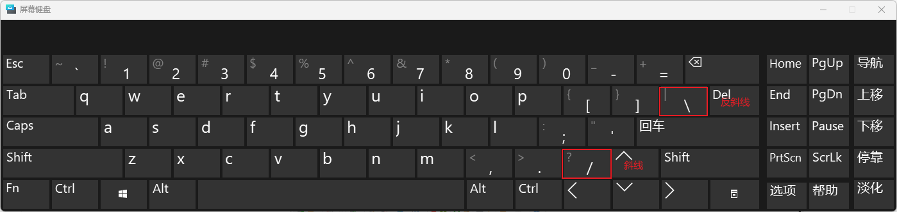

## 2.2 概述

* 在 Linux 中的目录都是ä»æ ¹ç›®å½•ï¼ˆ`/`）开始的，Linux 的目录类似äºä¸€é¢—`倒挂`的树，如：

```shell
tree -L 1 /
```


* 其对应的`目录树状结æ„`，类似äºï¼š


> 注æ„âš ï¸ï¼š
>
> * ① `/` 是根目录。
> * â‘¡ `/etc/` 中的第一个 `/` 是根目录，`etc` 是目录å，第二个 `/` 表示是目录；并且，第二个 `/` å¯ä»¥çœç•¥ã€‚
> * â‘¢ 在å®é™…交æµçš„时候，我们å¯èƒ½ä¼šæ¨¡ç³Šè¿™äº›æ¦‚念，直æ¥è¯´ `/etc` 目录。

## 2.3 Linux 核心目录（:star:）

* Linux 的核心目录如下：

| 核心目录 | 备注                                                         |
| -------- | ------------------------------------------------------------ |
| `/etc/`  | 系统æœåŠ¡`é…置文件`的目录，存放系统ã€æœåŠ¡ã€å‘½ä»¤çš„é…置；通常，yum 或 rpm 安装的软件的é…置都在该目录中。 |
| `/home/` | 普通用户的家目录，如：`x` 用户的家目录就是 `/home/x/`。      |
| `/root/` | root 用户的家目录，如：`root` 用户的家目录就是 `/root/`。    |
| `/dev/`  | dev 是 device 的缩写，是设备文件目录，如：硬盘等。           |
| `/tmp/`  | tmp 是 temp 的缩写，表示临时目录，用æ¥å­˜å‚¨ç¨‹åºè¿è¡Œä¸­çš„临时文件等。 |
| `/proc/` | proc 是 process（进程）的缩写，表示虚拟的目录，它是系统内存的映射，存放的是内存中的信æ¯ã€è¿›ç¨‹ã€æœåŠ¡ä¿¡æ¯ä»¥åŠå†…核信æ¯ç­‰ã€‚ |

> 注æ„âš ï¸ï¼š
>
> * â‘  å¯¹äº Linux 中的目录，官方是有[标准](https://www.pathname.com/fhs/)（文件系统分层结æ„，LSB（Linux Standard Base））的。
> * â‘¡ 在å®é™…工作中，通常所说的`文件å或目录大å°å†™æ•æ„Ÿ`指的是`文件å或目录区分大å°å†™`。
> * â‘¢ 在å®é™…工作中，å¯èƒ½ä¼šæœ‰äººè¯´ï¼šLinux 系统是区分大å°å†™çš„，而 Win 系统是ä¸åŒºåˆ†å¤§å°å†™çš„；这ç§è¯´æ³•ï¼ŒæŸç§æ„义上是错误的，因为ä¸æ˜¯æ“作系统区分大å°å†™ï¼Œè€Œæ˜¯æ“作系统下的`æŸäº›æ–‡ä»¶ç³»ç»ŸåŒºåˆ†å¤§å°å†™`，比如：Linux 系统就å¯ä»¥æŒ‚è½½ NTFS 文件系统，而 NTFS 文件系统就是ä¸åŒºåˆ†å¤§å°å†™çš„（win 默认的文件系统）。

## 2.4 Linux 中的目录

* å¯ä»¥é€šè¿‡å¦‚下的命令，查看 Linux 中根目录下的一级å­ç›®å½•ï¼š

```shell
tree -L 1 /
```

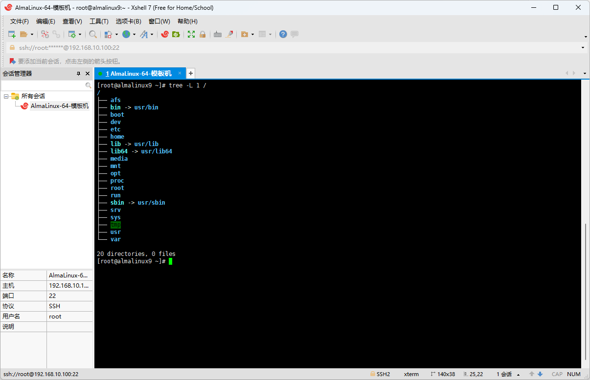

* 其内容的简è¦è§£é‡Šï¼Œå¦‚下所示：

```shell
afs # 是 Andrew File System 的挂载点，这是一个分布å¼æ–‡ä»¶ç³»ç»Ÿï¼Œé€šå¸¸ç”¨äºå¤§å‹ç½‘络ç¯å¢ƒä¸­ï¼Œä½†å®ƒå¹¶ä¸æ˜¯ Linux 标准目录结æ„的一部分。
bin -> usr/bin # 这是一个符å·é“¾æ¥ï¼ŒæŒ‡å‘ usr/bin 目录。bin 目录通常包å«ç³»ç»Ÿçš„基本用户命令的二进制文件。这个链æ¥è¡¨ç¤ºç³»ç»Ÿå‘½ä»¤ç°åœ¨ç»Ÿä¸€æ”¾åœ¨ usr/bin 下，为的是简化文件系统的结æ„。
boot # 包å«å¯åŠ¨åŠ è½½ç¨‹åºç›¸å…³çš„文件，例如：内核映åƒå’Œå¯åŠ¨åŠ è½½ç¨‹åºçš„é…置文件（如 GRUB）。
dev # 这个目录包å«è®¾å¤‡æ–‡ä»¶ã€‚Linux 将硬件设备视作文件，å¯ä»¥åœ¨è¿™ä¸ªç›®å½•ä¸­æ‰¾åˆ°å®ƒä»¬ï¼Œå¦‚：ç£ç›˜é©±åŠ¨å™¨ã€ç»ˆç«¯è®¾å¤‡ï¼ˆtty）等。
etc # 包å«ç³»ç»Ÿçš„é…置文件。这里通常存放ç€å¯åŠ¨è„šæœ¬ã€æœåŠ¡çš„é…置文件等。
home # 用户的家目录。通常æ¯ä¸ªç”¨æˆ·éƒ½ä¼šåœ¨è¿™é‡Œæœ‰ä¸€ä¸ªä»¥å…¶ç”¨æˆ·å命å的目录。
lib -> usr/lib # 符å·é“¾æ¥ï¼ŒæŒ‡å‘ usr/lib 目录。这些目录包å«ç³»ç»Ÿçš„库文件，这些文件包å«ä»£ç ï¼Œè®¸å¤šç¨‹åºéƒ½ä¾èµ–äºè¿™é‡Œçš„库æ¥è¿è¡Œã€‚
lib64 -> usr/lib64 # 符å·é“¾æ¥ï¼ŒæŒ‡å‘ usr/lib64 目录。这些目录包å«ç³»ç»Ÿçš„库文件，这些文件包å«ä»£ç ï¼Œè®¸å¤šç¨‹åºéƒ½ä¾èµ–äºè¿™é‡Œçš„库æ¥è¿è¡Œã€‚
media # 通常用äºæŒ‚è½½å¯ç§»åŠ¨åª’体，如：USB 驱动器ã€CD-ROM 等。
mnt # 通常用äºä¸´æ—¶æŒ‚载文件系统，如：挂载硬盘分区或网络文件系统。
opt # 用äºå®‰è£…“å¯é€‰â€çš„软件和第三方应用程åºã€‚
proc # 一个虚拟文件系统，æ供了一个æ¥å£åˆ°å†…核数æ®ç»“æ„。它包å«äº†å…³äºç³»ç»Ÿå’Œè¿è¡Œä¸­è¿›ç¨‹çš„ä¿¡æ¯ã€‚
root # 超级用户（root用户）的家目录。
run # 一个临时文件系统，存储系统å¯åŠ¨å以æ¥çš„ä¿¡æ¯ã€‚如：当å‰ç™»å½•çš„用户和è¿è¡Œçš„æœåŠ¡ã€‚
sbin -> usr/sbin # 这是一个符å·é“¾æ¥ï¼ŒæŒ‡å‘ usr/sbin 目录。sbin 目录包å«ç³»ç»Ÿç®¡ç†å‘½ä»¤ï¼Œé€šå¸¸ä»…ç”± root 用户使用。
srv # 用äºæœåŠ¡ç‰¹å®šçš„æ•°æ®ï¼Œè¿™ä¸ªç›®å½•ä¸‹çš„æ•°æ®ç”¨æ¥æä¾›æœåŠ¡ã€‚
sys # 一个虚拟文件系统，æ供了内核的设备和硬件信æ¯çš„æ¥å£ã€‚它å…许用户空间程åºè·å–和设置硬件å±æ€§ã€‚
tmp # 用äºå­˜å‚¨ä¸´æ—¶æ–‡ä»¶ï¼Œç³»ç»Ÿå’Œç”¨æˆ·ç¨‹åºå¯ä»¥åœ¨è¿™é‡Œåˆ›å»ºä¸´æ—¶æ–‡ä»¶ã€‚
usr # 包å«ç”¨æˆ·ç¨‹åºå’Œæ•°æ®çš„ç»å¤§å¤šæ•°å†…容，如：系统默认的应用程åºå’Œåº“。
var # 用äºå­˜å‚¨ç»å¸¸å˜åŒ–的文件，如：日志文件ã€é‚®ä»¶é˜Ÿåˆ—等。
```

* 其内容的详细解释，如下所示：

| Linux 中的目录          | 备注                                                         |
| ----------------------- | ------------------------------------------------------------ |
| `/bin` -> `/usr/bin/`   | bin 表示 binary ，å³äºŒè¿›åˆ¶æ–‡ä»¶å‘½ä»¤ï¼Œæ™®é€šç”¨æˆ·ç»å¸¸ä½¿ç”¨çš„命令，如：`ping` 命令。 |
| `/sbin`-> `/usr/sbin/`  | s 是 superï¼ˆè¶…çº§ï¼‰çš„ç¼©å†™ï¼Œå³ root 用户æ‰å¯ä»¥ä½¿ç”¨çš„命令，如：`shutdown` 命令和 `reboot` 命令。 |
| `/boot/`                | 存放的是 Linux 系统å¯åŠ¨å’Œå¼•å¯¼ç›¸å…³æ–‡ä»¶çš„目录，如：引导系统å¯åŠ¨ç¨‹åºã€ç³»ç»Ÿå†…核镜åƒç­‰ã€‚ |
| `/dev/`                 | dev 是 device 的缩写，是设备文件目录，如：`/dev/cpu`ã€`/dev/mem` 等。 |
| `/etc/`                 | 系统æœåŠ¡`é…置文件`的目录，存放系统ã€æœåŠ¡ã€å‘½ä»¤çš„é…置。       |
| `/home/`                | 普通用户的家目录，如：`x` 用户的家目录就是 `/home/x/`。      |
| `/root/`                | root 用户的家目录，如：`root` 用户的家目录就是 `/root/`。    |
| `/lib` -> `/usr/lib/`   | lib 是 library 的缩写，å³åº“文件（æœåŠ¡è½¯ä»¶çš„ä¾èµ–ï¼‰ï¼Œå…¶ä½œç”¨ç±»ä¼¼äº Windows 里的 DLL 文件；其中 `.so` 是软件è¿è¡Œéœ€è¦çš„ç¯å¢ƒã€‚ |
| `/sbin` -> `/usr/sbin/` | 作用和 lib 目录一样，åªä¸è¿‡å­˜æ”¾çš„是 64 ä½åº“文件（æœåŠ¡è½¯ä»¶çš„ä¾èµ–）。 |
| `/mnt/`                 | `mnt` 是 `mount tempoary` 的缩写，临时挂载点，临时的入å£ã€‚   |
| `/opt/`                 | opt 是 optional(å¯é€‰) 的缩写，第三方软件的安装ä½ç½®ï¼Œå¦‚：MySQL 等。 |
| `/proc/`                | proc 是 process（进程）的缩写，表示虚拟的目录（ä¸å ç¡¬ç›˜ç©ºé—´ï¼‰ï¼Œå®ƒæ˜¯ç³»ç»Ÿå†…存的映射，存放的是内存中的信æ¯ã€è¿›ç¨‹ã€æœåŠ¡ä¿¡æ¯ä»¥åŠå†…核信æ¯ç­‰ã€‚ |
| `/sys/`                 | å’Œ /proc 类似，表示虚拟的目录（ä¸å ç¡¬ç›˜ç©ºé—´ï¼‰ï¼Œç”¨äºå±•ç¤ºç³»ç»Ÿç¡¬ä»¶ä¿¡æ¯ã€ç®¡ç†ç¡¬ä»¶è®¾å¤‡ã€è°ƒæ•´å†…æ ¸å‚æ•°ã€æ§åˆ¶è®¾å¤‡é©±åŠ¨ç¨‹åºä»¥åŠè¿›è¡Œç”µæºç®¡ç†ç­‰ã€‚它是内核对象的映射，å…许用户和程åºä»¥æ–‡ä»¶ç³»ç»Ÿçš„æ–¹å¼è®¿é—®å’Œæ§åˆ¶è¿™äº›å†…核对象。 |
| `/tmp/`                 | tmp 是 temp 的缩写，表示临时目录，用æ¥å­˜å‚¨ç¨‹åºè¿è¡Œä¸­çš„临时文件等。 |
| `/usr/`                 | usr 是 unix shared resources(共享资æº) 的缩写，存放的是用户软件安装的ä½ç½®ï¼Œç±»ä¼¼äº windows 下的 program files 目录。 |
| `/var/`                 | var 是 variable 的缩写，用æ¥å­˜æ”¾ç»å¸¸å˜åŒ–çš„æ•°æ®ï¼Œç»å¸¸ç”¨æ¥ä¿å­˜åº”用程åºçš„日志。 |

## 2.5 路径表ç°å½¢å¼ï¼ˆâ­ï¼‰

* Linux 下的路径表示形å¼æœ‰å¦‚下的两ç§ï¼š

| Linux 路径表ç°å½¢å¼ | è¯´æ˜                                                         | 建议                             |
| ------------------ | ------------------------------------------------------------ | -------------------------------- |
| ç»å¯¹è·¯å¾„           | ä»`根目录`开始的路径都是ç»å¯¹è·¯å¾„，如：`/usr/local`ã€`/etc/hostname` 等。 | åˆæ­¥å­¦ä¹ é˜¶æ®µï¼Œæ¨è使用ç»å¯¹è·¯å¾„。 |
| 相对路径           | ä¸æ˜¯ä»æ ¹ç›®å½•å¼€å§‹çš„路径就是相对路径，如：`etc/`ã€`etc/hostname`。 | 熟练以å，å¯ä»¥ä½¿ç”¨ç›¸å¯¹è·¯å¾„。     |

> 注æ„âš ï¸ï¼šè·¯å¾„中的 `.` 或 `./` 表示的是`当å‰ç›®å½•`，而 `..` å’Œ`../` 表示的是`上一层目录`。

* `相对路径`å’Œ`ç»å¯¹è·¯å¾„`çš„ç†è§£ï¼š

  * 我目å‰æ‰€åœ¨çš„ä½ç½®åœ¨`中国江è‹çœå—京市六åˆåŒºé’Ÿç§€å˜‰å›­xxxæ ‹xxx室`，其中`中国江è‹çœå—京市六åˆåŒºé’Ÿç§€å˜‰å›­xxxæ ‹xxx室`就是ç»å¯¹è·¯å¾„。

  * 我目å‰æ‰€åœ¨çš„ä½ç½®åœ¨`盛和家园`（中国江è‹çœå—京市六åˆåŒºç››å’Œå®¶å›­ï¼‰é™„è¿‘çš„``钟秀嘉园xxxæ ‹xxx室``，其中`盛和家园附近的钟秀嘉园xxxæ ‹xxx室`就是相对路径。


* 示例：ç»å¯¹è·¯å¾„

```shell
# /etc/NetworkManager/system-connections/eth0.nmconnection 就是ç»å¯¹è·¯å¾„
cat /etc/NetworkManager/system-connections/eth0.nmconnection
```


* 示例：相对路径

```shell
cd /etc/NetworkManager/system-connections/
# eth0.nmconnection 就是相对路径
cat eth0.nmconnection
```


# 第三章：Linux 必会命令

## 3.1 cd 命令（â­ï¼‰

* 命令：

```shell
cd [目录]
```

* 对应的英文：change directory 。
* 作用：进入（切æ¢ï¼‰åˆ°æŒ‡å®šçš„目录（å¯ä»¥æ˜¯ç»å¯¹è·¯å¾„或相对路径）中。

> 注æ„âš ï¸ï¼š
>
> * 如æœç›®å½•çœç•¥ï¼Œå³ `cd` ，就是默认进入当å‰ç”¨æˆ·çš„ shell å˜é‡ HOME 所在目录，å³å®¶ç›®å½•ã€‚
> * 如æœç›®å½•ä¸º `~`ï¼Œå³ `cd ~`，也是 默认进入当å‰ç”¨æˆ·çš„ shell å˜é‡ HOME 所在目录，å³å®¶ç›®å½•ã€‚
> * 如æœç›®å½•ä¸º `-`ï¼Œå³ `cd -`，是切æ¢åˆ°ä¸Šæ¬¡æ‰€åœ¨ä½ç½®ï¼ˆäº†è§£ï¼‰ã€‚


* 示例：切æ¢åˆ°ç”¨æˆ·çš„家目录

```shell
cd
```


* 示例：切æ¢åˆ°ç”¨æˆ·çš„家目录

```shell
cd ~
```


* 示例：切æ¢æ ¹ç›®å½•

```shell
cd /
```

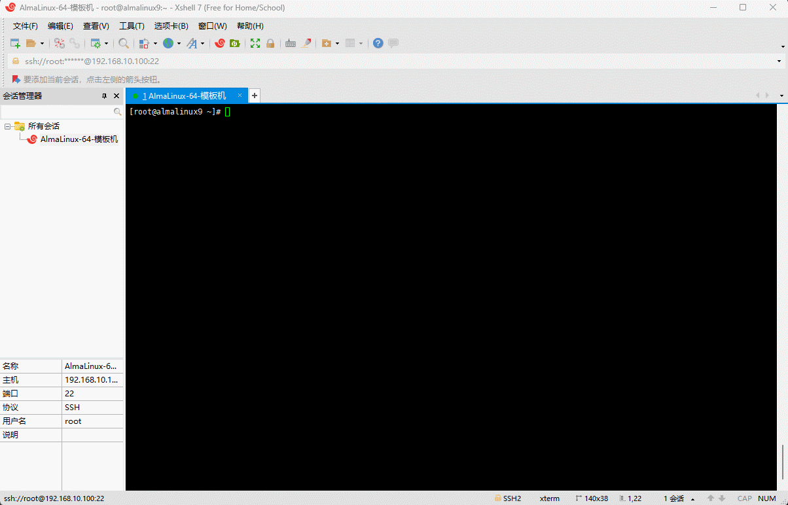


* 示例：切æ¢ä¸Šä¸€çº§ç›®å½•

```shell
# ç­‰ä»·äº cd ..
cd ../
```


* 示例：切æ¢ä¸Šä¸€çº§ç›®å½•çš„上一级目录

```shell
cd ../../
```


* 示例：切æ¢åˆ°æŒ‡å®šçš„目录

```shell
cd /etc/NetworkManager/system-connections/
```


## 3.2 pwd 命令（â­ï¼‰

* 命令：

```shell
pwd
```

* 对应的英文：print working directory。
* 功能：显示当å‰æ‰€åœ¨ä½ç½®ï¼ˆä»¥ç»å¯¹è·¯å¾„æ–¹å¼æ˜¾ç¤ºï¼‰ã€‚


* 示例：

```shell
pwd
```


## 3.3 mkdir 命令（â­ï¼‰

* 命令：

```shell
mkdir [-p][-v] 目录 ...
```

* 功能：创建目录。

* 对应的英文：make directory 。

* 选项：

  * `-p`，`--parents`：创建多级目录。
  * `-v`，`--verbose`：æ¯æ¬¡åˆ›å»ºæ–°ç›®å½•éƒ½æ˜¾ç¤ºä¿¡æ¯ã€‚


* 示例：创建一级目录

```shell
mkdir demo
```


* 示例：创建多级目录

```shell
mkdir -pv demo/a/b
```


## 3.4 touch 命令（â­ï¼‰

* 命令：

```shell
touch 文件 ...
```

* 功能：创建空文件。

> 注æ„âš ï¸ï¼š
>
> * â‘  如æœæ–‡ä»¶ä¸­åŒ…å«è·¯å¾„，必须存在父目录；å¦åˆ™ï¼Œå°†ä¼šæŠ¥é”™ã€‚
> * â‘¡ touch 除了创建空文件之外，还有刷新文件的时间，如：atime（access time）ã€mtime（modify time） å’Œ ctime（change time） 。


* 示例：创建å•ä¸ªæ–‡ä»¶

```shell
cd /tmp/
```

```shell
touch a.txt
```


* 示例：创建多个文件

```shell
touch /tmp/a.txt /tmp/b.txt
```


## 3.5 ls 命令（â­ï¼‰

* 命令：

```shell
ls [-l][-a][-h][-r][-t] [目录|具体的文件]
```

* 功能：显示文件列表。
* 对应的英文：list 。
* 选项：
  * `-l` ：以 long（长格å¼ï¼‰æ˜¾ç¤ºï¼Œå³æ˜¾ç¤ºè¯¦ç»†ä¿¡æ¯ï¼Œå¦‚：文件时间ã€å¤§å°ã€æ‰€æœ‰è€…。
  * `-a`，`--all`：显示所有文件和目录，包括éšè—文件或目录。
  * `-h`，`--human-readable`：以人类å¯è¯»å½¢å¼æ˜¾ç¤ºå¤§å°ï¼Œå¦‚：1.5Kã€4.0K 。
  * `-t`，`--time`：按照修改时间æ’åºã€‚
  * `-r`，`--reverse`：逆åºæ’åºï¼Œé€šå¸¸å’Œ`-t` é…åˆä½¿ç”¨ï¼Œé»˜è®¤æŒ‰ç…§å­—æ¯å¤§å°æ’åºã€‚
* ç±»ä¼¼äº windows 中的`文件资æºç®¡ç†å™¨`：


> 注æ„âš ï¸ï¼š
>
> * â‘  `ls -l` 的别å是 `ll` ；所以，æŸç§æ„义上讲，`ls -l` å’Œ `ll` 是等价的；但是，ä¸æ˜¯æ‰€æœ‰ Linux 都是这样。
> * â‘¡ 如æœæ²¡æœ‰æŒ‡å®šå‚æ•°`[目录|具体的文件]`，那么就是列出当å‰ç›®å½•çš„文件列表；æ¢è¨€ä¹‹ï¼Œå°±æ˜¯ `.` 或 `./`。


* 示例：

```shell
ls /
```


* 示例：以 long（长格å¼ï¼‰æ˜¾ç¤ºï¼ˆå¸¸ç”¨ï¼‰

```shell
# ç­‰ä»·äº ll /
ls -l /
```


* 示例：按照文件的修改时间æ’åºï¼Œæœ€æ–°çš„文件和目录在最上é¢ï¼ˆé»˜è®¤æ˜¯æŒ‰ç…§å­—æ¯é¡ºåºä» a ~ z æ’åºï¼‰

```shell
ll -t /
```


* 示例：根æ®æ–‡ä»¶çš„修改时间逆åºæ’åºï¼ˆå¸¸ç”¨ï¼‰

```shell
ll -lt /
```


* 示例：以人类å¯è¯»å½¢å¼æ˜¾ç¤ºå¤§å°

```shell
ll -h /
```

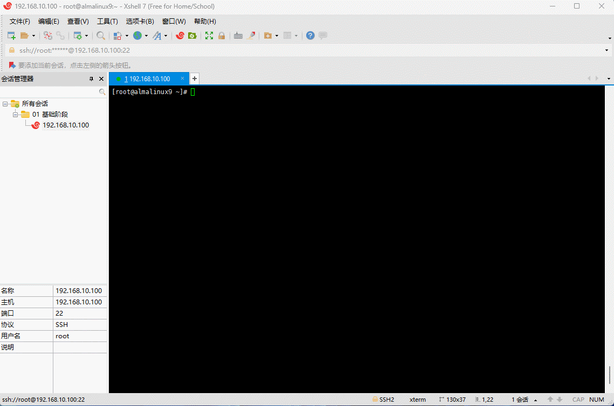


* 示例：显示所有文件和目录

```shell
ll -ah /
```


## 3.6 mv 命令（â­ï¼‰

* 命令：

```shell
mv [-b][-f] æºæ–‡ä»¶|目录 目标文件|目标目录
```

* 功能：移动文件和目录ã€é‡å‘½å文件和目录。
* 对应的英文：move 。
* 选项：
  * `-b`：如æœéœ€è¦è¦†ç›–文件，则覆盖å‰å…ˆå¤‡ä»½ã€‚
  * `-f`：如æœç›®æ ‡æ–‡ä»¶å’Œç°æœ‰æ–‡ä»¶é‡å，则直æ¥è¦†ç›–。

> 注æ„âš ï¸ï¼š
>
> * â‘  mv 命令类似äº`剪切并粘贴`。
>
> * â‘¡ 如æœ`文件所在目录`å’Œ`目标目录`是`åŒä¸€ä¸ªç›®å½•`，就是`é‡å‘½å`。
> * â‘¢ 如æœç›®æ ‡æ–‡ä»¶æˆ–目标目录ä¸å­˜åœ¨ï¼Œåˆ™ mv 命令将创建它。如æœç›®æ ‡æ–‡ä»¶æˆ–目标目录已ç»å­˜åœ¨ï¼Œåˆ™ mv 命令将覆盖它。


* 示例：移动文件

```shell
mkdir -pv /tmp/back
```

```shell
mv /tmp/a.txt /tmp/back/
```

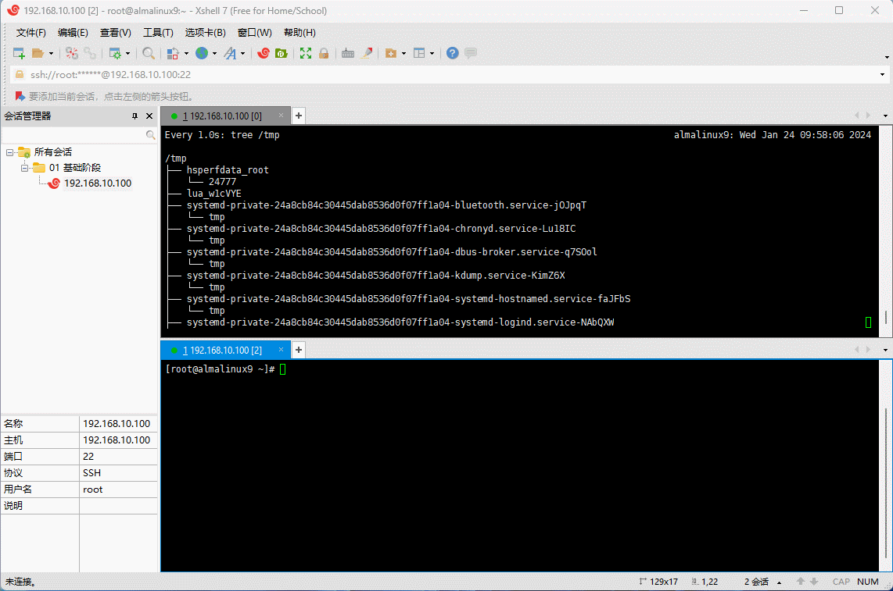


* 示例：é‡å‘½å文件

```shell
mv /tmp/a.txt /tmp/b.txt
```


* 示例：移动目录

```shell
mkdir -pv /tmp/a /tmp/back
```

```shell
mv /tmp/a /tmp/back
```


* 示例：移动目录下的所有文件到指定目录

```shell
mkdir -pv /tmp/a/b/c /tmp/back
```

```shell
touch /tmp/a/{1..10}.txt 
```

```shell
mv /tmp/a/* /tmp/back
```


* 示例：强制覆盖指定文件（æ…用ï¼ï¼ï¼ï¼‰

```shell
mkdir -pv /tmp/back
```

```shell
touch /tmp/a.txt /tmp/back/a.txt
```

```shell
mv -f /tmp/a.txt /tmp/back/a.txt
```


* 示例：覆盖å‰å¤‡ä»½ï¼ˆæ¨èï¼ï¼ï¼ï¼‰

```shell
mkdir -pv /tmp/back
```

```shell
touch /tmp/a.txt /tmp/back/a.txt
```

```shell
mv -bf /tmp/a.txt /tmp/back/a.txt
```

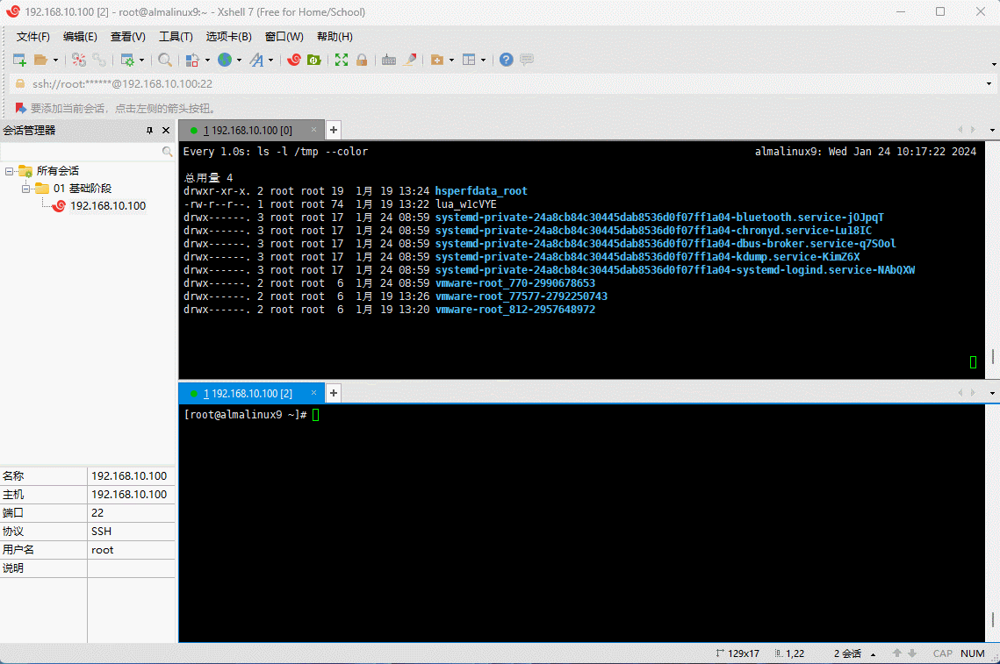

## 3.7 cp 命令（â­ï¼‰

* 命令：

```shell
cp [-r|-R][-p][-d][-a] æºæ–‡ä»¶|目录 目标文件|目标目录
```

* 功能：å¤åˆ¶æ–‡ä»¶æˆ–目录。
* 对应的英文：copy 。
* 选项：
  * `-r|-R`，`--recursive`：递归赋值，å¤åˆ¶ç›®å½•åŠå…¶ç›®å½•ä¸­çš„内容。
  * `-p`：å¤åˆ¶çš„时候ä¿ç•™æºæ–‡ä»¶æˆ–目录的å±æ€§ï¼ˆé»˜è®¤æƒ…况是：模å¼ã€æ‰€æœ‰æƒã€æ—¶é—´æˆ³ï¼‰ã€‚
  * `-d`：å¤åˆ¶æ–‡ä»¶æˆ–目录的åŒæ—¶ï¼Œå¤åˆ¶è½¯é“¾æ¥ã€‚
  * `-a`：å¤åˆ¶æ‰€æœ‰ï¼Œç›¸å½“äº `-dpr` 。

> 注æ„âš ï¸ï¼šcp 默认是ä¸èƒ½å¤åˆ¶ç›®å½•çš„，除é加上 `-R` 或 `-r` 选项。


* 示例：

```shell
cp /etc/hostname /tmp/
```


* 示例：

```shell
cp -R /etc/ /tmp/
```


## 3.8 rm 命令（â­ï¼‰

* 命令：

```shell
rm [-r][-f] 文件|目录 ...
```

* 功能：删除文件或目录。
* 对应的英文：remove 。
* 选项：
  * `-f`，`--force`：强制删除ä¸æ示，é常å±é™©âš ï¸ã€‚
  * `-r|-R`，`--recursive`：递归删除目录åŠå…¶å†…容，é常å±é™©âš ï¸ã€‚

> 注æ„âš ï¸ï¼š
>
> * â‘  `rm` 命令é常å±é™©ï¼Œä½¿ç”¨çš„时候è¦æ…é‡ï¼ï¼ï¼
> * â‘¡ `rm -rf xxx` 超级å±é™©ï¼Œä½¿ç”¨çš„时候，没有需求就ä¸è¦åŠ ä¸Š `-r`或 `-f`。


* 示例：删除文件（强制删除ä¸æ示）

```shell
touch /tmp/a.txt
```

```shell
rm -f /tmp/a.txt
```


* 示例：删除目录（超级å±é™©ï¼Œä½¿ç”¨çš„时候æ…é‡ï¼ï¼ï¼ï¼‰

```shell
cp -R /etc /tmp/
```

```shell
rm -rf /tmp/etc
```

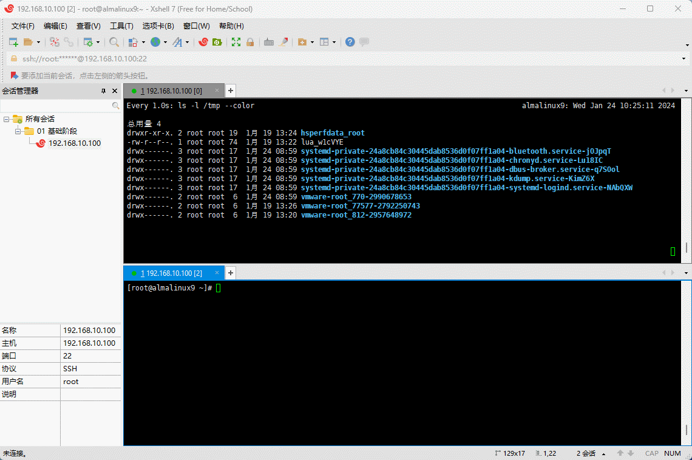

## 3.9 echo 命令（â­ï¼‰

* 命令：

```shell
echo 字符串|å˜é‡ ...
```

* 功能：输出字符串或å˜é‡åˆ°å±å¹•ã€‚

> 注æ„âš ï¸ï¼šecho å¯ä»¥å’Œ `>` 或 `>>` 符å·ä¸€èµ·ä½¿ç”¨ã€‚
>
> * â‘  `>` 被称为`é‡å®šå‘`符å·ï¼Œå³å…ˆæ¸…空文件内容，å†å†™å…¥ã€‚
> * â‘¡ `>>` 被称为`追加é‡å®šå‘`符å·ï¼Œå³å°†ä¿¡æ¯å†™å…¥åˆ°æ–‡ä»¶çš„末尾。 
> * â‘¢ `é‡å®šå‘`就是`改å˜æ•°æ®è¾“出的方å‘`；在默认情况下，都是输出到å±å¹•ä¸Šçš„。
> * â‘£ `é‡å®šå‘`ä¸ä»…仅有 `>` ã€`>>` ，其å®è¿˜æœ‰ `|（管é“）` 等。

> 温馨æ示ℹï¸ï¼š
>
> * â‘  `echo` å¯ä»¥å’Œ `{}` 一起简å•ä½¿ç”¨ï¼Œå¦‚：`echo {1..10}` ，此时的 `{} `被称为生æˆåºåˆ—。
> * â‘¡ `{}` 也å¯ä»¥ç”¨æ¥å’Œ `touch` 或 `mkdir` 一起é…åˆä½¿ç”¨ï¼Œç”¨æ¥æ‰¹é‡ç”Ÿæˆæ–‡ä»¶æˆ–目录。


* 示例：输出字符串

```shell
echo "HelloWorld"
```


* 示例：输出内容到文件中

```shell
echo "HelloWorld" > /tmp/a.txt
```


* 示例：批é‡è¾“出数字

```shell
echo {1..10}
```

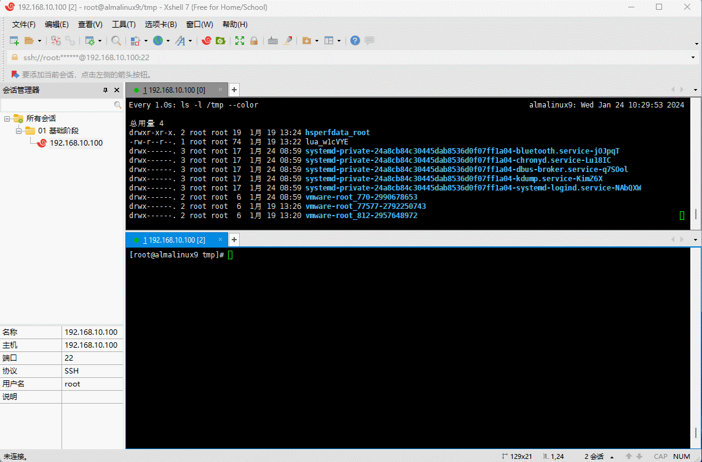


* 示例：批é‡è¾“出数字

```shell
echo xudaxian{01..10}
```


* 示例：批é‡è¾“出字符

```shell
echo {a..z}
```

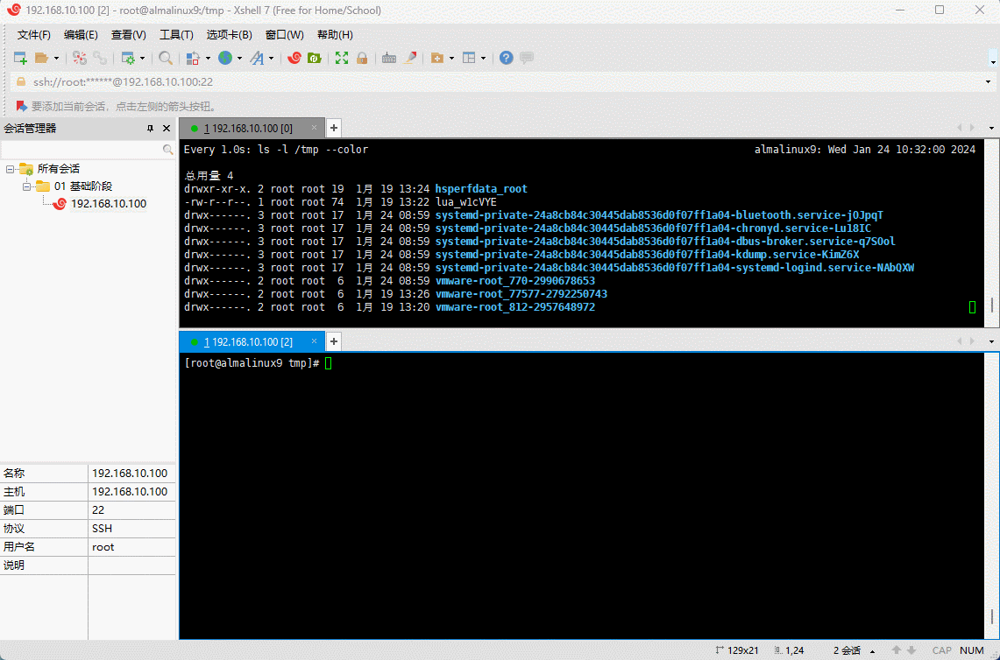


* 示例：批é‡è¾“出字符

```shell
echo {A..Z}
```


* 示例：批é‡ç”Ÿæˆæ–‡ä»¶

```shell
touch /tmp/{01..10}.txt
```

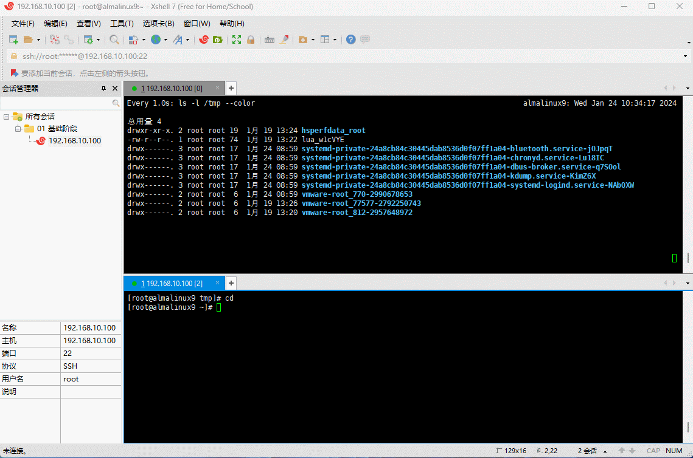


* 示例：批é‡ç”Ÿæˆæ–‡ä»¶å¤¹

```shell
mkdir -pv /tmp/{01..10}
```


## 3.10 cat 命令（â­ï¼‰

* 命令：

```shell
cat [-n] [文件]...
```

* 功能：显示文件内容。
* 对应的英文：concatenate（åˆå¹¶æ–‡ä»¶å¹¶è¾“出到å±å¹•ï¼‰ã€‚
* 选项：
  * `-n`，`--number`：显示行å·ã€‚

> 温馨æ示ℹï¸ï¼š
>
> * â‘  所谓的åˆå¹¶æ–‡ä»¶ï¼Œå°±ç±»ä¼¼äº `SQL` 中的 `UNION ALL`（并集）。
> * â‘¡ 如æœæ²¡æœ‰æŒ‡å®šæ–‡ä»¶ï¼Œåˆ™ä»æ ‡å‡†è¾“入中读å–。


* 示例：显示文件内容

```shell
cat /etc/hostname
```


* 示例：显示文件内容åŠå…¶è¡Œå·

```shell
cat -n /etc/passwd
```


* 示例：åˆå¹¶æ–‡ä»¶å†…容

```shell
cat -n /etc/hostname /etc/passwd 
```

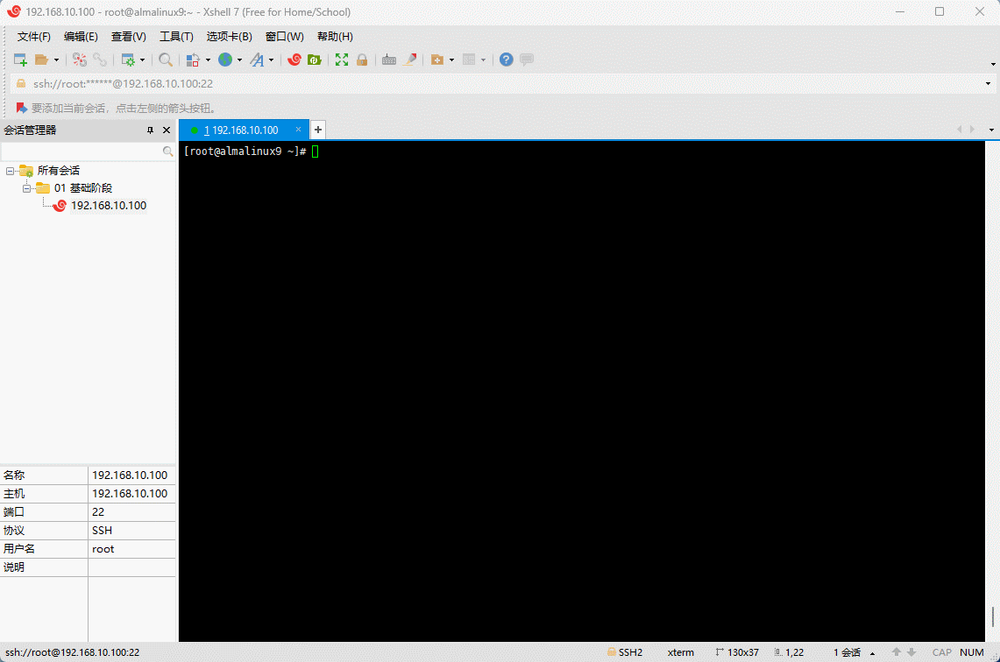


# 第四章：补充

## 4.1 Linux 的组æˆï¼ˆâ­ï¼‰

### 4.1.1 概述

* Linux 主è¦ç”±ä»¥ä¸‹å‡ ä¸ªç»„æˆéƒ¨åˆ†æ„æˆï¼š
  - â‘  `Linux 内核`：Linux 内核是整个æ“作系统的核心，负责管ç†ç¡¬ä»¶è®¾å¤‡ã€å†…存管ç†ã€è¿›ç¨‹è°ƒåº¦ç­‰æ ¸å¿ƒåŠŸèƒ½ã€‚它是由æ—纳斯·托瓦兹åŠå…¶ä»–å¼€å‘者编写和维护的。
  - â‘¡ `Shell 解释器`：Shell 解释器是用户ä¸æ“作系统交互的æ¥å£ï¼Œå®ƒæ¥æ”¶ç”¨æˆ·è¾“入的命令并将其解释执行。常è§çš„ Shell 解释器有 Bashã€Zsh 等，它们æ供了命令行界é¢å’Œè„šæœ¬ç¼–程功能。
  - â‘¢ `外围的应用程åº`：命令ã€åº”用程åºã€å›¾å½¢åŒ–ç•Œé¢â€¦â€¦

* 其图示如下：

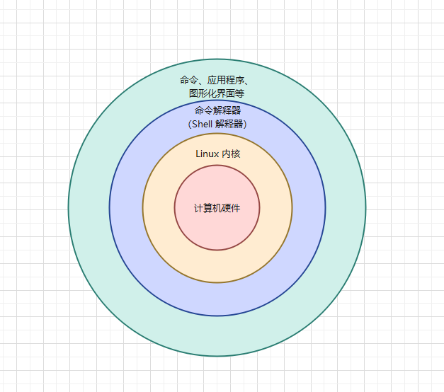

* 上述的组æˆéƒ¨åˆ†å…±åŒæ„æˆäº†ä¸€ä¸ªå®Œæ•´çš„ Linux æ“作系统，为用户æ供了丰富的功能和çµæ´»æ€§ã€‚

### 4.1.2 查看 Linux 内核命令

* 命令：

```shell
uname [-a][-s][-r]
```

* 功能：显示 Linux 内核信æ¯ã€‚
* 选项：
  * `-a`，`--all` ：按顺åºæ‰“å°å…¨éƒ¨ä¿¡æ¯ã€‚
  * `-s`，`--kernel-name`：打å°å†…æ ¸åç§°ï¼Œç›¸å½“äº `uname`。
  * `-r`，`--kernel-release`：打å°å†…æ ¸ release 。


* 示例：查看全部信æ¯

```shell
uname -a
```


* 示例：查看内核版本

```shell
uname -sr
```


### 4.1.3 查看默认 SHELL 解释器命令

* 命令：

```shell
echo $SHELL
```

* 功能：显示默认的 SHELL 解释器。

> 温馨æ示ℹï¸ï¼šå¯ä»¥é€š `cat /etc/shells`å‘½ä»¤æŸ¥çœ‹å½“å‰ Linux 系统支æŒçš„所有 SHELL ç±»å‹ã€‚


* 示例：

```shell
echo $SHELL
```

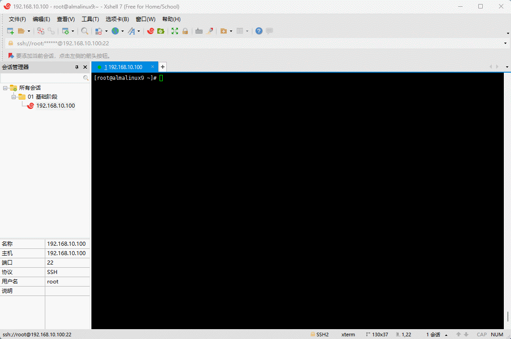

### 4.1.4 查看 Linux å‘行版本

* 命令：

```shell
cat /etc/os-release
```

* 功能：显示 Linux å‘行版本信æ¯ã€‚


* 示例：

```shell
cat /etc/os-release
```


* 示例：

```shell
cat /etc/*-release
```


## 4.2 Linux ç¯å¢ƒçš„åˆæ­¥ä¼˜åŒ–（â­ï¼‰

* 安装 epel-release ：

```shell
dnf config-manager --set-enabled crb
dnf -y install epel-release
```


* 安装 Linux 常用的工具：

```shell
dnf -y install gcc make autoconf gcc-c++ glibc glibc-devel pcre \
    pcre-devel openssl openssl-devel systemd-devel zlib-devel \
    tree vim tmux lsof tcpdump bc bzip2 nfs-utils man-pages \
    wget bash-completion \
    lrzsz net-tools sysstat iotop iftop htop zip unzip nc \
    nmap telnet bc psmisc httpd-tools bind-utils nethogs expect
```


* 安装 Linux 娱ä¹å‘½ä»¤ï¼ˆå¯é€‰ï¼‰ï¼š

```shell
dnf -y install sl cowsay
```

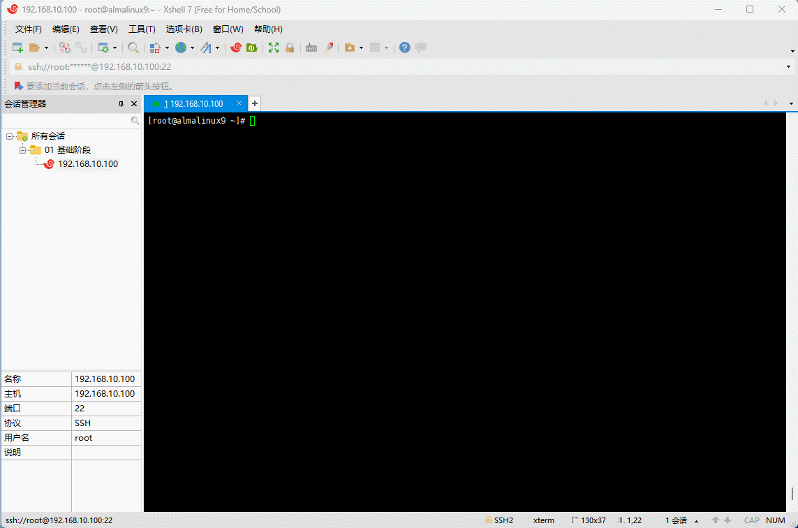

* 安装开å‘工具软件包组：

```shell
dnf -y groupinstall "Development Tools" 
```

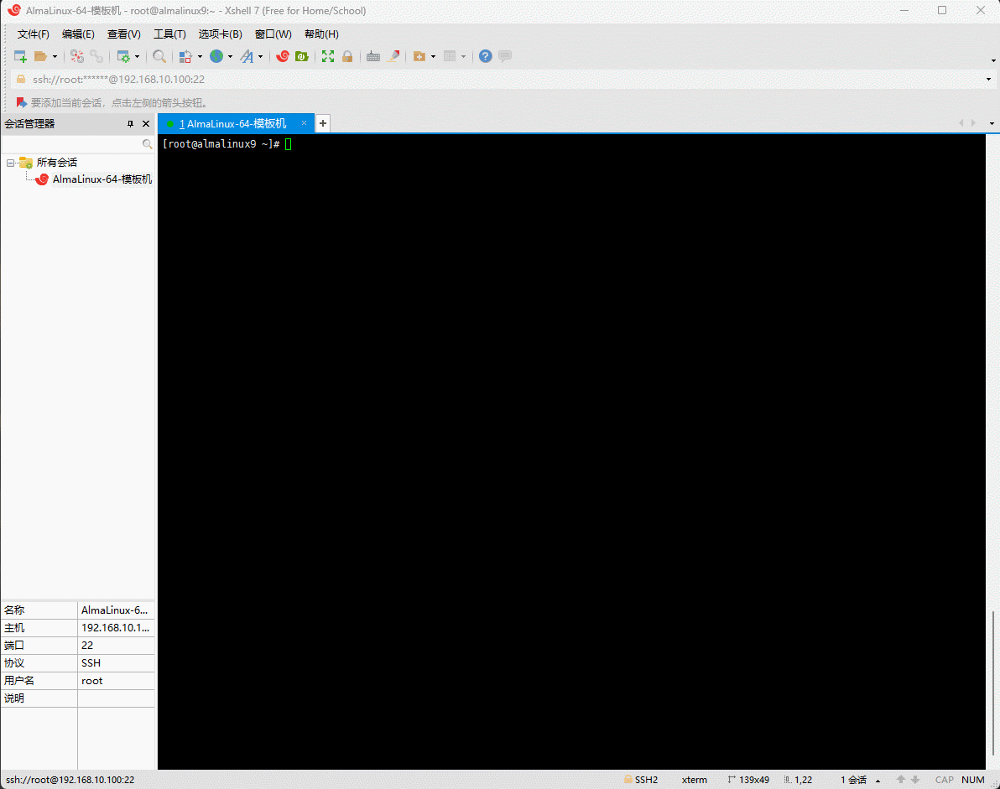

## 4.3 Linux 中的命令

### 4.3.1 概述

* 当我们在 Linux 中的终端输入一æ¡å‘½ä»¤ï¼Œå°†ä¼šæ¶‰åŠåˆ°ä»¥ä¸‹è¿‡ç¨‹ï¼š
  * â‘  `输入命令`：当我们在终端输入一个命令并按下å›è½¦é”®æ—¶ï¼Œè¿™ä¸ªå‘½ä»¤å°±ä¼šè¢«é€åˆ° shell。
  * â‘¡ `Shell 判断`：当收到命令å，Shell 首先会判断该命令是内部命令还是外部命令，如æœæ˜¯ Shell 的内部命令（如：cd 命令），将由 Shell ç›´æ¥å¤„ç†ï¼›å¦åˆ™ï¼Œå°†ç”± Shell 进行解æ。
  * â‘¢ `Shell 解æ`：如æœæ˜¯å¤–部命令，Shell 将解æ这个命令，并将其分解æˆå‘½ä»¤åå’Œå‚æ•°ã€å¤„ç†ç‰¹æ®Šå­—符（如：引å·å’Œåæ–œæ ï¼‰ã€æ›¿æ¢ç¯å¢ƒå˜é‡ã€å¤„ç†é‡å®šå‘符å·ï¼ˆå¦‚ `>` å’Œ `|`）等。
  * â‘£ `查找命令`：Shell 会在ç¯å¢ƒå˜é‡ `PATH` 指定的目录中查找匹é…该命令åçš„å¯æ‰§è¡Œæ–‡ä»¶ã€‚
  * ⑤ `æƒé™æ£€æŸ¥`：一旦找到命令，Shell 将检查当å‰ç”¨æˆ·æ˜¯å¦æœ‰æƒé™æ‰§è¡Œè¿™ä¸ªå‘½ä»¤ã€‚
  * â‘¥ `执行命令`：如æœç”¨æˆ·æœ‰æƒé™ï¼ŒShell 则通过创建一个新的进程æ¥æ‰§è¡Œå‘½ä»¤ã€‚通常，这是通过调用系统调用 `fork()` æ¥åˆ›å»ºä¸€ä¸ªæ–°è¿›ç¨‹ï¼Œç„¶å使用 `exec()` 系列函数æ¥è¿è¡Œå‘½ä»¤ã€‚
  * ⑦ `命令执行和输出`：命令执行å，其输出（如æœæœ‰çš„è¯ï¼‰å°†è¢«è¿”å›åˆ° Shell，通常会显示在终端上。如æœæ¶‰åŠåˆ°é‡å®šå‘，输出å¯èƒ½ä¼šè¢«å‘é€åˆ°å‘½ä»¤æˆ–其他命令中。
  * ⑧ `结æŸè¿›ç¨‹`：执行完毕å，命令进程结æŸï¼Œå¹¶å°†é€€å‡ºçŠ¶æ€è¿”å›ç»™ Shell。Shell æ¥ç€è¿”å›åˆ°ç­‰å¾…状æ€ï¼Œç­‰å¾…下一个命令的输入。

> 温馨æ示ℹï¸ï¼š`PATH` 是一个包å«å¤šä¸ªç›®å½•è·¯å¾„çš„ç¯å¢ƒå˜é‡ï¼ŒShell 会按照这些路径的顺åºæ¥æœç´¢å‘½ä»¤ã€‚

* 其对应的æµç¨‹å›¾ï¼Œå¦‚下所示：


### 4.3.2 内部命令和外部命令

* Linux 中的`内部命令`（**Built-in Commands**）：
  * 内部命令是直æ¥å†…置在 Shell 解æ器（如：Bashã€Zsh 等）中的命令，它们ä¸æ˜¯ç‹¬ç«‹çš„å¯æ‰§è¡Œæ–‡ä»¶ï¼Œç”¨æˆ·ç™»å½•å自动加载并常驻到内存中。
  * è¿™äº›å‘½ä»¤çš„æ‰§è¡Œé€Ÿåº¦æ¯”è¾ƒå¿«ï¼Œå› ä¸ºå®ƒä»¬æ— éœ€åˆ›å»ºæ–°çš„è¿›ç¨‹ï¼Œè€Œæ˜¯åœ¨å½“å‰ Shell 的上下文中直æ¥æ‰§è¡Œã€‚

* å¯ä»¥é€šè¿‡å¦‚下的命令，查看 Linux 中的所有内部命令：

```shell
help
```

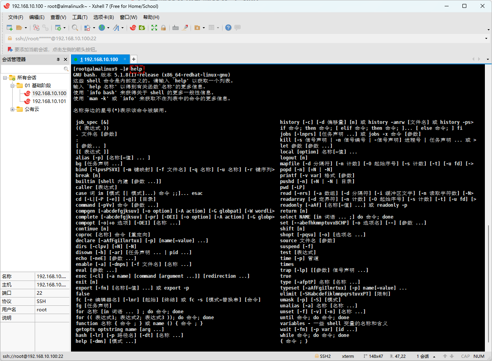

* 当然，也å¯ä»¥é€šè¿‡å¦‚下的命令，查看æŸä¸ªå‘½ä»¤æ˜¯å¦æ˜¯ Linux 中的内部命令：

```shell
type cd
```

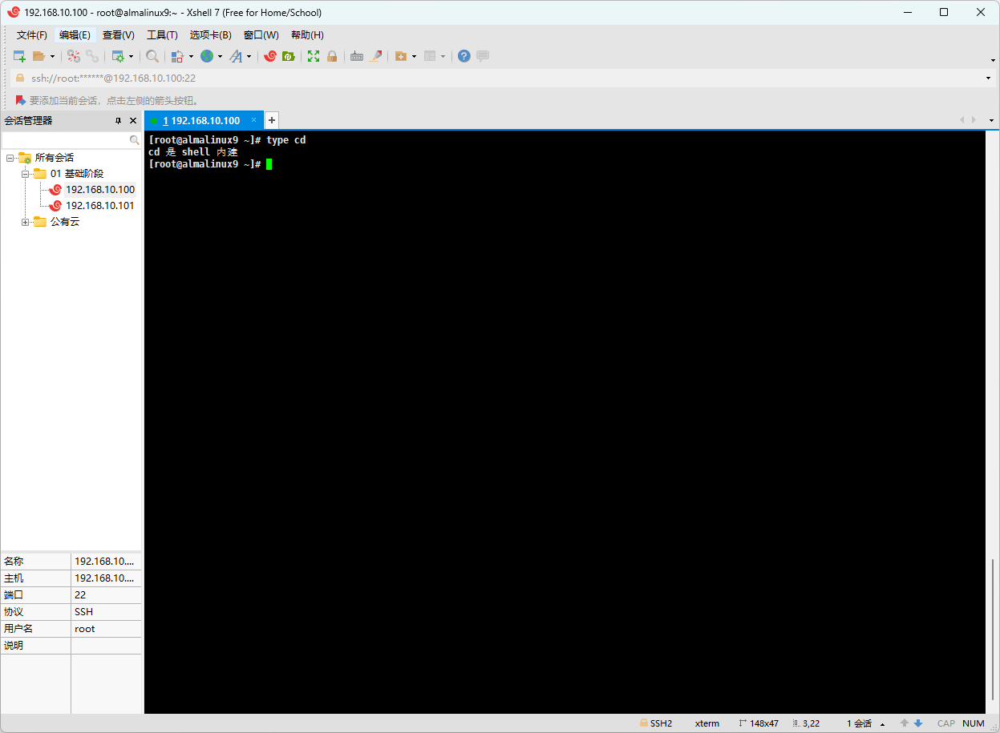

* Linux 中的`外部命令`**（External Commands）**：
  * 外部命令是独立的å¯æ‰§è¡Œæ–‡ä»¶ï¼Œå®ƒä»¬å­˜åœ¨äºç³»ç»Ÿçš„文件系统中，通常ä½äº`/bin`ã€`/usr/bin` 等目录下。
  * 这些命令的执行需è¦åˆ›å»ºæ–°çš„进程，通过调用相应的å¯æ‰§è¡Œæ–‡ä»¶æ¥å®Œæˆä»»åŠ¡ã€‚

* å¯ä»¥é€šè¿‡å¦‚下的命令，查看 Linux 中的所有外部命令对应的目录：

```shell
echo $PATH
```


* 当然，也å¯ä»¥é€šè¿‡å¦‚下的命令，查看æŸä¸ªå‘½ä»¤æ˜¯å¦æ˜¯ Linux 中的外部命令：

```shell
type cat
```


* 如æœå¯¹äº Linux 中的外部命令，æ¯æ¬¡éƒ½è¦å»`ç¯å¢ƒå˜é‡ $PATH` 对应的目录中å»å¯»æ‰¾æŒ‡å®šçš„å¯æ‰§è¡Œæ–‡ä»¶ï¼Œé‚£æ•ˆç‡ä¹Ÿå¤ªæ…¢äº†ï¼›Linux 采用了 hash 算法æ¥åŠ å¿«è®¿é—®ï¼Œå…¶åŸç†å¦‚下所示：


* å¯ä»¥é€šè¿‡å¦‚下的命令，查看 hash 表中缓存的命令：

```shell
hash
```


> 注æ„âš ï¸ï¼šå¦‚æœæœ‰çš„时候，移动了 Linux 外部命令的ä½ç½®ï¼Œå¯ä»¥ä½¿ç”¨ `hash -r` 清除 hash 表记录，以防止 Linux 报错：`xxx 命令找ä¸åˆ°`。 

* 有的时候，我们会å‘ç°æœ‰äº›å‘½ä»¤æ˜¯å†…部命令，但是在 PATH ç¯å¢ƒå˜é‡æ‰€æŒ‡å‘的路径目录中也存在，为什么？

```shell
type cd
```

```shell
ll /usr/bin/cd
```

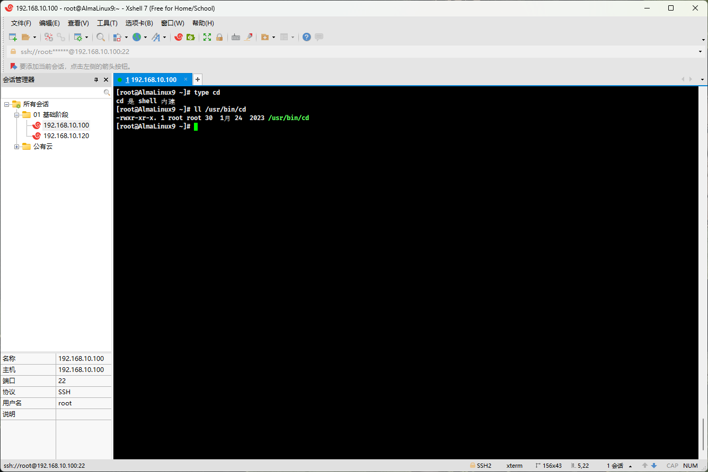

> 温馨æ示ℹï¸ï¼šä¹Ÿå¯ä»¥ä½¿ç”¨ `type -a cd` 命令显示系统中æŸä¸ªå‘½ä»¤çš„所有å¯èƒ½çš„ä½ç½®ï¼Œå³ï¼šæ˜¯å¦æ˜¯å†…部命令ã€å¦‚æœæ˜¯å¤–部命令，命令的ä½ç½®åœ¨å“ªé‡Œã€ä»¥åŠè¯¥å‘½ä»¤æ˜¯å¦æ˜¯åˆ«å。

* å…¶å®ï¼Œæ˜¯å› ä¸ºå¹¶ä¸æ˜¯æ‰€æœ‰çš„ Linux 的内置 Shell 解æ器都是 `/bin/bash`，如æœæ˜¯åˆ«çš„ Shell 解æ器，å¯èƒ½å†…部命令就没有 cd 命令，为了防止编写的 Shell 脚本在ä¸åŒçš„ Linux 版本中出ç°é”™è¯¯ï¼ˆç§»æ¤é—®é¢˜ï¼‰ï¼Œå°±å‡ºç°äº†æœ‰äº›å‘½ä»¤å³æ˜¯å†…部命令也是外部命令的ç°è±¡ã€‚

## 4.4 Linux 命令帮助手册

### 4.4.1 概述

* å¯¹äº Linux 的内部命令，我们å¯ä»¥é€šè¿‡å¦‚下的命令，æ¥æŸ¥çœ‹å‘½ä»¤çš„使用方法：

```shell
man command
```

```shell
# 通常用æ¥æŸ¥çœ‹å¸¸ç”¨çš„选项和å‚æ•°
help command
```

* å¯¹äº Linux 的外部命令，我们å¯ä»¥é€šè¿‡å¦‚下的命令，æ¥æŸ¥çœ‹å‘½ä»¤çš„使用方法：

```shell
man command
```

```shell
# 通常用æ¥æŸ¥çœ‹å¸¸ç”¨çš„选项和å‚æ•°
command --help
```

```shell
# 通常用æ¥æŸ¥çœ‹å¸¸ç”¨çš„选项和å‚数，并ä¸æ˜¯æ‰€æœ‰çš„命令都有 -h 选项
command -h
```

> 注æ„âš ï¸ï¼š
>
> * â‘  man 命令æ¥æŸ¥çœ‹å¸®åŠ©ï¼Œå…¶å®æ˜¯æŸ¥çœ‹æŒ‡å®šå‘½ä»¤çš„帮助手册，在 `/usr/share/man` 下。
> * â‘¡ å¯ä»¥é€šè¿‡ `whereis 命令`或 `whatis 命令`查看其对应命令的帮助手册的ä½ç½®ã€‚
> * â‘¢ å®é™…工作中，并ä¸ä¼šä¸¥æ ¼åŒºåˆ† Linux 内部命令或 Linux 外部命令，如æœæŸ¥è¯¢ Linux 内部命令的方法ä¸è¡Œï¼Œå°±æ ¹æ®æ示æ¢ä¸ºæŸ¥çœ‹ Linux 外部命令的方法。

* 其使用步骤，如下所示：


> 温馨æ示ℹï¸ï¼š
>
> * â‘  上述的步骤，仅仅åªæ˜¯å½“我们`æ¥è§¦åˆ°ä¸€ä¸ªæ–°å‘½ä»¤`时的使用步骤（帮助）。
> * â‘¡ 我们也知é“，Linux 的哲学是：一切皆文件，å³ï¼šå‘½ä»¤ï¼ˆå¯æ‰§è¡Œç¨‹åºï¼‰æ˜¯æ–‡ä»¶ï¼Œå‘½ä»¤æ‰€å¯¹åº”çš„é…置文件也是文件。所以，如æœéœ€è¦äº†è§£å‘½ä»¤æ‰€å¯¹åº”é…置文件的帮助信æ¯ï¼Œä¸Šè¿°çš„步骤显然是ä¸å¤Ÿçš„。


* 示例：查看 Linux 内部命令的使用方法

```shell
man cd
```


* 示例：查看 Linux 内部命令的使用方法

```shell
help cd
```


* 示例：查看 Linux 外部命令的使用方法

```shell
man cat
```

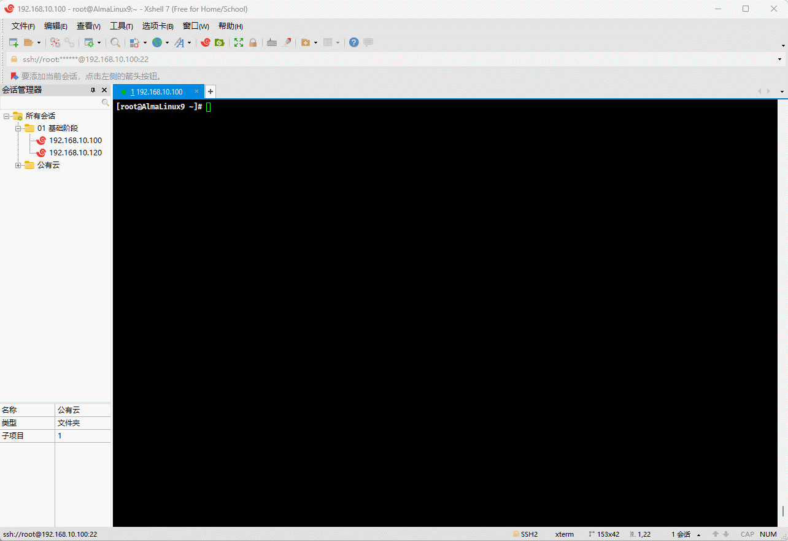


* 示例：查看 Linux 外部命令的使用方法

```shell
cat --help
```


* 示例：查看 Linux 外部命令的使用方法

```shell
cat -h
```

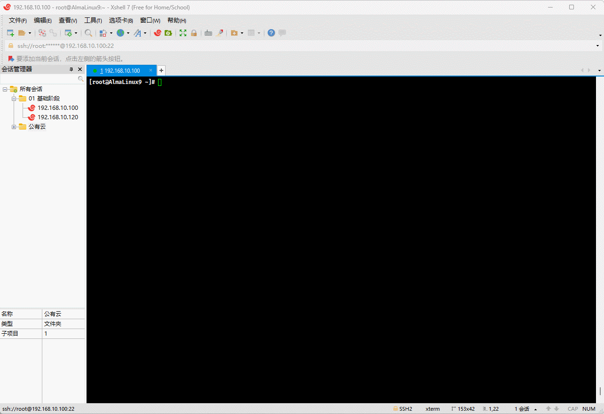

### 4.4.2 查看 Linux 命令ä½ç½®åŠå…¶å¸®åŠ©æ‰‹å†Œä½ç½®

* å¯ä»¥é€šè¿‡å¦‚下的命令，查看 Linux 命令的ä½ç½®åŠå…¶å¸®åŠ©æ‰‹å†Œçš„ä½ç½®ï¼š

```shell
whereis command
```

```shell
whatis command
```

> 注æ„âš ï¸ï¼š
>
> * â‘  在安装完æ“作系统之å，立刻就使用 `whatis command` ，å¯èƒ½ä¸ä¼šå‡ºç°å¯¹åº” `command` 命令的简短信æ¯ï¼Œæ˜¯å› ä¸º`whatis` 命令ä¾èµ–äºåº•å±‚çš„æ•°æ®åº“，å¯ä»¥ä½¿ç”¨ `mandb` 命令让其立刻生æˆæ•°æ®åº“；也å¯ä»¥ç­‰å¾…一段时间，让æ“作系统自动为其生æˆæ•°æ®åº“。
> * â‘¡ `whatis` 命令主è¦ç”¨äºæŸ¥æ‰¾å’Œæ˜¾ç¤ºç»™å®šå‘½ä»¤ã€ç³»ç»Ÿè°ƒç”¨ã€åº“函数等的一行手册页æè¿°ï¼›æ¢è¨€ä¹‹ï¼Œ`帮助我们了解命令是åšä»€ä¹ˆçš„`。
> * â‘¢ `whereis`命令主è¦ç”¨äºå®šä½äºŒè¿›åˆ¶æ–‡ä»¶ã€æºä»£ç æ–‡ä»¶ã€å¸®åŠ©æ–‡ä»¶çš„ä½ç½®ï¼Œå®ƒæœç´¢ç‰¹å®šçš„目录æ¥æ‰¾åˆ°ä¸ç»™å®šç¨‹åºå相关的文件；æ¢è¨€ä¹‹ï¼Œ`帮助我们查找命令的相关文件的ä½ç½®`。


* 示例：

```shell
whereis cd
```


* 示例：

```shell
whatis passwd
```

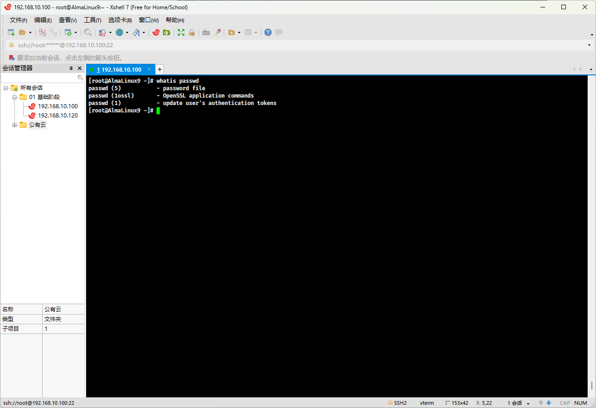

### 4.4.3 Linux 帮助手册详解

* 我们å¯ä»¥é€šè¿‡å¦‚下的命令，æ¥æŸ¥çœ‹ Linux 的帮助手册：

```shell
ll /usr/share/man
```


> 温馨æ示ℹï¸ï¼š
>
> * ① Linux 中的大部分命令，都有 man 帮助手册。
> * â‘¡ å¯ä»¥é€šè¿‡ `manpath`命令查看 man 帮助手册的ä½ç½®ã€‚

* 内容如下，åªæ˜¾ç¤ºæœ‰ç”¨çš„ä¿¡æ¯ï¼Œå³ï¼š

```shell {1,4,7,13,15,17,19,21,23}
drwxr-xr-x. 2 root root  77824  3月  1 09:35 man1 # 1 章节，用户命令
drwxr-xr-x. 2 root root   8192  2月 29 13:36 man1p
drwxr-xr-x. 2 root root      6  3月 25  2022 man1x
drwxr-xr-x. 2 root root  16384  2月 29 13:36 man2 # 2 章节，系统调用
drwxr-xr-x. 2 root root     31  2月 29 13:36 man2type
drwxr-xr-x. 2 root root      6  3月 25  2022 man2x
drwxr-xr-x. 2 root root 372736  2月 29 14:21 man3 # 3 章节，C 库调用
drwxr-xr-x. 2 root root   4096  2月 29 13:36 man3const
drwxr-xr-x. 2 root root     58  2月 29 13:36 man3head
drwxr-xr-x. 2 root root  32768  2月 29 13:36 man3p
drwxr-xr-x. 2 root root   4096  2月 29 13:36 man3type
drwxr-xr-x. 2 root root      6  3月 25  2022 man3x
drwxr-xr-x. 2 root root   4096  2月 29 13:36 man4 # 4 章节，设备文件和特殊文件
drwxr-xr-x. 2 root root      6  3月 25  2022 man4x
drwxr-xr-x. 2 root root  16384  3月  1 09:35 man5 # 5 章节，é…置文件格å¼
drwxr-xr-x. 2 root root      6  3月 25  2022 man5x
drwxr-xr-x. 2 root root     24  2月 29 13:36 man6 # 6 章节，游æˆ
drwxr-xr-x. 2 root root      6  3月 25  2022 man6x
drwxr-xr-x. 2 root root  16384  2月 29 14:19 man7 # 7 章节，æ‚项
drwxr-xr-x. 2 root root      6  3月 25  2022 man7x
drwxr-xr-x. 2 root root  40960  3月  1 09:35 man8 # 8 章节，管ç†ç±»çš„命令
drwxr-xr-x. 2 root root      6  3月 25  2022 man8x
drwxr-xr-x. 2 root root      6  3月 25  2022 man9 # 9 章节，Linux 内核 API
drwxr-xr-x. 2 root root      6  3月 25  2022 man9x
```

> 注æ„âš ï¸ï¼š
>
> * â‘  手册中å«æœ‰ p 的一般都是程åºå‘˜ä¸“用的，因为 p 是 programmer 的缩写。
> * â‘¡ 在å®é™…工作中，对äºå«æœ‰ p 的手册，我们一般ä¸å…³å¿ƒï¼ï¼ï¼

* 我们知é“，`passwd` 命令对应的é…置文件是 `/etc/passwd`：

```shell 
whereis passwd
```


* 通过，如下的命令å»æŸ¥çœ‹ `/etc/passwd` 文件的内容：

```shell
cat /etc/passwd
```

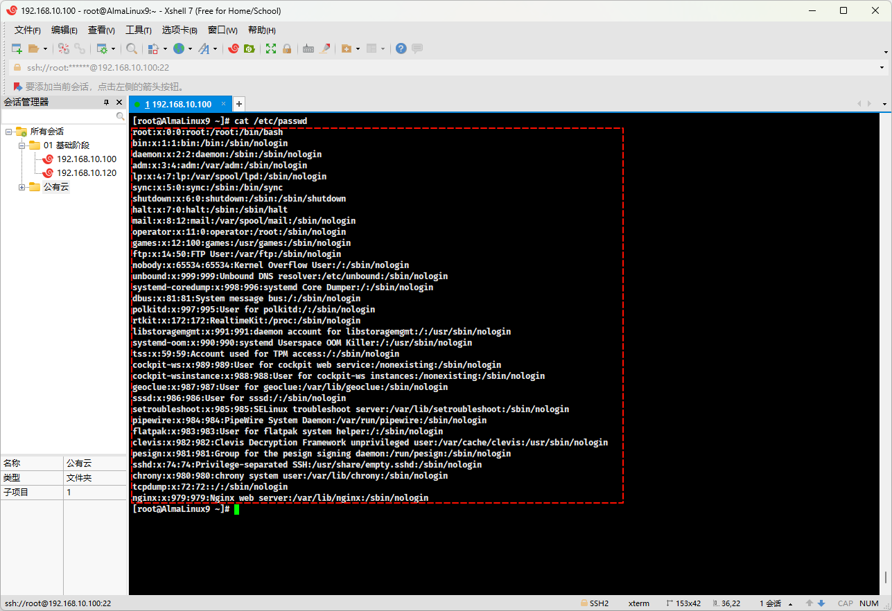

> 疑惑😖：该é…置文件中的æ¯ä¸€åˆ—çš„å«ä¹‰æ˜¯ä»€ä¹ˆï¼Ÿ

* 我们å¯ä»¥å»çœ‹ä¸‹ï¼Œman 命令如何使用：

```shell
man --help
```

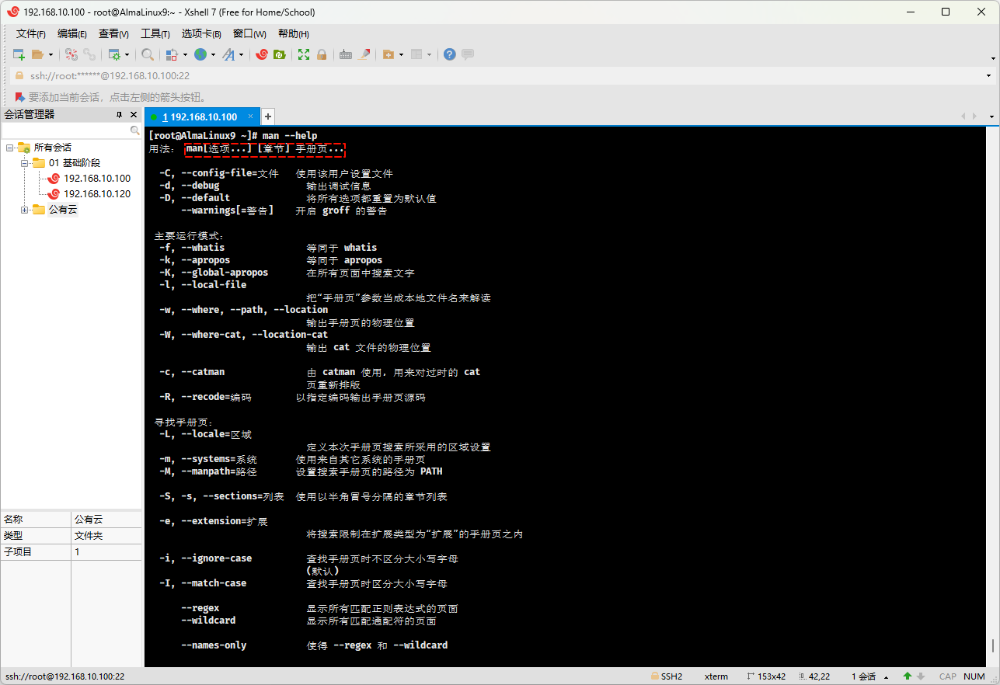

* 我们å¯ä»¥é€šè¿‡ `whereis` 或 `whatis` å»ï¼ŒæŸ¥çœ‹è¯¥å‘½ä»¤å¯¹åº”çš„é…置文件是那个章节的帮助手册：

```shell
whereis passwd
```

```shell
whatis passwd
```


* 此时，我们就å¯ä»¥é€šè¿‡ `man` 命令，æ¥æŸ¥çœ‹ `passwd` 命令对应é…置文件 `/etc/passwd` 中æ¯ä¸€åˆ—çš„å«ä¹‰ï¼š

```shell
man 5 passwd
```


* 如æœä¸å†™å¸®åŠ©æ‰‹å†Œçš„章节，默认就是查看命令的使用方法：

```shell
man passwd # ç­‰ä»·äº man 1 passwd 
```


* å…¶å®ï¼Œåœ¨ä½¿ç”¨ man 查看命令的时候，会显示帮助手册的章节：

```shell
man passwd
```

```shell
man 5 passwd
```


## 4.5 命令的å†å²è®°å½•ï¼ˆâ­ï¼‰

### 4.5.1 概述

* 在 Linux ä¸­ï¼Œå½“ç”¨æˆ·ç™»å½•çš„æ—¶å€™ï¼Œç³»ç»Ÿä¼šè¯»å– `/etc/profile` 文件，我们å¯ä»¥é€šè¿‡å¦‚下的命令，æ¥æŸ¥çœ‹è¯¥æ–‡ä»¶çš„内容：

```shell
cat /etc/profile | head -n 20
```


* 其内容如下：

```txt
# /etc/profile

# System wide environment and startup programs, for login setup
# Functions and aliases go in /etc/bashrc

# 系统范围的ç¯å¢ƒå’Œå¯åŠ¨ç¨‹åºï¼Œå¯¹äºç™»å½•è®¾ç½®çš„函数和别åå¯ä»¥è®¾ç½®åˆ° /etc/bashrc 文件中

# It's NOT a good idea to change this file unless you know what you
# are doing. It's much better to create a custom.sh shell script in
# /etc/profile.d/ to make custom changes to your environment, as this
# will prevent the need for merging in future updates.

# 除éä½ æ˜ç¡®çŸ¥é“你自己在åšä»€ä¹ˆï¼Œå¦åˆ™ä¿®æ”¹è¿™ä¸ªæ–‡ä»¶ä¸æ˜¯å¾ˆå¥½çš„注æ„。最好的方å¼å°±æ˜¯ä½ åœ¨ /etc/profile.d/ 目录中
# 创建一个 custom.sh çš„ shell 文件æ¥å¯¹ç¯å¢ƒè¿›è¡Œè‡ªå®šä¹‰æ›´æ”¹ï¼Œä»¥é¿å…å°†æ¥æ›´æ–°çš„时候需è¦åˆå¹¶çš„问题。

pathmunge () {
    case ":${PATH}:" in
        *:"$1":*)
            ;;
        *)
            if [ "$2" = "after" ] ; then
                PATH=$PATH:$1
            else
                PATH=$1:$PATH
            fi
# 其余略
```

* ä»ä¸Šè¿°çš„翻译中，我们å¯ä»¥å¾—知：`/etc/profile` 文件是系统范围内的全局é…置文件，会在用户登录的时候被读å–和执行，并且通常用äº`设置ç¯å¢ƒå˜é‡`å’Œ`执行系统级别的é…ç½®`；但是，一般ä¸å»ºè®®ï¼Œä¿®æ”¹è¿™ä¸ªæ–‡ä»¶ã€‚
* 其次，上述的翻译中，也æ到了对äº`登录设置的函数`å’Œ`别å`å¯ä»¥è®¾ç½®åˆ° `/etc/bashrc` 文件中，我们å¯ä»¥é€šè¿‡å¦‚下的命令，æ¥æŸ¥çœ‹è¯¥æ–‡ä»¶çš„内容：

```shell
cat /etc/bashrc | head -n 20
```


* 其内容如下：

```txt
# /etc/bashrc

# System wide functions and aliases
# Environment stuff goes in /etc/profile

# 系统范围的函数和别å
# ç¯å¢ƒç›¸å…³çš„é…置放在 /etc/profile 中

# It's NOT a good idea to change this file unless you know what you
# are doing. It's much better to create a custom.sh shell script in
# /etc/profile.d/ to make custom changes to your environment, as this
# will prevent the need for merging in future updates.

# 除éä½ æ˜ç¡®çŸ¥é“你自己在åšä»€ä¹ˆï¼Œå¦åˆ™ä¿®æ”¹è¿™ä¸ªæ–‡ä»¶ä¸æ˜¯å¾ˆå¥½çš„注æ„。最好的方å¼å°±æ˜¯ä½ åœ¨ /etc/profile.d/ 目录中
# 创建一个 custom.sh çš„ shell 文件æ¥å¯¹ç¯å¢ƒè¿›è¡Œè‡ªå®šä¹‰æ›´æ”¹ï¼Œä»¥é¿å…å°†æ¥æ›´æ–°çš„时候需è¦åˆå¹¶çš„问题。

# Prevent doublesourcing
if [ -z "$BASHRCSOURCED" ]; then
  BASHRCSOURCED="Y"

  # are we an interactive shell?
  if [ "$PS1" ]; then
    # 其余略
    # Turn on parallel history
    shopt -s histappend
    # 将命令å†å²è®°å½•åŠ è½½åˆ°å†…存中
    history -a
    
    # 其余略
  fi

  if ! shopt -q login_shell ; then # We're not a login shell
    # 其余略
    # Set default umask for non-login shell only if it is set to 0
    [ `umask` -eq 0 ] && umask 022
	# 设置ç¯å¢ƒå˜é‡ SHELL 为 bash
    SHELL=/bin/bash 
    # éå† /etc/etc/profile.d/ 中以 *.sh 为结尾的é…置文件，并进行设置
    for i in /etc/profile.d/*.sh; do
        if [ -r "$i" ]; then
            if [ "$PS1" ]; then
                . "$i"
            else
                . "$i" >/dev/null
            fi
        fi
    done
    unset i
    unset -f pathmunge
  fi

fi

```

* 我们å¯ä»¥å¾—知，在 `/etc/profile.d/`目录中创建 `custom.sh` çš„ shell 文件，æ¥`执行系统级别的é…ç½®`是好的方å¼ï¼Œæˆ‘们å¯ä»¥é€šè¿‡å¦‚下的命令，æ¥æŸ¥çœ‹ `/etc/profile.d/` 目录：

```shell
ll /etc/profile.d/
```

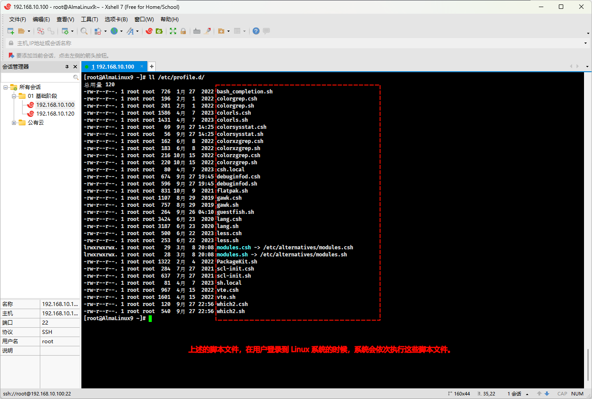

* å…¶å®ï¼Œåœ¨`创建用户`的时候，就会有一些`默认设置`，å¯ä»¥é€šè¿‡å¦‚下的命令查看：

```shell
useradd -D # ç­‰åŒäº cat /etc/default/useradd
```


* 其内容如下：

```txt
GROUP=100 # 用户组，root 用户默认是 0 
HOME=/home # 用户的家目录，
INACTIVE=-1
EXPIRE=
SHELL=/bin/bash # 用户的默认 SHELL 解释器
SKEL=/etc/skel # SKEL 是骨æ¶ã€æ¨¡æ¿çš„æ„æ€
CREATE_MAIL_SPOOL=yes
```

> 注æ„âš ï¸ï¼š
>
> * â‘  在 Linux 系统中，`/etc/skel` 目录包å«äº†æ–°å»ºç”¨æˆ·è´¦å·æ—¶æ‰€å¤åˆ¶çš„默认é…置文件和目录结æ„，相当äºä¸€ä¸ªç”¨æˆ·å®¶ç›®å½•çš„模æ¿æˆ–骨æ¶ã€‚
> * â‘¡ 当管ç†å‘˜åˆ›å»ºæ–°ç”¨æˆ·è´¦å·æ—¶ï¼Œç³»ç»Ÿä¼šå¤åˆ¶ `/etc/skel` 目录中的文件和目录到新用户的家目录 (`/home/new_user`) 下，作为新用户的åˆå§‹é…置。这样å¯ä»¥ç¡®ä¿æ–°ç”¨æˆ·æ‹¥æœ‰ä¸€å¥—基本的é…置文件，比如 `.bashrc`ã€`.bash_logout` ã€`bash_profile`等，以åŠä¸€äº›é»˜è®¤çš„目录结æ„。

* 我们å¯ä»¥å¦‚下的命令，查看 `/etc/skel` 目录æ¥éªŒè¯ä¸‹ï¼š

```shell
ll -lah /etc/skel
```

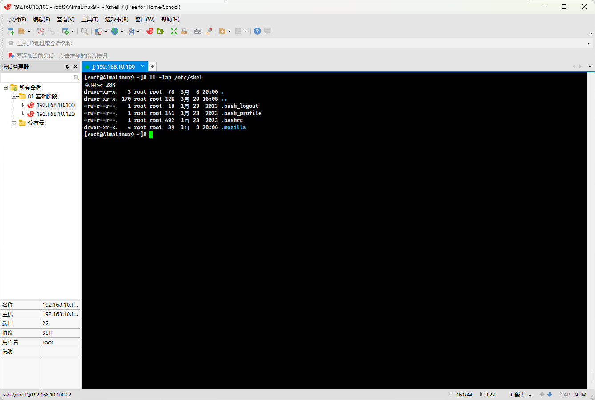

* å…¶å®ï¼Œ`root` 用户是我们在`安装æ“作系统`的时候`创建`的，并且 `root` 用户的家目录是 `/root` ；所以，`root` 用户在家目录下也有这些文件：

```shell 
ll -lah ~/
```

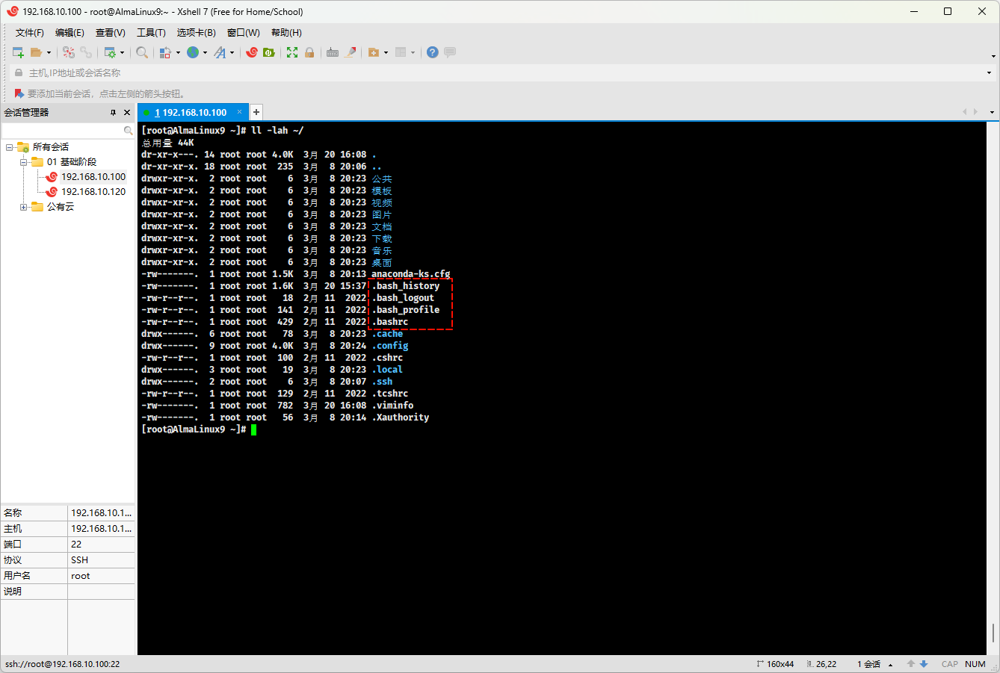

* 当用户登录的时候，Linux æ“作系统会加载 `~/.bash_profile` ，我们å¯ä»¥æŸ¥çœ‹è¯¥æ–‡ä»¶çš„内容：

```shell
cat ~/.bash_profile
```


* 内容如下：

```txt
# .bash_profile

# Get the aliases and functions

# 通过执行 ~/.bashrc æ¥è·å–别å和登录设置的函数

if [ -f ~/.bashrc ]; then
	. ~/.bashrc
fi

# User specific environment and startup programs
```

* 此时，我们å¯ä»¥æŸ¥çœ‹ä¸‹ `~/.bashrc` 文件的内容：

```shell
cat ~/.bashrc
```

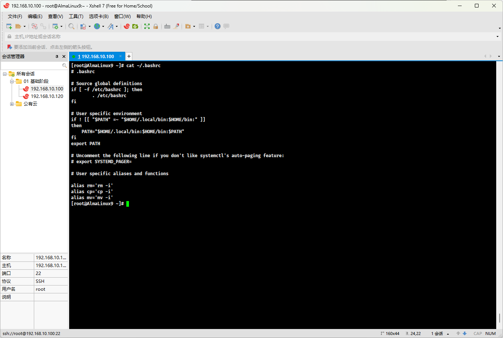

* 其内容如下：

```txt
# .bashrc

# Source global definitions

# 加载 /etc/bashrc 中定义的系统范围的函数和别å
if [ -f /etc/bashrc ]; then
	. /etc/bashrc
fi

# User specific environment
if ! [[ "$PATH" =~ "$HOME/.local/bin:$HOME/bin:" ]]
then
    PATH="$HOME/.local/bin:$HOME/bin:$PATH"
fi

# 导出 PATH ç¯å¢ƒå˜é‡ï¼Œä»¥ä¾¿æ‰§è¡Œåº”用程åº
export PATH

# Uncomment the following line if you don't like systemctl's auto-paging feature:
# export SYSTEMD_PAGER=

# User specific aliases and functions

# 用户自定义的别å和函数 

alias rm='rm -i'
alias cp='cp -i'
alias mv='mv -i'
```

> 注æ„âš ï¸ï¼šå¦‚æœä¿®æ”¹äº† `.bashrc` 文件，å¯ä»¥ä½¿ç”¨ `source ~/.bashrc` 使其生效。

* å…¶å®ï¼Œè¿˜æœ‰ä¸€ä¸ª `.bash_history` 文件，该命令是用æ¥è®°å½•ç”¨æˆ·æ¯ä¸€æ¬¡æ‰§è¡Œçš„命令情况，å³å‘½ä»¤çš„å†å²è®°å½•ï¼š

```shell
cat ~/.bash_history | head 
```

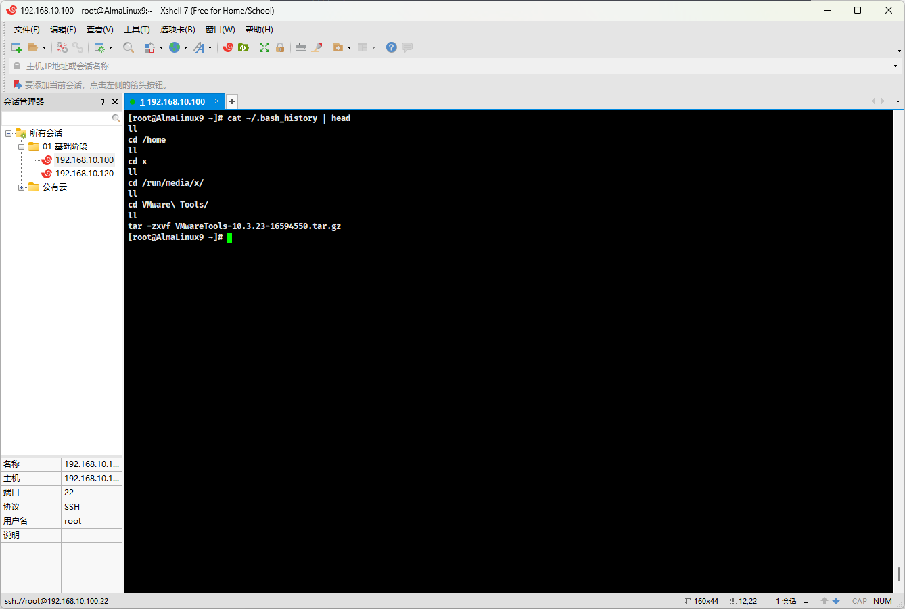

* 那么，`.bash_history` 是 `history` 命令用æ¥`记录`我们`执行过的命令`，以便我们å¯ä»¥`查看`å’Œ`å›é¡¾`之å‰æ‰§è¡Œè¿‡çš„命令，其执行æµç¨‹å¦‚下：


### 4.5.2 history 命令使用

* 命令：

```shell
history [-c] [n]
```

* 功能：查看已ç»æ‰§è¡Œè¿‡çš„å†å²å‘½ä»¤ã€‚
* 选项：
  * `-c`：清空å†å²è®°å½•ã€‚
* å‚数：
  * `n`：最近 n æ¡å†å²å‘½ä»¤è®°å½•ã€‚

> 注æ„âš ï¸ï¼š
>
> * â‘  å¯ä»¥ä½¿ç”¨ `!å†å²è®°å½•æ•°` 执行命令å†å²è®°å½•ä¸­çš„命令。
> * â‘¡ å¯ä»¥ä½¿ç”¨ `ctrl + r` 进行å†å²å‘½ä»¤æœç´¢ï¼ˆ `reverse-i-search`），使用 `ctrl + g` 退出æœç´¢ã€‚


* 示例：显示所有的命令å†å²è®°å½•

```shell
history 
```

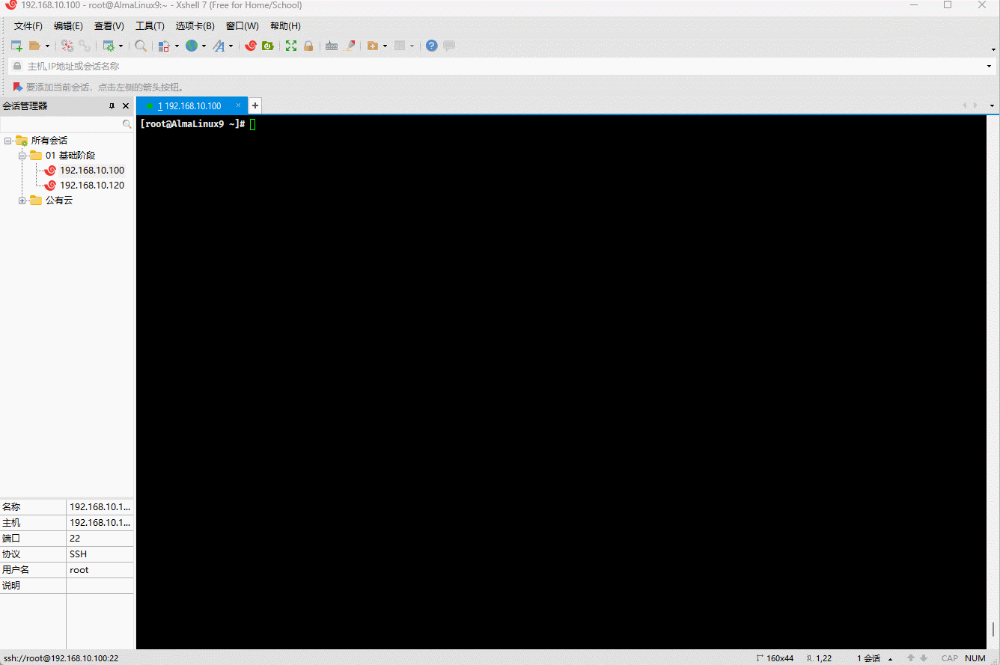


* 示例：显示最近 10 æ¡å‘½ä»¤å†å²è®°å½•

```shell
history 10
```


* 示例：执行å†å²å‘½ä»¤

```shell
!87
```


* 示例：æœç´¢å†å²å‘½ä»¤ï¼Œå¹¶æ‰§è¡Œ

```shell
# 如æœæœ‰å¤šä¸ªï¼Œå¯ä»¥ä¸€ç›´æŒ‰ ctrl + r
ctrl + r
```


## 4.6 tldr 命令（â­ï¼‰

### 4.6.1 概述

* 当我们在使用一个ä¸ç†Ÿæ‚‰çš„命令的时候，å¯ä»¥ä½¿ç”¨ `--help`  或 `-h` 选项æ¥æŸ¥çœ‹å¸¸è§çš„用法；当然，也å¯ä»¥é€šè¿‡ `man xxx`命令查看更详细的用法。
* 但是，根æ®`二八法则`，其å®åªæœ‰`一å°éƒ¨åˆ†`命令的选项是我们ç»å¸¸ä½¿ç”¨çš„。基äºæ­¤åŸç†ï¼Œç¤¾åŒºå¼€å‘了 [TLDR](https://tldr.sh/)（Too Long; Didn't Read，`太长ä¸çœ‹`，也被人翻译为 `"å·æ‡’的人"` ）项目，旨在为命令行工具æ供简æ´æ˜“懂的帮助页é¢ï¼Œä»¥å¸®åŠ©ç”¨æˆ·å¿«é€Ÿäº†è§£åŸºæœ¬çš„使用方法和选项，而ä¸å¿…深入阅读å¤æ‚的手册页。

> 注æ„âš ï¸ï¼š
>
> * â‘  二八法则，也被称为帕累托åŸåˆ™ï¼ˆPareto Principle），是一个ç»æµå­¦åŸåˆ™ï¼Œç”±æ„大利ç»æµå­¦å®¶ç»´å°”弗雷多·帕累托（Vilfredo Pareto）在 19 世纪末首次æ出。帕累托注æ„到在他的时代，æ„大利大约 80% 的土地由大约 20% 的人å£æ‹¥æœ‰ã€‚他进一步调查其他国家，å‘ç°è¿™ç§ä¸å¹³ç­‰åˆ†å¸ƒçš„ç°è±¡æ™®é存在，ä»è€Œæ出了这个åŸåˆ™ã€‚
> * â‘¡ 二八法则指出，在许多情况下，大约 80% 的效æœæ¥è‡ª 20% çš„åŸå› ã€‚æ¢è¨€ä¹‹ï¼Œå°‘数（20%）的因素往往对结æœæœ‰å†³å®šæ€§çš„å½±å“。这个åŸåˆ™ä¸ä»…适用äºç»æµé¢†åŸŸï¼Œè¿˜å¹¿æ³›é€‚用äºç®¡ç†ã€ç§‘学研究ã€è½¯ä»¶å·¥ç¨‹ç­‰å¤šä¸ªé¢†åŸŸã€‚
> * â‘¢ 例如：在商业管ç†ä¸­ï¼ŒäºŒå…«æ³•åˆ™å¯ä»¥è§£é‡Šä¸ºå¤§çº¦ 80% 的销售é¢æ¥è‡ª 20% 的客户；在软件开å‘中，80% 的错误和崩溃å¯èƒ½ä»…ç”± 20% 的缺陷引起；在个人时间管ç†ä¸­ï¼Œé€šå¸¸ 20% 的工作投入产生 80% çš„æˆæœã€‚
> * â‘£ 需è¦æ³¨æ„的是，二八法则是一个ç»éªŒè§„则，表æ˜ä¸¤ç»„事物之间存在ä¸å‡ç­‰çš„关系，但这个比例并ä¸æ˜¯å›ºå®šçš„80:20。å®é™…的比例å¯èƒ½æ˜¯70:30ã€90:10或其他，关键在äºå¤§éƒ¨åˆ†æ•ˆæœé€šå¸¸ç”±å°‘æ•°åŸå› äº§ç”Ÿã€‚此外，这个åŸåˆ™å¼ºè°ƒäº†ä¼˜å…ˆçº§å’Œé‡ç‚¹ç®¡ç†çš„é‡è¦æ€§ï¼Œå³é€šè¿‡è¯†åˆ«å’Œä¸“注äºé‚£äº›â€œå…³é”®çš„20%â€ï¼Œå¯ä»¥æœ‰æ•ˆåœ°æ高效ç‡å’Œæˆæ•ˆã€‚

### 4.6.2 安装

* 安装 node.js ：

```shell
dnf -y install nodejs
```

> 注æ„âš ï¸ï¼š
>
> * â‘  tldr ä¾èµ–äº nodejs 。
> * â‘¡ tldr ä¸ä»…ä»…å¯ä»¥æŸ¥çœ‹ Linux 上命令的常è§ä½¿ç”¨ï¼Œè¿˜å¯ä»¥æŸ¥çœ‹ androidã€darwinã€freebsdã€macosã€windows ç­‰æ“作系统上的命令的常è§ä½¿ç”¨ã€‚


* 安装 tldr ：

```shell
npm -g install tldr
```

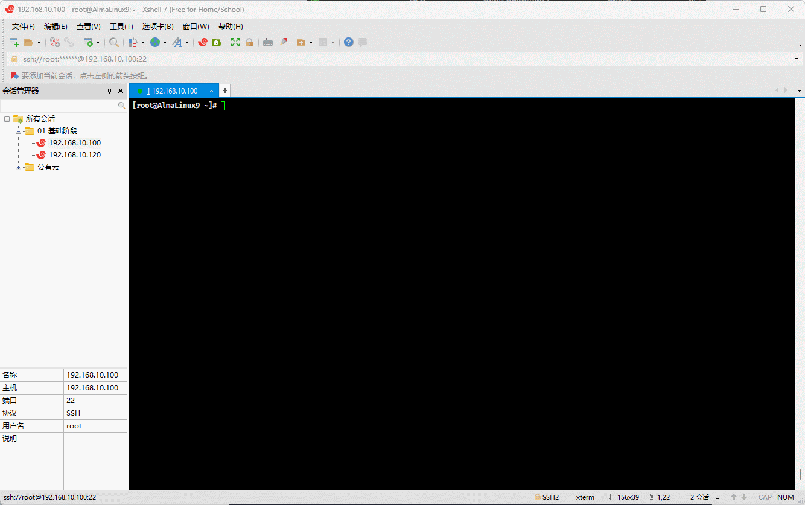

* 更新缓存：

```shell
tldr --update
```


### 4.6.3 使用

* 查看 ls 的用法：

```shell
tldr ls
```

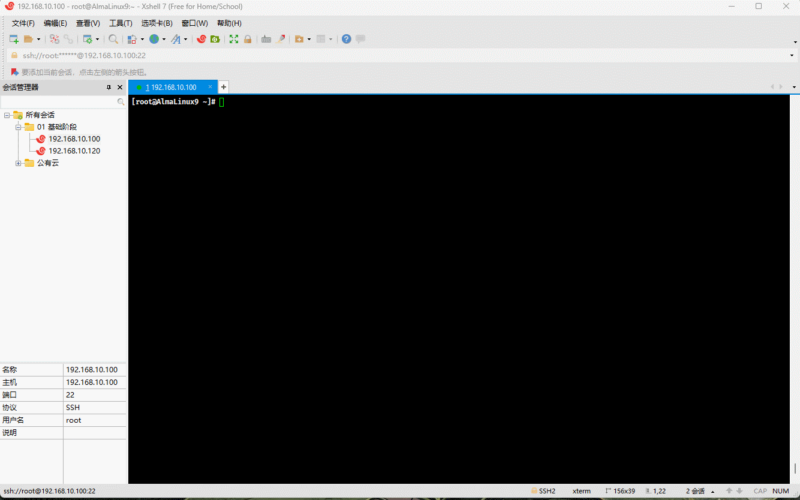


* 查看 tar 的用法：

```shell
tldr tar
```

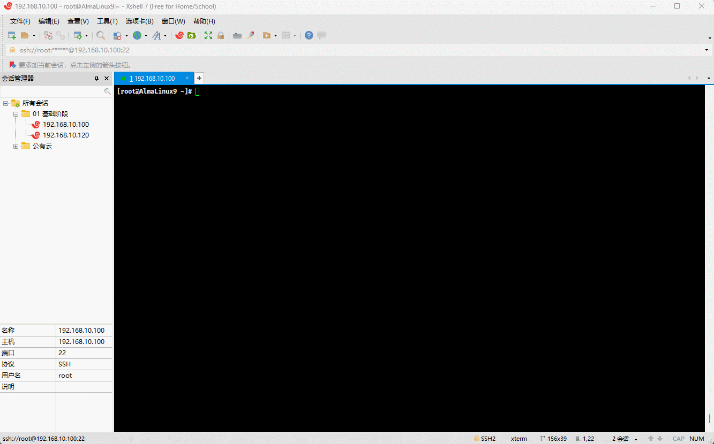

