# 第一章：扫清概念（⭐）

## 1.1 硬盘（磁盘）类型

### 1.1.1 概述

* 之前，我们在 `VMWare 虚拟机软件`中创建`虚拟机`的时候，会发现`磁盘类型`的选项：

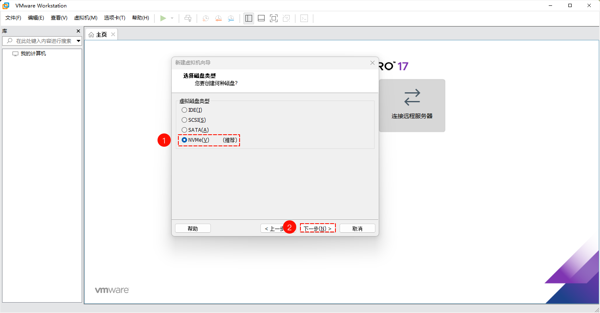

* 从图中，我们知道，`磁盘`的`类型`有：`IDE`、`SCSI`、`SATA` 、`NVME` 。

### 1.1.2 IDE 接口

* `IDE` （Integrated Drive Electronics，电子集成驱动器）早已被淘汰，毕竟是 `1986` 年由`康铂`、`西部数据`等几家公司共同开发的，如下所示：


* `IDE` 接口，又叫 `ATA` 接口、`PATA` 接口、`并口`，`IDE` 接口本身可以支持`串行`或`并行`。`IDE` 接口的硬盘最高所能达到 `133 MB/s`。
* 虽然 `IDE` 接口的硬盘价格低廉、兼容性强、性价比高。但是，有这样的缺点：数据传输速度慢、线缆长度过短、连接设备少、不支持热插拔、接口速度以及可升级性差。

> 注意⚠️：目前市面上已经几乎没有这种 IDE 接口的硬盘了。

### 1.1.3 SCSI 接口

*  SCSI（Small Computer System Interface，小型计算机系统接口），是一种应用于`小型机`上的高速数据传输技术，最早于1986年提出的 `SCSI Ⅰ`最大传输速率为 `5MB/s`，支持 7 个设备。

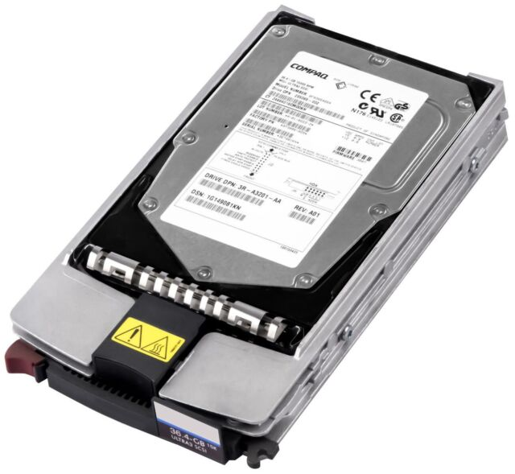

* `1995` 年左右出现了第三代 `SCSI`，差不多达到了 `40MB/s`，但没有统一标准：
  * 最大同步传输速度达到 `20MB/s` 的 Ultra SCSI（又称为 Fast-20 SCSI，时钟频率为 20 MHz）
  * 最大同步传输速度达到 `40MB/s` 的 Ultra Wide SCSI
  * 最大同步传输速度达到 `40MB/s` 的 Ultra2 SCSI（又称为 Fast-40 SCSI，时钟频率为 40 MHz，1997 年）
  * ...
  * 最大同步传输速度达到 `640MB/s` 的 Ultra 640 SCSI（时钟频率为 160 MHz 加双倍数据速率，2003 年）

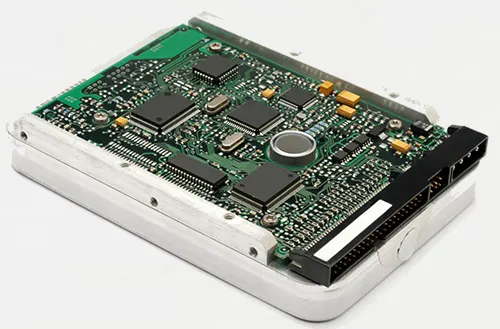

* SCSI 接口具有应用范围广、多任务、带宽大、CPU占用率低，以及热插拔等优点；

> 注意⚠️：由于成本问题，SCSI 接口的硬盘主要用于`服务器`和`工作站`上。

### 1.1.3 SATA 接口

* `SATA`（Serial ATA，串行 ATA，Serial Advanced Technology Attachment），大概是在 `2003` 年出现的，速度比 IDE 接口更快，SATA 不依赖系统总线的带宽，而是内置时钟频率，支持热插拔。

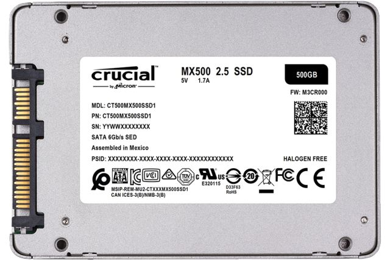

* `SATA 3.0` 最大的改进之处，就是将总线最大传输带宽提升到 `6Gb/s`，实际传输速度大约 `600MB/S`。

### 1.1.4 M.2 接口

* `M.2` 接口内部又可以简单划分为走传统的 `SATA AHCI` 协议的接口和走 `PCIe` 通道 `NVMe` 协议的接口。

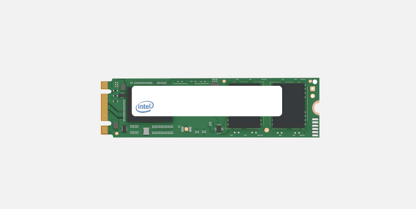

> 注意⚠️：
>
> * ① **NVMe**（基于非易失性存储器的传输规范）是一种较新的协议，可以直接连接到主板的 PCIe 通道，从而提供更高的吞吐量和更低的延迟。PCIe 3.0 和 4.0 驱动器可以每秒数千兆的速度传输数据，这比 SATA III 更快，而 PCIe 4.0 驱动器的带宽大约是 3.0 的两倍。
> * ② M.2 驱动器被打造成又小又薄的矩形，经常被比作口香糖。它们直接插入主板上的 M.2 插槽。它们通常使用 NVMe 传输协议，不过某些较旧的设备可能使用 SATA。
> * ③ 购买 M.2 接口的 SSD 的时候，要注意它的是 SATA 通道，还是 NVMe 通道；如果是 SATA  通道，可能最高也就是 `600MB/S` ，在主板支持的情况下，尽量购买 M.2 接口走 NVMe 通道的。

### 1.1.5 总结

* 其实，现在市面上主流的`硬盘接口类型`就是：`STAT` 接口和 `M.2` 接口。

## 1.2 机械硬盘 VS 固态硬盘

### 1.2.1 概述

* 机械硬盘（HDD）和固态硬盘（SSD）最主要的区别就是`内部结构不一样`，和`硬盘接口类型没有关系`，比如：`STAT 接口类型`的硬盘有`机械硬盘`，也有`固态硬盘`；当然，`M.2 接口类型`的硬盘一般都是`固态硬盘`。

> 温馨提示ℹ️：
>
> * ① `硬盘接口类型`就是`一种标准`、`一种协议`，只是规范了硬盘和计算机主板之间的数据传输接口，如：STAT 硬盘接口类型。
> * ② `机械硬盘`和`固态硬盘`都只是`硬盘接口类型的实现`而已，如：STAT 硬盘接口类型的机械硬盘和 STAT 硬盘接口类型的固态硬盘。
> * ③ 对于`固态硬盘`来说，其实也有划分，如：M.2 STAT 的固态硬盘（走的是 STAT 协议）和 M.2 NVMe （走的是 NVMe 协议）的固态硬盘。

* `STAT 接口类型的机械硬盘`，如下所示：

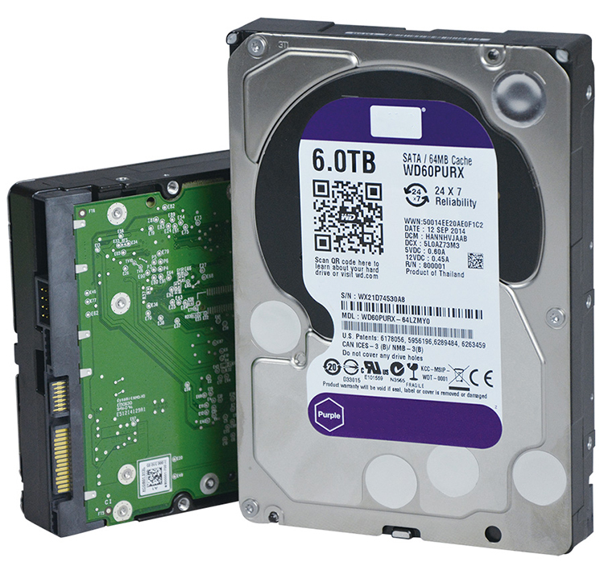

* `STAT 接口类型的固态硬盘`，如下所示：

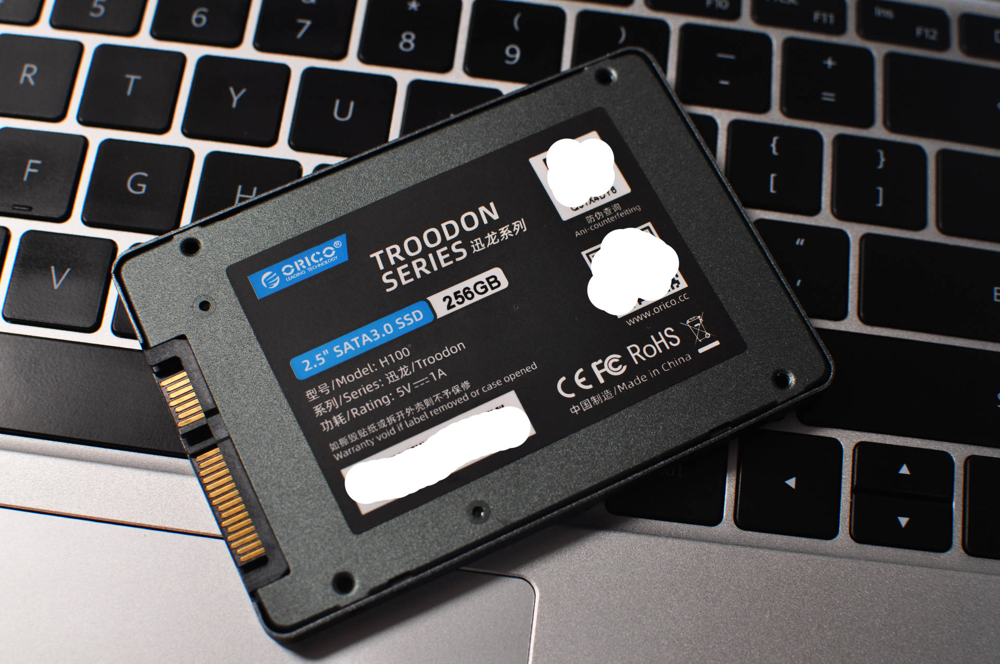

* `M.2 接口类型的固态硬盘`，如下所示：


### 1.2.2 机械硬盘

* 定义：机械硬盘（HDD）是一种带有机械马达结构的存储装置，主要带有马达、盘片、磁头、缓存。
* 内部构造：

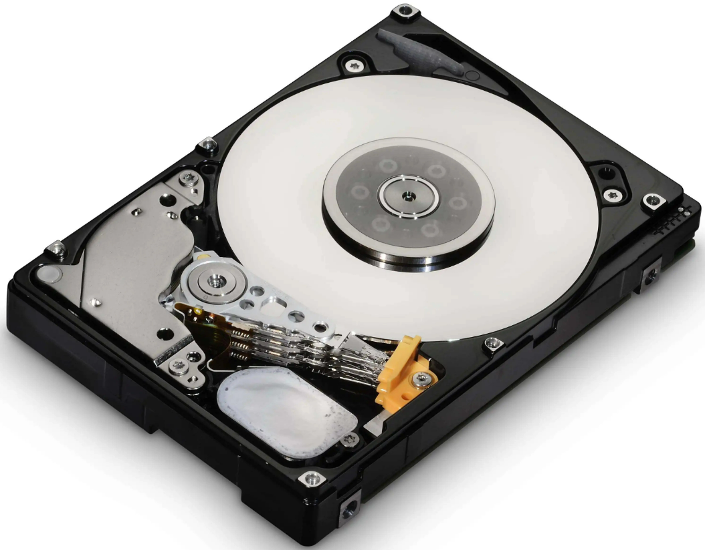

* 防震抗摔性：机械硬盘都是磁碟型的，数据储存在磁碟扇区里。防震抗摔性相较固态硬盘较差。
* 数据存储速度： 机械硬盘的最大传输速度约为 600 MB/S。
* 功耗：功耗相对固态硬盘较高。
* 重量：重量相对固态硬盘较高。
* 噪音： 机械硬盘工作时需要高速转动磁盘，马达的高速转动不可避免地带来噪音和发热。
* 价格：大容量的机械硬盘价格经济实惠。
* 数据保存：在机械硬盘发生损坏时，通过数据恢复可能挽救一部分数据。
* 寿命：机械硬盘没有读写次数的限制，机械结构一般寿命都在 15 年以上。

### 1.2.3 固态硬盘

* 定义：固态硬盘（SSD）是一种不带有机械马达结构的存储装置，主要带有闪存、主控芯片、缓存。
* 内部构造：

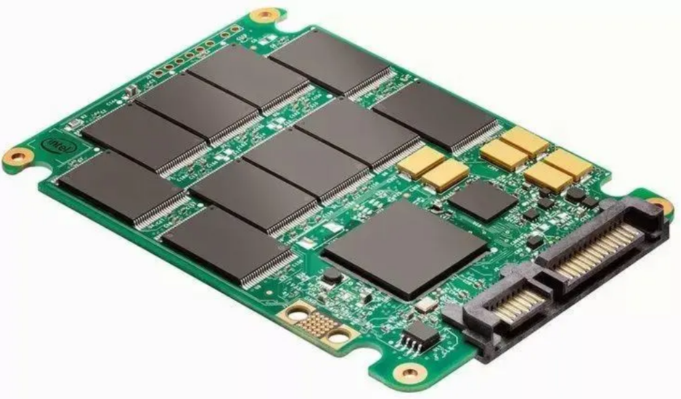

* 防震抗摔性：固态硬盘是使用闪存颗粒（即：内存、MP3、U盘 等存储介质）制作而成，所以 SSD 固态硬盘内部不存在任何机械部件，这样即使在高速移动甚至伴随翻转倾斜的情况下也不会影响到正常使用，而且在发生碰撞和震荡时能够将数据丢失的可能性降到最小。
*  数据存储速度：SATA 协议的固态硬盘速度约为 500 MB/S；NVMe 协议 (PCIe 3.0×2) 的固态硬盘速度约为 1800 MB/S；NVMe 协议(PCIe 3.0×4) 的固态硬盘速度约为 3500 MB/S。
* 功耗：功耗相对机械硬盘较低。
* 重量：固态硬盘在重量方面更轻，与常规 1.8 英寸硬盘相比，重量轻 20-30 克。
* 噪音：固态硬盘属于无机械部件及闪存芯片，所以具有了发热量小、散热快等特点，而且没有机械马达和风扇，噪音值为 0 分贝。
* 价格：价格较高（`都 2024 年了，固态硬盘的价格早就降了，如果主板支持，无脑选择固态硬盘`）。
* 数据保存：固态硬盘一旦闪存、主控芯片发生损坏，几乎不可能找回数据。
* 寿命：固态硬盘闪存具有擦写次数限制的问题，是其寿命短的原因所在。固态硬盘的寿命，要比理论值少，正常寿命 10 年左右。

## 1.3 Linux 对硬盘的支持

* 在 Linux 系统中，对于`各种硬盘接口类型`的`硬盘`在接入到操作系统后都是以`文件`的形式存在的，并且`不同类别的硬盘`将被`识别`为`不同的文件类型`，如：

| 硬盘类型（硬盘接口类型）                  | 物理识别文件名称                                             |
| ----------------------------------------- | ------------------------------------------------------------ |
| ~~IDE（老式并口硬盘，如今已经被淘汰了）~~ | ~~/dev/hd0、/dev/hd1（h 是 hard 的缩写，d 是 Disk 的缩写，0 表示第一块硬盘）~~ |
| SCSI、STAT、SAS、USB（串口硬盘）          | /dev/sda、/dev/sdb（s = STAT\|SCSI\|SAS 的缩写，d 是 Disk 的缩写，a 表示第一块硬盘） |
| M.2 接口（M.2 接口的 NVMe 硬盘）          | /dev/nvme0、/dev/nvme1（nvme 是 NVMe 协议，0 表示第一块硬盘） |
| ~~光驱或光盘~~                            | ~~/dev/sr0、/dev/sr1（sr 是 SCSI CD-ROM，即可移动的 SCSI 设备，通常指的是光盘，0 表示第一个光盘）~~ |

* 其实，对于目前的计算机（台式机、笔记本、服务器）而言，~~光驱或光盘~~已经被淘汰了；但是，因为我们在安装虚拟机的时候，选择了[设置 CD/DVD](https://aexiar.github.io/linux/notes/01_linux_basic/01_xdx/#_2-4-4-%E8%AE%BE%E7%BD%AE-cd-dvd)，以便引导 Linux 操作系统的安装，如下：

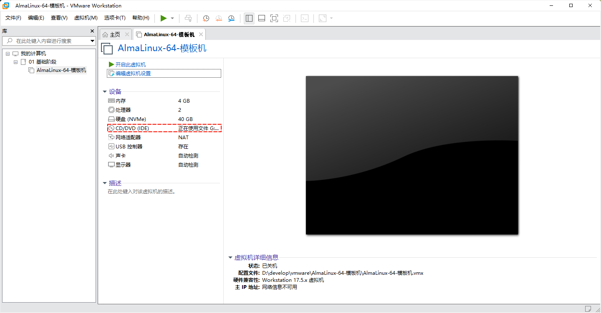

* 这样，在 Linux 中，查看系统中的所有块设备（包括：硬盘、分区、光驱、U 盘等），不至于疑惑😖，如下所示：

```shell
lsblk -f
```

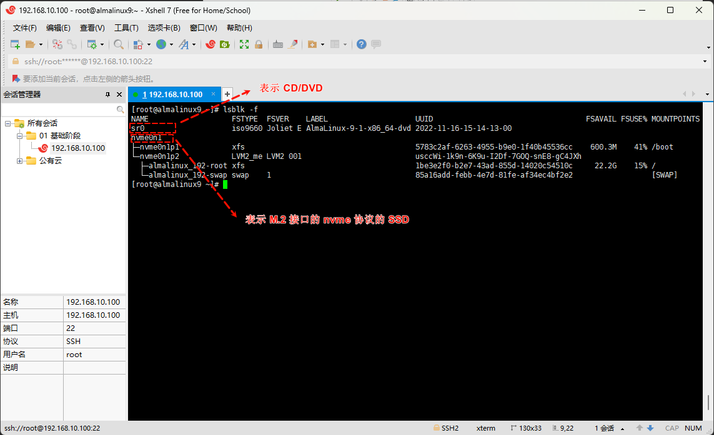

## 1.4 分区和格式化

### 1.4.1 分区

* 在一块`硬盘`在`被系统使用前`，都需要进行`分区`，所谓的`分区`就是`将硬盘划分为一个个逻辑的区域`，`每一个分区都有确定的起始和结束位置`。

* `磁盘分区`是为了更有效地`管理`和`使用`磁盘空间，以及满足不同的`操作系统`和`数据`的`组织需求`。以下是分区的几个主要原因：

  * **组织数据**：分区可以帮助用户将不同类型的数据存储在不同的区域，例如：一个分区用于操作系统，另一个用于个人文件，再另一个用于备份，这样可以提高数据管理的效率。

  * **多操作系统**：如果用户需要在同一台计算机上运行多个操作系统（如：Windows、Linux 或 MacOS），分区可以为每个操作系统提供一个独立的安装空间，避免系统间的冲突。
  * **性能优化**：某些文件系统在特定的分区大小和对齐方式下表现更好。通过分区，可以优化这些文件系统的性能。
  * **安全性**：分区可以作为数据保护的一种手段。例如：可以将敏感数据放在一个单独的分区，并对该分区进行加密或限制访问，以提高数据安全性。
  * **故障隔离**：当一个分区出现问题时，通常不会影响到其他分区。这意味着即使某个分区损坏，其他分区的数据仍然可以安全地访问。
  * **灵活的磁盘空间分配**：随着时间的推移，用户对磁盘空间的需求可能会变化。通过分区，可以更灵活地调整各个分区的大小，以适应不同的存储需求。
  * **备份和恢复**：分区使得备份和恢复数据更加方便。可以针对特定分区进行备份，而不是整个磁盘，这样可以节省备份时间并减少所需的存储空间。
  * **兼容性**：不同的操作系统可能需要不同的分区格式。例如：Windows 通常使用 MBR 或 GPT 分区，而 Linux 则更倾向于使用 GPT 。分区可以确保操作系统能够正确识别和使用磁盘空间。

> 注意⚠️：在虚拟机中安装 Linux 操作系统的时候，我们选择的是[自动分区](https://aexiar.github.io/linux/notes/01_linux_basic/01_xdx/#_2-5-%E5%AE%89%E8%A3%85-linux)。
>

* 如果自己手动安装过 Win 操作系统的，也会接触到`分区`的概念，以 [diskgenius](https://www.diskgenius.cn/) 为例，来查看`分区`的`类型`，如下所示：

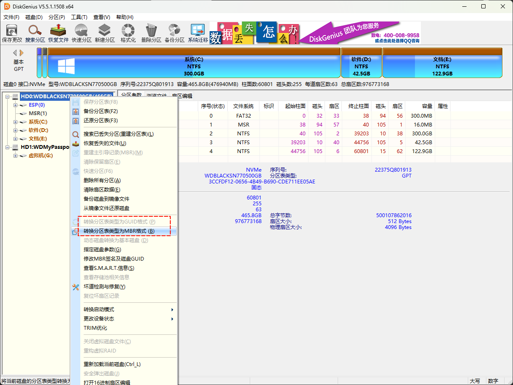

* 从上图中，我们知道分区有两种：MBR 和 GUID 格式；当然，在 Linux 系统中也支持`分区格式`，如下：

| 分区格式                       | 支持的位数    | 支持分区个数                             | 最大硬盘容器                  | 引导方式       |
| ------------------------------ | ------------- | ---------------------------------------- | ----------------------------- | -------------- |
| legacy（MBR，主引导记录分区表) | 32 位和 64 位 | 4  个主分区 或 3 个主分区和 1 个扩展分区 | 2 TB                          | 传统 BIOS 引导 |
| UEFI（GPT，GUID 分区表）       | 32 位和 64 位 | 理论上无限（win 限制为 128 个）          | 18 EiB（1 EiB = 1048576 TiB） | UEFI 引导      |

* MBR 支持 4 个主分区 或 3 个主分区和 1 个扩展分区。
  * MBR 分区包含`主分区`和`扩展分区`，其中`扩展分区`里面可以`包含`若干个`逻辑分区`。
  * MBR 分区中`扩展分区`不可以直接使用，`需要划分为多个逻辑分区`才可以使用。
  * MBR 分区中的`主分区`只有一个是`活动分区`（激活分区），通常用来`安装操作系统`。

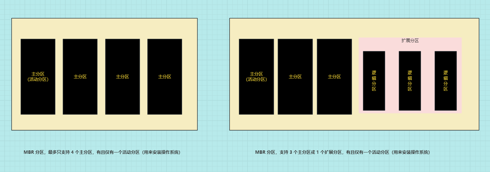

* MBR 分区中的`主分区`和`扩展分区`都是使用 `1-4` 来表示，`扩展分区`是系统`自动分配`的，都是从 `5` 开始；在 Linux 中，如果硬盘类型是 SATA 类型，并且只有一块硬盘，对应的表示就是 `/dev/sda`，那么 MBR 的主分区或扩展分区的表示如下：

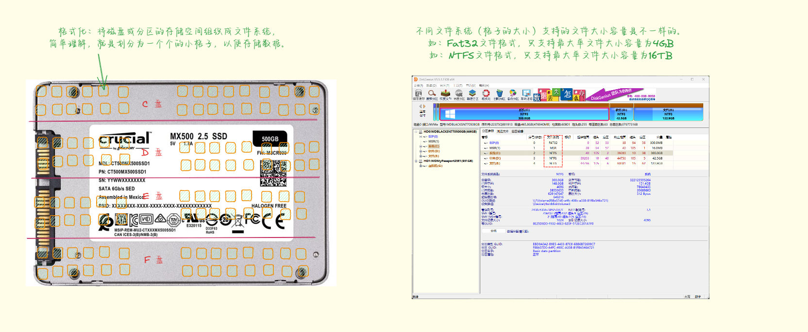

* 所以，对于 MBR 分区而言，如果要创建 6 个分区，它们可以是：
  * 3 个主分区和 1 个扩展分区（其中扩展分区包含 3 个逻辑分区）。
  * 2 个主分区和 1 个扩展分区（其中扩展分区包含 4 个逻辑分区）。
  * 1 个主分区和 1 个扩展分区（其中扩展分区包含 5 个逻辑分区）

* MBR（Master Boot Record，主引导记录）是一种磁盘分区表格式，它位于硬盘或其他可启动存储设备的最开始部分。
  * MBR 的具体位置是在硬盘的 `0` 磁道 `0` 柱面 `1` 扇区，这个扇区总共有 `512` 字节。
  * 在这 `512` 字节中，MBR 占用了前 `446` 字节，用于存储引导程序代码。
  * 接下来的 `64` 字节是磁盘分区表（Disk Partition Table，DPT），它定义了硬盘上的分区布局，包括每个分区的起始和结束位置。
  * 最后两个字节（55AA）是分区表的结束标志。
  * MBR 的主要作用是在计算机启动时，由 BIOS（基本输入输出系统）读取并执行其中的引导程序，以加载操作系统。
* MBR（主引导记录）中的`引导程序`的`工作流程`如下：
  * **硬件自检**：计算机开机后，BIOS 执行自检（POST，Power-On Self-Test），检查硬件设备。
  * **寻找 MBR**：BIOS 在指定的启动设备（通常是硬盘）上寻找 MBR。这通常发生在硬盘的 0 磁道、0 柱面、1 扇区。
  * **执行引导程序**：BIOS 读取 MBR 中的引导程序代码，并执行它。这段代码会检查分区表，寻找标记为活动的分区。
  * **加载引导加载程序**：引导程序会根据活动分区的信息，定位到该分区的引导扇区（通常是分区的起始位置），并从那里加载更复杂的引导加载程序。这个引导加载程序可能是 Windows 的 NTLDR、BOOTMGR，Linux 的 GRUB 或其他操作系统的相应程序。
  * **启动操作系统**：引导加载程序接管控制权，继续加载操作系统内核和必要的驱动程序，最终启动操作系统。

> 注意⚠️：
>
> * ① MBR 中的引导程序代码不直接包含操作系统，而是负责启动过程的最初阶段，确保计算机能够找到并加载操作系统的引导加载程序。这个过程中，MBR 扮演了至关重要的角色，因为它是计算机启动序列的起点。
> * ② MBR 分区格式的限制之一是它只能支持最大 `2TB` 的硬盘容量，并且在分区数量上也有限制。
> * ③ 随着技术的发展，GPT（GUID Partition Table，GUID 分区表）作为 MBR 的替代者，提供了更多的分区数量、更大的磁盘支持以及更好的数据完整性检查等优点；换言之， GPT 分区不限制分区数量，即 GPT 分区没有主分区、扩展分区和逻辑分区之分。
> * ④ 目前，在安装操作系统的时候，大部分情况下都是选择 GPT 分区；目前的 Win11 操作系统，已经强制使用 GPT 分区了，即强制使用 UEFI 来引导操作系统。

### 1.4.2 格式化

* `分区`是将`磁盘`划分成`若干个`的`逻辑部分`，以便可以分别使用这些部分，即：

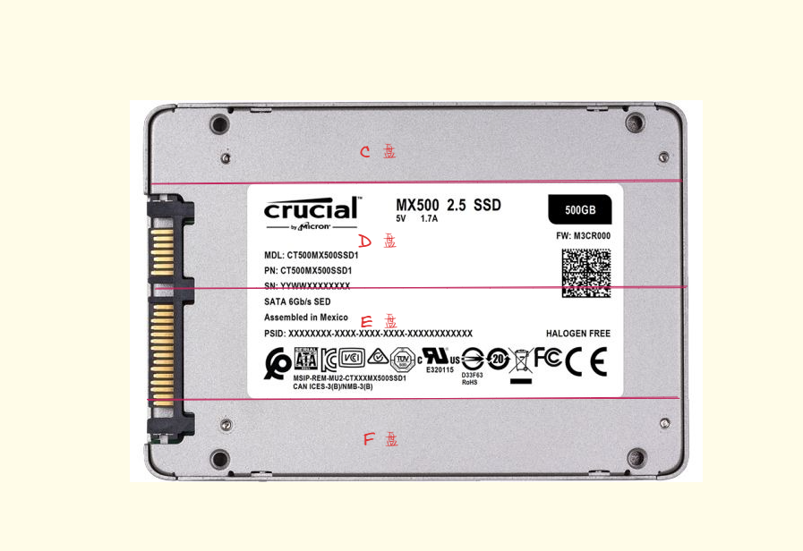

* 而`格式化`是将`磁盘`或`分区的存储空间`组织成`文件系统`以便存储数据，即：

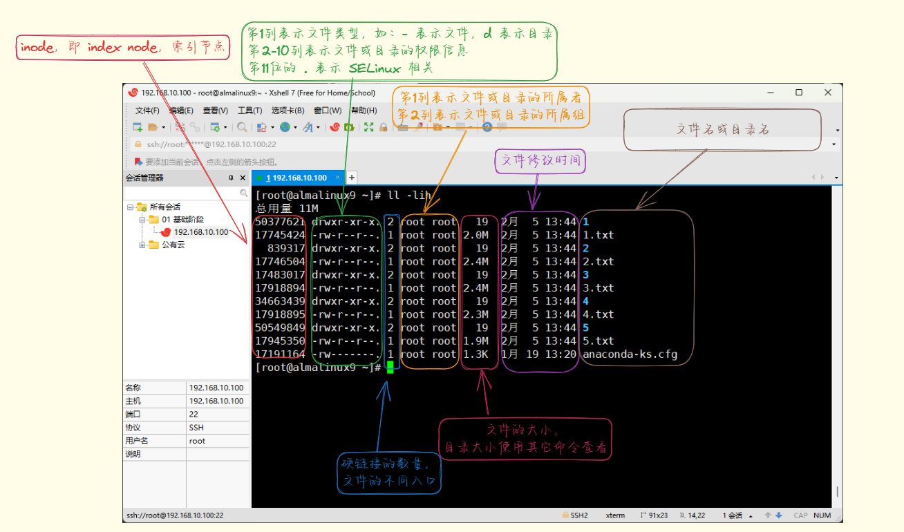

> 注意⚠️：很多人对格式化有误区，认为格式化就是清空硬盘或分区；其实，格式化只是写入文件系统而已，清空硬盘或分区不是首要目的，是附带效果！！！


# 第二章：文件属性体系

## 2.1 概述

* 我们经常通过 `ls` 查看`某个目录下`的`文件`及其`子目录`信息，如下：

```shell
# 创建 5 个目录
mkdir {1..5}
# 随机向 5 个目录中创建文件，并写入内容
for i in $(seq 1 5); do echo "随机内容 $RANDOM" >> $i/$i.txt; done
```

```shell
# 随机创建 5 个文件，并向其中添加内容
for i in $(seq 1 5); do echo $(head -c $((1048576 + $(shuf -i 1-1048576 -n 1))) /dev/urandom | base64) > $i.txt; done
```

```shell
# 查询文件属性
ls -ilh
```

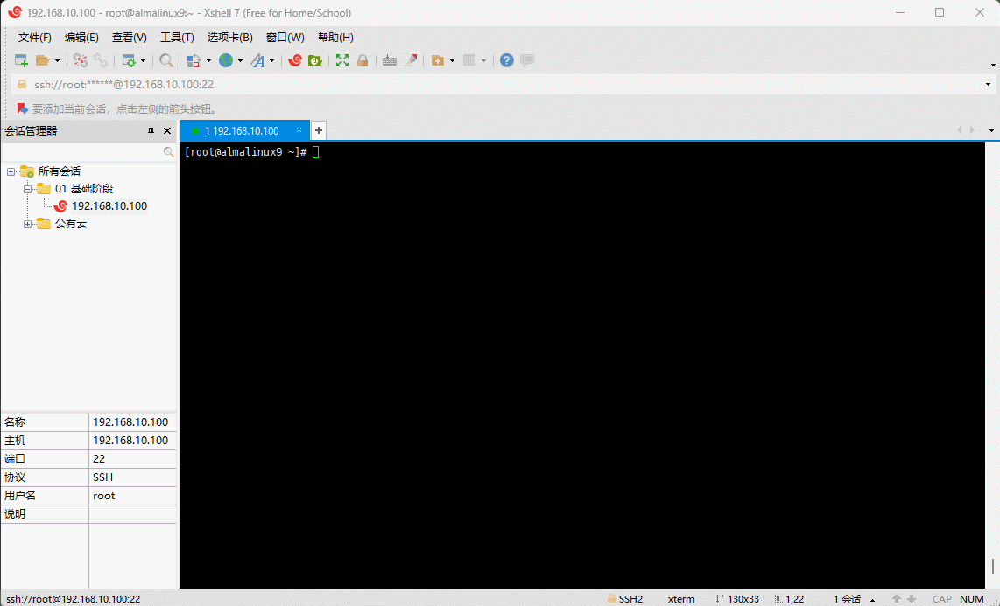

* 其内容如下所示：

```
[root@almalinux9 ~]# ll -lih
总用量 11M
50377621 drwxr-xr-x. 2 root root   19  2月  5 13:44 1
17745424 -rw-r--r--. 1 root root 2.0M  2月  5 13:44 1.txt
  839317 drwxr-xr-x. 2 root root   19  2月  5 13:44 2
17746504 -rw-r--r--. 1 root root 2.4M  2月  5 13:44 2.txt
17483017 drwxr-xr-x. 2 root root   19  2月  5 13:44 3
17918894 -rw-r--r--. 1 root root 2.4M  2月  5 13:44 3.txt
34663439 drwxr-xr-x. 2 root root   19  2月  5 13:44 4
17918895 -rw-r--r--. 1 root root 2.3M  2月  5 13:44 4.txt
50549849 drwxr-xr-x. 2 root root   19  2月  5 13:44 5
17945350 -rw-r--r--. 1 root root 1.9M  2月  5 13:44 5.txt
17191164 -rw-------. 1 root root 1.3K  1月 19 13:20 anaconda-ks.cfg
```

* 对其进行简要分析，如下所示：


* 那么，inode 是什么？

## 2.2 inode 和 block

* 在现实生活中，我们如何定位到一个人 -- 通过`身份证号码`，即：


* 那么，在 Linux 中，是通过 `inode`（index node ，索引节点）来`定位`一个`文件`或`目录`。

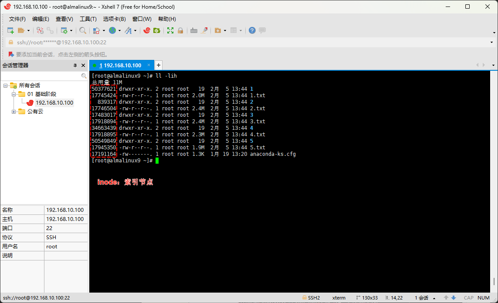

* 我们可以通过如下的命令，来证明：

```shell
# 从 / 根目录开始寻找，根据 inode number 来查找文件或目录 
find / -inum 50549849
```

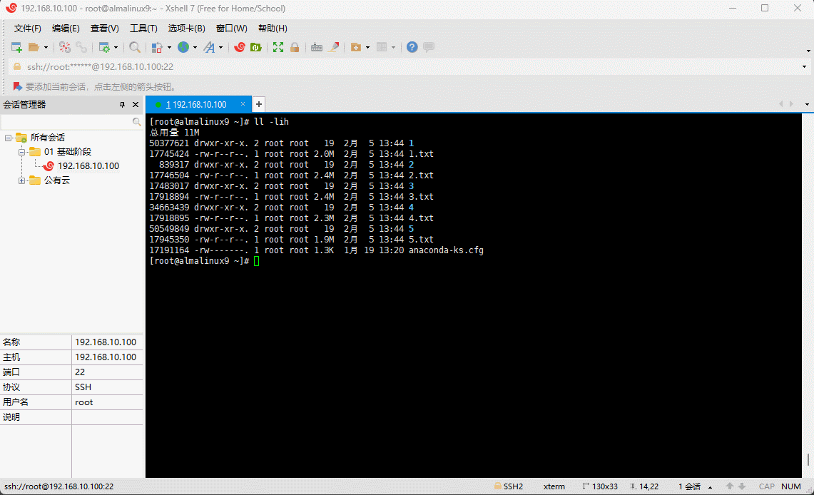

* 其实，`inode` 是 Linux 文件系统中的一种`数据结构`，它包含了`文件`或`目录`的`元数据信息`。inode 中包含的信息包括：

  - 文件或目录的类型。

  - 文件或目录的大小。

  - 文件或目录的创建时间和修改时间。

  - 文件或目录的访问权限。

  - 文件或目录的所有者和所属组。

  - 文件或目录的数据块号。


* 可以通过如下的命令，来证明：

```shell
stat 5.txt
```

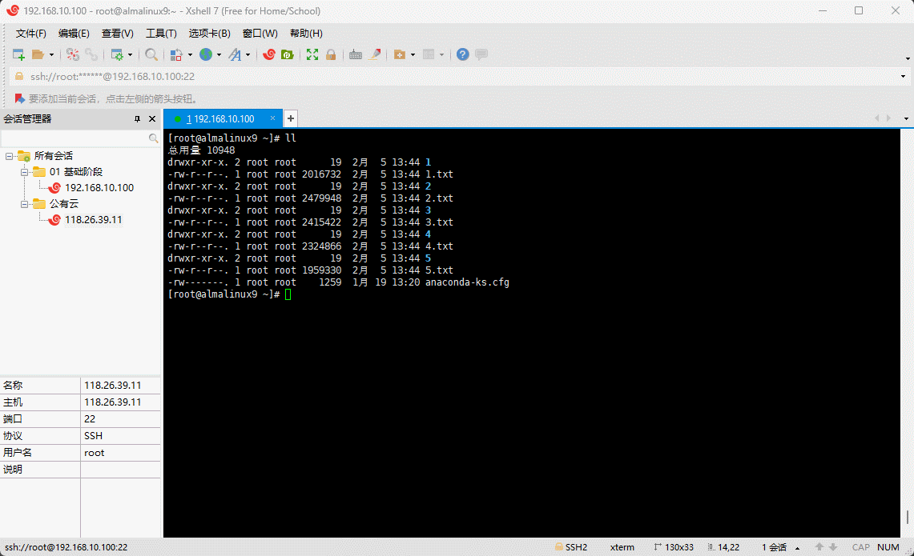

* 中文版的系统的信息显示不是很易懂，我暂时切换为英文版的，即：

```shell
stat 5.txt
```

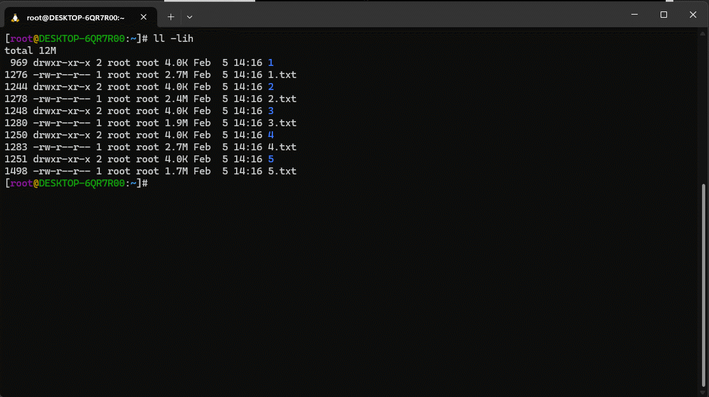

* 其内容如下所示：

```
  File: 5.txt
  Size: 1732776         Blocks: 3392       IO Block: 4096   regular file
Device: 840h/2112d      Inode: 1498        Links: 1
Access: (0644/-rw-r--r--)  Uid: (    0/    root)   Gid: (    0/    root)
Access: 2024-02-05 14:16:51.587330447 +0800
Modify: 2024-02-05 14:16:51.587330447 +0800
Change: 2024-02-05 14:16:51.587330447 +0800
 Birth: 2024-02-05 14:16:51.587330447 +0800
```

> 注意⚠️：
>
> * ① 上图中的 Inode 就是所谓的 inode，即索引节点；而 Blocks 就是所谓的 block，数据块号。
> * ② inode 号是文件或目录在文件系统中的唯一标识符。当一个文件或目录被创建时，系统会为其分配一个唯一的 inode 号。inode 号码不会改变，即使文件或目录被重命名或移动。

* inode 保存的是文件的索引号，而 block 保存的时候文件的内容信息，即：

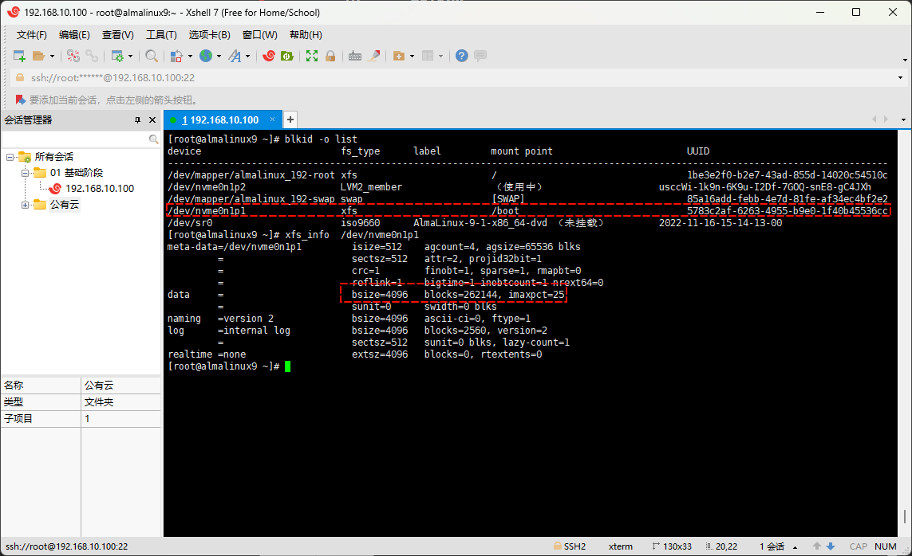

> 注意⚠️：
>
> * ① inode 的作用是将`文件`或`目录`的`元数据信息`与`文件`或`目录`的`数据块`分离。这样做的目的是为了提高文件系统的性能和可靠性。
> * ② 不同的`文件系统`的 `block` 是`不一样`的，其实 block 就是文件系统中最小的单位（一个个小格子），即：用来存放文件内容的。

## 2.3 inode 和 block 的特点

*  inode 是索引节点，存放的是文件的属性信息以及 block 的位置，而 block 存放的是文件的内容。
* 每创建 1 个非空文件至少占用 1 个 inode 和 1 个 block；如果文件为空，那么就只有 1 个 inode。
* block 的单位默认是 4 K，可以通过如下的命令来查询：

```shell
# 查询文件系统
blkid -o list
```

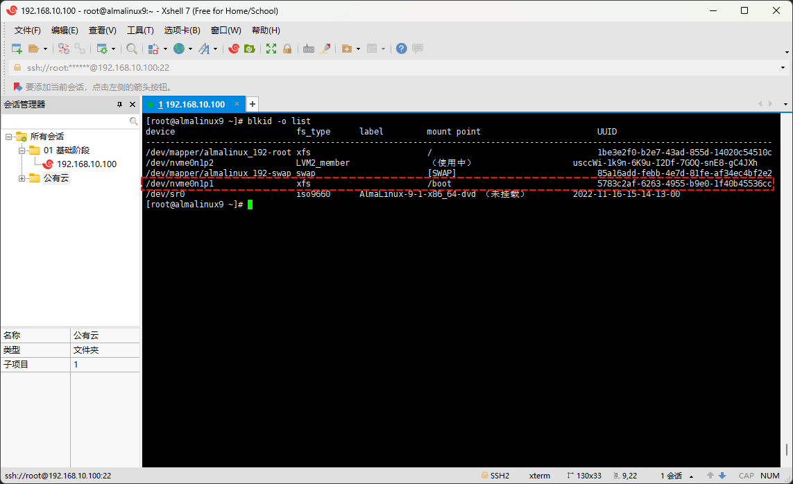

```shell
# 查看默认 block 的默认单位
xfx_info /dev/nvme0n1p1
```


* 如果创建的小文件的大小不足 4k，那么 1 个 block 将有剩余空间，并不会将空间分配给其它文件使用。如果创建的文件大于 4K，那么将会占用多个 block 。

## 2.4 如何查看（⭐）

* 查看 inode 的使用情况：

```shell
# df 是 disk free 的缩写，free 有免费，空的（空闲），剩余的意思，i 就是 inode
df -i
```

* 查看 block 的使用情况（磁盘空间的使用情况）：

```shell
df -h
```


* 示例：查看 inode 的使用情况

```shell
df -i
```

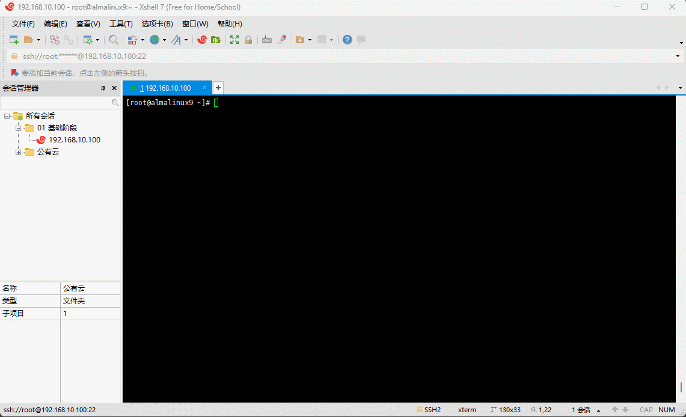


* 示例：查看磁盘空间使用情况

```shell
df -h
```

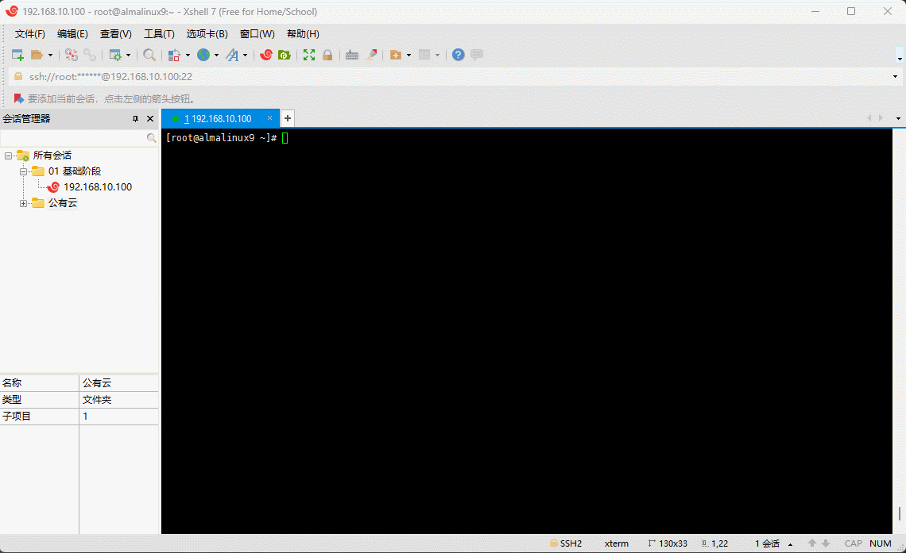


# 第三章：文件类型

## 3.1 Win 和 Linux 文件类型的区别

* 在 Win 系统中，是通过 `扩展名` 来识别不同的文件类型的，如：

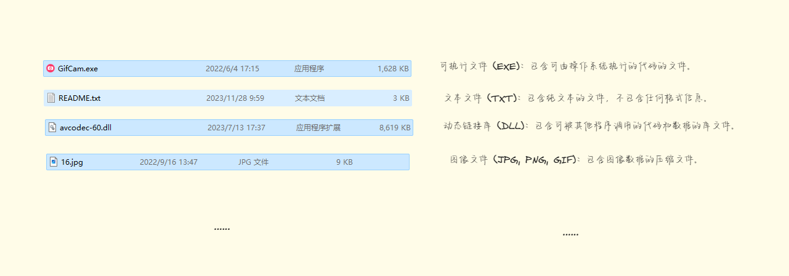

* 但是，Linux 中的`扩展名`仅仅用于展示而已，可以随意修改；但是，`推荐加上扩展名`，以便`见名识意`，如：

| 常用扩展名                | 备注               |
| ------------------------- | ------------------ |
| `.txt`                    | 普通文本文件       |
| `.sh` 或 `.bash`          | Shell 脚本文件爱你 |
| `.conf` 、`.cfg` 、`.ini` | 配置文件           |
| ...                       |                    |

## 3.2 Linux 中的文件类型（⭐）

* 通常而言，我们都是通过 `ls -l` 来查看文件的类型的，如：

```shell
ls -l 
```

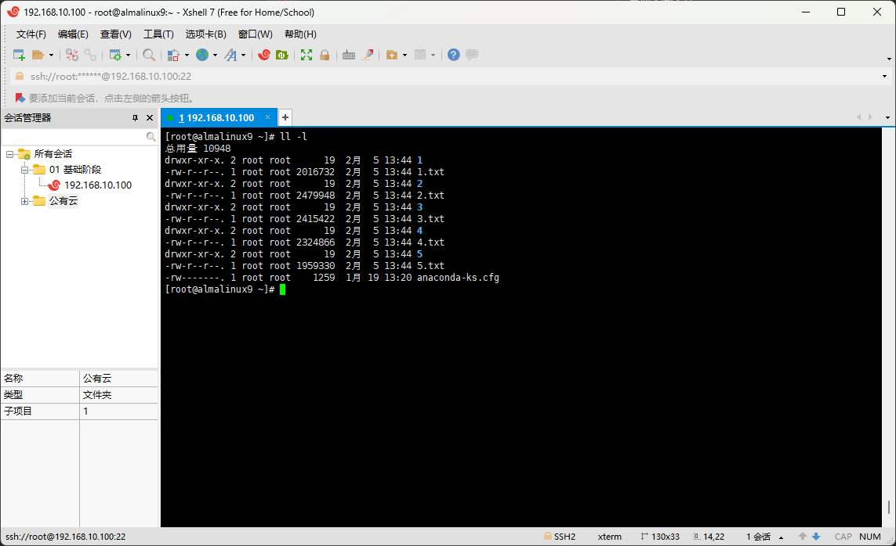

* 其中，Linux 常见的文件类型如下：

| Linux 常见的文件类型 | 解释说明 | 备注   |
| -------------------- | -------- | ------ |
| `-`rw-rw-r--         | 普通文件 | `常用` |
| `d`rwxrwxr-x         | 目录     | `常用` |
| `l`rwxrwxrwx         | 软链接   | `常用` |
| `b`rw-rw----         | 块设备   |        |
| `c`rw-rw----         | 字符设备 |        |
| `s`rwxrwxrwx         | 套接字   |        |
| `p`rw-rw----         | 管道     |        |

## 3.3 如何查看文件的类型（⭐）

* 有的时候，我们很难确定文件的类型到底是什么，如：

```shell
ll /etc/hostname /var/log/wtmp /bin/ls
```


* 此时，就可以通过 file 命令来查看文件的详细类型，即：

```shell
file /etc/hostname /var/log/wtmp /bin/ls
```


* file 命令结果的详细解释：

| 文件的类型 | 备注                                                         |
| ---------- | ------------------------------------------------------------ |
| text       | 文本文件；通常情况下，可以日常查看或修改的都是 text 类型的文件。 |
| data       | 数据文件，需要专门的命令查看，如：压缩包。                   |
| executable | 二进制文件，大部分都是文件。                                 |

> 注意⚠️：`file` 命令还可以查看是否是软链接、设备文件、目录等。


# 第四章：软链接和硬链接

## 4.1 概述

* 软链接（**Symbolic** Link）：
  * 软链接也称为符号链接，它是一种文件系统中的特殊文件，它指向另一个文件或目录，类似于 Win 系统中的快捷方式。
  * 软链接本身不包含任何数据，它只是存储了被链接的文件或目录的路径。
  * 当访问软链接时，系统会自动跳转到被链接的文件或目录。
  * 软链接可以跨越文件系统，也可以跨越分区。
  * 软链接可以指向任何类型的文件或目录，包括：普通文件、目录、设备文件、管道等。
  * 软链接可以被多次链接到同一个文件或目录。
  * 软链接可以被删除，而不会影响被链接的文件或目录。


* 硬链接（**Hard** Link）：
  * 硬链接是一种文件系统中的特殊文件，它直接指向同一个文件或目录的 inode。
  * 硬链接和被链接的文件或目录共享同一个 inode，因此它们具有相同的设备号和 inode 号。
  * 硬链接只能在同一个文件系统中创建。
  * 硬链接只能指向普通文件，不能指向目录、设备文件、管道等。
  * 硬链接不能被多次链接到同一个文件。
  * 删除硬链接不会影响被链接的文件，但如果删除了被链接的文件，那么所有指向它的硬链接都将失效。

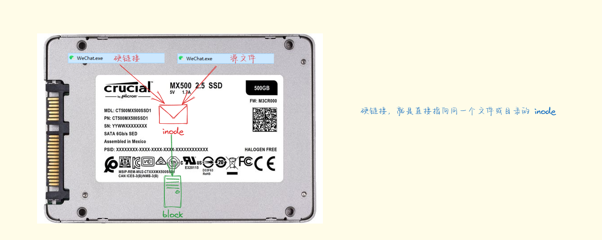

* 软链接和硬链接的区别：

| 特性         | 软链接                                                       | 硬链接                                                       |
| ------------ | ------------------------------------------------------------ | ------------------------------------------------------------ |
| 本质         | 文件系统中的特殊文件，指向另一个文件或目录                   | 文件系统中的特殊文件，直接指向另一个文件或目录的 inode       |
| 存储方式     | 存储被链接的文件或目录的路径                                 | 与被链接的文件或目录共享同一个 inode                         |
| 作用         | 当访问软链接时，系统会自动跳转到被链接的文件或目录           | 硬链接和被链接的文件或目录共享同一个 inode，因此它们具有相同的设备号和 inode 号 |
| 跨越文件系统 | 可以跨越文件系统，也可以跨越分区                             | 只能在同一个文件系统中创建                                   |
| 指向类型     | 可以指向任何类型的文件或目录，包括普通文件、目录、设备文件、管道等 | 只能指向普通文件，不能指向目录、设备文件、管道等             |
| 多次链接     | 可以被多次链接到同一个文件或目录                             | 不能被多次链接到同一个文件                                   |
| 删除影响     | 可以被删除，而不会影响被链接的文件或目录                     | 删除硬链接不会影响被链接的文件，但如果删除了被链接的文件，那么所有指向它的硬链接都将失效 |

> 注意⚠️：在实际工作中，软链接可能会使用到；但是，硬链接几乎不会被使用它。

## 4.2 使用

* 创建链接：

```shell
ln [-s] 源文件 链接文件
```

* ln 对应的英文是 link ，即创建软链接和硬链接的意思；默认情况下，创建硬链接（不加参数 `-s`）。
* 选项：
  * `-s`，`--symbolic` ：创建软链接（符号链接）。

> 注意⚠️：通常而言，软链接采用相对路径。


* 示例：创建软链接

```shell
touch a.txt
```

```shell
ln -s a.txt a.txt.soft
```

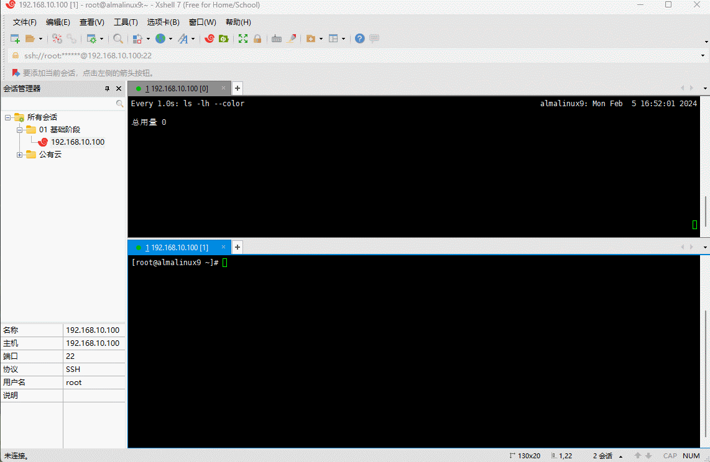


* 示例：创建硬链接

```shell
touch a.txt
```

```shell
touch a.txt a.txt.hard
```

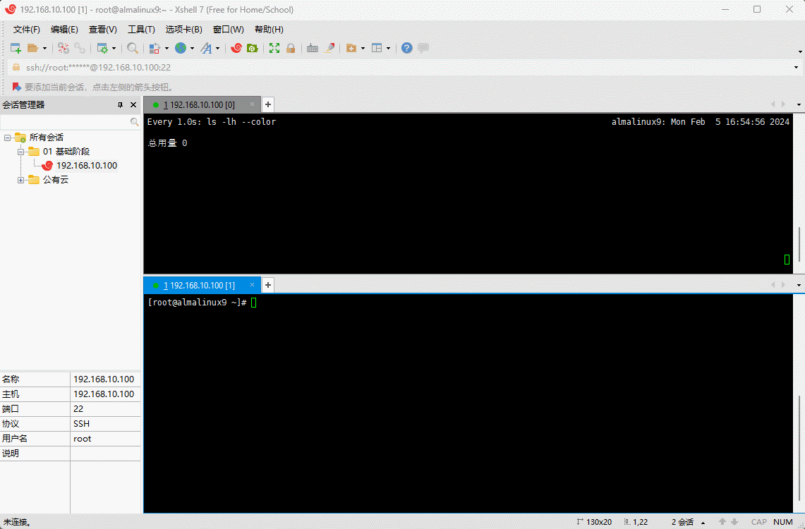

## 4.3 补充（⭐）

* 统计文件内容实际大小：

```shell
# f 表示只显示文件
ls -flh /etc/
```

* 查看目录大小：

```shell
# du 是 disk usage ，显示文件和目录磁盘使用情况
# s 是 summarize 的缩写，即总结
du -sh /etc
```


* 示例：统计文件内容实际大小

```shell
ls -flh /etc/
```

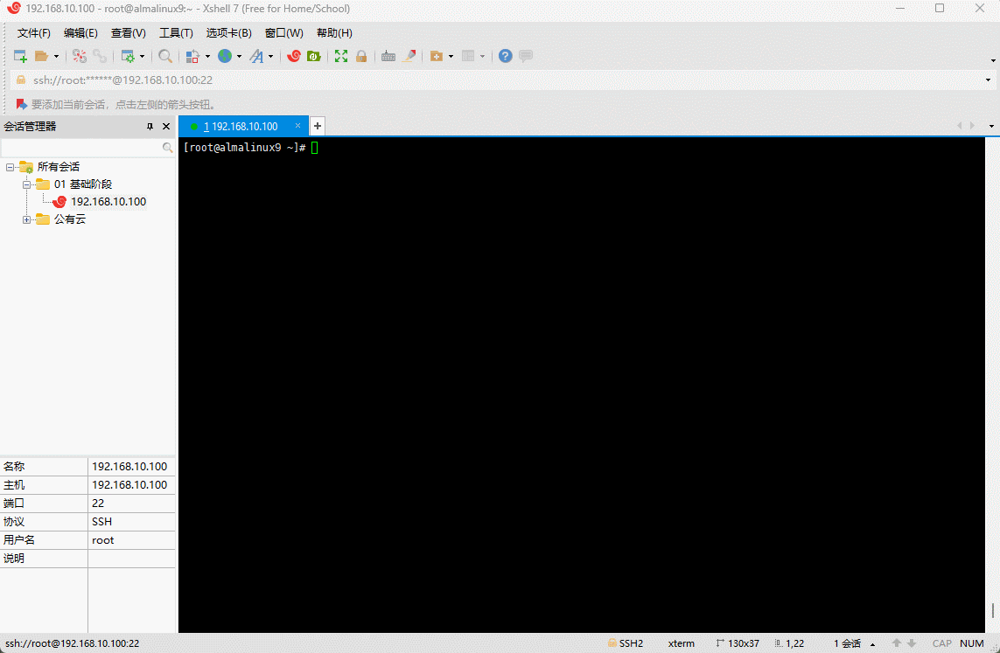


* 示例：查看目录大小

```shell
du -sh /etc
```

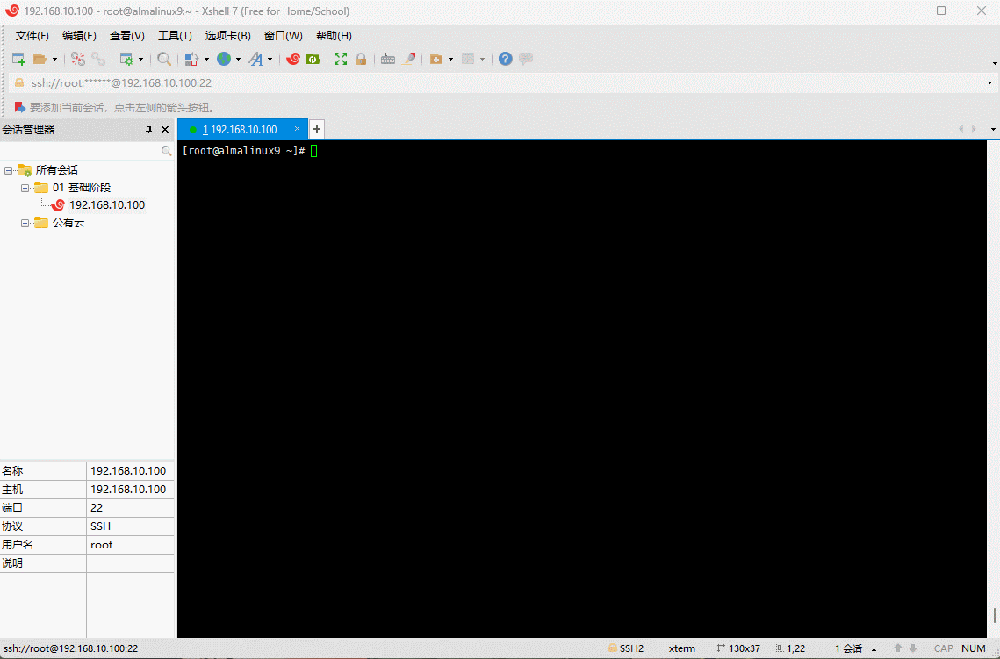


# 第五章：打包压缩三剑客

## 5.1 概述

* 在实际工作中，我们经常需要备份文件或目录，如果使用 cp 等命令，占用的磁盘空间就太大了。
* 为了避免空间的浪费，我们就可以选择使用`打包压缩命令`来对目标文件或目录进行打包压缩。

> 注意⚠️：
>
> * ① 对于单个文件使用 cp 备份；对于多个文件或目录，强烈推荐使用`打包压缩命令`进行备份。
> * ② 在 Linux 中的打包压缩命令，有：`tar`、`gzip` 和 `zip` 、 `unzip` 。
> * ③ 在 Linux 中，最为常用的打包压缩命令是 `tar` ，其次是 `zip` 和 `unzip` 了。

## 5.2 tar（⭐）

### 5.2.1 概述

* 在 Linux 中的打包压缩是分为两步：
  * ① 打包（将文件放到一起）：tar 。
  * ② 压缩（进行压缩，解决空间）：tar 命令的选项（如：z 等）。
* tar 命令最为常用的功能：
  * ① 创建压缩包。
  * ② 查看压缩包。
  * ③ 解压压缩包。
  * ④ 解压压缩包到指定目录。
* tar 命令的创建压缩包：

```shell
# -z, --gzip, --gunzip, --ungzip   通过 gzip 过滤归档（压缩选项）
# -c, --create   创建
# -f, --file=ARCHIVE  指定压缩包的路径和名称
# -v, --verbose       详细地列出处理的文件       
tar -zcvf xxx.tar.gz 文件|目录 ...
```

* tar 命令查看压缩包中的详细内容：

```shell
# -t, --list 列出压缩包中的内容
# -v, --verbose       详细地列出处理的文件 
# -f, --file=ARCHIVE  指定压缩包的路径和名称
tar -tvf xxx.tar.gz
```

* tar 命令解压压缩包：

```shell
# -x, --extract, --get       从归档中解出文件
# -v, --verbose       详细地列出处理的文件 
# -f, --file=ARCHIVE  指定压缩包的路径和名称
tar -xvf xxx.tar.gz
```

* tar 命令解压压缩包到指定目录：

```shell
# -x, --extract, --get       从归档中解出文件
# -v, --verbose       详细地列出处理的文件 
# -f, --file=ARCHIVE  指定压缩包的路径和名称
# -C, --directory=DIR        改变至目录 DIR
tar -xvf xxx.tar.gz -C xxx
```

### 5.2.2 案例

* 示例：创建压缩包

```shell
tar -zcvf etc.tar.gz /etc
```


* 示例：查看压缩包中的详细内容

```shell
tar -tvf etc.tar.gz
```

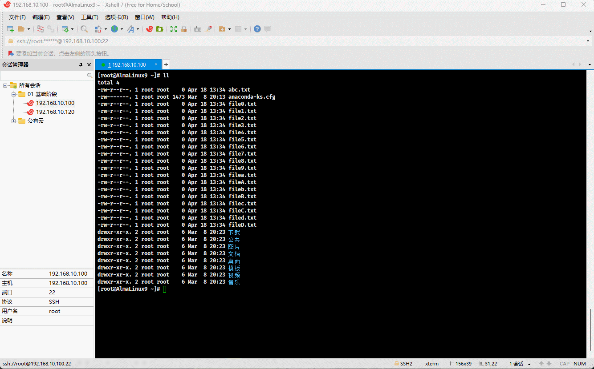


* 示例：解压到当前目录

```shell
tar -xvf etc.tar.gz
```

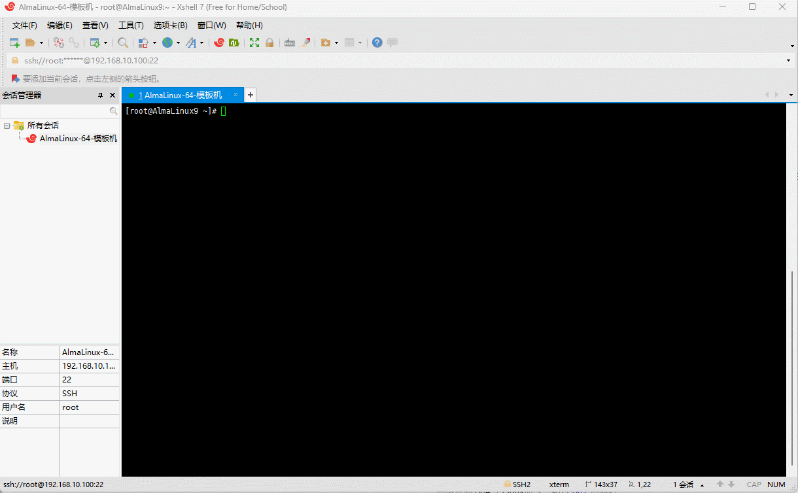


* 示例：解压到 /tmp 目录

```shell
tar -xvf etc.tar.gz -C /tmp
```


## 5.3 gzip（了解）

### 5.3.1 概述

* 打包压缩：

```shell
# -c, --stdout 压缩后的数据输出到标准输出，而不是覆盖原文件
# -k, --keep 压缩后保留原文件
gzip -ck 文件  > xxx.gz
```

* 解压：

```shell
# -c, --stdout 保留原始文件，生成标准输出流，而不是覆盖原文件
# -d, --decompress  解压
# -k, --keep 压缩后保留原文件
gzip -dck xxx.gz > 文件
```

### 5.3.2 案例

* 示例：

```shell
gzip -ck a.txt > a.gz
```


* 示例：

```shell
gzip -dck a.gz > b.txt
```

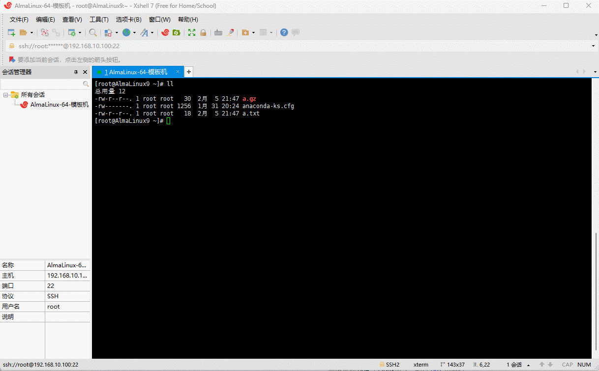

## 5.4 zip 和 unzip（⭐）

### 5.4.1 概述

* zip 格式的压缩包是 Linux 和 Windows 共同支持的格式，并且 tar 命令无法处理，只能使用 zip 命令或 unzip 命令。
* 其安装如下：

```shell
dnf -y install zip unzip
```

* 压缩：

```shell
# -r 递归目录，如果压缩目录，需要此参数
zip [-r] xxx.zip [目录|文件...]
```

* 解压：

```shell
unzip xxx.zip -d 目录
```

> 注意⚠️：通常只会使用解压命令。

### 5.4.2 案例

* 示例：

```shell
zip a.zip a.txt b.txt
```


* 示例：

```shell
unzip a.zip
```

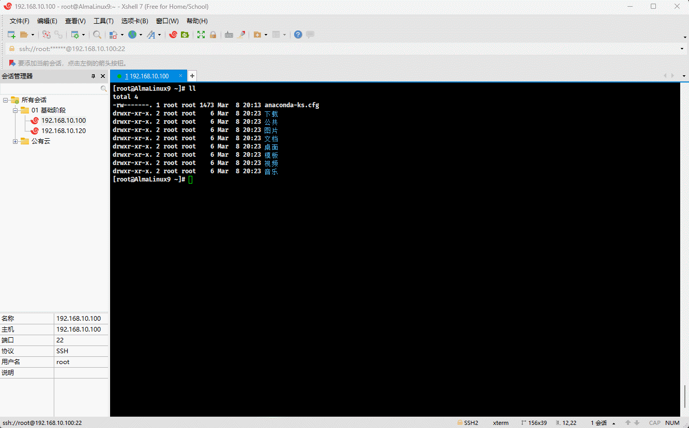


* 示例：

```shell
zip -r demo.zip demo
```

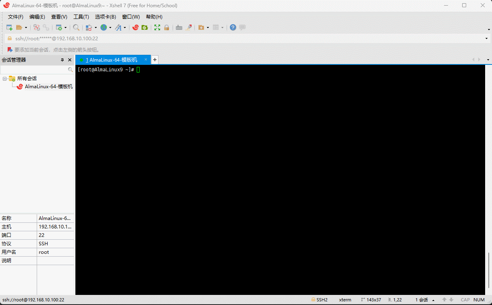


* 示例：

```shell
unzip demo.zip -d /tmp
```

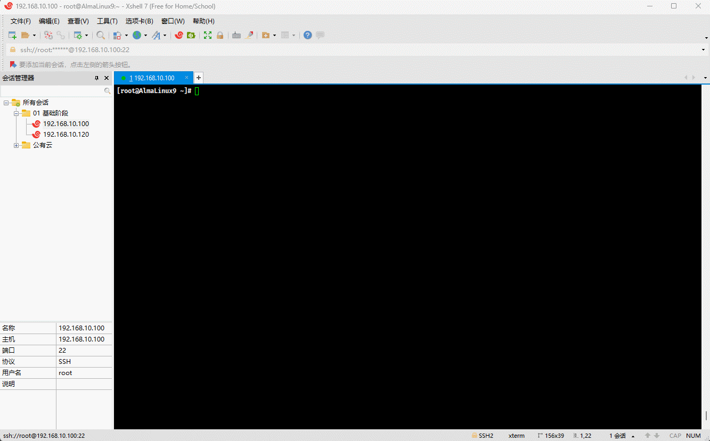


