# 第一章：标准输入输出（标准 IO）

## 1.1 概述

* 程序，通常指的是一系列指令的集合，这些指令是为了完成特定的任务或解决特定的问题而编写的。在计算机科学中，程序是软件的一部分，它包含了计算机执行的一系列操作，这些操作可以是数据处理、信息检索、自动化任务等。程序通常用一种或多种编程语言编写，然后通过编译或解释的方式转换成计算机能够执行的形式。
* 总之，`程序` = `指令` + `数据`；其中，对于程序来说，可以读入数据（input），也可以由程序处理完之后，形成输出数据（output），即：

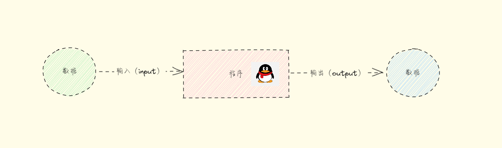

> 注意⚠️：
>
> * ① 在冯·诺依曼体系结构中的 5 大部件中包含了：输入设备和输出设备；
> * ② 输入设备和输出设备在现代操作系统中是由键盘和显示器（终端）来充当的，所以标准输入一般指的是键盘，而标准输出一般指的是显示器（终端）。

* 在 Linux 中，一切皆文件，输入设备和输出设备也是文件；并且，当打开一个文件、目录、管道、套接字、……的时候，系统会为其分配一个`文件描述符（File Descriptor）`，这些描述符在进程的生命周期内保持有效，如：

```shell
tail -f /var/log/secure
```

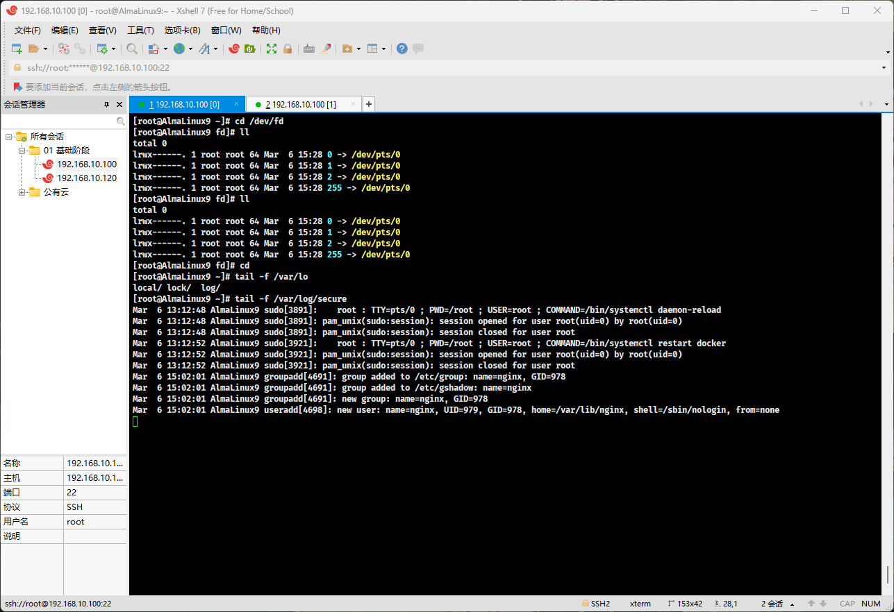

```shell
ll /proc | grep `pidof tail`
```

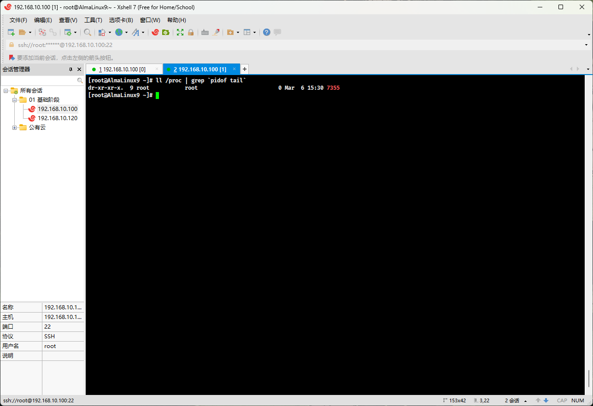

```shell
ll /proc/7355/fd
```

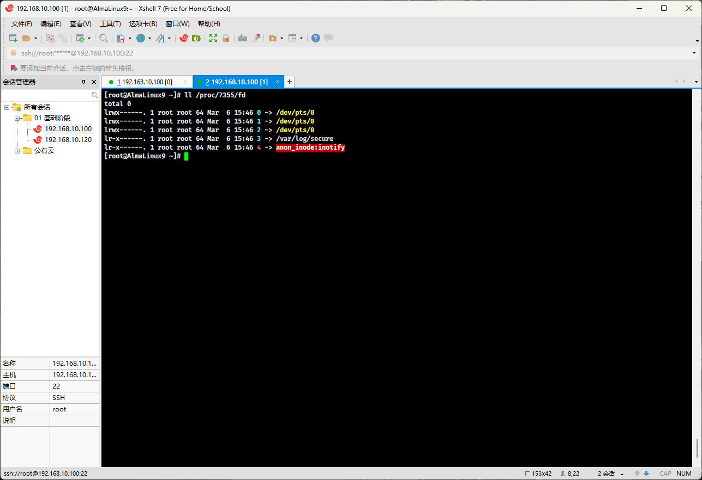

* 我们会发现有 `0`、`1`、`2`、`3`、`4` 等这样的文件描述符；其中，`0` 、`1` 、`2` 是 Linux 中的`标准文件描述符`，即：
  * `0` (stdin)：标准输入文件描述符，通常用于读取输入，默认接收键盘的输入。
  * `1` (stdout)：标准输出文件描述符，通常用于输出数据到终端，默认输出到终端。
  * `2` (stderr)：标准错误文件描述符，用于输出错误信息，默认输出到终端。

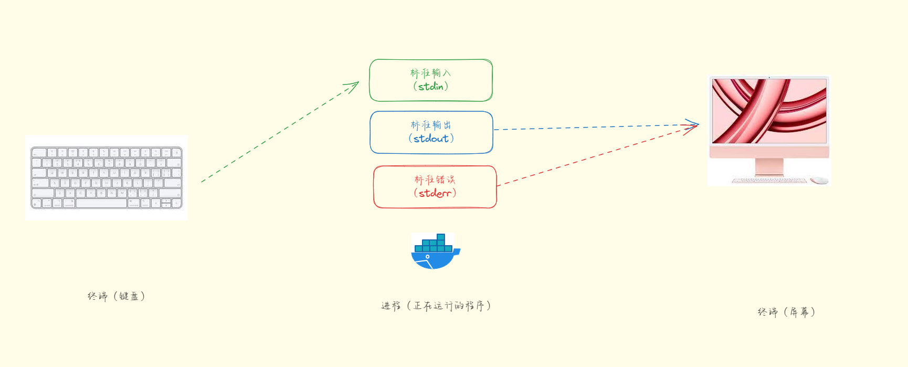

## 1.2 IO 重定向

* 所谓的 IO 重定向就是改变标准输入（stdin）、标准输出（stdout）和标准错误（stderr）的默认流向；在 Linux 中，很多命令都有标准输出，如：

```shell
hostname # 默认显示到终端
```

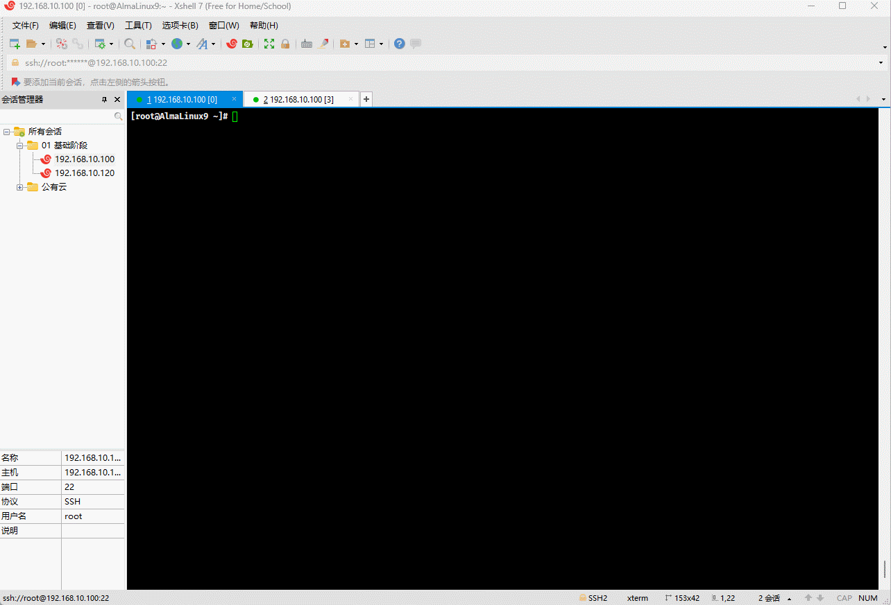

* 也可以输出到其它的终端，如：

```shell
hostname > /dev/pts/1
```


* 甚至，可以输出到文件中，如：

```shell
hostname > hostname.txt
```

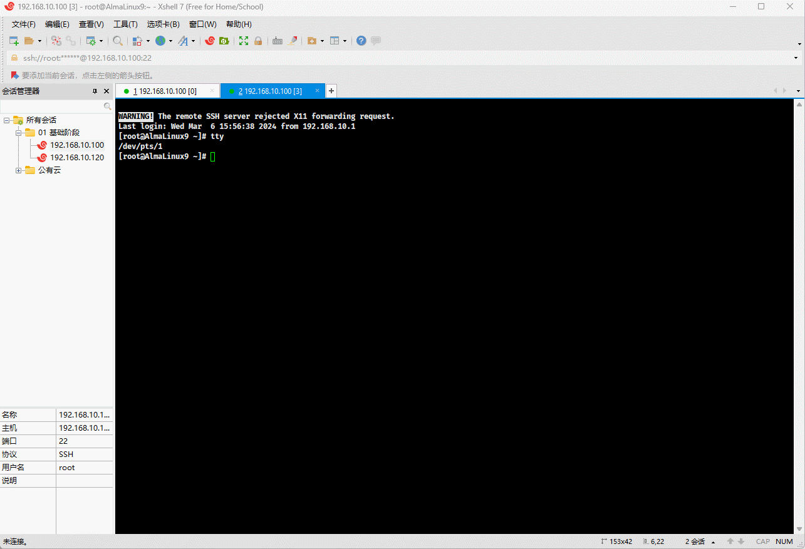

* 其实，在 Linux 中有很多 IO 重定向语法：

```shell
# 将 inputfile 的内容作为 command 的标准输入。
command < inputfile 
```

```shell
# 将 command 的标准输出写入 outputfile
command > outputfile
```

```shell
# 将 command 的标准输出追加到 outputfile
command >> outputfile
```

```shell
# 将 command 的标准错误输出到 errorfile
command 2> errorfile
```

```shell
# 将 command 的标准输出和标准错误都写入 outputfile
command &> outputfile
```

* 需要注意的是，上面的标准输出语法其实是一种简写，即：

```shell
# 将 command 的标准输出写入 outputfile，省略写法
command > outputfile
```

```shell
# 将 command 的标准输出追加到 outputfile，省略写法
command >> outputfile
```

* 和下面的写法是等价的，即：

```shell
# 将 command 的标准输出写入 outputfile
command 1> outputfile
```

```shell
# 将 command 的标准输出追加到 outputfile
command 1>> outputfile
```


* 示例：标准输出重定向到指定的文件（会产生覆盖现象）

```shell
date > abc.log
```

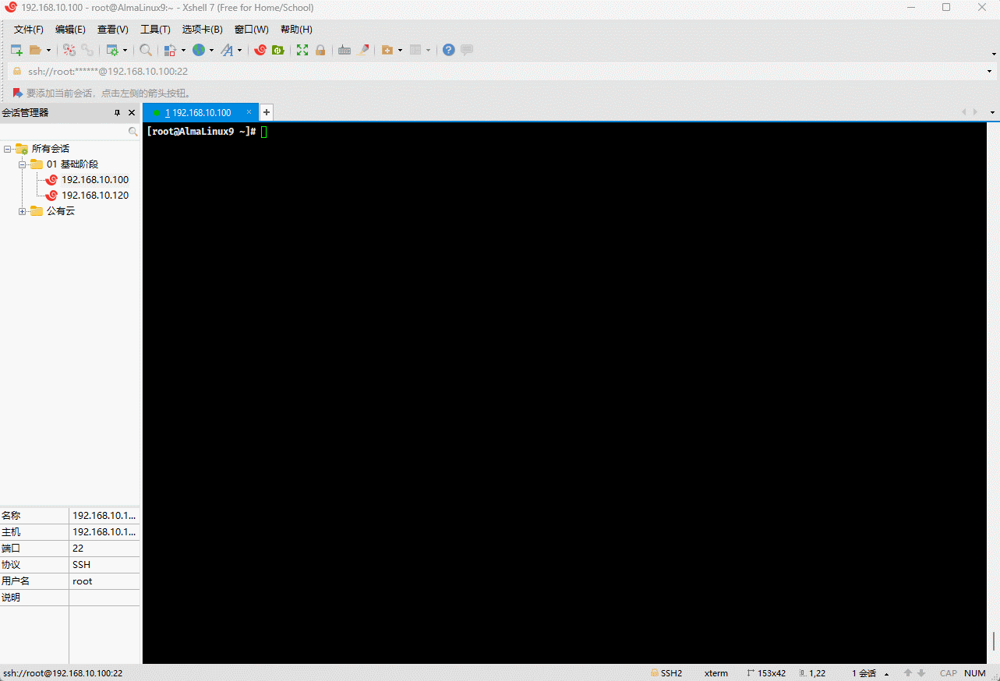


* 示例：标准输出追加重定向到指定文件

```shell
cat /etc/passwd >> abc.log
```


* 示例：标准错误重定向到指定文件（会产生覆盖现象）

```shell
abc 2> abc.log
```

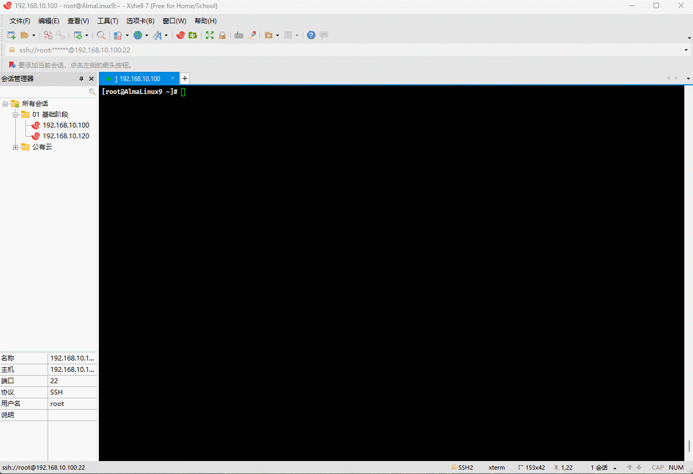


* 示例：标准输出和标准错误追加重定向到指定文件

```shell
cat /etc/passwd &>> abc.log
```

```shell
abc &>> abc.log
```

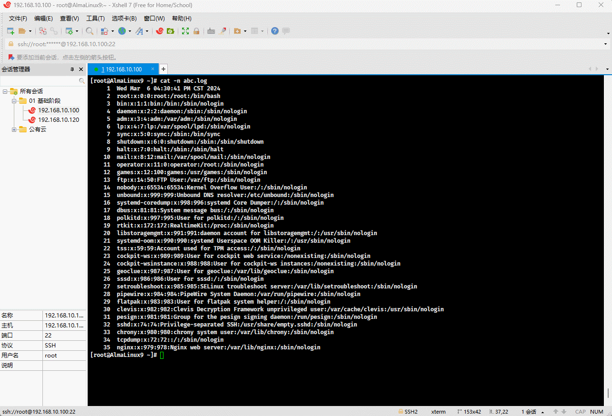


* 示例：标准输出追加重定向到指定文件，标准错误追加重定向到另一个文件

```shell
ll /etc/passwd /etc/xxx >> a.log 2>> b.log
```


* 示例：标准输出和标准错误重定向到指定文件

```shell
ll /etc/passwd /etc/xxx > abc.log 2>&1
```


* 示例：标准输入重定向到文件

```shell
# <<EOF 表示多行重定向，表示从键盘将多行重定向到 stdin ，直到 EOF 位置的所有文本都发送给 stdin ，专业称为就地文本
cat > test.txt <<EOF
1
2
3
4
5
EOF
```

```shell
xargs < test.txt
```

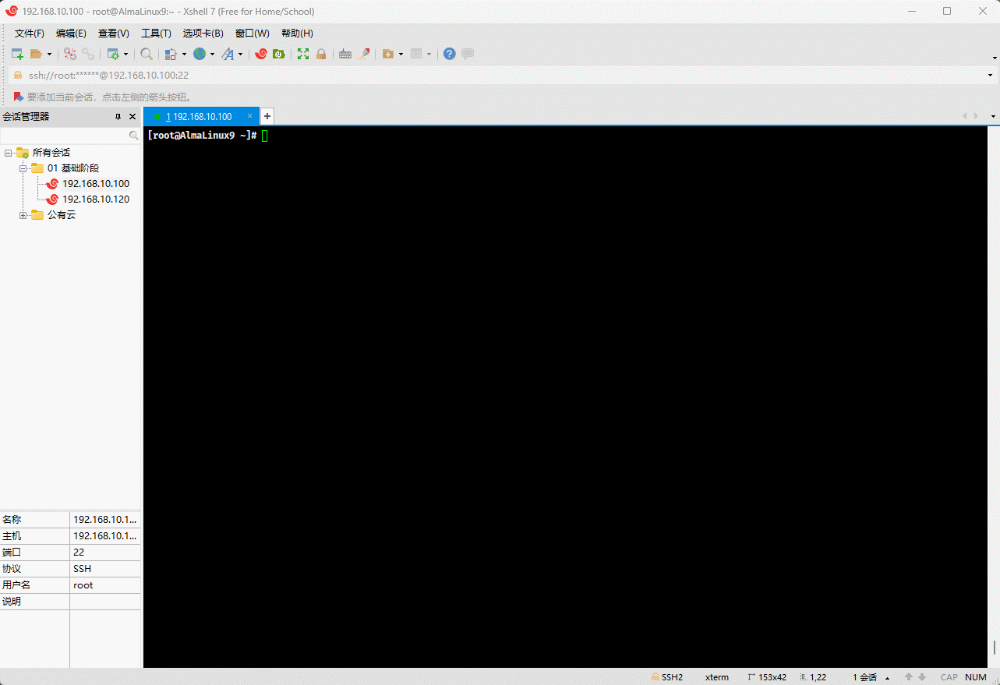


# 第二章：管道

## 2.1 概述

* 管道（`|`）可以用来连接命令，如：

```shell
命令1 | 命令2 | 命令3 | ...
```

* 管道的功能：将 `命令1` 的 `stdout` 发送给 `命令2` 的 `stdin`，将 `命令2` 的 `stdout` 发送给 `命令3` 的 `stdin` 。

> 注意⚠️：
>
> * ① `stderr` 默认是不能通过管道转发的，可以利用 `2>&1` 或 `|&` 实现。
> * ② 最后一个命令会在当前 shell 进程的子 shell 进程中完成。

## 2.2 案例

* 需求：将 seq 产生的数字由列转为行。


* 示例：通过中间文件来实现

```shell
seq 1 10 > abc.log
```

```shell
tr '\n' ' ' < abc.log
```

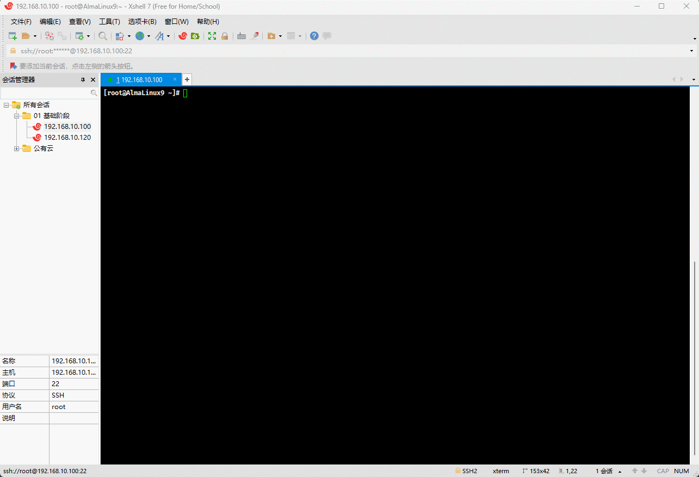


* 示例：通过管道实现

```shell
seq 1 10 | tr '\n' ' '
```


## 2.3 tee

* 命令：

```shell
命令1 | tee [-a] 文件名 | 命令2
```

* 功能：将 `命令1` 的 `stdout`  通过 `tee` 命令的 `-a` 选项写入到文件中，并作为 `命令2` 的 `stdin`。

> 注意⚠️： tee 命令类似于英文中的 T ，表示可以将标准输入流向到两个方向：标准输出（终端）和文件（一个或多个文件）。

* 应用场景：
  * ① 保存不同阶段的输出。
  * ② 复杂管道的故障排除。
  * ③ 同时查看和记录输出。


* 示例：tee 命令的原始功能

```shell
tee
```

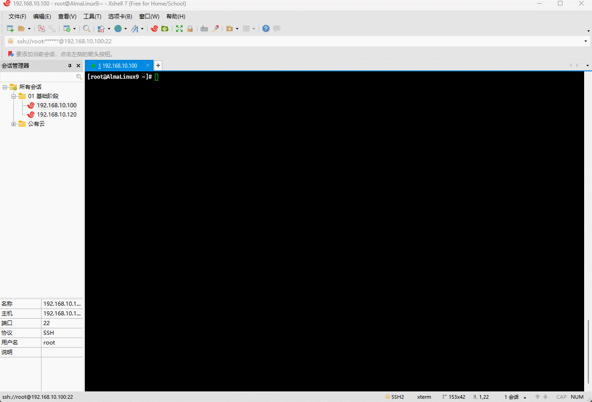


* 示例：

```shell
tee abc.log
```

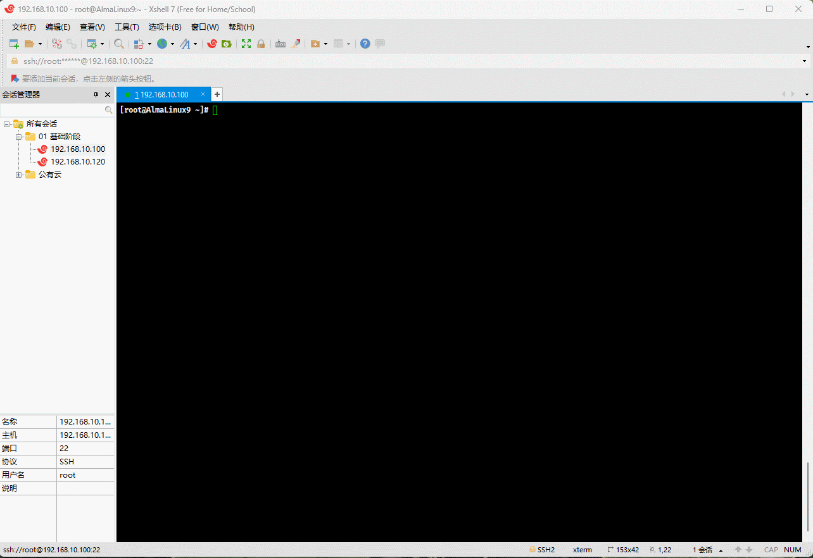


* 示例：

```shell
tee -a abc.log
```


* 示例：

```shell
ping baidu.com | tee output.log
```

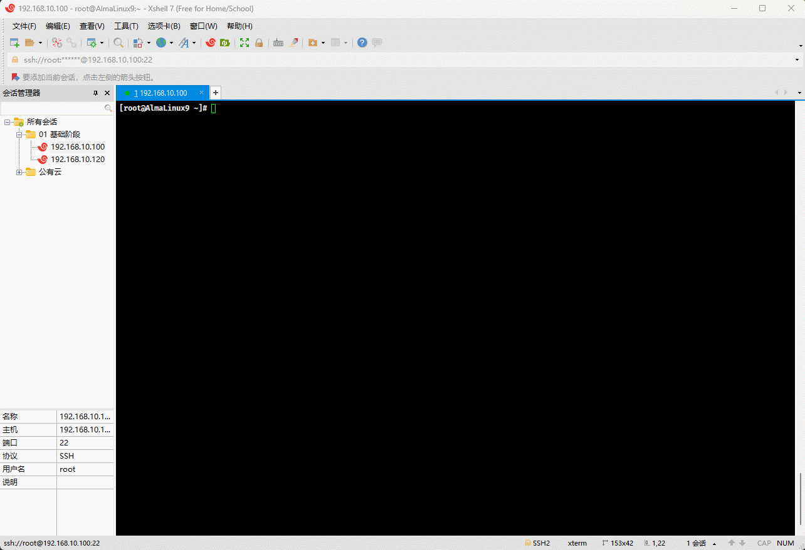


* 示例：

```shell
sudo mkdir -pv /etc/docker
```

```shell
tee /etc/docker/daemon.json <<-'EOF'
{
  "exec-opts": ["native.cgroupdriver=systemd"],	
  "registry-mirrors": [
    "https://du3ia00u.mirror.aliyuncs.com",
    "https://docker.m.daocloud.io",
    "https://hub-mirror.c.163.com",
    "https://mirror.baidubce.com",
    "https://docker.nju.edu.cn",
    "https://docker.mirrors.sjtug.sjtu.edu.cn"
  ],
  "live-restore": true,
  "log-driver":"json-file",
  "log-opts": {"max-size":"500m", "max-file":"3"},
  "max-concurrent-downloads": 10,
  "max-concurrent-uploads": 5,
  "storage-driver": "overlay2"
}
EOF
```

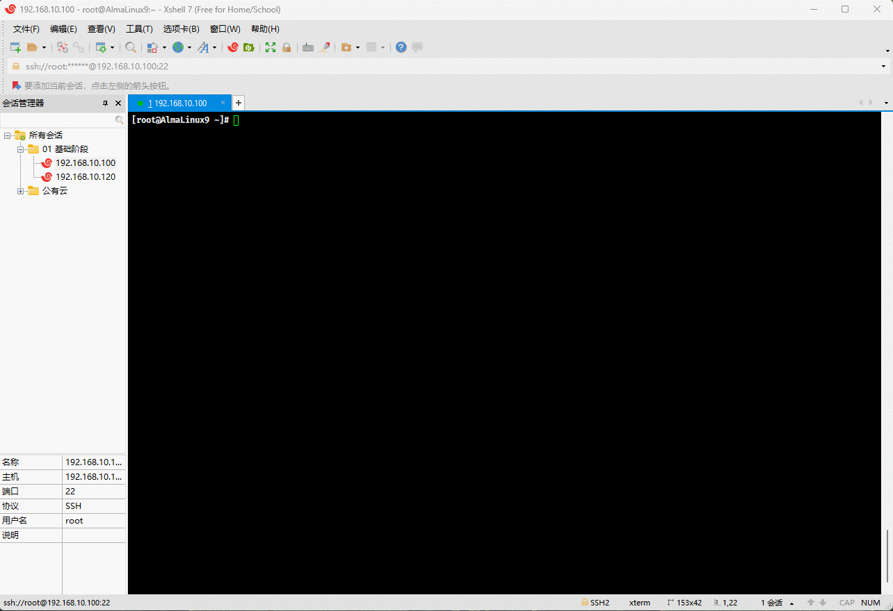

