# 第一章：Linux 权限管理体系概述

## 1.1 回顾 RBAC 模型

* RBAC（Role-Based Access Control，基于角色的访问控制）是一种访问控制模型，它通过定义`角色`来`管理用户`对`系统资源`的`访问权限`。
* 在 RBAC 模型中，用户不是直接被授予权限的，而是被分配到一个或多个角色中，每个角色都包含了一组权限。
* 这样，`用户`可以通过`角色`来`间接`的`获取`对资源的`访问控制`（权限）。
* 这种模型的核心思想是将`权限管理`和`用户身份`分离，使得`权限分配`更加`灵活`和`易于管理`。


> 注意⚠️：
>
> * ① 在 Linux 中，其权限模型就是 RBAC0 权限模型；只不过，在 Linux 中没有角色，而是用户组的概念，含义是一样的。
> * ② 在 Linux 中，默认情况下，创建用户会生成一个`同名`的`用户组`；当然，也可以通过`参数`使其`不生成`同名的用户组。
> * ③ 在 Linux 中，权限就是对`文件`和`目录`的访问控制，并且使用 `rwx`这三种描述符来表示权限。 
> * ④ Linux 使用 `rwx `权限描述符来控制整个 Linux 系统的安全，`用户`和`权限`共同组成 Linux 系统的安全防护体系。

## 1.2 所有者、所属组、其他人

* 在 RBAC 模型中，一个用户（所有者）可以分配多个角色（所属组），一个角色也可以被分配多个用户，`它们之间的关系是多对多的关系`；当然，角色和权限之间也是多对多的关系，即：

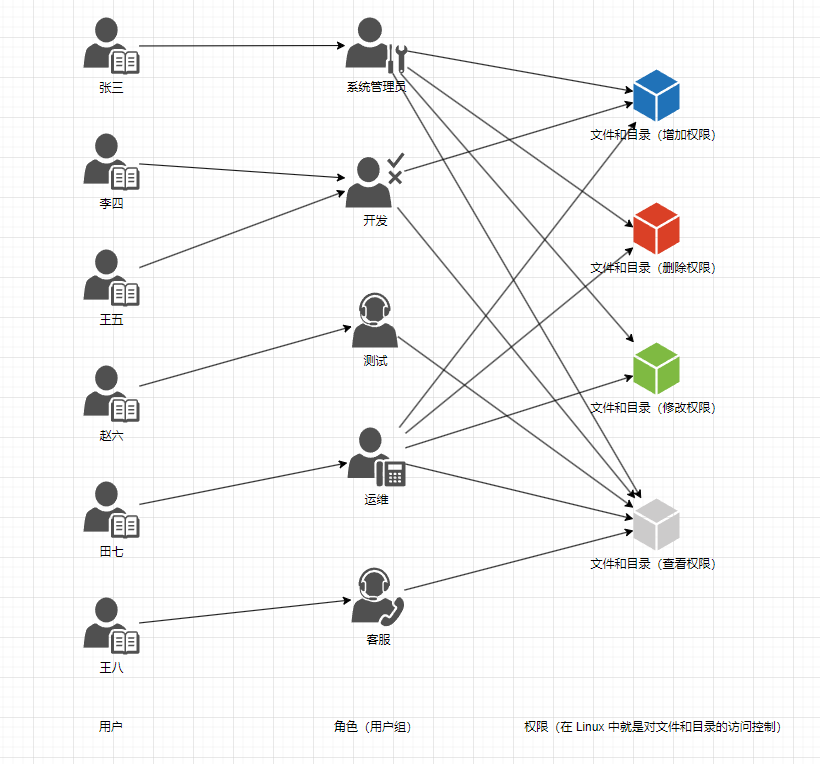

* 对于上图而言，我们可以知道，`李四`和`王五`都属于`开发`（用户组），其他的人是`不`属于`开发`（用户组），即其他人的角色。
* 如果，我们以`李四`为`主要视角（所有者）`，那么`王五`和`李四`就是`同一组（所属组）`，而`张三`、`赵六`、`田七`和`王八`就是`其它人`的角色，即：

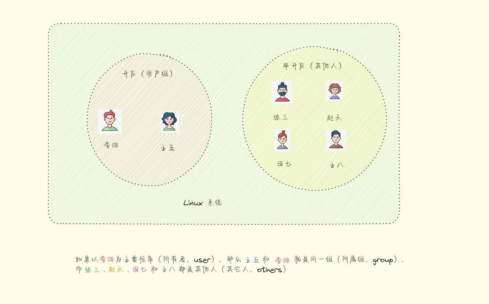

* 在 Linux 中，权限通常分为三种类型，即：
  * **所有者（user）**：文件或目录的所有者拥有的权限。
  * **所属组（group）**：与文件所有者相同用户组的其他用户拥有的权限。
  * **其他人（others）**：不属于文件所有者和用户组的其他所有用户拥有的权限。

* 在 Linux 中，权限通常由 `rwx` 来描述文件或目录的访问权限，即：

| 权限          | 含义     | 备注                                                         |
| ------------- | -------- | ------------------------------------------------------------ |
| `r` (read)    | 读取权限 | 如果一个用户或用户组有对文件的读取权限，他们可以查看文件的内容。 |
| `w` (write)   | 写入权限 | 拥有写入权限的用户或用户组可以修改文件的内容，包括：添加文件内容、删除文件内容、修改文件内容。 |
| `x` (execute) | 执行权限 | 对于文件，执行权限允许用户运行该文件作为程序，一般是命令或脚本。<br>对于目录，执行权限允许用户进入该目录（即访问目录下的文件和子目录）。 |


# 第二章：权限计算和修改权限（⭐）

## 2.1 权限计算

### 2.1.1 概述

* 在 Linux 中，我们可以通过 `ll` 命令快速查看文件和目录的权限，即：

```shell
ll /usr/bin
```


* 截取部分信息，如下所示：

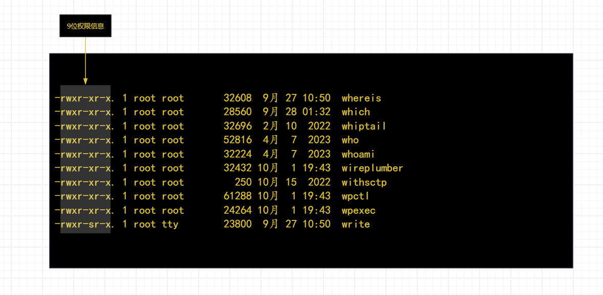

* 所有者（user）、所属组（group）和其他人（others）对应的信息，如下所示：

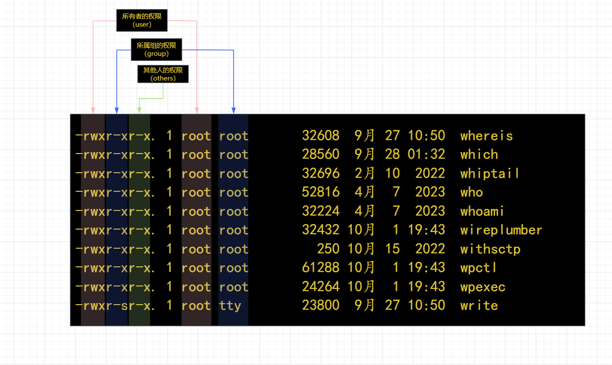

* 为了方便使用权限，于是给每个权限字母设置了一个对应的数字，通过数字来表示权限，即：

| 权限          | 含义                                                       | 权限对应的数字 |
| ------------- | ---------------------------------------------------------- | -------------- |
| `r` (read)    | 是否可读。                                                 | 4              |
| `w` (write)   | 是否可写。                                                 | 2              |
| `x` (execute) | 是否可执行，对于文件而言，通常是命令和脚本（命令的集合）。 | 1              |
| -             | 没有权限                                                   | 0              |

* 其实，我们也可以通过 `stat` 命令，来查看权限对应的数字，即：

```shell
stat /usr/bin/which
```

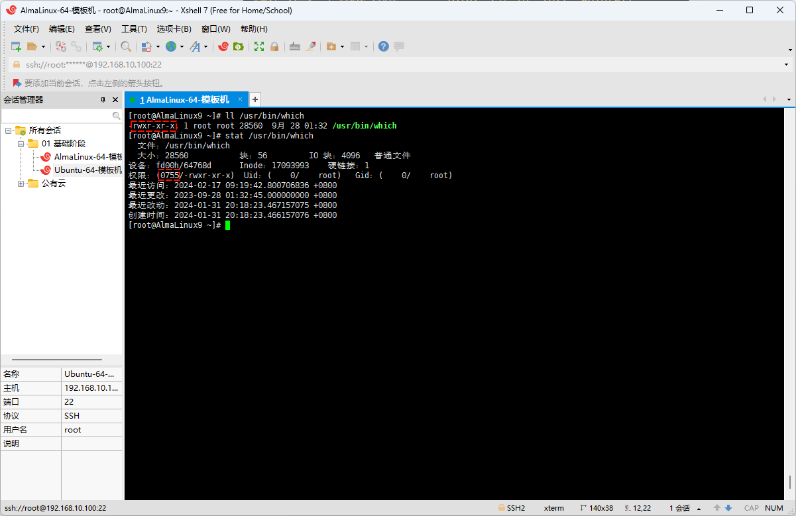

* 计算如下：

```
-   rwx    r-x    r-x
   4+2+1   4+0+1  4+0+1 = 755
```

### 2.1.2 案例

* 示例：字母 → 数字

```
-  rwx   r-x   r-x
   4+2+1 4+0+1 4+0+1 = 755
```


* 示例：字母 → 数字

```
-  r--   r--   r--
   4+0+0 4+0+0 4+0+0 = 444
```


* 示例：字母 → 数字

```
-  r--   rw-   rw-
   4+0+0 4+2+0 4+2+0 = 466
```


* 示例：数字 → 字母

```
644 =  4+2+0 4+0+0 4+0+0 
     - rw-   r--   r--
```


* 示例：数字 → 字母

```
750 =  4+2+1 4+0+1 0+0+0 
     - rwx   r-x   ---
```


* 示例：数字 → 字母

```
700 =  4+2+1 0+0+0 0+0+0 
     - rwx   ---   ---
```


* 示例：数字 → 字母

```
600 =  4+2+0 0+0+0 0+0+0 
     - rw-   ---   ---
```

## 2.2 修改权限

### 2.2.1 概述

* 前文提到：`用户`和`权限`共同组成 Linux 系统的安全防护体系，那么就可以使用 chmod 命令来修改权限，使用 chown 来修改用户或用户组。

* 修改权限的命令：

  ```shell
  chmod [-R] 模式[,模式]... 文件或目录 ...
  ```

  * 选项：
    * `-R`，`--recursive`：递归修改文件和目录，`慎用`！！！

  * 模式：`[ugoa]*([-+=]([rwxXst]*|[ugo]))+|[-+=][0-7]+`

* 修改用户（用户组）的命令：

  ```shell
  chown [-R] [所有者][:所属组] 文件或目录 ...
  ```

  * 选项：
    * `-R`，`--recursive`：递归修改文件和目录，`慎用`！！！

### 2.2.2 准备工作

* 批量创建文件：

```shell
touch /tmp/{01..10}.txt
```


* 创建用户：

```shell
useradd x
```


### 2.2.3 案例

* 示例：将 `/tmp/01.txt` 文件的权限设置为 `755`

```shell
# mode 为数字的形式
chmod 755 /tmp/01.txt
```


* 示例：将 `/tmp/01.txt` 文件的所有者和所属组设置为 `x`

```shell
chown x:x /tmp/01.txt
```


* 示例：将 `/tmp/02.txt` 文件的所有者的权限增加 `x`权限

```shell
# 以字符串的形式；其中，u表示所有者，user；g表示所属组，group；o表示其它人，other；a = u + g + o
# + 表示在原来权限的基础上增加，- 表示在原来权限的基础上减少 = 表示用新的权限覆盖旧的权限
chmod u+x /tmp/02.txt
```


* 示例：给 `/etc/rc.d/rc.local` 文件增加 `x` 权限

```shell
chmod a+x /etc/rc.d/rc.local
```


# 第三章：文件和目录的权限

## 3.1 概述（⭐）

* 文件和目录的权限不同，如下所示：

| 权限          | 文件                                                         | 目录                                                        |
| ------------- | ------------------------------------------------------------ | ----------------------------------------------------------- |
| `r` (read)    | 是否可以查看文件内容。                                       | 是否可以查看目录内容，需要 `x` 权限配合。                   |
| `w` (write)   | 是否可以修改文件内容，包括：添加文件内容、删除文件内容、修改文件内容；一般需要 `r` 权限配合。 | 是否可以在目录中创建、删除、重命名文件，需要 `x` 权限配合。 |
| `x` (execute) | 是否允许用户执行该文件，通常是`命令`或`脚本`；一般需要 `r` 权限配合。 | 是否可以进去到该目录，是否可以访问目录下的文件属性。        |

> 注意⚠️：
>
> * ① 通过 root 修改权限，其它普通用户来测试权限；因为 root 用户具有最高权限，可以无视权限规则。
> * ② 实际工作中，启动程序或脚本等，尽量使用普通用户！！！

## 3.2 测试文件权限

### 3.2.1 准备工作

* root 创建`文件`以及修改权限：

```shell
touch /tmp/demo.sh
```

```shell
echo 'hostname' > /tmp/demo.sh
```

```
chmod 777 /tmp/demo.sh
```

```shell
chown x:x /tmp/demo.sh
```


* root 用户测试读、写、执行权限：

```shell
# 读权限
cat /tmp/demo.sh
```

```shell
# 写权限
echo 'whoami' >> /tmp/demo.sh
```

```shell
# 执行权限，可以使用绝对路径或相对路径；如果是相对路径，需要切换到对应的目录中，使用./demo.sh
/tmp/demo.sh 
```


* x 用户测试读、写、执行权限：

```shell
# 读权限
cat /tmp/demo.sh
```

```shell
# 写权限
echo 'w' >> /tmp/demo.sh
```

```shell
# 执行权限
/tmp/demo.sh 
```


### 3.2.2 测试文件的 r 权限

* `root` 用户修改`文件`的权限为 `r` 权限：

```shell
chmod u=r /tmp/demo.sh
```


* `x` 用户测试`文件`的 `r` 权限：

```shell
cat /tmp/demo.sh
```


* `x` 用户测试`文件`的 `w` 权限：

```shell
# 失败，因为只有 r 权限，没有 w 权限
echo 'ls -lah .' >> /tmp/demo.sh
```


* `x` 用户测试`文件`的 `x` 权限：

```shell
# 失败，因为只有 r 权限，没有 x 权限
./tmp/demo.sh
```


### 3.2.3 测试文件的 w 权限

* `root` 用户修改`文件`的权限为 `w` 权限：

```shell
chmod u=w /tmp/demo.sh
```


* `x` 用户测试`文件`的 `r` 权限：

```shell
# 失败，因为只有 w 权限，没有 r 权限
cat /tmp/demo.sh
```


* `x` 用户测试`文件`的 `w` 权限：

```shell
# 可以，如果通过 vi 是不行的，因为 vi 需要先读取文件；所以，通常 rw 配合使用
echo 'cd .' >> /tmp.demo.sh
```


* `x` 用户测试`文件`的 `x` 权限：

```shell
# 失败，因为只有 w 权限，没有 x 权限
./tmp/demo.sh
```


### 3.2.4 测试文件的 x 权限

* `root` 用户修改`文件`的权限为 `x` 权限：

```shell
chmod u=x /tmp/demo.sh
```


* `x` 用户测试`文件`的 `r` 权限：

```shell
# 失败，因为只有 x 权限，没有 r 权限
cat /tmp/demo.sh
```


* `x` 用户测试`文件`的 `w` 权限：

```shell
# 失败，因为只有 x 权限，没有 w 权限
echo 'cd .' >> /tmp.demo.sh
```


* `x` 用户测试`文件`的 `x` 权限：

```shell
# 失败，因为只有 w 权限，没有 r 权限; SHELL 解释器在执行的时候，需要先读取文件，再执行；所以，通常需要配合 r 使用
./tmp/demo.sh
```


## 3.3 测试目录权限

### 3.3.1 准备工作

* root 创建`目录`以及修改权限：

```shell
mkdir -pv /tmp/demo
```

```shell
touch /tmp/demo/{01..10}.txt
```

```shell
chown -R x:x /tmp/demo
```


### 3.3.2 测试目录的 r 权限

* `root` 用户修改`目录`的权限为 `r` 权限：

```shell
chmod u=r /tmp/demo
```


* `x` 用户测试`目录`的 `r` 权限：

```shell
# 只能查看到文件名，看不到文件属性，需要配合 x 权限
ll /tmp/demo
```


> 注意⚠️：
>
> * ① 目录和文件不同，目录用来对文件分类的，所以 r 权限最能查看目录中文件名称；对于文件的属性等，r 权限就无能为力了。
> * ② 目录的 x 权限表示能够`进入`目录，并且能够`查看`和`修改`目录下`文件`的`属性信息`。
> * ③ 通常，目录的 r 权限要配合 x 权限一起使用。

* `x` 用户测试`目录`的 `w` 权限：

```shell
# 失败，没有 x 权限
touch /tmp/demo/11.txt
```

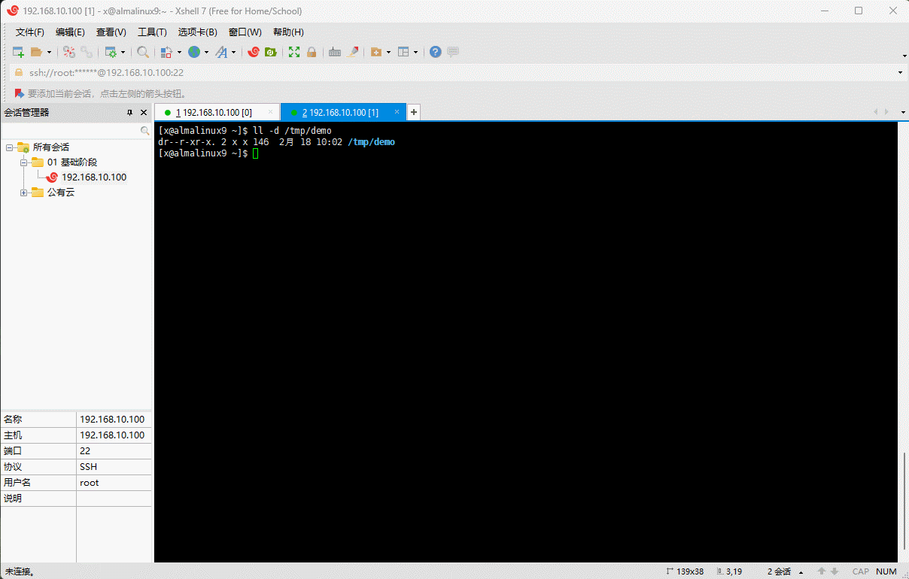

* `x` 用户测试`目录`的 `x` 权限：

```shell
# 失败，没有 x 权限
cd /tmp/demo
```


### 3.3.3 测试目录的 w 权限

* `root` 用户修改`目录`的权限为 `w` 权限：

```shell
chmod u=w /tmp/demo
```


* `x` 用户测试`目录`的 `r` 权限：

```shell
# 失败，没有 r 和 x 权限
ll /tmp/demo
```


* `x` 用户测试`目录`的 `w` 权限：

```shell
# 失败，没有 x 权限；很好理解，连目录都不能进入，怎么向目录中创建文件？
touch /tmp/demo/11.txt
```

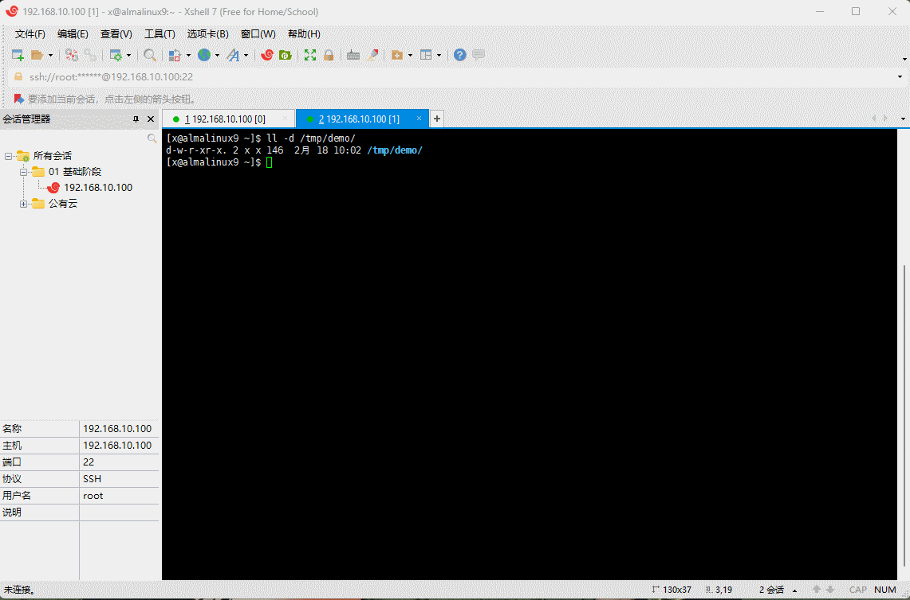

* `x` 用户测试`目录`的 `x` 权限：

```shell
# 失败，没有 x 权限
cd /tmp/demo
```


### 3.3.4 测试目录的 x 权限

* `root` 用户修改`目录`的权限为 `x` 权限：

```shell
chmod u=x /tmp/demo
```

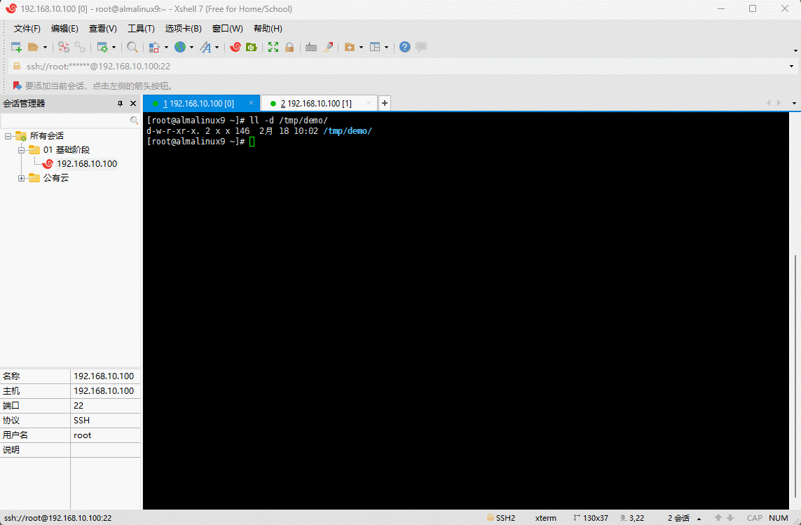

* `x` 用户测试`目录`的 `r` 权限：

```shell
# 失败，没有 r 
ll /tmp/demo
```


* `x` 用户测试`目录`的 `w` 权限：

```shell
# 失败，没有 w 权限
touch /tmp/demo/11.txt
```


* `x` 用户测试`目录`的 `x` 权限：

```shell
cd /tmp/demo
```


## 3.4 总结（⭐）

* 文件和目录的权限不同，如下所示：

| 权限          | 文件                                                         | 目录                                                         |
| ------------- | ------------------------------------------------------------ | ------------------------------------------------------------ |
| `r` (read)    | 是否可以查看文件内容。                                       | 是否可以查看目录内容，需要 `x` 权限配合，即 `rx`。           |
| `w` (write)   | 是否可以修改文件内容，包括：添加文件内容、删除文件内容、修改文件内容；一般需要 `r` 权限配合，即 `rw`。 | 是否可以在目录中创建、删除、重命名文件，需要 `x` 权限配合，即 `rwx`。 |
| `x` (execute) | 是否允许用户执行该文件，通常是`命令`或`脚本`；一般需要 `r` 权限配合，即 `rx` 或 `rwx`。 | 是否可以进去到该目录，是否可以访问目录下的文件属性，即 `rx` 或 `rwx`。 |

> 注意⚠️：
>
> * ① 在实际工作中，我们通常会授予`脚本文件`权限，一般会授权 `rx` 或 `rwx` 权限。
> * ② 在实际工作中，对于`目录`，我们通常会收取 `rx` 或 `rwx` 的权限。


# 第四章：系统的默认权限和特殊权限

## 6.1 系统的默认权限

* 在 Linux 系统中，文件和目录是有权限的，即：

```shell
# 创建目录
mkdir demo
# 查看目录
ll 
# 查看目录的属性
stat demo
```

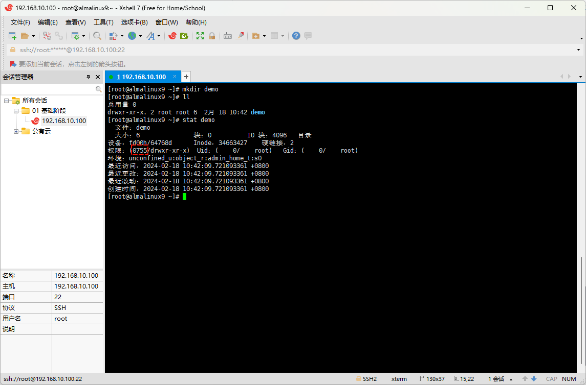

```shell
# 创建文件
touch demo.txt
# 查看文件
ll
# 查看文件的属性
stat demo.txt
```

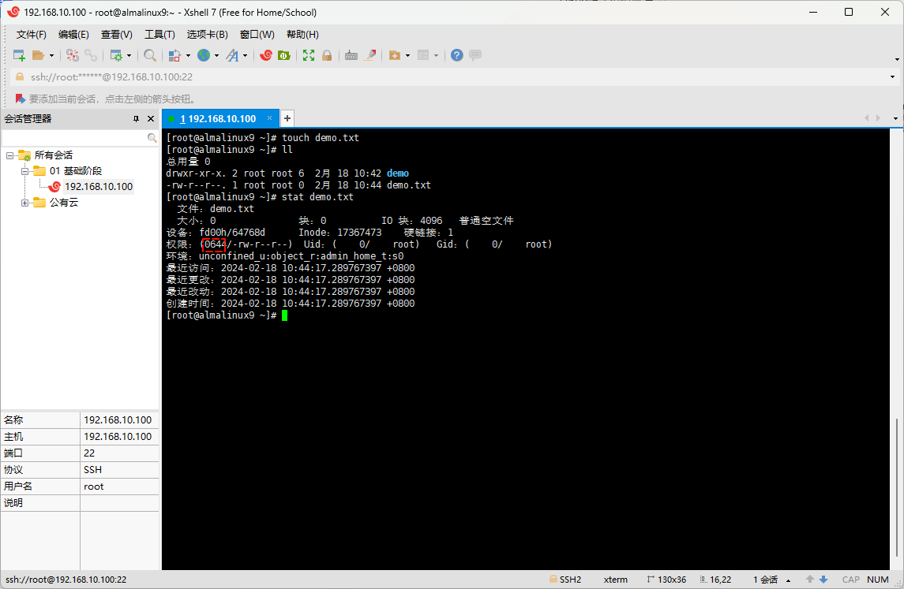

> 注意⚠️：从上图中，我们可以得知，文件的默认权限是 644 ，而目录的默认权限是 755 ，怎么计算的？

* 在 Linux 中，文件和目录的默认权限是通过 umask 设置来决定了，即：

```shell
umask
```

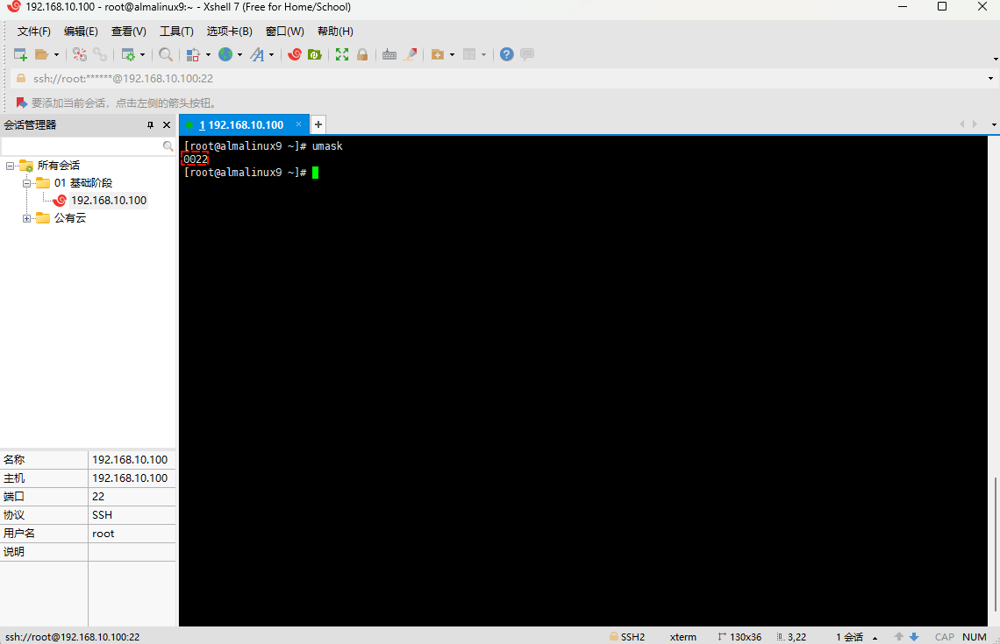

> 注意⚠️：从上图中，我们可以得知，umask 是 22 ，和文件的默认权限是 644 ，而目录的默认权限是 755 ，没有任何关系，到底怎么计算的？

* 其实，在 Linux 中，文件的最大权限是 666 ，即 `-rw-rw-rw-`（默认创建的文件是没有执行权限的）；而目录最大的权限是 777，即 `drwxrwxrwx`；umask 的计算公式如下：

```shell
# 如果 umask 的结果是奇数，则在结果上+1，即 umask = 033 ，就是 666 - (033 + 1)
文件 或 目录的最大权限 - umask 
```

* 那么，文件和目录的权限就是这么计算的：

```
文件：  666
umask： 22
----------
结果：  644 
```

```
目录：  777
umask： 22
----------
结果：  755
```

> 注意⚠️：
>
> * ① 在实际工作的时候，推荐网站的权限配置是：`文件 644 root root`，`目录 755 root root` 。
> * ② 网站在运行的时候，不推荐使用 root ，而是自己创建虚拟用户或软件自动帮助我们创建虚拟用户。

## 4.2 特殊权限

* 之前，我们在使用 `ll` 查看权限时候：

```shell
ll /usr/bin
```

* 结果如下：

```shell
-rwxr-xr-x. 1 root root       28560  9月 28 01:32  which
-rwxr-xr-x. 1 root root       32696  2月 10  2022  whiptail
-rwxr-xr-x. 1 root root       52816  4月  7  2023  who
-rwxr-xr-x. 1 root root       32224  4月  7  2023  whoami
-rwxr-xr-x. 1 root root       32432 10月  1 19:43  wireplumber
-rwxr-xr-x. 1 root root         250 10月 15  2022  withsctp
-rwxr-xr-x. 1 root root       61288 10月  1 19:43  wpctl
-rwxr-xr-x. 1 root root       24264 10月  1 19:43  wpexec
-rwxr-sr-x. 1 root tty        23800  9月 27 10:50  write
```

* 会发现权限除了 `rwx`外，还有 s 等，这些其实就是特殊权限；并且当我们使用 stat 查看文件或目录的属性的时候：

```shell 
stat /usr/bin/which
```

* 结果如下：

```
  文件：/usr/bin/which
  大小：28560     	块：56         IO 块：4096   普通文件
设备：fd00h/64768d	Inode：17087621    硬链接：1
权限：(0755/-rwxr-xr-x)  Uid：(    0/    root)   Gid：(    0/    root)
环境：system_u:object_r:bin_t:s0
最近访问：2024-02-18 08:25:27.740628828 +0800
最近更改：2023-09-28 01:32:45.000000000 +0800
最近改动：2024-01-19 13:22:42.874728285 +0800
创建时间：2024-01-19 13:22:42.874728285 +0800
```

* 会发现权限是`四`位，即 `0755`，不是通常所见的三位；其实，`第一位`就是`特殊权限`。特殊权限有如下的三种：

| 特殊权限          | 解释                                                         | 备注           |
| ----------------- | ------------------------------------------------------------ | -------------- |
| set uid ，即 suid | 运行这个命令的时候，就相当于这个命令的`所有者`权限，用数字 4 表示。 | passwd         |
| sticky，即 t      | 对于包含 sticky 权限的目录，每个用户都可以在目录下创建内容，但是每个用户只能管理自己的文件，用数字 1 表示。 | /tmp           |
| set gid ，即 gid  | 运行这个命令的时候，就相当于这个命令的用户组权限，用数字 2 表示。 | /bin/ssh-agent |

* 查看特殊权限：

```shell
ll -d /bin/passwd /tmp /bin/ssh-agent
```

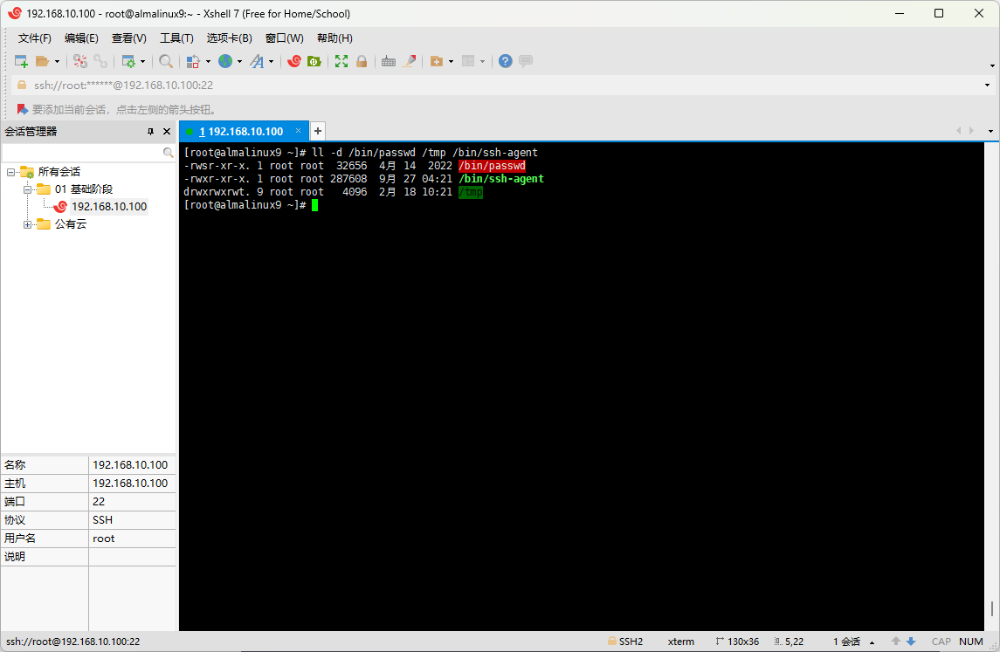

* 设置特殊权限：

```shell
# 字符写法
chmod u+s /bin/rm
chmod o+t /tmp
```

```shell
# 数字写法
chmod 4755 /bin/rm
chmod 1777 /tmp
```

> 注意⚠️：了解即可，实际工作的时候，不需要手动设置。


# 第五章：特殊属性（⭐）

## 5.1 概述

* 某些时候，为了防止病毒修改某些文件或命令，我们可以使用 `chattr` 增强系统的安全性，防止未授权的修改或删除。
* 修改文件或命令的特殊属性：

```shell
chattr [+a|i] 文件或命令 ...
```

* 对应的英文：change attribute。
* 选项：
  * `+` 表示增加特殊属性，`-`表示删除特殊属性。
  * a 是 append 的缩写，表示只能追加。
  * i 是 immutable 的缩写，表示不朽的、无法被毁灭的，即不能被删除。

* 查看文件或命令的特殊属性：

```shell
lsattr 文件或命令
```

> 注意⚠️：目前了解即可，后面再详细讲解！！！

## 5.2 案例

* 示例：

```shell
touch /tmp/log.txt
```

```shell
chattr +a /tmp/log.txt
```

```shell
lsattr /tmp/log.txt
```


* 示例：

```shell
touch /tmp/log.txt
```

```shell
chattr +i /tmp/log.txt
```

```shell
lsattr /tmp/log.txt
```


