# 第一章：安装 oh-my-zsh（可选）

## 1.1 概述

* Zsh（Z Shell）是一个功能强大的命令行解释器，它是对 Bash 的一个扩展，提供了许多增强的功能，如：更智能的命令行补全、强大的脚本功能、主题和插件支持等。Zsh 的设计目标是提供一种更友好、更高效的命令行体验，同时保持与 Bash 的兼容性。
* Oh My Zsh 是一个开源的、社区驱动的框架，用于管理 Zsh 配置。它提供了一个易于使用的界面来安装和管理 Zsh 的配置、插件和主题。Oh My Zsh 使得定制和扩展 Zsh 的功能变得更加简单，它包含了大量的预定义主题和插件，可以帮助用户快速搭建一个个性化的命令行环境。

## 1.2 安装

### 1.2.1 安装和配置 zsh

* 确认系统中是否安装有 zsh ：

```shell
zsh --version
```


* 如果发现没有安装，则需要手动安装：

```shell
dnf -y install zsh
```

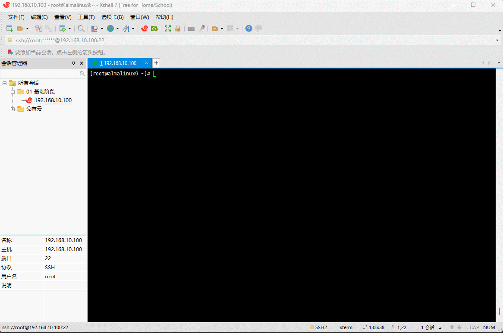

* 查看默认的 shell 解释器：

```shell
echo $SHELL
```

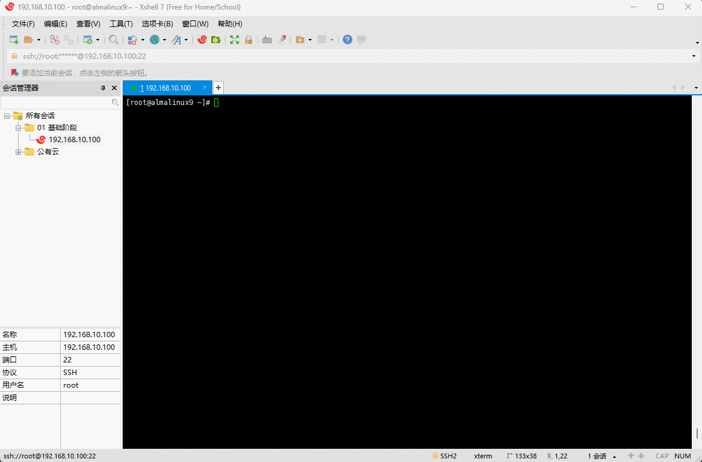

* 使用 `chsh` 命令更改默认的 shell 解释器为 zsh ：

```shell
chsh -s $(which zsh)
```


* 退出并重新登录，查看是否设置成功：

```shell
# ctrl + D
exit
```

```shell
echo $SHELL
```


### 1.2.2 安装 oh-my-zsh

#### 1.2.2.1 自动化安装

* 可以使用官方提供的自动化脚本进行安装：

```shell
sh -c "$(curl -fsSL https://raw.githubusercontent.com/ohmyzsh/ohmyzsh/master/tools/install.sh)"
```

> 注意⚠️：
>
> * ① 可能会出现安装失败；此时，就需要魔法来解决！！！
> * ② 将 `https://raw.githubusercontent.com/ohmyzsh/ohmyzsh/master/tools/install.sh` 替换为 `https://install.ohmyz.sh`，因为某些国家会污染 `raw.githubusercontent.com`。


#### 1.2.2.2 手动安装

* 安装 git ：

```shell
dnf -y install git
```


* 下载源码：

```shell
git clone https://github.com/ohmyzsh/ohmyzsh.git  --depth=1 ~/.oh-my-zsh
```


* 备份现有的配置文件（可选）：

```shell
cp ~/.zshrc ~/.zshrc.back
```

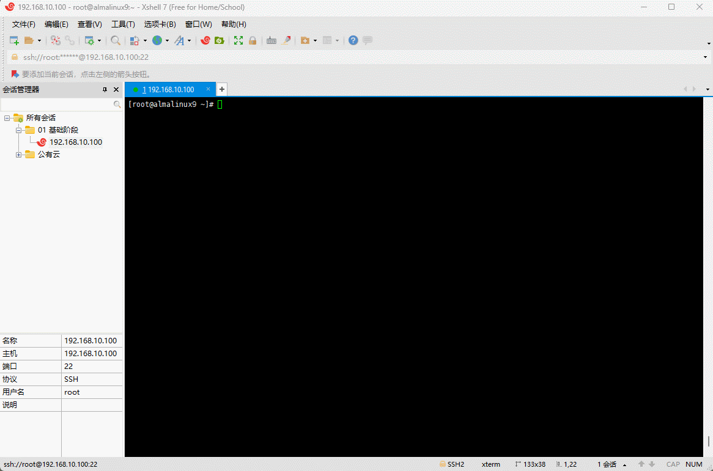

* 创建 zsh 的配置文件：

```shell
cp ~/.oh-my-zsh/templates/zshrc.zsh-template ~/.zshrc
```

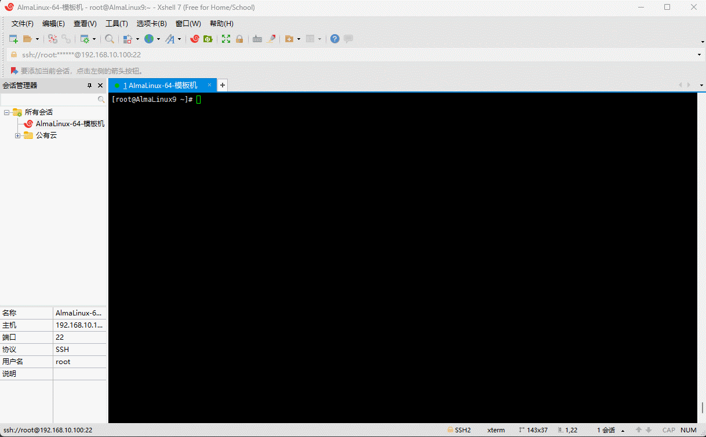

* 加载配置文件：

```shell
source ~/.zshrc
```


### 1.2.3 配置主题

* Oh My Zsh 内置了很多主题，可以通过如下的命令查看：

```shell
ls ~/.oh-my-zsh/themes
```


* 通过 vim 编辑 `~/.zshrc` 配置文件，修改内置主题：

```shell
vim ~/.zshrc
```

```
# 其余略
ZSH_THEME="agnoster" # 修改，原来是 robbyrussell
# 其余略
```


* 加载 `~/.zshrc` 配置文件：

```shell
source ~/.zshrc
```


### 1.2.4 安装插件

#### 1.2.4.1 概述

* oh-my-zsh 内置了很多插件，可以在 `~/.oh-my-zsh/plugins`中查看，如：

```shell
ls ~/.oh-my-zsh/plugins
```

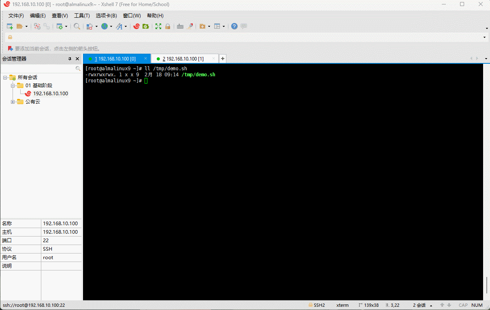

* 但是，有的时候，还需要一些第三方插件，可以在[这里](https://github.com/unixorn/awesome-zsh-plugins)查看。

#### 1.2.4.2 安装 zsh-completions（额外补全）

* 下载并安装：

```shell
git clone https://github.com/zsh-users/zsh-completions --depth=1 ${ZSH_CUSTOM:-${ZSH:-~/.oh-my-zsh}/custom}/plugins/zsh-completions
```

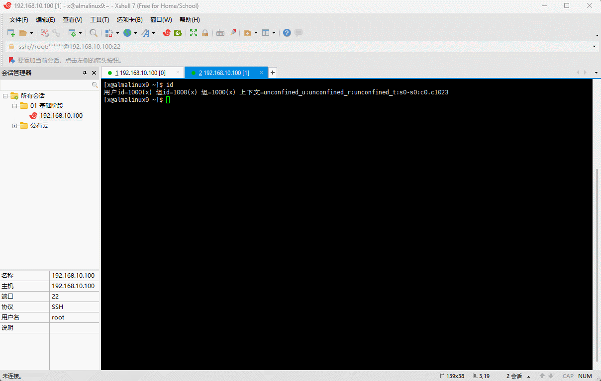

* 添加到指定目录：

```shell
fpath+=${ZSH_CUSTOM:-${ZSH:-~/.oh-my-zsh}/custom}/plugins/zsh-completions/src
```


* 加载配置：

```shell
source "$ZSH/oh-my-zsh.sh"
```

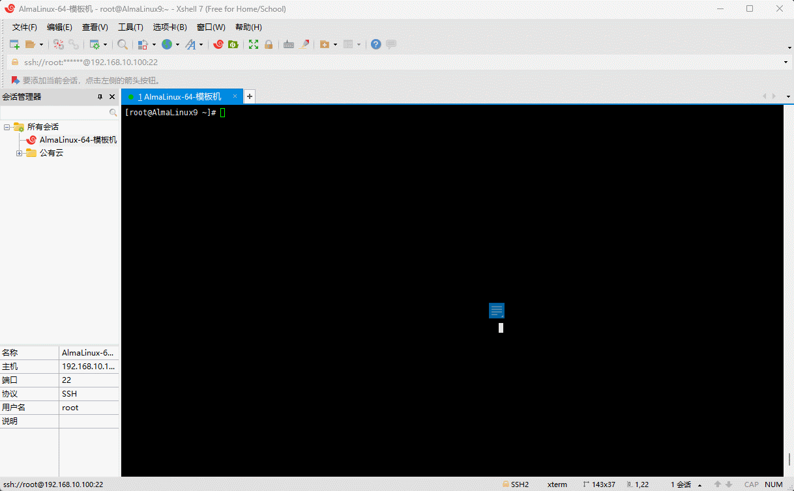

#### 1.2.4.3 安装 zsh-autosuggestions（命令提示）

* 下载并安装：

```shell
git clone https://github.com/zsh-users/zsh-autosuggestions ${ZSH_CUSTOM:-~/.oh-my-zsh/custom}/plugins/zsh-autosuggestions
```

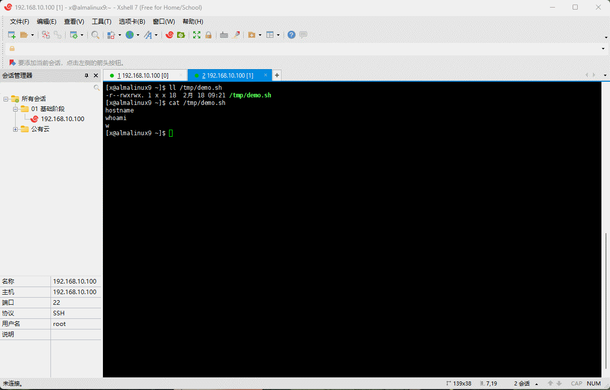

* 通过 vim 编辑 `~/.zshrc` 配置文件，添加该插件：

```shell
vim ~/.zshrc
```

```{5}
# 其余略
plugins=(
    git
    # other plugins...
    zsh-autosuggestions
)
# 其余略
```


* 加载 `~/.zshrc` 配置文件：

```shell
source ~/.zshrc
```


> 注意⚠️：通过 `→` 来补全。

#### 1.2.4.4 安装 zsh-syntax-highlighting（语法高亮）

* 下载并安装：

```shell
git clone https://github.com/zsh-users/zsh-syntax-highlighting.git ${ZSH_CUSTOM:-~/.oh-my-zsh/custom}/plugins/zsh-syntax-highlighting
```

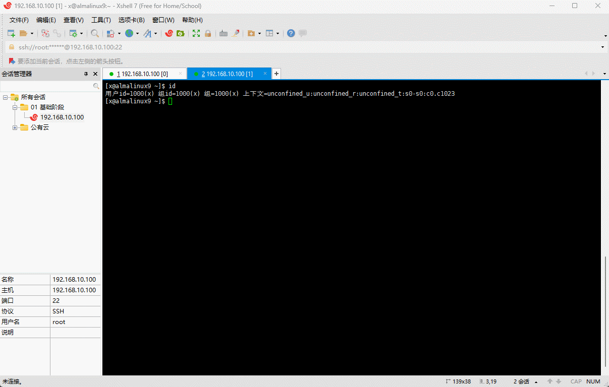

* 通过 vim 编辑 `~/.zshrc` 配置文件，添加该插件：

```shell
vim ~/.zshrc
```

```{6}
# 其余略
plugins=(
    git
    # other plugins...
    zsh-autosuggestions
    zsh-syntax-highlighting
)
# 其余略
```


* 加载 `~/.zshrc` 配置文件：

```shell
source ~/.zshrc
```


### 1.2.5 解决问题

#### 1.2.5.1 问题引出

* 当我们在使用 `tab` 进行命令补全的时候，可能会出现下面的情况（出现重复字符）：


#### 1.2.5.2 问题解决

* ① 安装语言包：

```shell
# 安装字体
dnf -y install powerline-fonts 
# 安装语言包
dnf -y install glibc-langpack-en
```


* ② 查看系统 locale ：

```shell
localectl list-locales
```


* ③ 设置编码：

```shell
# 修改编码
echo 'export LC_CTYPE=en_US.UTF-8' >> ~/.zshrc
```

```shell
# 重新加载配置文件
source ~/.zshrc
```


* ④ 修改主题配置：

```shell
# 修改主题
sed -i 's/⚡/%/' ~/.oh-my-zsh/themes/agnoster.zsh-theme
```

```shell
# 重新加载配置文件
source ~/.zshrc
```


# 第二章：RBAC 模型

## 2.1 概述

* RBAC（Role-Based Access Control，基于角色的访问控制）是一种访问控制模型，它通过定义`角色`来`管理用户`对`系统资源`的`访问权限`。
* 在 RBAC 模型中，用户不是直接被授予权限的，而是被分配到一个或多个角色中，每个角色都包含了一组权限。
* 这样，`用户`可以通过`角色`来`间接`的`获取`对资源的`访问控制`（权限）。
* 这种模型的核心思想是将`权限管理`和`用户身份`分离，使得`权限分配`更加`灵活`和`易于管理`。

> 注意⚠️：
>
> * ① RBAC模型的应用场景非常广泛，包括但不限于：
>
>   * 企业资源规划（ERP）系统：在大型企业中，员工可能需要访问不同的业务模块，RBAC 可以确保他们只能访问其职责范围内的数据。
>   * 医疗信息系统：医生、护士、行政人员等不同角色需要访问不同级别的患者信息。
>   * 金融服务：银行和金融机构使用RBAC来控制员工对敏感金融数据的访问。
>   * ……
>   
> * ② Kubernetes（云原生的事实标准）也是基于 RBAC 模型开发的。

## 2.2 RBAC 

* 最简单的 RBAC 模型是 RBAC0，包含了`用户`、`角色`和`权限`之间的关系（多对多的关系），即：


> 注意⚠️：
>
> * ① 用户、角色、权限都是`多对多`的关系，是最通用的权限管理模型，节省了很大的权限维护成本，对于 Linux 而言是足够的；所以，目前为止，Linux 的权限模型就是 RBAC0 模型。
> * ② 其实，在 RBAC 模型出现之前，还有 ACL 模型，即：用户和权限的多对多关系；但是随着用户数量的增长，这种模型的弊端就凸显出来了，每一个用户都需要去分配权限，非常的浪费管理员的时间和精力，并且用户和权限杂乱的对应关系会给后期带来巨大的维护成本。
> * ③ RBAC96 模型族确实是由 George Mason 大学的 Ravi Sandhu 教授在 1996 年提出的，这个模型族对基于角色的访问控制（RBAC）进行了系统的分类和扩展。RBAC96 模型族包括四个主要模型：RBAC0、RBAC1、RBAC2 和 RBAC3，它们各自代表了 RBAC 的不同层次和复杂度。


# 第三章：用户管理概述

## 2.1 概述

* 在各种操作系统中都有`用户`的概念，如：win 中的超级管理员（administrator）和普通用户；当然，Linux 中也有各种类型的用户。
* 很多时候，我们在进行系统管理的时候，会使用到 root 用户；但是，为了系统的安全，还是推荐使用普通用户。

> 注意⚠️：
>
> * ① Linux 中有各种各样的用户，每个用户都有自己的作用，如：root 用户（最高权限的用户）、普通用户、虚拟用户（一些服务的创建、启动、停止，需要此类用户）。
> * ② Linux 是一个多用户、多任务的操作系统，这意味着它可以同时支持多个用户登录并执行任务。在 Linux 系统中，每个用户都有自己的用户账户，可以拥有不同的权限和资源访问级别。
> * ③ Linux 中系统管理员可以为不同的用户分配不同的权限，以确保系统的安全性和资源的有效管理。这种多用户环境使得 Linux 成为服务器和工作站的理想选择，因为它能够高效地处理并发任务和用户需求。

## 2.2 UID 和 GID

* 在生活中，如何精确标识一个人？答案是通过`身份证`，或者身份证上的号码（`身份证号`），即：


* 其实，对于中国来说，还有户籍制度，它是中国特有的一种户籍管理方式，记录了公民的个人信息，包括：姓名、性别、出生日期、民族、婚姻状况、家庭关系以及居住地址等，对应的载体就是`户口本`，而且`户口本`上也有唯一的`号码`的（`户号`），即：

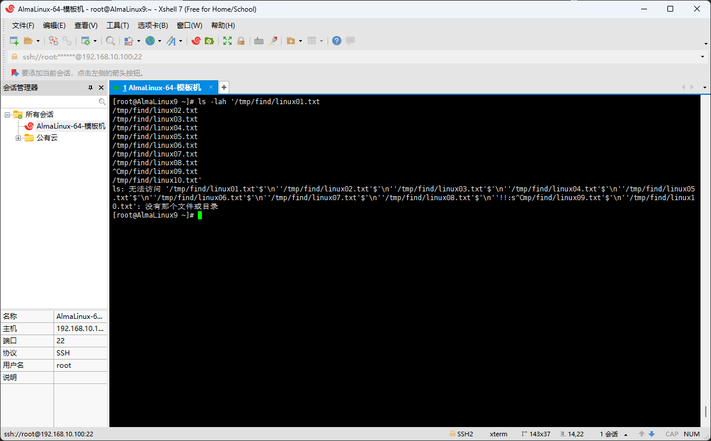

* 对于 Linux 而言，Linux 通过 `UID` （User ID）来`标识`一个`用户`，通过 `GID`（Group ID）来标识一个`用户组`，即：

| 类别              | 说明           | 备注                           |
| ----------------- | -------------- | ------------------------------ |
| `UID` （User ID   | 用户的 ID 号   | 类似于身份证号码，即：身份证号 |
| `GID`（Group ID） | 用户组的 ID 号 | 类似于户口本上的号码，即：户号 |

* 通过如下的命令，查询当前登录用户的 UID 和 GID ，即：

```shell
id
```


## 2.3 用户分类

* 可以根据 `uid` 来对用户进行分类：

| 用户分类             | 分类方法（uid）                                              |
| -------------------- | ------------------------------------------------------------ |
| root                 | uid 是 0 。                                                  |
| 普通用户             | uid >= 1000，手动创建，无法对系统进行更改，只能对家目录进行操作。 |
| 虚拟用户（系统用户） | uid < 1000 ，用于服务、进程运行使用，如：mysqld 服务、sshd 服务。 |

> 注意⚠️：
>
> * ① 在 Linux 中，对用户分类的方法`并不仅仅`通过 uid 这种分类方法，也可以通过其它`分类方法`来进行分类。
> * ② 用户的 id ，即 uid 在 [0,65535] 之间，不要超过此范围，可以通过查看 `/etc/login.defs` 文件来了解。

## 2.4 用户相关的文件（⭐）

* Linux 中每创建一个用户，通常都会影响下面的文件：

| 用户相关文件       | 说明                                                 |
| ------------------ | ---------------------------------------------------- |
| `/etc/passwd`（⭐） | 存放用户信息。                                       |
| /etc/shadow        | 存放密码信息。                                       |
| /etc/group         | 存放用户组信息。                                     |
| /etc/gshaow        | 存放用户组密码信息；但是，通常不会给用户组设置密码。 |

> 注意⚠️：
>
> * ① `/etc/passwd` 文件的名称来源于 Unix 和类 Unix 系统的早期历史，最初是存储用户信息和密码信息的；但是，随着时间的推移，为了限制对密码信息的访问，将密码信息移动到了 `/etc/shadow`文件，并且只能管理员（root）才能访问；当然，`/etc/passwd` 文件依然保留下来，只存储用户的基本信息，如：用户名、UID 等。
> * ② shadow 在英文中是`阴影`，`影子`的意思；在 Linux 中，用来表示只能由 root 才能访问。

* 查询 `/etc/passwd` 文件（⭐）：

```shell
cat /etc/passwd
```

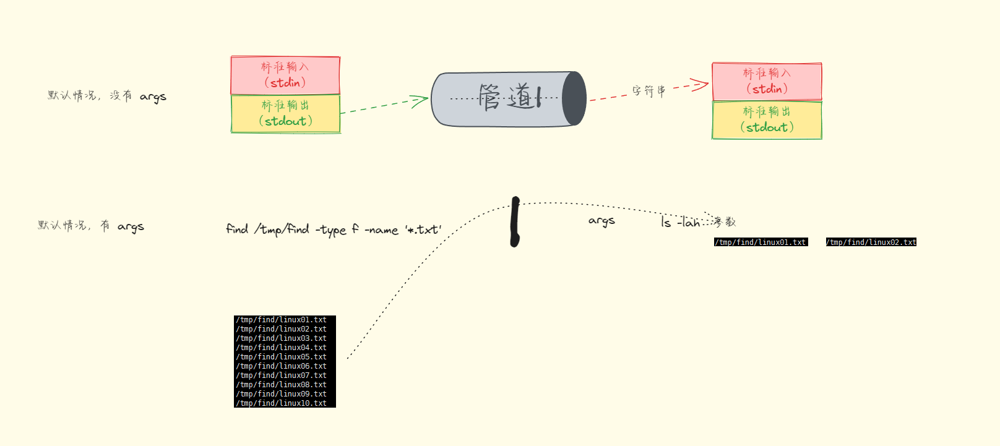

* 详细解释 `/etc/passwd` 中每一列的含义（⭐）：

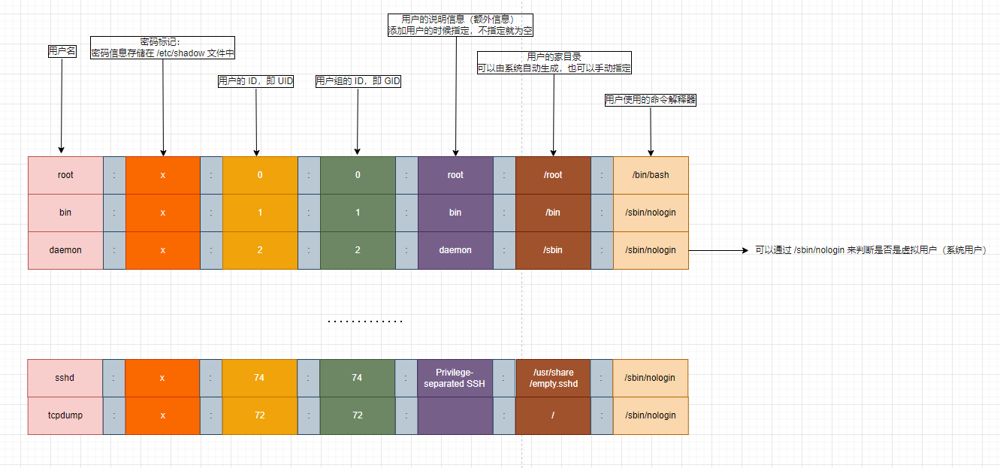

* 查询 `/etc/shadow` 文件：

```shell
cat /etc/shadow
```


* 详细解释 `/etc/shadow` 中每一列的含义：

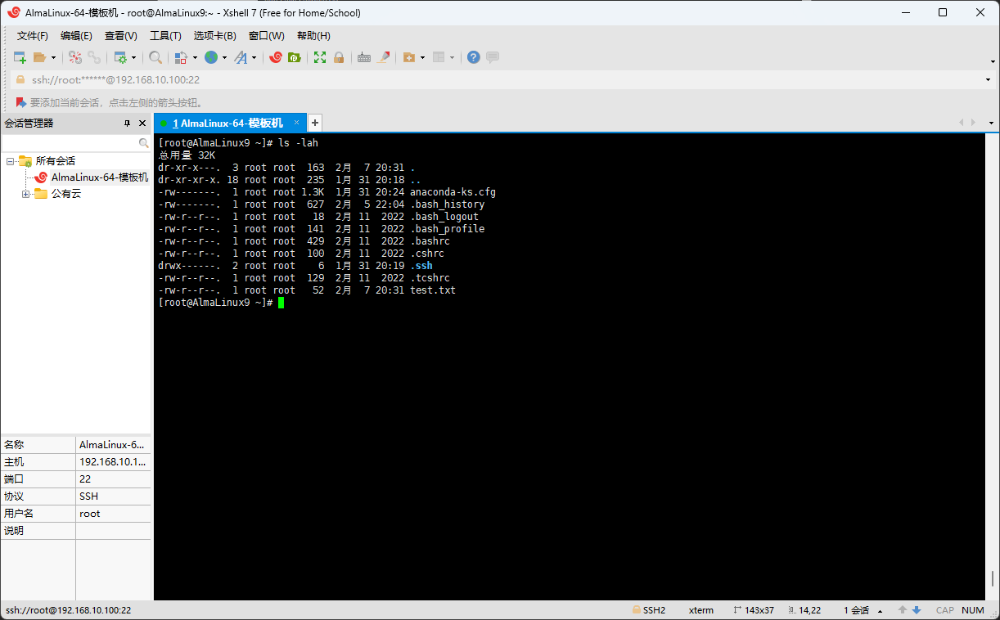

* 查询 `/etc/group` 文件：

```shell
cat /etc/group
```


* 详细解释 `/etc/group` 中每一列的含义：

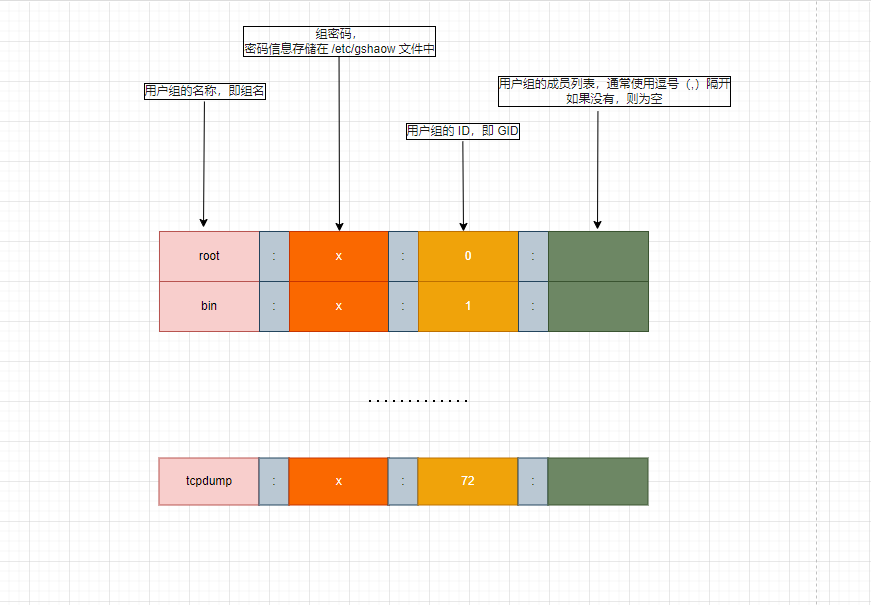


# 第四章：用户管理命令（⭐）

## 4.1 概述

* 用户管理命令，无非就是对用户进行`增`、`删`、`改`、`查`操作。

## 4.2 增加

* 命令：

```shell
useradd [-u][-s][-M][-g] 用户名
```

* 功能：创建用户。
* 选项：
  *   `-u`，`--uid UID`：指定用户的 ID，即 UID 。
  *   `-s`，`--shell SHEL`：指定命令解释器，默认是 `/bin/bash`。
  *   `-M`，`--no-create-home`：不创建用户的家目录。
  *   `-g`，`--gid GROUP`：指定用户组名称或用户组 ID。

> 注意⚠️：
>
> * ① 默认情况下，会创建`同名`的`家目录`和`用户组`。
> * ② `useradd` 命令的默认选项，可以通过 `cat /etc/default/useradd` 查看；通过编辑这个文件，系统管理员可以预先定义一些参数，这些参数将在没有手动指定的情况下被 `useradd` 命令使用。


* 示例：创建普通用户

```shell
useradd x
```


* 示例：创建虚拟账户 mysql ，并指定 UID 为 1314

```shell
useradd -u 1314 -s /sbin/nologin -M mysql
```


## 4.3 删除

* 命令：

```shell
userdel [-r] 用户名
```

* 功能：删除用户。
* 选项：
  * `-r`， `--remove`：删除用户和家目录。

> 注意⚠️：
>
> * ① 默认情况下，不会删除用户的家目录，除非添加 `-r` 选项。
> * ② 在实际工作中，userdel 命令很危险，建议在 `/etc/passwd` 文件对应的`用户前`添加 `#` 注释，以便达到删除用户的效果。


* 示例：删除用户

```shell
userdel x
```

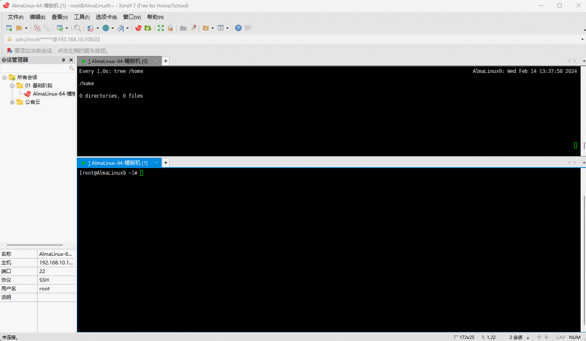


* 示例：删除用户和家目录

```shell
userdel -r x
```

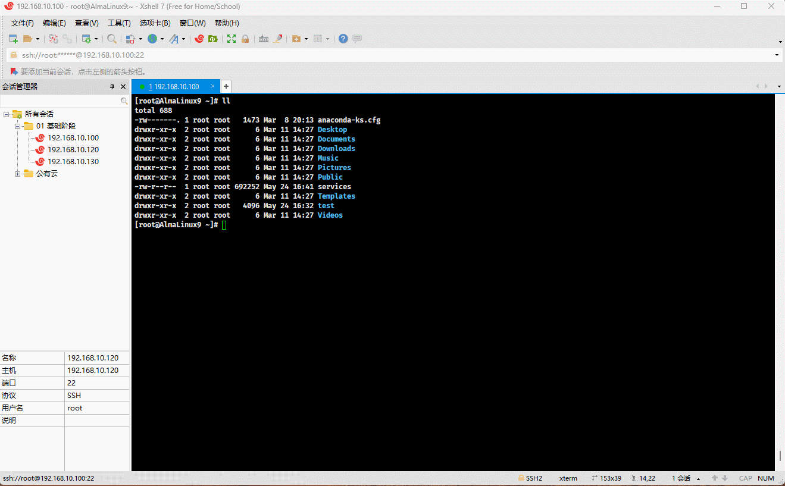

## 4.4 修改

### 4.4.1 修改用户信息

* 命令：

```shell
usermod [-u][-s][-g][-l] 用户名
```

* 功能：修改用户信息。
* 对应英文：user modify 。
* 选项：
  *   `-u`，`--uid UID`：指定用户的 ID，即 UID 。
  *   `-s`，`--shell SHEL`：指定命令解释器，默认是 `/bin/bash`。
  *   `-g`，`--gid GROUP`：指定用户组名称或用户组 ID。
  * `-l`，`--login NEW_LOGIN`：修改用户名称，不会修改用户的家目录名称。


* 示例：修改 mysql 的 SHELL 解释器为 /bin/bash

```shell
usermod -s /bin/bash mysql
```


* 示例：修改用户名

```shell
usermod -l xudaxian x
```


### 4.4.2 修改密码

* 命令：

```shell
passwd [--stdin] [用户名]
```

* 功能：修改用户的密码。
* 对应英文：password 。
* 选项：
  * `--stdin`：从标准流中读取信息，并修改密码（只有 root 用户才能进行此操作）。

> 注意⚠️：
>
> * ① 如果不写用户名，就是修改当前的用户名。
> * ② `--stdin` 可以实现批量修改密码，如：`echo '123456' | passwd  --stdin x`。


* 示例：修改当前用户的密码

```shell
passwd
```

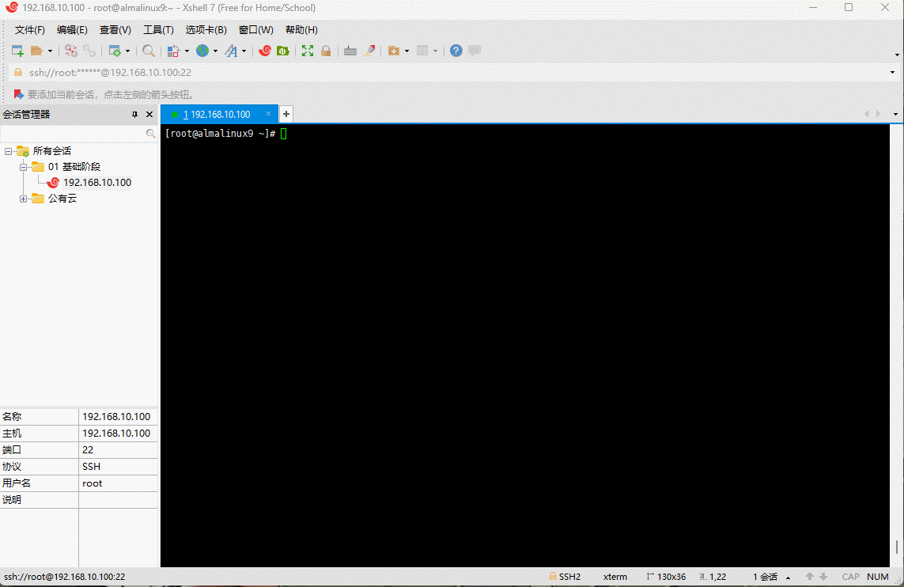


* 示例：修改指定用户的密码

```shell
echo '123456' | passwd --stdin x
```

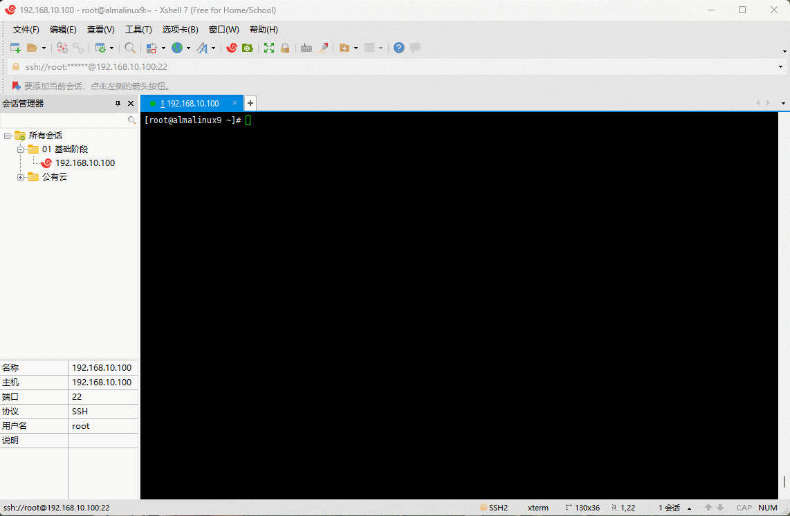

### 4.4.3 切换用户

* 命令：

```shell
su - [用户名]
```

* 对应的英文：switch user。
* 选项：
  * `-`， `-l`， `--login`：切换用户的同时，切换用户的配置和环境变量。

> 注意⚠️：
>
> * ① su 命令允许我们在不注销当前会话的情况下，以不同的用户身份之间，执行各种任务，同时保持系统的稳定和安全。
> * ② root 切换到普通用户，`无需`登录（输入密码）；普通用户切换到 root ，`需要`登录（输入密码）。


* 示例：

```shell
su - x
```

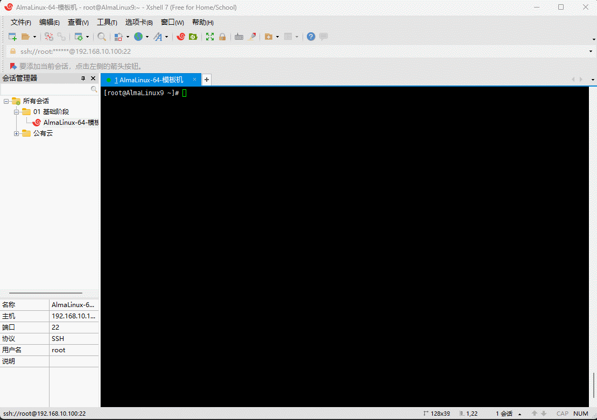

## 4.5 查询

### 4.5.1 查询用户的信息

* 命令：

```shell
id [用户名]
```

* 功能：
  * 查询用户的 UID、GID 和用户组信息，进而可以用来检查用户是否存在。
  * 如果`用户名`没有指定，默认查询的是当前用户的信息。


* 示例：查询当前用户的信息

```shell
id
```


* 示例：查询指定用户的信息

```shell
id x
```

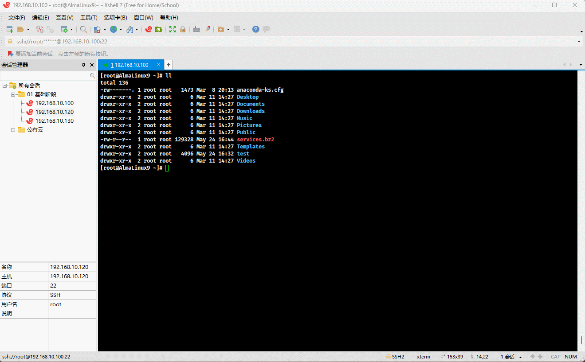


* 示例：检查指定用户是否存在

```shell
id x
```


### 4.5.2 查询用户当前的名字

* 命令：

```shell
whoami
```

* 功能：查询用户当前的名字。


* 示例：

```shell
whoami
```

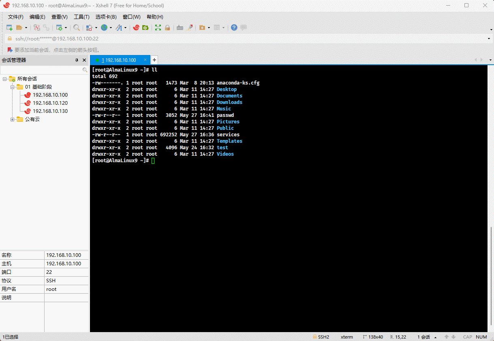

### 4.5.3 查询当前登录用户的详细信息

#### 4.5.3.1 概述

* 命令：

```shell
w [-f]
```

* 功能：查询当前登录用户的详细信息，包括：用户名称、终端类型、登录时间、空闲时间、CPU使用情况以及用户正在执行的进程。
* 选项：
  * `-f`，`--from`：显示远程登录主机的 IP 地址。

> 注意⚠️：w 命令其实是 uptime（计算机正常运行时间，即在线时间） 和 who 命令的组合。

#### 4.5.3.2 案例

* 示例：

```shell
w -f
```

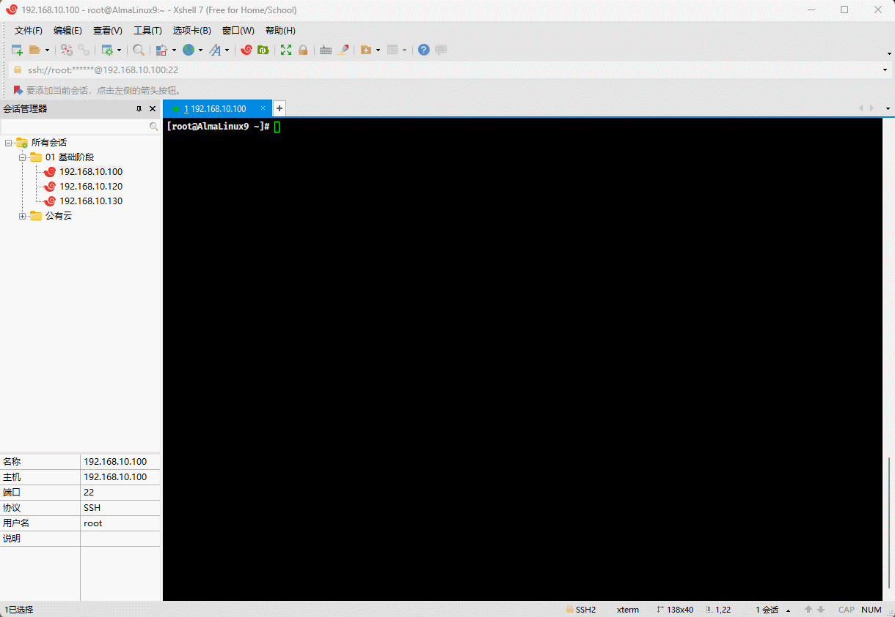

#### 4.5.3.3 详细解释

* 下面将给出对应的详细信息的解释，即：

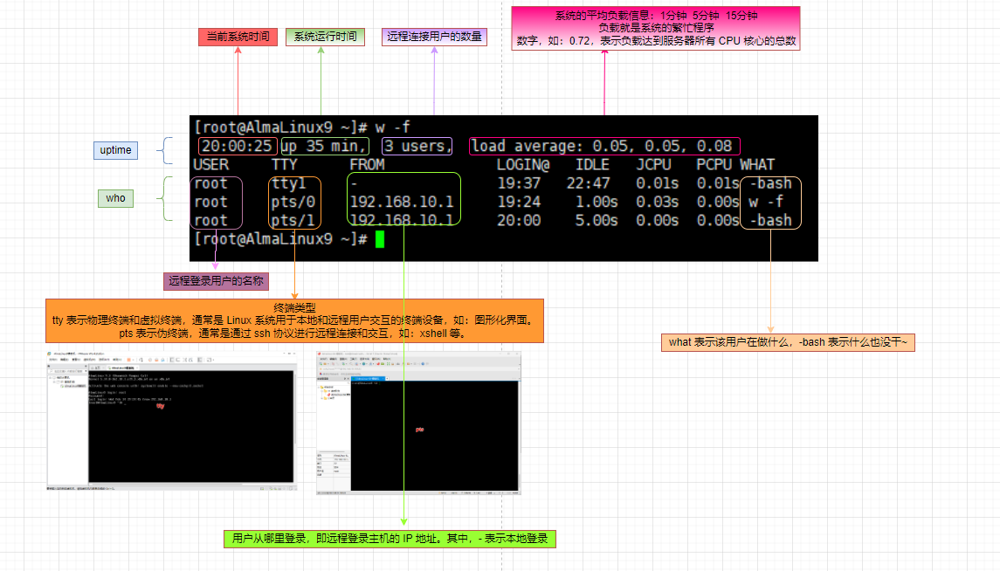

### 4.5.4 显示用户最近的登录信息

* 命令：

```shell
last
```


* 示例：

```shell
last
```


### 4.5.5 显示用户最近一次的登录信息

* 命令：

```shell
lastlog
```


* 示例：

```shell
lastlog
```

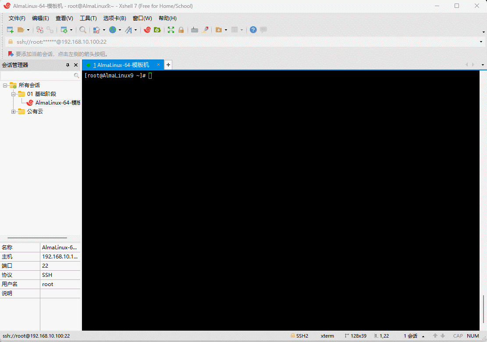

## 4.6 用户组命令（了解）

### 4.6.1 创建用户组

* 命令：

```shell
groupadd 用户组
```


* 示例：

```shell
groupadd dev
```


### 4.6.2 创建用户的同时指定用户组

* 命令：

```shell
useradd -g 用户组 用户名
```

> 注意⚠️：前提条件是用户组存在！！！


* 示例：

```shell
useradd -g dev x
```

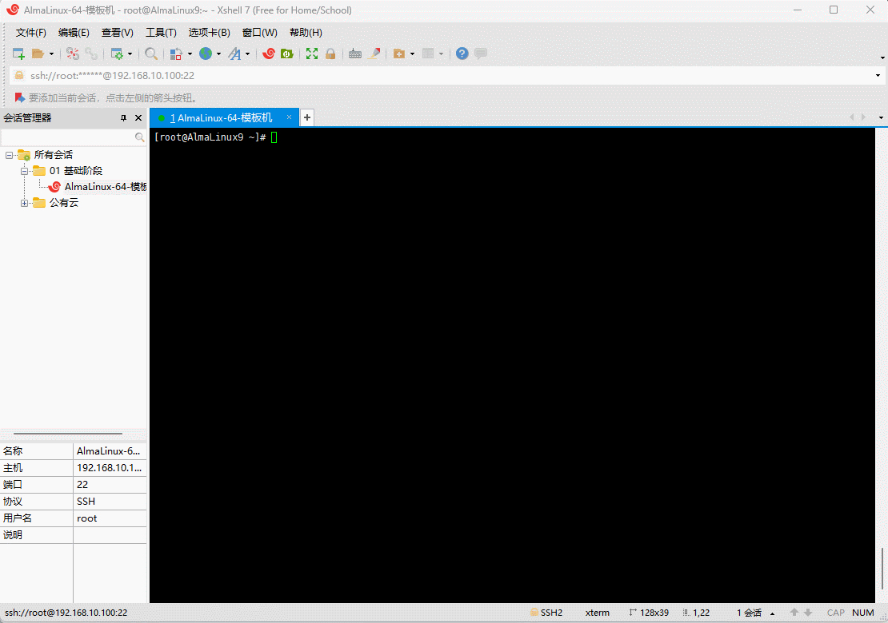

### 4.6.3 删除用户组

* 命令：

```shell
groupdel 用户组
```

> 注意⚠️：
>
> * ① 需要确保用户组中没有用户；否则，将会报错！！！
> * ② 可以通过 `getent group 用户组`命令查询用户组的详细信息，包括：用户组密码、GID 以及用户组成员列表。


* 示例：

```shell
groupdel dev
```


# 第五章：sudo 权限管理（⭐）

## 5.1 概述

* 在实际工作中，开发人员要查看系统日志，怎么办（root 权限太大，普通用户的权限又太小）？

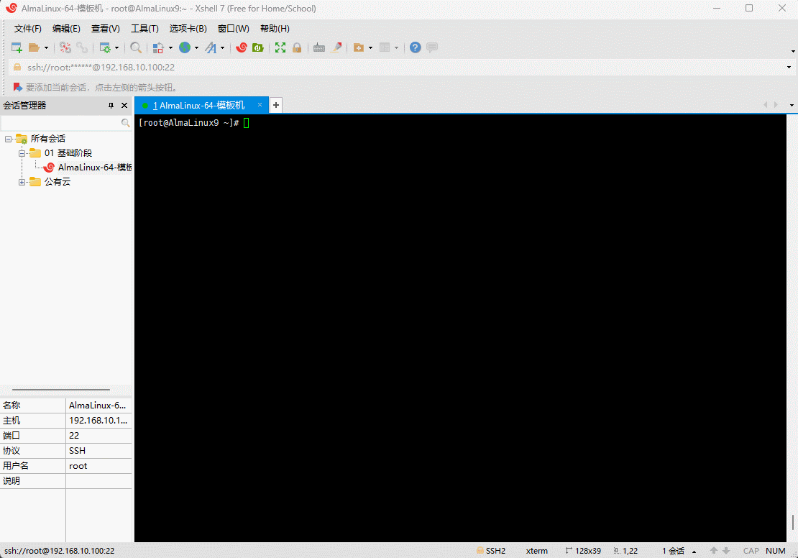

* 此时，就可以使用 sudo 进行提权，对应的流行如下：

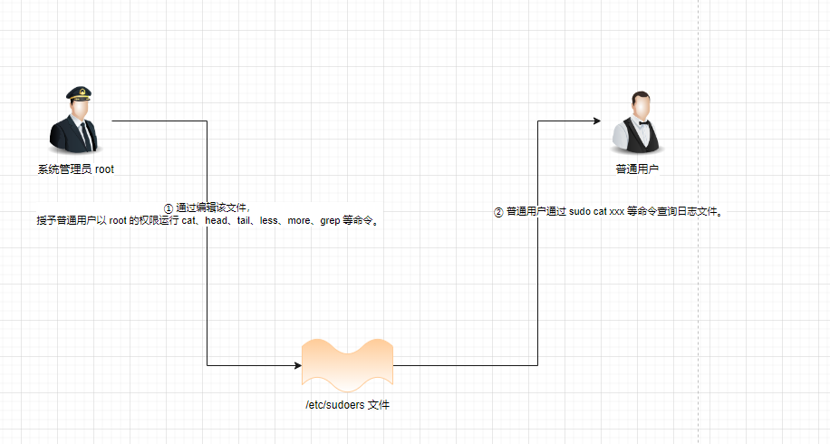

> 注意⚠️：未来会搭建`日志平台（ELK、EFK 等）`，那么就不需要这么麻烦了。

## 5.2 sudo 授权和使用

* sudo 授权和使用步骤如下：
  * ① 使用 `visudo` 命令进行授权（其实，背后修改的是 `/etc/sudoers` 文件）。
  * ② 普通用户通过 `sudo cat xxx` 等进行日志文件的查看，并且可以通过 `sudo -l` 查看哪些命令需要使用 sudo 提权。

* 通过 which 查询这些命令对应的绝对路径，即：

```shell
which cat head tail less more grep
```

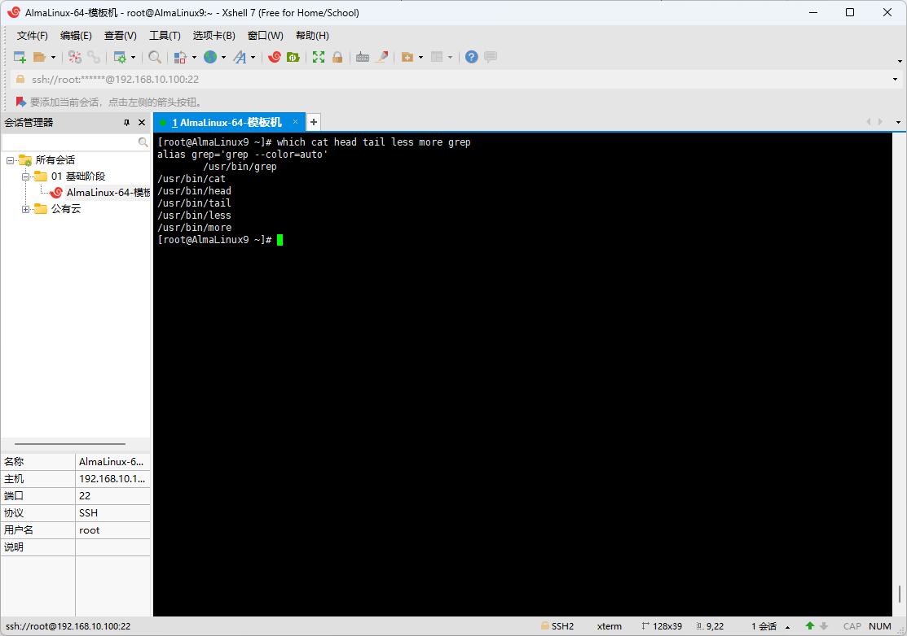

* root 用户使用 `visudo` 命令进行授权（授权给开发人员），即：

```shell
visudo
```

```
root    ALL=(ALL)       ALL # 100 行
x       ALL=(ALL)       /usr/bin/cat, /usr/bin/head, /usr/bin/tail, /usr/bin/less, /usr/bin/more, /usr/bin/grep
```

> 解释：
>
> * `root` 表示用户名，具有 root 权限的用户。
> * `ALL=(ALL)` 中的 `ALL` 表示所有主机（即任何 IP 地址），而 `(ALL)` 表示所有用户组，即 root 用户所属的所有用户组。
> * `ALL`：表示所有命令，它允许 root 用户在任何主机上以任何用户组的身份执行任何命令。


* 普通用户（开发人员）通过 sudo 进行命令的提权，即：

```shell
# 第一次会有密码提示输入，原理是通过时间戳文件文件实现的，可以通过 sudo -k 清除时间戳文件
sudo cat /var/log/secure
```

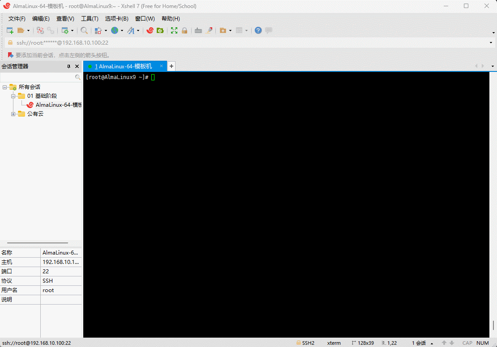


* 有的时候，我们不希望通过 root 账号来管理 Linux ，而希望通过一个账号来管理 Linux ，那么就通过 visudo 命令授权（授权给运维人员），并且不希望输入密码，即：

```shell
visudo
```

```
root    ALL=(ALL)       ALL # 100 行
x       ALL=(ALL)       /usr/bin/cat, /usr/bin/head, /usr/bin/tail, /usr/bin/less, /usr/bin/more, /usr/bin/grep
w       ALL=(ALL)       NOPASSWD: ALL # 授权给运维自己不需要密码运行各种命令
```


## 5.3 总结

* sodo 就是让普通用户可以拥有 root 的部分权限来操作 Linux。
* 流程就是：root 账号使用 `visudo` 进行授权，普通用户使用 `sudo xxx` 来进行提权。

>   注意⚠️：
>
>   * ① 如果每个用户都需要这么配置，就会感觉非常麻烦，我们也可以使用`堡垒机`来进行解决这类问题。
>   * ② 一些开源的`堡垒机`可能没有对用户提权的功能；但是，云厂商提供的`堡垒机`是有对 SSH、Telnet 协议主机增加提权功能的，只不过需要购买而已！！！


# 第六章：堡垒机（⭐）

## 6.1 概述

* 之前，我们对于 Linux 的操作，都是通过 xshell 来`直接`进行远程连接的，即：

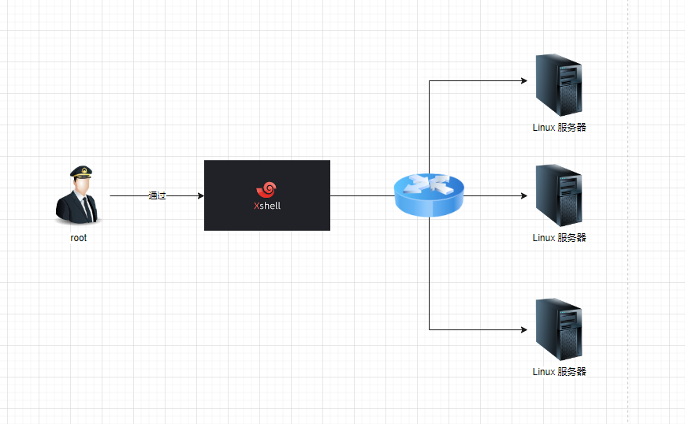

* 但是，这样是有安全隐患的，比如：直接将 `22` 端口暴露到外网上，可能会遭受攻击；所以，`跳板机`和`堡垒机`就应用而生了，即：


>   注意⚠️：
>
> * ① 之所以使用`堡垒机`或`跳板机`，是因为人是趋利避害的性格，可能为了掩饰自己的错误行为，在使用 xshell 远程连接到 Linux 服务器上的时候（操作记录存放在 Linux 服务器上），会将自己的操作记录删除；而通过堡垒机或跳板机远程连接 Linux 服务器（操作记录存放在堡垒机或跳板机上），是不能将自己的操作记录删除的。
> * ② 使用`跳板机`或`堡垒机`，在未来的场景中，只需要开放`跳板机`或`堡垒机`的端口就可以了，避免了直接暴露内部网络资源给外部网络带来的安全风险。
> * ③ 通常而言，`跳板机`侧重于提供`安全`的`远程访问`和`操作平台`，而`堡垒机`更侧重于`安全防护`和`审计`。

* 堡垒机的产品：

| 堡垒机的产品 | 说明                                                         |
| ------------ | ------------------------------------------------------------ |
| 开源软件     | Teleport 、JumpServer、CMDB、Next Terminal、Spug、CODO、OpsCloud |
| 物理硬件设备 | 需要自己购买。                                               |
| 云服务       | 需要自己购买，阿里云等云厂商都提供有对应的服务。             |

>   注意⚠️：本次将以 `Next Terminal` 作为演示！！！

## 6.2 关闭防火墙和 SELinux

### 6.2.1 关闭防火墙

* 查询防火墙是否运行：

```shell
systemctl status firewalld
```

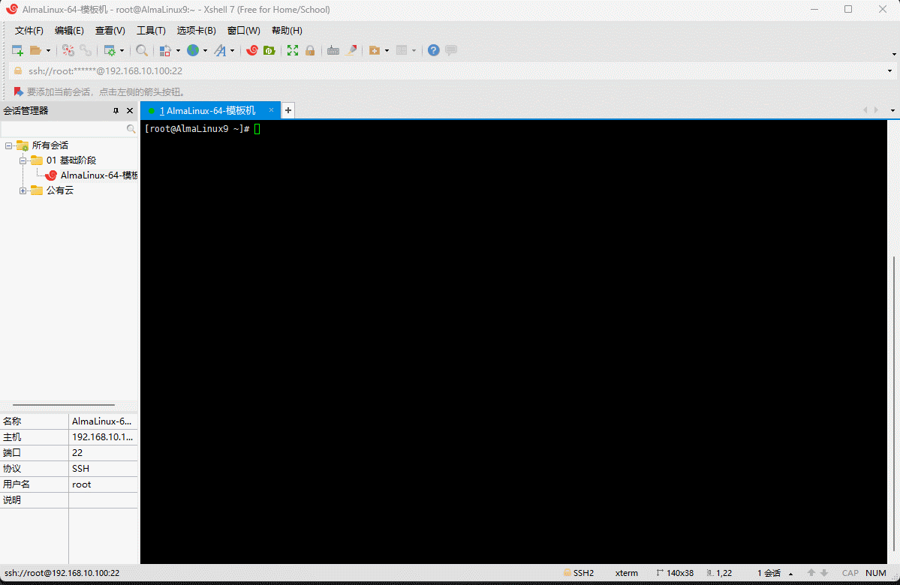

* 关闭防火墙：

```shell
# 临时关闭
systemctl stop firewalld
```

```shell
# 重启生效
systemctl disable firewalld
```


* 查询防火墙是否运行：

```shell
systemctl status firewalld
```


### 6.2.2 关闭 SELinux

* 查看 SELinux 是否运行：

```shell
# 结果是 permissive 或 disabled 都表示关闭，结果是 enforcing 表示开启
getenforce
```

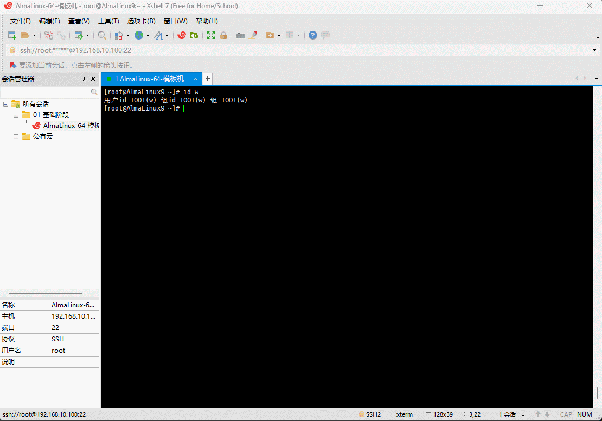

* 关闭 SELinux：

```shell
setenforce 0 # 临时关闭
```

```shell
sed -i 's/SELINUX=enforcing/SELINUX=disabled/g' /etc/selinux/config  # 永久关闭，重启生效
```


* 查看 SELinux 是否运行：

```shell
# 结果是 permissive 或 disabled 都表示关闭，结果是 enforcing 表示开启
getenforce
```


## 6.3 前置准备

### 6.3.1 安装 Apache Guacamole-Server

* 安装 guacd  ：

```shell
dnf install -y epel-release
```

```shell
dnf install -y libguac-client-kubernetes \
    libguac-client-rdp \
    libguac-client-ssh \
    libguac-client-telnet \
    libguac-client-vnc \
    guacd
```


* 配置 guacd 服务：

```shell
mkdir /etc/guacamole/
```

```shell
cat <<EOF >> /etc/guacamole/guacd.conf
[daemon]
pid_file = /var/run/guacd.pid
log_level = info

[server]
# 监听地址
bind_host = 127.0.0.1
bind_port = 4822
EOF
```

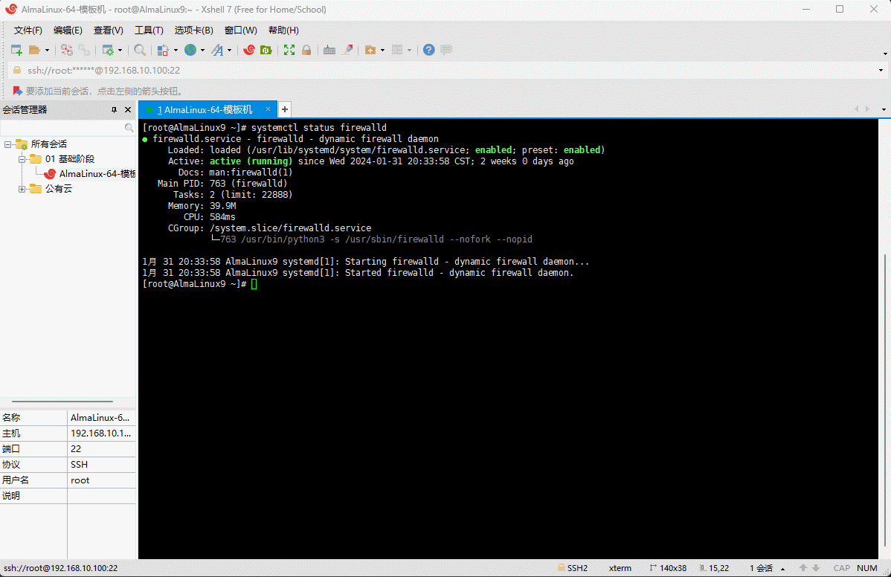

* 修改 `/usr/lib/systemd/system/guacd.service` 文件中的 User 和 Group 两行，以避免权限问题，即：

```shell
vim /usr/lib/systemd/system/guacd.service
```

```{11-12}
[Unit]
Description=Guacamole proxy daemon
Documentation=man:guacd(8)
After=network.target

[Service]
EnvironmentFile=-/etc/sysconfig/guacd
Environment=HOME=/var/lib/guacd
ExecStart=/usr/sbin/guacd -f $OPTS
Restart=on-failure
# User=guacd 注释
# Group=guacd 注释

[Install]
WantedBy=multi-user.target
```


* 启动 guard 服务：

```shell
# 重载服务
systemctl daemon-reload
```

```shell
# 开机自启以及立即启动
systemctl enable --now guacd
```

```shell
# 查看状态
systemctl status guacd
```


### 6.3.2 安装字体

* 安装字体管理软件：

```shell
dnf install -y fontconfig mkfontscale
```


* 下载字体文件并移动到 `/usr/share/fonts/` 目录下：

```shell
cd  /usr/share/fonts/
```

```shell
# 下载英文字体
wget https://gitee.com/dushixiang/next-terminal/raw/master/guacd/fonts/Menlo-Regular.ttf
```

```shell
# 下载中文字体
wget https://gitee.com/dushixiang/next-terminal/raw/master/guacd/fonts/SourceHanSansCN-Regular.otf
```

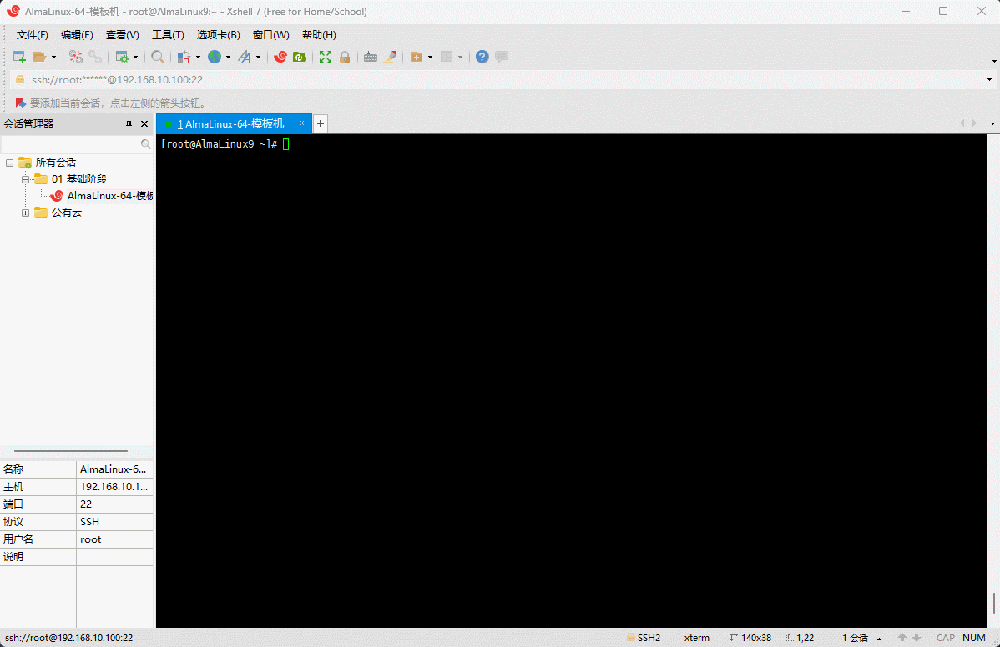

* 更新字体：

```shell
mkfontscale && mkfontdir && fc-cache
```


## 6.4 安装堡垒机 -- Next Terminal

* 下载软件安装包：

```shell
wget https://github.com/dushixiang/next-terminal/releases/download/v1.3.9/next-terminal.tar.gz
```


* 解压到指定目录：

```shell
tar -zxvf next-terminal.tar.gz -C /usr/local/
```


* 修改 `/usr/local/next-terminal/config.yaml` 文件：

```shell
vim /usr/local/next-terminal/config.yaml
```

```yaml
debug: false
db: sqlite # sqlite 或 mysql
# mysql:
  # hostname: localhost
  # port: 3306
  # username: next-terminal
  # password: next-terminal
  # database: next-terminal
sqlite:
  file: './data/sqlite/next-terminal.db'
server:
  addr: 0.0.0.0:8088
#  当设置下面两个参数时会自动开启https模式(前提是证书文件存在)
#  cert: /root/next-terminal/cert.pem
#  key: /root/next-terminal/key.pem
guacd:
  hostname: 127.0.0.1
  port: 4822
  # 此路径需要为绝对路径，并且 next-terminal 和 guacd 都能访问到
  recording: '/usr/local/next-terminal/data/recording'
  # 此路径需要为绝对路径，并且 next-terminal 和 guacd 都能访问到
  drive: '/usr/local/next-terminal/data/drive'

sshd:
  # 是否开启 sshd 服务
  enable: true
  # sshd 监听地址，未开启 sshd 服务时此配置不会使用
  addr: 0.0.0.0:2022
  # sshd 使用的私钥地址，未开启 sshd 服务时此配置不会使用
  key: ~/.ssh/id_rsa
```


* 启动：

```shell
cd /usr/local/next-terminal/
```

```shell
./next-terminal
```


* 创建 `next-terminal` 系统服务文件，以便通过 `systemctl` 命令来管理堡垒机：

```shell
cat > /etc/systemd/system/next-terminal.service <<EOF
[Unit]
Description=next-terminal service
After=network.target

[Service]
User=root
WorkingDirectory=/usr/local/next-terminal
ExecStart=/usr/local/next-terminal/next-terminal
Restart=on-failure
LimitNOFILE=1048576

[Install]
WantedBy=multi-user.target
EOF
```


* 启动 `next-terminal` 服务：

```shell
# 重载服务
systemctl daemon-reload
```

```shell
# 开机自启以及立即启动
systemctl enable --now next-terminal
```

```shell
# 查看状态
systemctl status next-terminal
```


## 6.5 访问和配置堡垒机

* 通过浏览器访问 `http://192.168.10.100:8088`，管理员的账号和密码是 `admin/admin` ，即：

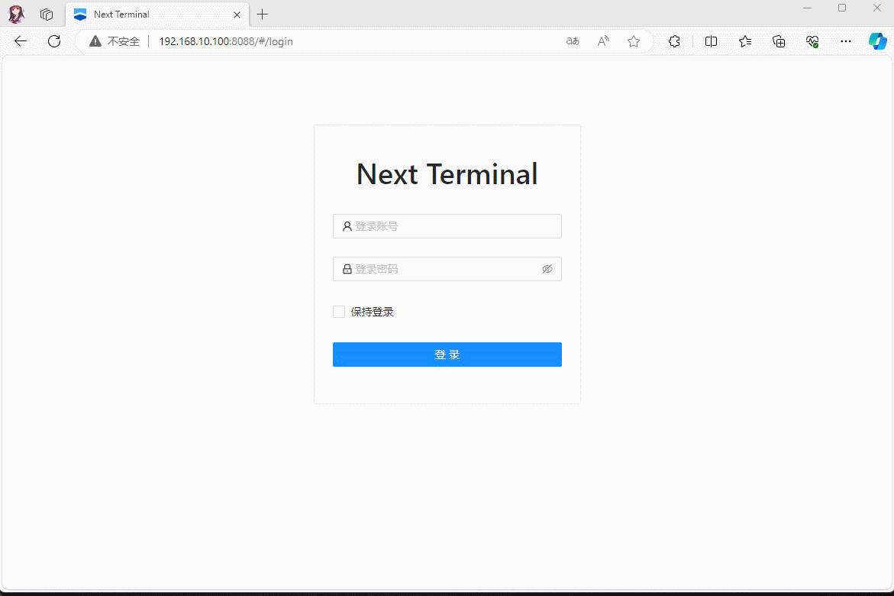

* 在`资产管理 --> 资产管理`中配置远程 Linux 服务器的信息，如：


> 注意⚠️：
>
> * ① 本次将`Next Terminal` 和远程 Linux 服务器配置在一台机器上；
> * ② 在实际工作中，`Next Terminal` 所在的服务器和远程 Linux 服务器是不同的服务器。

* 在 `资产管理 --> 资产管理` 中`操作`的`接入`中，就可以远程操作 Linux 了，即：

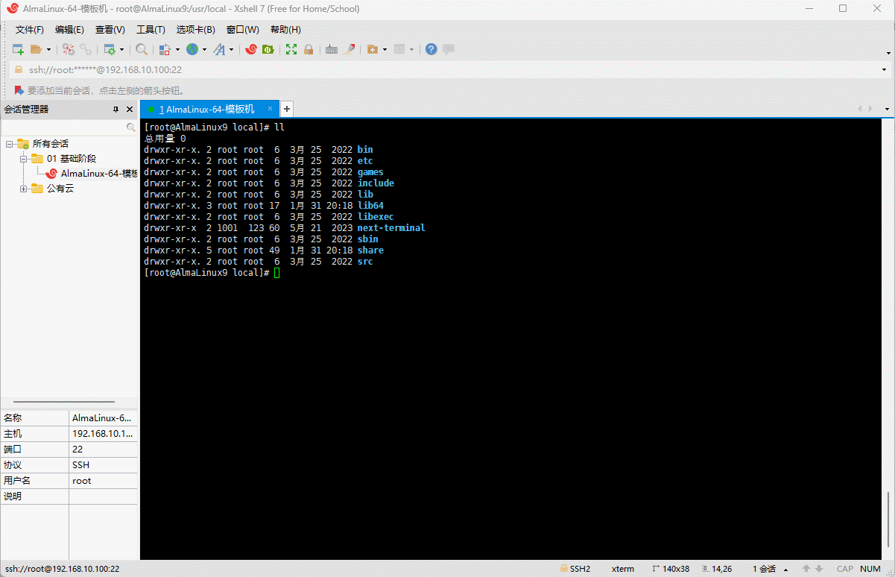

* 在`会话审计 --> 在线会话 或 历史会话` 中，可以通过`监控或回放`查看 Linux 的操作，即：


# 第七章：补充

## 7.1 getent

### 7.1.1 概述

* 命令：

```shell
getent database [key]
```

* 功能：从`系统数据库`中根据`指定的 key`  查询出`想要的信息`。
* 对应的英文：get entries from administrative database 。

> 注意⚠️：database 可以是 ahosts、ahostsv4、ahostsv6、aliases、ethers、group、gshadow、hosts、initgroups、netgroup、networks、passwd、protocols、rpc、services、shadow。

* 应用场景：
  * 查询用户信息：通过 `getent passwd` 命令，可以查看系统中的用户账户信息。
  * 查询用户组信息：使用 `getent group` 可以查看用户组及其成员。
  * 查询主机信息：通过 `getent hosts` 可以查看主机名与 IP 地址的映射。
  * 查询服务信息：`getent services` 用于查看系统中的服务及其对应的端口号。
  * 查询网络协议：`getent protocols` 可以列出网络协议及其编号。

### 7.1.2 案例

* 需求 ① ：查看系统中的指定用户的信息。


* 示例：

```shell
cat /etc/passwd | grep xiaoming
```

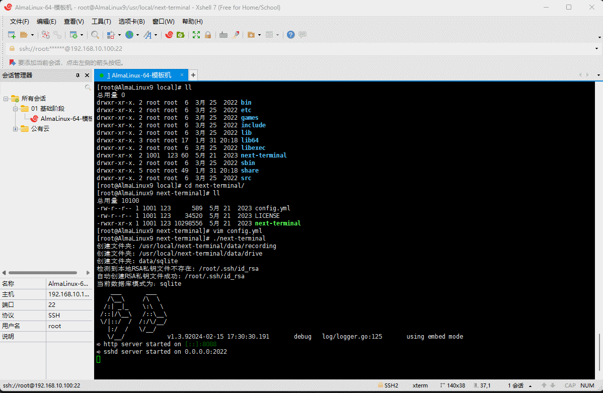


* 示例：

```shell
getent passwd xiaoming
```

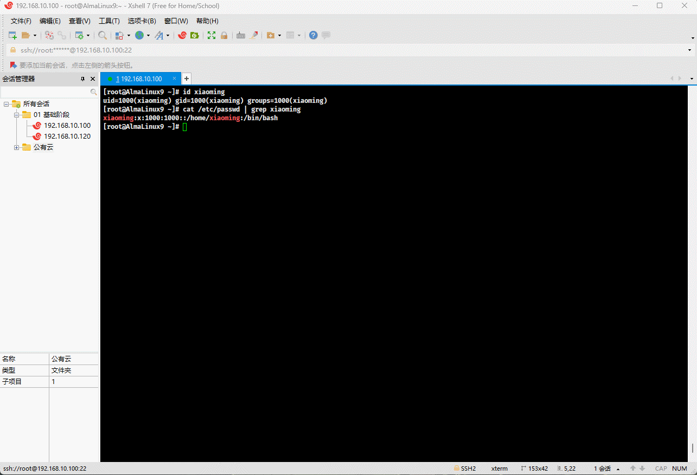


* 需求 ② ：查看系统中的指定用户密码的信息。


* 示例：

```shell
cat /etc/shadow | grep xiaoming
```

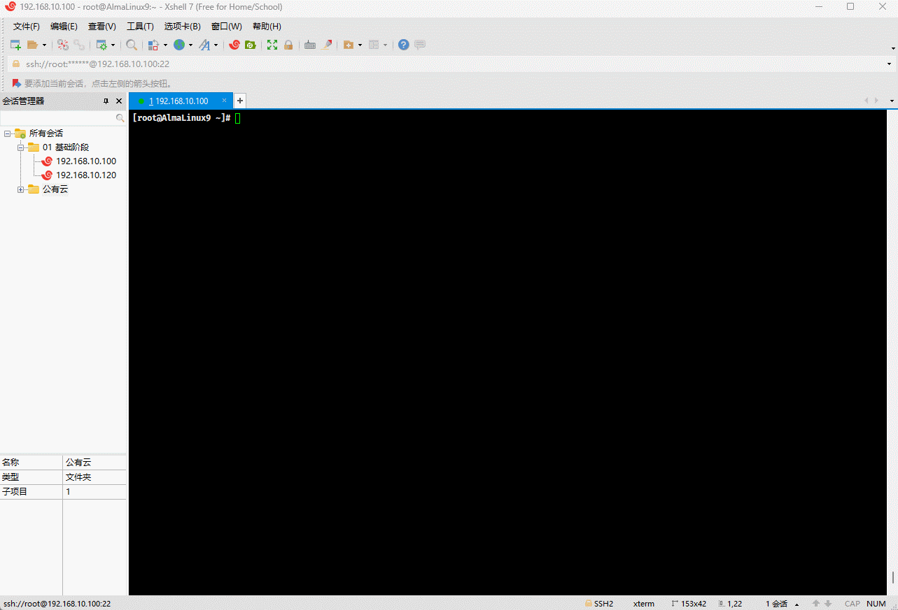


* 示例：

```shell
getent shadow xiaoming
```

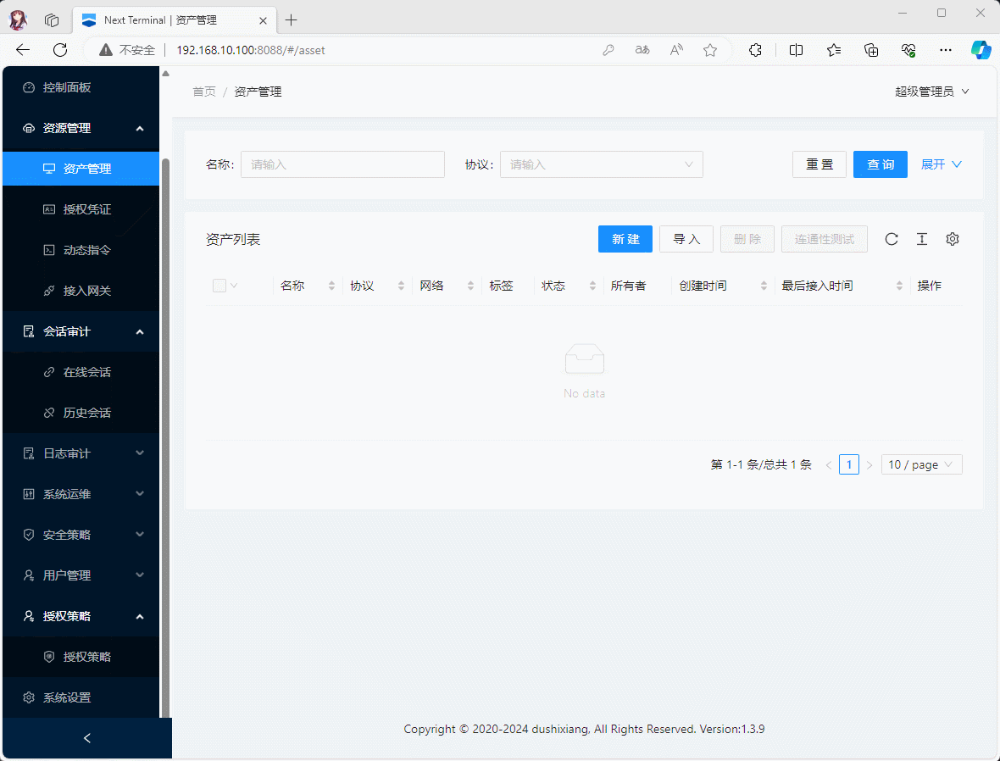


* 需求 ③ ：查看系统中的指定用户组的信息。


* 示例：

```shell
cat /etc/group | grep xiaoming
```

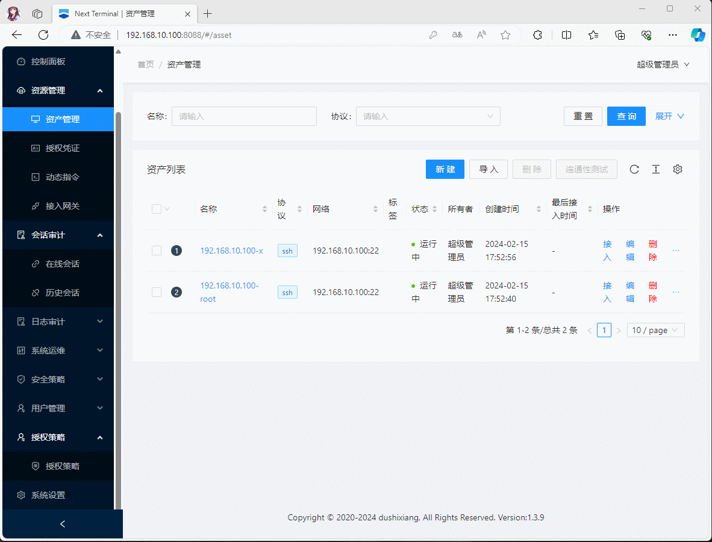


* 示例：

```shell
getent group xiaoming
```

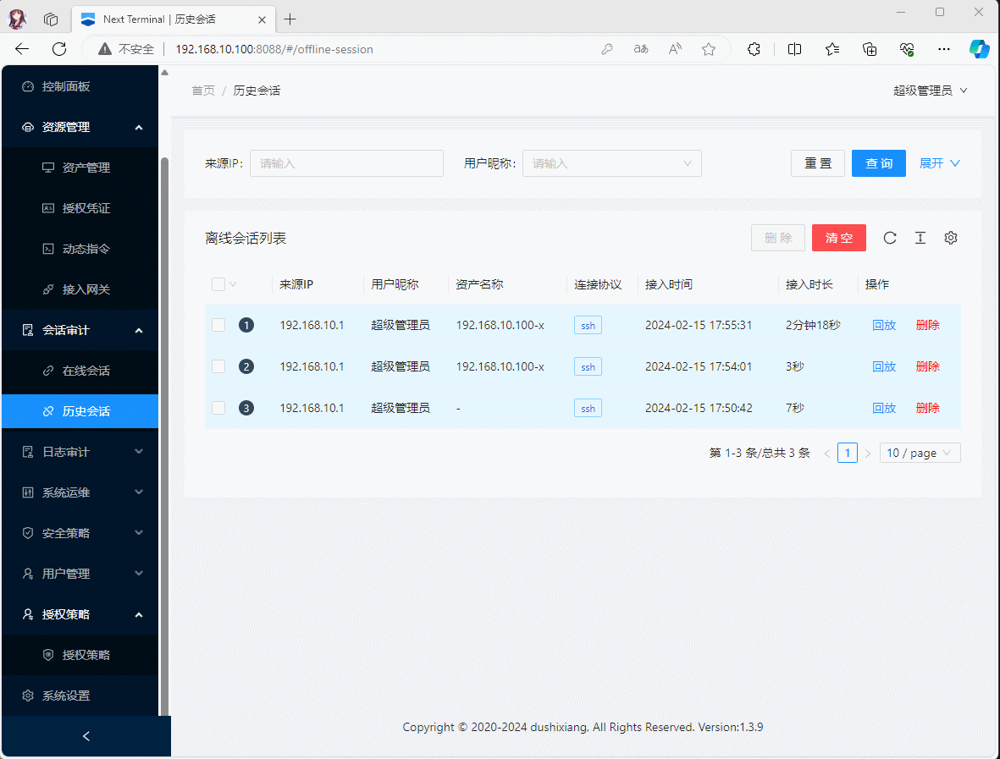


* 需求 ④ ：查看系统中的指定用户组密码的信息。


* 示例：

```shell
cat /etc/gshadow | grep xiaoming
```


* 示例：

```shell
getent gshadow xiaoming
```


### 7.1.3 案例

* 需求：查询主机信息。


* 示例：

```shell
cat /etc/hosts
```


* 示例：

```shell
gentent hosts
```

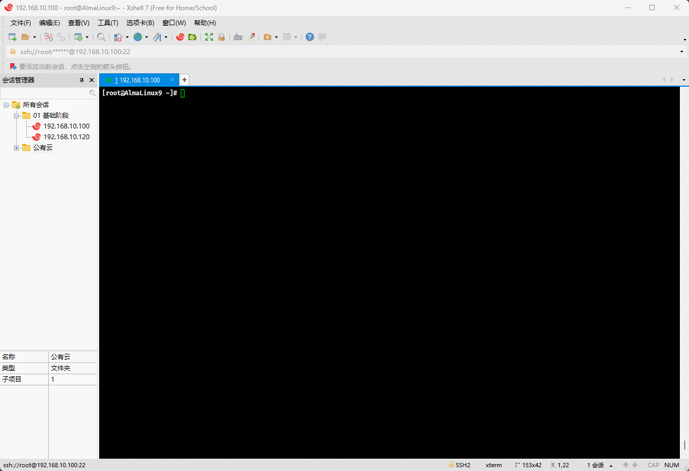

### 7.1.4 案例

* 需求：查询服务信息（服务和端口）。


* 示例：

```shell
netstat -anp | grep ssh
```

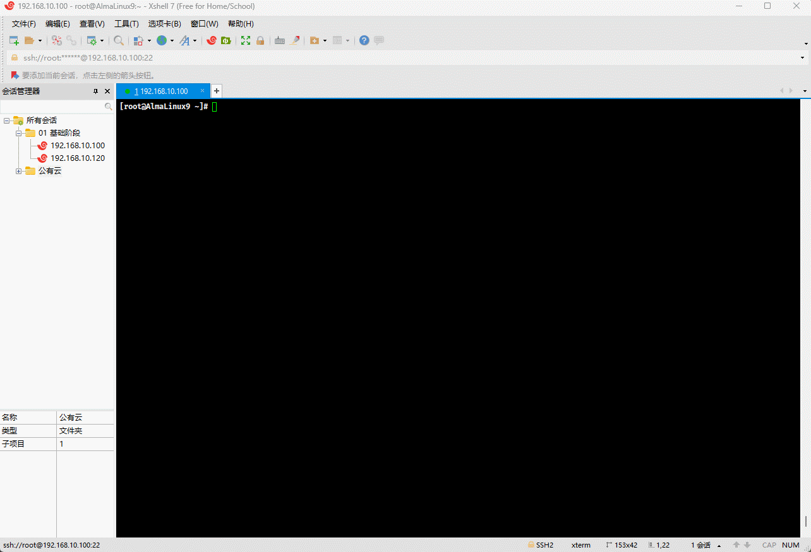


* 示例：

```shell
getent services ssh
```


