# 第一章：grep（⭐）

## 1.1 概述

* 格式：

```shell
grep [OPTION]... PATTERNS [FILE]...
```

* 对应的英文：Global search REgular expression and Print out the line。
* 功能：文本搜索工具，根据用户指定的模式（正则表达式）对目标文本逐行进行匹配检查，并显示匹配到的行。

> 注意⚠️：
>
> * ① 所谓的 `PATTERNS`（`模式`）就是由`正则表达式`或`文本字符（字符串）`所形成的过滤条件。
> * ② 默认情况下，grep 支持普通正则表达式；可以通过 `-E` 选项来开启扩展正则表达式，或者直接使用 egrep 命令来代替 `grep -E 扩展正则表达式`。
> * ③ 正则表达式可以通过 `man 7 regex` 命令来查询其规则。

* 常用选项：
  * `-m`，`--max-count=NUM`：匹配到指定的 NUM 行后，就停止继续匹配。
  * `-v`，`--invert-match`：反转匹配，即显示哪些不被 PATTERNS 匹配到的行；换言之，忽略指定内容的某些行。
  * `-n`，`--line-number`： 显示行号。
  * `-o`，`--only-matching`：仅显示匹配到行的非空部分，即显示匹配到的字符串。
  * `-q`，`--quiet`，`--silent`：静默模式，不输出任何信息。
  * `-e`，`--regexp=PATTERNS`：使用正则表达式匹配，可以实现多个选项间的逻辑 OR 关系，即 `grep -e xxx -e xxx abc.txt` 。
  * `-w`，`--word-regexp`：匹配整个单词（单词两边是数字、字母、下划线也被认为是单词的一部分）。
  * `-E`，`--extended-regexp`：使用扩展正则表达式进行匹配。
  * `-F`，`--fixed-strings`：不使用正则表达式进行匹配，仅使用字符串来进行匹配。
  * `-P`， `--perl-regexp`：使用 PCRE 兼容正则表达式来进行匹配，很多语言和软件支持，如：Java、NGINX 等。
  * `-f`，`--file=FILE`：根据模式文件进行匹配。
  * `-A`，`--after-context=NUM`：显示匹配到的后 NUM 行。
  * `-B`，`--before-context=NUM`：显示匹配到的前 NUM 行。
  * `-C`， `--context=NUM`：显示匹配到的前后 NUM 行。

## 1.2 应用示例

* 示例：从 /etc/passwd 文件中查找包含 root 的行。

```shell
grep root /etc/passwd
```

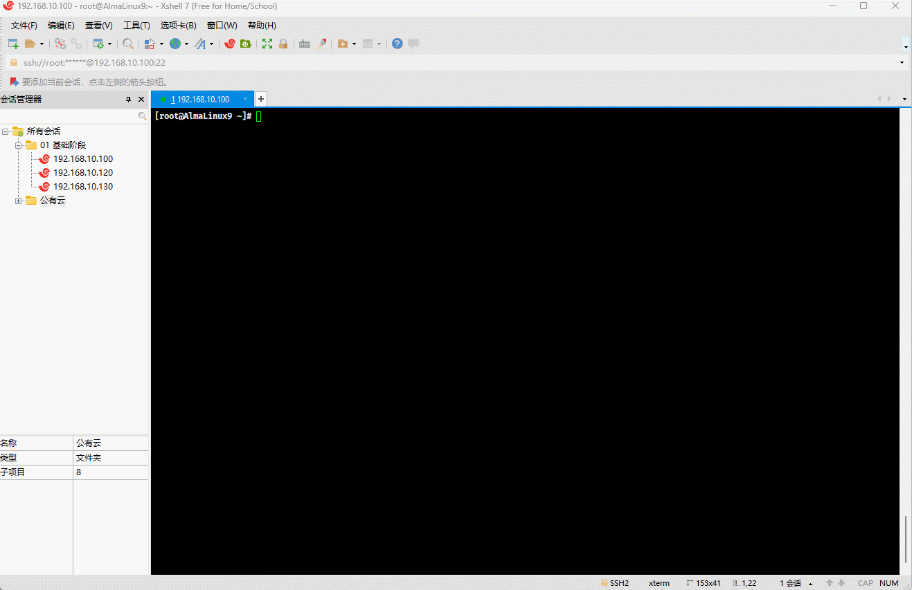


* 示例：从 /etc/passwd 文件中查找包含 root 的行以及行号。

```shell
grep -n "root" /etc/passwd
```


* 示例：查询系统用户登录的错误信息。

```shell
grep -i "failed password" /var/log/secure
```


* 示例：查询 chronyd 日期同步进程。

```shell
ps -ef | grep -i chronyd | grep -v grep
```


* 示例：指定匹配到 1 行后就停止匹配

```shell
grep -m 3 'root' /etc/passwd
```


* 示例：静默模式，不输出任何信息；通常用于脚本开发中，通过 `echo $?` 来判断是否执行成功

```shell
grep -q "root" /etc/passwd # 等价于 grep "root" /etc/passwd > dev/null
```

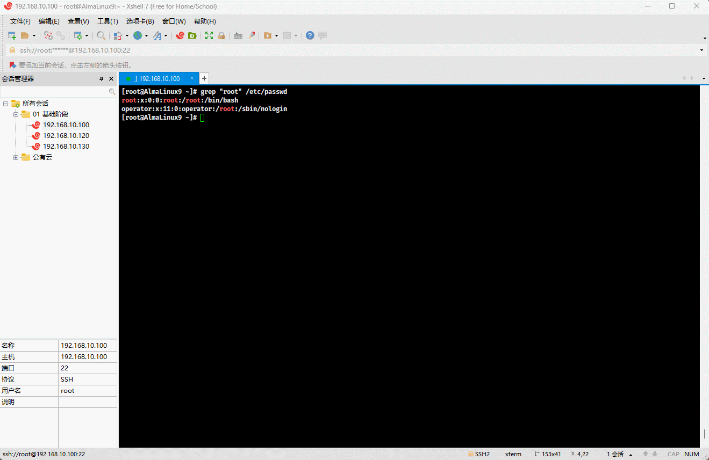


* 示例：逻辑或运算，从 /etc/passwd 文件中查找包含 root 或 mail 的行。

```shell
grep -e "root" -e "mail" /etc/passwd
```

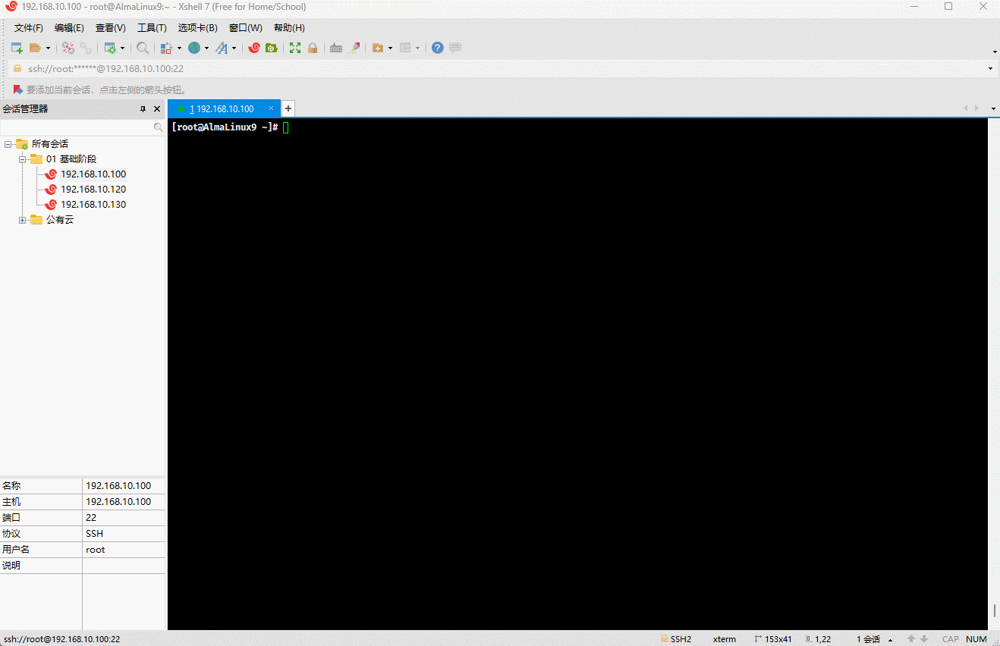


* 示例：匹配整个单词

```shell
echo -e "root i love you \n\
root-er i love you \n\
8root8 i love you \n\
_root_ i love you \n" | grep -w "root"
```


* 示例：仅显示匹配到行的非空部分，即显示匹配到的字符串

```shell
ifconfig | grep "inet "| grep -oE '([0-9]{,3}\.){3}[0-9]{,3}'
```

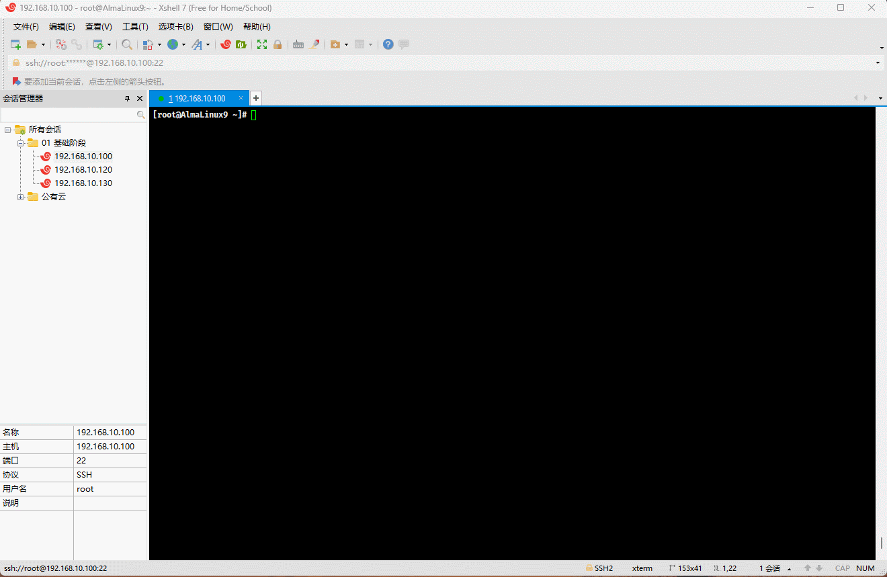

## 1.3 应用示例

* 示例：查询磁盘的利用率，并且逆序排序

```shell
df | grep '^/dev' | tr -s " " | cut -d " " -f1,5 | sort -rn -t 2
```


# 第二章：正则表达式（⭐）

## 2.1 回顾文件通配符

* 文件通配符（globbing）是一种用于匹配`文件`和`目录名称`的模式，可以帮助我们高效的管理文件，如：执行复制（cp）、移动(mv)、删除（rm）或搜索（grep），正确使用通配符可以大大提高命令行的效率和灵活性。
* 常见的通配符（可以通过 `man 7 glob` 命令查看），如下所示：

```shell
*      # 匹配 0 或多个字符，但是不匹配以 . 开头的文件，即隐藏文件
?      # 匹配任何单个字符
~      # 当前的家目录
~abc   # abc 用户的家目录
.      # 当前工作目录
[0-9]  # 匹配 0-9 中的字符字符
[a-z]  # 匹配 a-z 中的任意字符
[A-Z]  # 匹配 A-Z 中的任意字符
[abc]  # 匹配 a、b、c 中的任意字符
[^abc] # 匹配 a、b、c 以外的任意字符

[:digit:]  # 任意数字，相当于0-9
[:lower:]  # 任意小写字母,表示 a-z
[:upper:]   # 任意大写字母,表示 A-Z 
[:alpha:]   # 任意大小写字母
[:alnum:]  # 任意数字或字母
[:blank:]  # 水平空白字符
[:space:]  # 水平或垂直空白字符
[:punct:]  # 标点符号
[:print:]  # 可打印字符
[:cntrl:]  # 控制（非打印）字符
[:graph:]  # 图形字符
[:xdigit:] # 十六进制字符
```

## 2.2 正则表达式

### 2.2.1 概述

* 正则表达式是一种用于匹配和操作文本的强大工具，它是由一系列字符和特殊字符组成的模式，用于描述要匹配的文本模式。
* 正则表达式根据元字符（如：`?`, `+`, `|`, `{}`）是否有特殊意义分为：
  * 基本正则表达式（Basic Regular Expressions，BRE）。
  * 扩展正则表达式（Extended Regular Expressions，ERE）。

* 当然，在扩展正则表达式的基础上，还发展出了 PCRE 正则表达式库，被广泛应用于很多编程语言和软件中，如：Java 和 Nginx 等。

> 注意⚠️：
>
> * ① 传统的 UNIX 工具，如：`sed`、`grep`默认使用 `BRE`，除非 `sed` 加上 `-r` 选项，而 `grep` 加上 `-E` 选项才支持 `ERE`。
> * ② 现代的`egrep`、`awk`等工具，以及很多编程语言默认使用 `ERE`，因为它们更直观和简洁。
> * ③ 在实际工作中，使用 `ERE` 居多，因为其更为直观和简洁。

### 2.2.2 基本正则表达式（BRE）

* 元字符匹配：

```shell
.   匹配任意单个字符，可以是一个汉字
[]   匹配指定范围内的任意单个字符，示例：[abc]   [0-9]   [a-z]   [a-zA-Z]
[^] 匹配指定范围外的任意单个字符，示例：[^abc]

[:alnum:] 字母和数字
[:alpha:] 代表任何英文大小写字符，亦即 A-Z, a-z
[:lower:] 小写字母,示例:[[:lower:]],相当于[a-z]
[:upper:] 大写字母
[:blank:] 空白字符（空格和制表符）
[:space:] 水平和垂直的空白字符（比[:blank:]包含的范围广）
[:cntrl:] 不可打印的控制字符（退格、删除、警铃...）
[:digit:] 十进制数字
[:xdigit:]十六进制数字
[:graph:] 可打印的非空白字符
[:print:] 可打印字符
[:punct:] 标点符号
```

* 匹配次数（量词）：用在要指定次数的字符后面，用于指定前面的字符要出现的次数

```shell
* 匹配前面的字符任意次，包括0次，贪婪模式：尽可能长的匹配
.* 任意长度的任意字符
\? 匹配其前面的字符 0 或 1 次,即:可有可无
\+ 匹配其前面的字符至少 1 次,即:肯定有，>=1
\{n\} 匹配前面的字符n次
\{m,n\} 匹配前面的字符至少m次，至多n次
\{,n\} 匹配前面的字符至多n次,<=n
\{n,\} 匹配前面的字符至少n次
```

* 位置锚定：可以用于定位出现的位置

```shell
^ 行首锚定，用于模式的最左侧
$ 行尾锚定，用于模式的最右侧
^PATTERN$ 用于模式匹配整行
^$ 空行
^[[:space:]]*$ 空白行
\< 或 \b 词首锚定，用于单词模式的左侧
\> 或 \b 词尾锚定，用于单词模式的右侧
\<PATTERN\> 匹配整个单词
```

* 分组：`()` 将多个字符捆绑在一起，当作一个整体处理，如：`\(root\)+`

```shell
\([0-9]{,3}\.\)
```

* 后向引用：分组括号中的模式匹配到的内容会被正则表达式引擎记录于内部的变量中，这些变量的命名方式为: `\1`, `\2`, `\3`, ...

```shell
\(string1\(string2\)\)\1 # 、1 就相当于 string1\(string2\)
```

* 或者：

```shell
\|
```

### 2.2.3 扩展正则表达式（ERE）

* 所谓的扩展表达式就是在基础正则表达式的基础上，将 `\` 转移符号去掉，使其更为简洁。
* 元字符匹配：

```shell
.   匹配任意单个字符，可以是一个汉字
[]   匹配指定范围内的任意单个字符，示例：[abc]   [0-9]   [a-z]   [a-zA-Z]
[^] 匹配指定范围外的任意单个字符，示例：[^abc]

[:alnum:] 字母和数字
[:alpha:] 代表任何英文大小写字符，亦即 A-Z, a-z
[:lower:] 小写字母,示例:[[:lower:]],相当于[a-z]
[:upper:] 大写字母
[:blank:] 空白字符（空格和制表符）
[:space:] 水平和垂直的空白字符（比[:blank:]包含的范围广）
[:cntrl:] 不可打印的控制字符（退格、删除、警铃...）
[:digit:] 十进制数字
[:xdigit:]十六进制数字
[:graph:] 可打印的非空白字符
[:print:] 可打印字符
[:punct:] 标点符号
```

* 匹配次数（量词）：用在要指定次数的字符后面，用于指定前面的字符要出现的次数

```shell
* 匹配前面的字符任意次，包括0次，贪婪模式：尽可能长的匹配
.* 任意长度的任意字符
? 匹配其前面的字符 0 或 1 次,即:可有可无
+ 匹配其前面的字符至少 1 次,即:肯定有，>=1
{n} 匹配前面的字符n次
{m,n} 匹配前面的字符至少m次，至多n次
{,n} 匹配前面的字符至多n次,<=n
{n,} 匹配前面的字符至少n次
```

* 位置锚定：可以用于定位出现的位置

```shell
^ 行首锚定，用于模式的最左侧
$ 行尾锚定，用于模式的最右侧
^PATTERN$ 用于模式匹配整行
^$ 空行
^[[:space:]]*$ 空白行
\< 或 \b 词首锚定，用于单词模式的左侧
\> 或 \b 词尾锚定，用于单词模式的右侧
\<PATTERN\> 匹配整个单词
```

* 分组：`()` 将多个字符捆绑在一起，当作一个整体处理，如：`(root)+`

```shell
([0-9]{,3}\.)
```

* 后向引用：分组括号中的模式匹配到的内容会被正则表达式引擎记录于内部的变量中，这些变量的命名方式为: `\1`, `\2`, `\3`, ...

```shell
(string1(string2)) \1 # 、1 就相当于 string1\(string2\)
```

* 或者：

```shell
|
```

### 2.2.4 应用示例

* 示例：显示 /etc/passwd 文件中以大小 s 开头的行

```shell
grep -E '^[sS]' /etc/passwd 
```

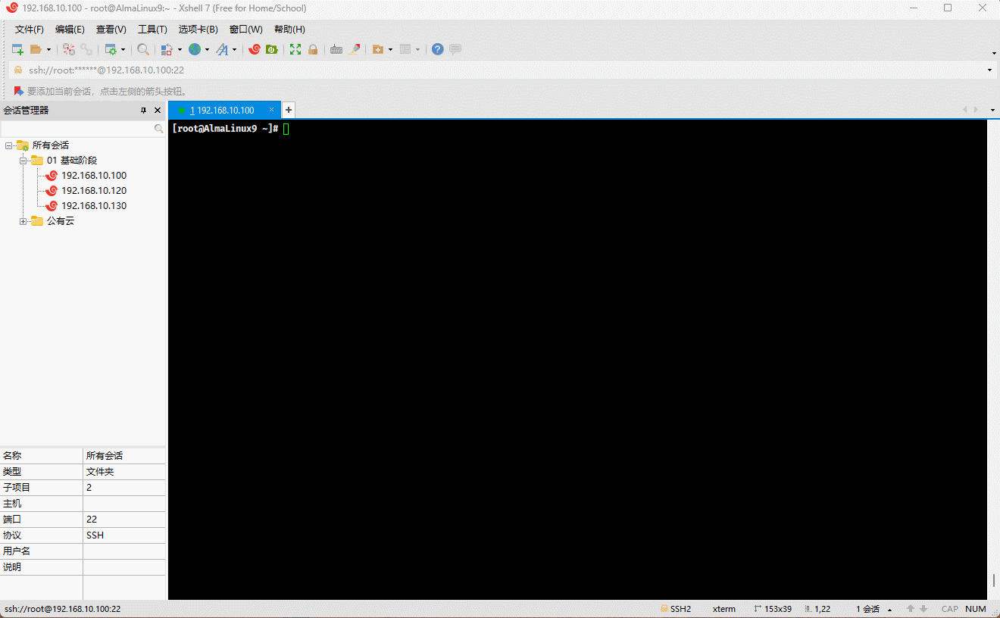


* 示例：显示 /etc/passwd 文件中不以 /bin/bash 结尾的行

```shell
grep -vE '/bin/bash$' /etc/passwd
```


* 示例：显示 root 用户的默认 SHELL 程序

```shell
cat /etc/passwd | grep "^root" | cut -d ":" -f7
```


* 示例：找出 /etc/passwd 中的两位或三位数

```shell
cat /etc/passwd | grep -oE "\b[0-9]{2,3}\b"
```


* 示例：显示 /etc/ssh/sshd_config 文件，需要排除掉空行和`#`开头的行

```shell
grep -v '^$' /etc/ssh/sshd_config | grep -v '^#'
```

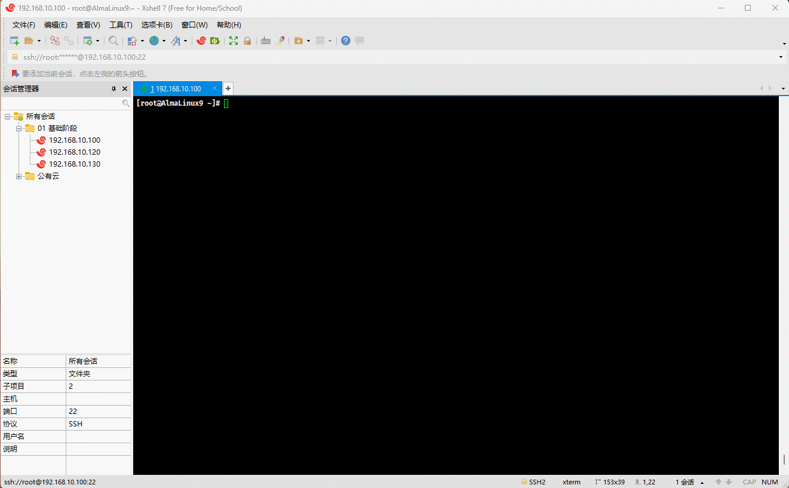

### 2.2.5 应用示例

* 准备工作：

```shell
cat > test.txt <<'EOF'
I am tom cat
I love linux.

my

I like badminton ball ,billiard ball and chinese
chess!
my blog is https://weiweixu.cn/ 

i not a team
i not a term
i not them
i not a tram 

# my blog is https://weiweixu.cn/，这就是注释，不要不服气！！我说是就是。

my qq is 1234567800
not 1234567800.
my god ,i am not tom,but Tom!

EOF
```

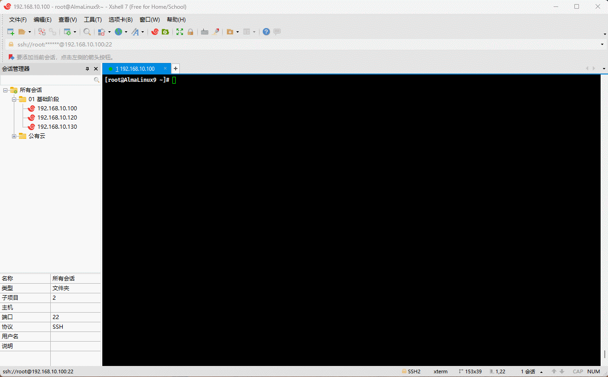


* 示例：显示以 m 开头的行

```shell
egrep '^m' test.txt
```

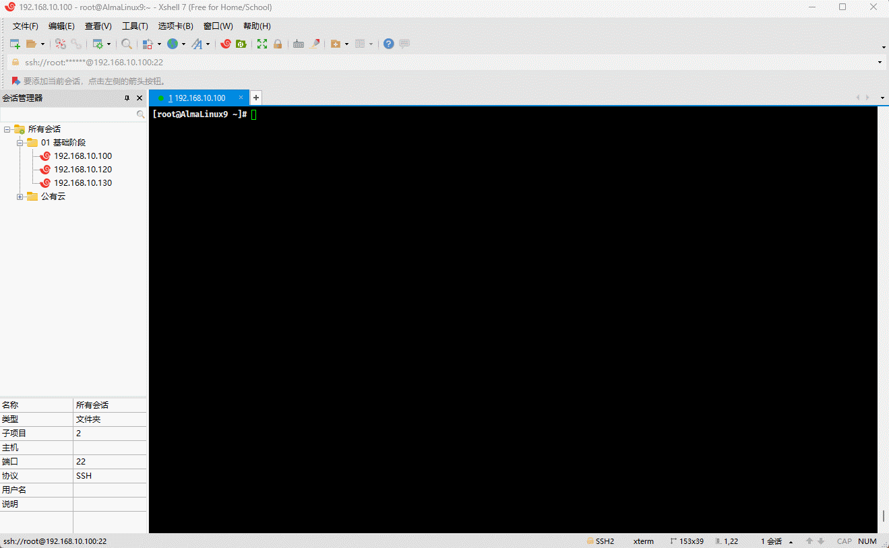


* 示例：显示以 0 结果的行

```shell
egrep '0$' test.txt
```


* 示例：显示某行只能包含 my 

```shell
egrep '^my$' test.txt
```

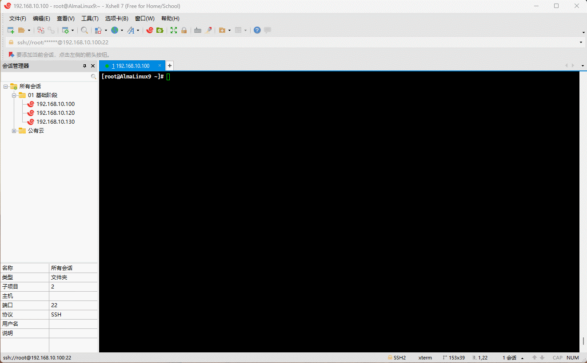


* 示例：排除掉空行

```shell
egrep -v '^$' test.txt
```


* 示例：排除掉空行和以 `#`  开头的行

```shell
egrep -v '^$' test.txt | egrep -v '^#'
```


* 示例：查询多个 `0` 出现的行

```shell
egrep '0*' test.txt
```


* 示例：显示以 `.` 结尾的行

```shell
egrep '\.$' test.txt
```

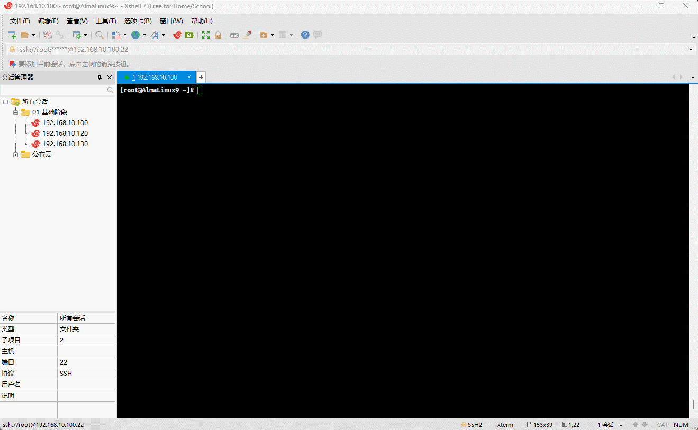


* 示例：查询以任意内容开头，直接 `am` 结尾的行

```shell
egrep '^.*am' test.txt
```

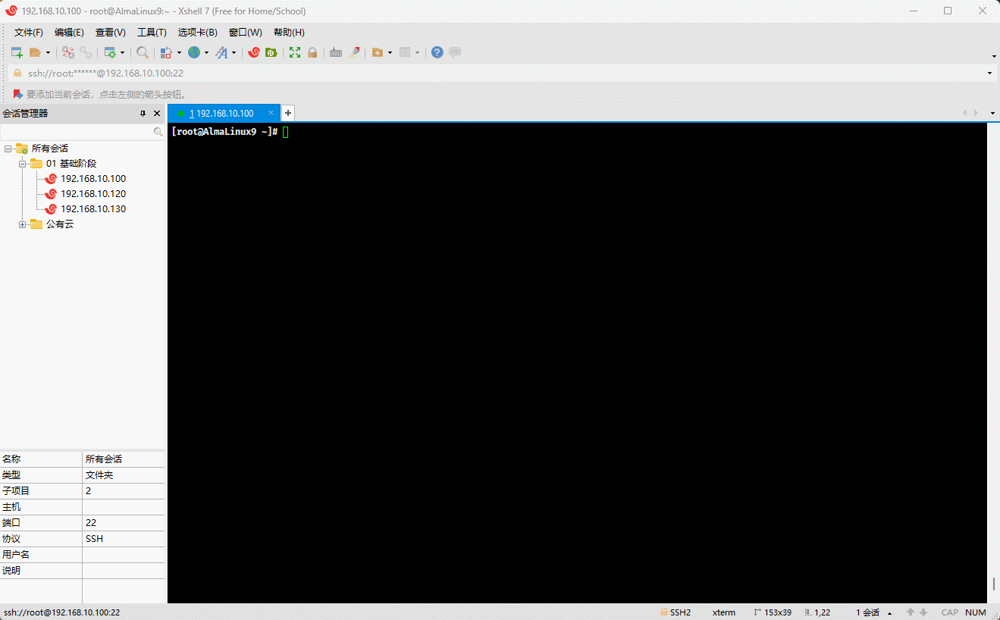


* 示例：查询包含 a 或 b 或 c 的行

```shell
egrep '[abc]' test.txt
```


* 示例：查询包含数字的行

```shell
egrep '[0-9]' test.txt
```


* 示例：查询包含小写字母的行

```shell
egrep '[a-z]' test.txt
```


* 示例：查询以 m 或 n 开头的行

```shell
egrep '^[mn]' test.txt
```


## 2.3 PCRE

### 2.3.1 概述

* 基本字符匹配：

| 类型     | 规则                                                         | 说明                                   |
| -------- | ------------------------------------------------------------ | -------------------------------------- |
| 普通字符 | `a`, `b`, `1`, `2` 等                                        | 匹配它们自身                           |
| 特殊字符 | `.`、`*`、`?`、`+`、`|`、`{`、`}`、`[`、`]`、`(`、`)`、`^`、`$`、`/` | 使用时需要转义，如： `\.` 匹配一个点。 |

- 元字符匹配：

| 元字符 | 说明                                                         |
| ------ | ------------------------------------------------------------ |
| `.`    | 匹配除换行符以外的任意字符                                   |
| `\d`   | 匹配任何一个数字，相当于 `[0-9]`                             |
| `\D`   | 匹配任何一个非数字字符，相当于 `[^0-9]`                      |
| `\w`   | 匹配任何一个字母、数字或下划线，相当于 `[a-zA-Z0-9_]`        |
| `\W`   | 匹配任何一个非字母、数字或下划线的字符，相当于 `[^a-zA-Z0-9_]` |
| `\s`   | 匹配任何一个空白字符，包括空格、制表符、换页符等             |
| `\S`   | 匹配任何一个非空白字符                                       |

* 边界匹配：

| 边界匹配 | 说明             |
| -------- | ---------------- |
| `^`      | 匹配字符串的开始 |
| `$`      | 匹配字符串的结束 |
| `\b`     | 匹配单词边界     |
| `\B`     | 匹配非单词边界   |

* 量词：

| 量词    | 说明                           |
| ------- | ------------------------------ |
| `*`     | 匹配前面的子表达式 0 次或多次  |
| `+`     | 匹配前面的子表达式 1 次或多次  |
| `?`     | 匹配前面的子表达式 0 次或 1 次 |
| `{n}`   | 匹配前面的子表达式恰好 n 次    |
| `{n,}`  | 匹配前面的子表达式至少 n 次    |
| `{n,m}` | 匹配前面的子表达式 n 到 m 次   |

* 分组和或：

| 规则    | 说明                                                         |
| ------- | ------------------------------------------------------------ |
| `(...)` | 分组，将表达式括起来作为一个整体处理，也用于捕获匹配的子字符串 |
| `|`     | 逻辑 OR 运算                                                 |

* 非贪婪量词

| 规则     | 说明                                        |
| -------- | ------------------------------------------- |
| `*?`     | 匹配前面的子表达式0次或多次，但尽可能少匹配 |
| `+?`     | 匹配前面的子表达式1次或多次，但尽可能少匹配 |
| `??`     | 匹配前面的子表达式0次或1次，但尽可能少匹配  |
| `{n,m}?` | 匹配前面的子表达式n到m次，但尽可能少匹配    |

### 2.3.2 应用示例

* 准备工作：

```shell
cat > test.txt <<'EOF'
张伟	13812345678
李娜	13987654321
王强	13765432109
刘洋	13654321098
陈静	13543210987
赵磊	14123456789442
孙丽	14234567890
周俊	1434567890132
吴涛	14456789012
郑敏	14567890123
马华	1467890123433
胡峰	14789012345444
朱琳	14890123456
高杰	14901234567
林霞	15012345678
何平	15123456789333
谢斌	15234567890
罗辉	15345678901333
韩雪	15456789012
曹阳	15567890123456789
EOF
```


* 示例：查询出符合中国大陆手机号码规则的用户名称

```shell
grep -P '\b1[3-9]\d{9}\b' test.txt
```


