# 第一章：Linux 四剑客（⭐）

## 1.1 概述

* Linux 中的用于`处理大规模的文本数据`，一般都需要使用 `grep` 、`sed`、`awk` 和 `find` 命令；所以，这几个命令也被人称为 Linux 四剑客。
* 其中，`grep` 命令用于在文本文件中`过滤`指定模式的行。
* 其中，`sed` 用于对文本文件进行`替换`、`删除`、`插入`等操作，即`编辑`操作。
* 其中，`awk` 用于对文本文件进行`按列`和`格式化`文本数据。
* 其中，`find` 命令用于`搜索`文件系统中`指定条件`的`文件`或`目录`。

> 注意⚠️：本次只讲解 `grep` 命令和 `find` 命令，因为其简单且容易掌握；其余的 `sed` 命令和 `awk` 命令后续讲解。

## 1.2 grep 命令

### 1.2.1 概述

* `grep` 是一个文本搜索工具，用于在`文件`或`管道`中`查找`（`过滤`）指定内容（`字符串`）的`行`，定义如下：

```
grep [-i][-n][-v] '字符串' [文件]...
```

* 对应的英文：`Global Regular Expression Print`，翻译为中文就是`全局正则输出`。
* 选项：
  * `-i`， `--ignore-case`：忽略大小写。
  * `-n`，`--line-number`：显示行号。
  * `-v`，`--invert-match`：反向匹配指定的字符串，即忽略指定内容的某些行。

> 注意⚠️：如果没有指定文件，则从标准输入中读取。

* `过滤`类似于`淘米`，通过`淘米筛`将一些`小的颗粒`以及`杂质`等`过滤`掉，只剩下`米`：


### 1.2.2 案例（基本使用） 

* 示例：从 /etc/passwd 文件中查找包含 root 的行

```shell
grep 'root' /etc/passwd
```

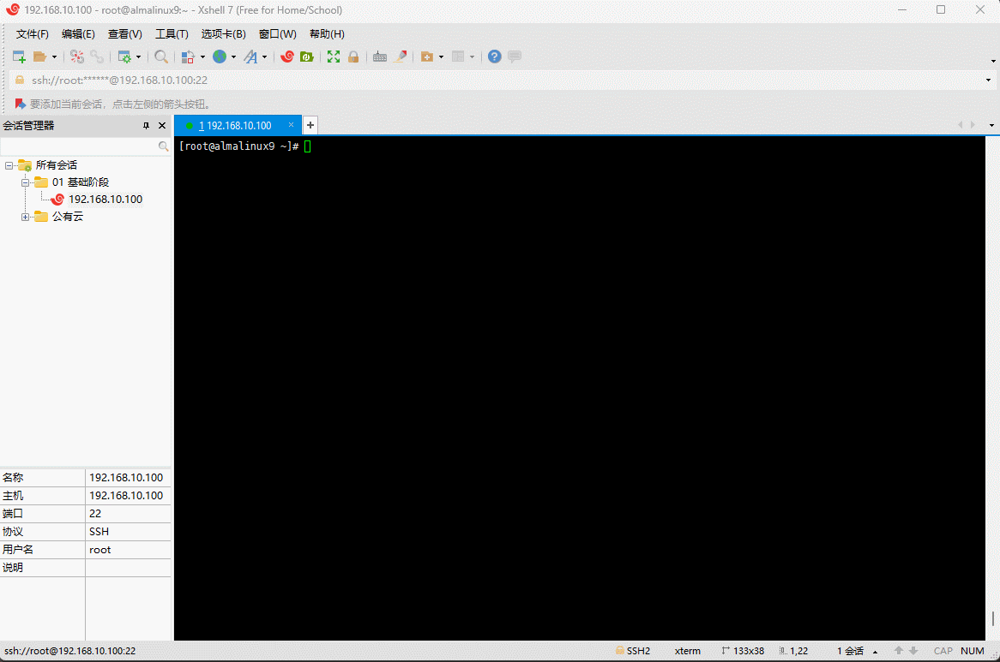


* 示例：查询 chronyd 日期同步进程

```shell
ps -ef | grep chronyd
```


* 示例：查询系统用户登录的错误信息

```shell
grep 'Failed password' /var/log/secure
```

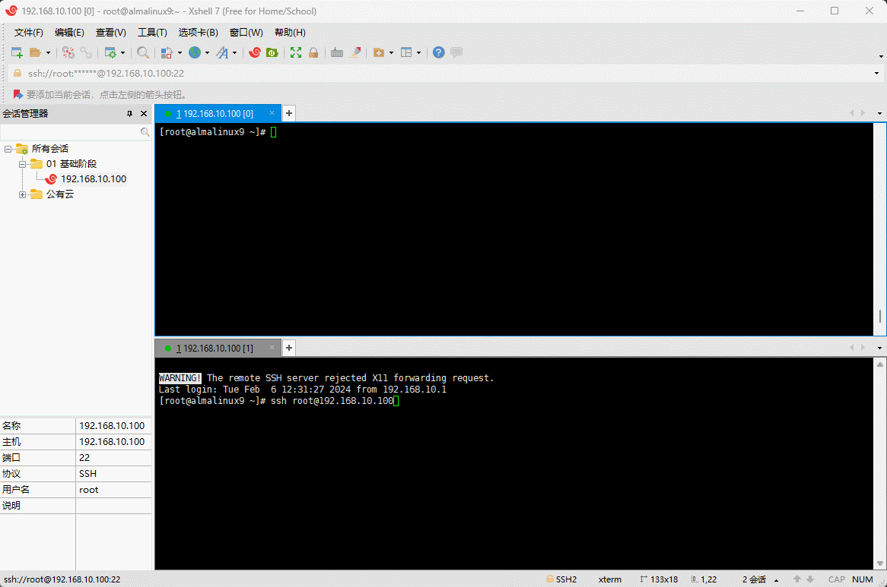


* 示例：统计系统用户登录的错误次数

```shell
grep 'Failed password' /var/log/secure | wc -l
```


### 1.2.3 案例（显示行号）

* 示例：从 /etc/passwd 文件中查找包含 root 的行以及行号

```shell
grep -n 'root' /etc/passwd
```

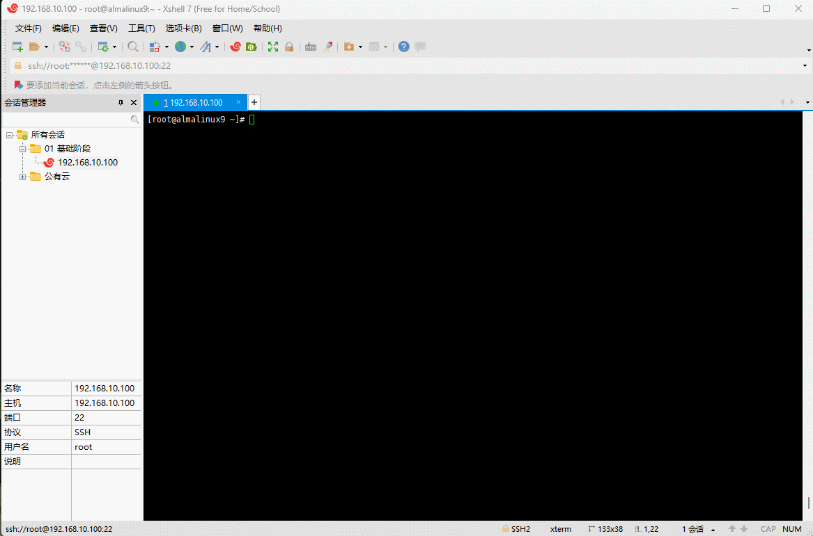


* 示例：查询系统用户登录的错误信息以及行号

```shell
grep -n 'Failed password' /var/log/secure
```


### 1.2.4 案例（不区分大小写）

* 场景：有的时候，我们也不清楚搜索的内容是大写还是小写；此时，就可以使用 `-i` 参数了。


* 示例：

```shell
grep -i 'failed passwod' /var/log/secure
```


### 1.2.5 案例（排除）

* 场景：有的时候，我们不需要具体查询的内容；但是，我们知道要排除什么内容；此时，就可以使用 `-v` 参数了。


* 示例：查询 chronyd 日期同步进程

```shell
ps -ef | grep -i chronyd | grep -v grep
```

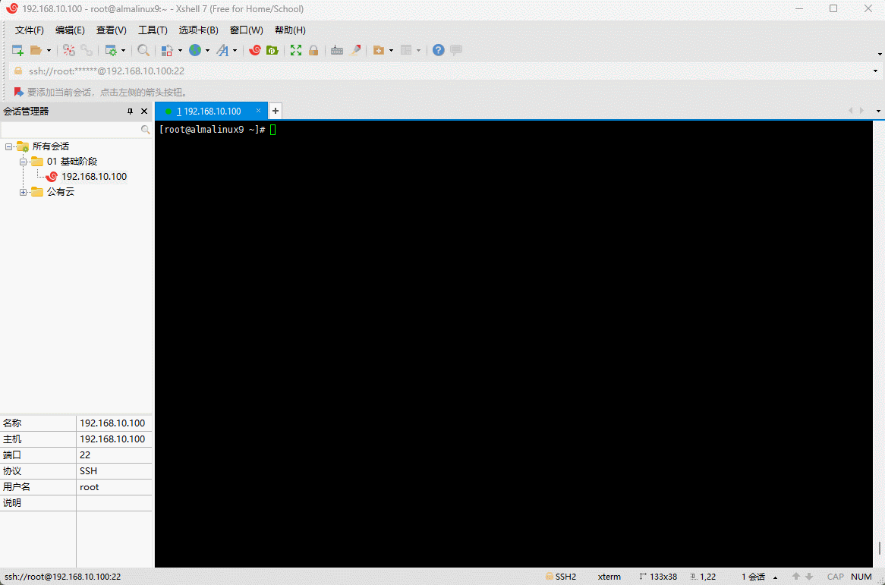

## 1.3 find 命令

### 1.3.1 概述

* `find` 命令用于`搜索`文件系统中`指定条件`的`文件`或`目录`，定义如下：

```shell
find [path...] [-type xxx][-name xxx][-size xxx][-mtime xxx]
```

* 参数：`path...`，指定要搜索的目录路径；默认是当前目录。
* 选项：

| 选项         | 说明                     | 备注                                                         |
| ------------ | ------------------------ | ------------------------------------------------------------ |
| -type [d\|f] | 根据文件类型的类型查找。 | f 表示文件，d 表示目录。                                     |
| -name xxx    | 要文件或目录的名称查找。 |                                                              |
| -size xxx    | 根据文件的大小查找。     | `+10k` 表示大于 10k，`-10k` 表示小于 10k，单位是：k、M、G 等。 |
| -mtime xxx   | 根据文件的修改时间查找。 | `-7` 表示最近 7 天内的文件，`+7` 表示 7 天之前的文件。<br>m 表示 modify ，翻译为中文是`修改`的意思。 |

> 注意⚠️：在实际工作中，通常我们使用 find 命令的场景是`在指定目录中查找想要的文件`。

### 1.3.2 案例（基本使用）

* 示例：查找名为 hostname 的文件（精确查找）

```shell
find / -type f -name 'hostname'
```


* 示例：查找名为 ls 的文件（精确查找）

```shell
# ls 是命令，在 Linux 中，万物皆是文件；所以，ls命令也是文件
find / -type f -name 'ls'
```

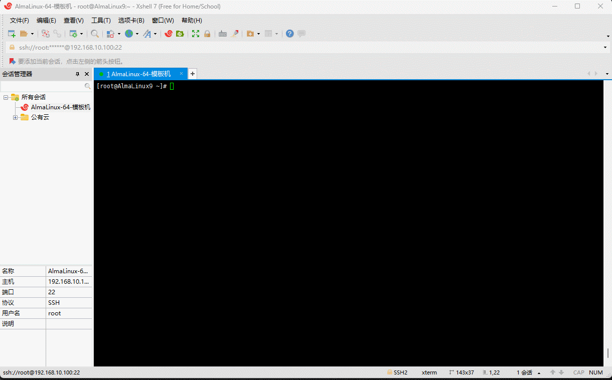


* 示例：查找 /etc 目录下名为 hostname 的文件（精确查找）

```shell
find /etc -type f -name 'hostname'
```


* 示例：查找 /etc 目录下以 `.conf` 结尾的文件（模糊查找，常用）

```shell
# * 表示任意，*.conf 就是任意以 .conf 结尾的文件，如：nginx.conf 等
find /etc -type f -name '*.conf'
```


### 1.3.3 案例（根据文件大小查找）

* 示例：查询 /etc 和 /tmp 目录下等于 10kb 的文件

```shell
# size 是大小的意思，-size 10k 表示 10kb 的文件
find /etc /tmp	-type f -size 10k
```


* 示例：查询 /etc 和 /tmp 目录下大于 100kb 的文件（常用）

```shell
# size 是大小的意思，-size +10k 表示大于 100kb 的文件
find /etc /tmp	-type f -size +100k
```

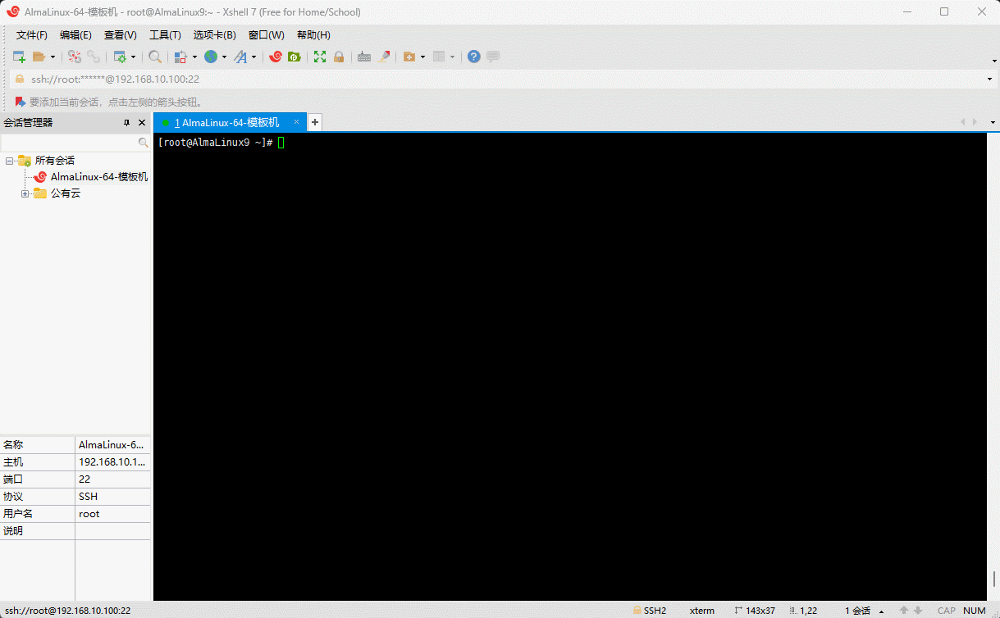


* 示例：查询  /etc 和 /tmp 目录下小于 1kb 的文件

```shell
# size 是大小的意思，-size -5k 表示小于 1kb 的文件
find /etc /tmp	-type f -size -1k
```


### 1.3.4 案例（根据修改时间查找）

* 时间是一维的，和 size 不一样，是去`过去的时间`中查找，如下所示：

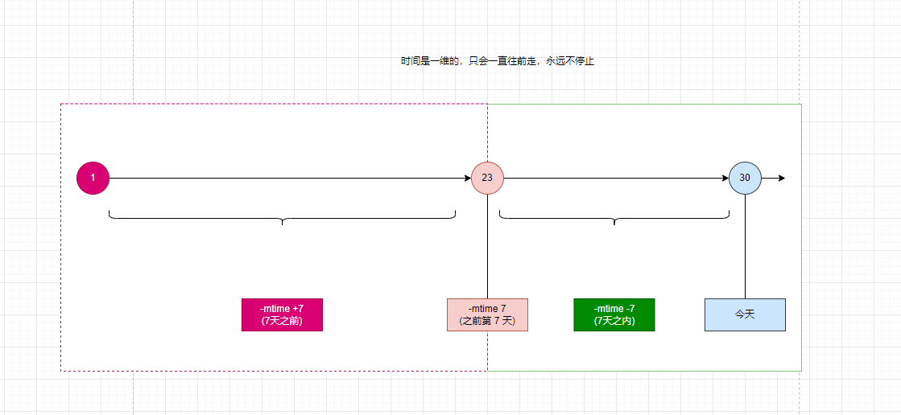


* 示例：查找最近 5 天内修改的文件

```shell
find /etc -type f -mtime -5
```


* 示例：查找 /etc 目录下 1000 天前以 `.conf` 结尾的文件

```shell
find /etc -type f -mtime +1000 -name '*.conf'
```


### 1.3.5 案例（综合案例）

* 示例：查找 /etc 目录下以 `.conf` 结尾的，文件大于 10kb 以及修改时间是 7 天之前的文件

```shell
find /etc -type f -size +10k -mtime +7 -name '*.conf'
```


### 1.3.6 案例（进阶案例，了解）

* 示例：查找文件的时候，指定目录的层级（深度）

```shell
#  -maxdepth 2 就是目录最大的层级（深度）2 ；不加就是所有层；并且必须是选项的第一个。
find / -maxdepth 2  -type f -size +2k -mtime +15 -name '*.conf'
```


* 示例：查找文件的时候，不区分文件名的大小写

```shell
# -iname 不区分文件名的大小写
find /etc -type f -size +10k -mtime +7 -iname '*.conf'
```


# 第二章：find 命令高级用法（⭐，难点）

## 2.1 概述

* find 命令可以和其它的命令配合使用，以便处理复杂的任务，如：
  * ① find + 简单命令（ls、head、less 、grep 等）：查看某些文件的详细信息、显示文件的内容、过滤等。
  * ② find + 打包压缩命令（tar 等）：find 找出某些文件后进行压缩。
  * ③ find + 复制或移动命令（cp、mv）：find 找出某些文件后将其进行复制或移动。
* 环境准备：

```shell
mkdir -pv /tmp/find
```

```shell
touch /tmp/find/linux{01..10}.txt
```


## 2.2 find + 简单命令

### 2.2.1 概述

* 需求：通过 find 查询 /tmp/find 目录下以 `.txt` 结尾的文件的详细信息。

> 注意：
>
> * ① find 通常可以和 ls 、rm 、cat、head、grep 等命令组合使用。
> * ② find 不要和交互式命令，如：vi、vim ，搭配使用。
> * ③ 在 Linux 中，\`\` 和 `$()`一样都是[重定向](https://aexiar.github.io/linux/notes/01_linux_basic/05_xdx/#_6-5-%E8%A1%A5%E5%85%85)符号，里面的命令将会优先执行。


* 示例：

```shell
ls -lah `find /tmp/find -type f -name '*.txt'`
```

```shell
ls -lah $(find /tmp/find -type f -name '*.txt')
```


### 2.2.2 引出 xargs 

* 如果上述的需求，我们使用管道符 `|` 来完成，如下所示：

```shell
find /tmp/find -type f -name '*.txt' | ls -lah
```


* 我们会发现很奇怪，结果完全不对，此时我们就需要 xargs 来解决，如下所示：

```shell
find /tmp/find -type f -name '*.txt' | xargs ls -lah
```

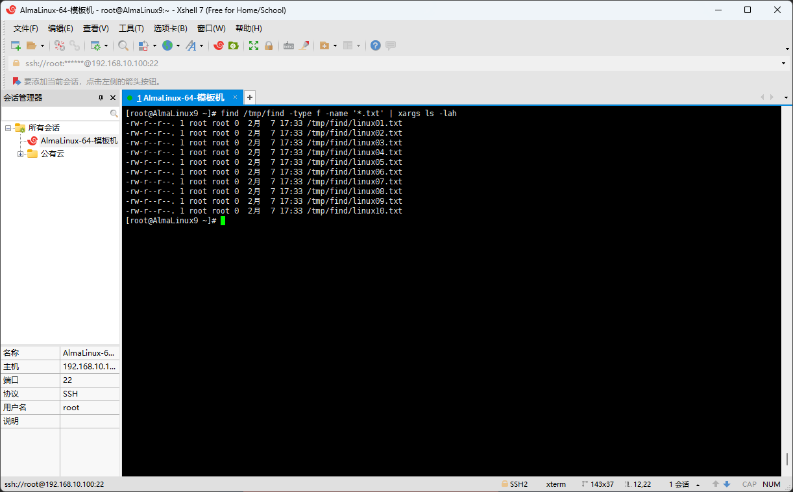

* 再次回顾命令的格式，如下所示：

```shell
命令（command） [选项](option) [参数](arguments/parameter)
```

* 其命令格式说明：

| 类别 | 说明                                       | 备注                                        |
| :--- | :----------------------------------------- | :------------------------------------------ |
| 命令 | Linux 中通过`命令`控制整个操作系统。       | 通常而言，命令是单词或单词缩写。            |
| 选项 | 就是`功能`，不同的`选项`对应不同的`功能`。 | 通常而言，选项会使用加上 `-` 或 `--` 前缀。 |
| 参数 | 命令处理的`目标`                           |                                             |

> 注意⚠️：并不是所有的命令`都遵循`上述的格式，有些命令就只有命令，而没有选项或参数，如：`pwd` 等。

* ls 命令的格式如下：

```shell
ls [选项]... [文件]...
```

* 我们通常会这么使用，即：

```shell
ls -lah /tmp/find
```

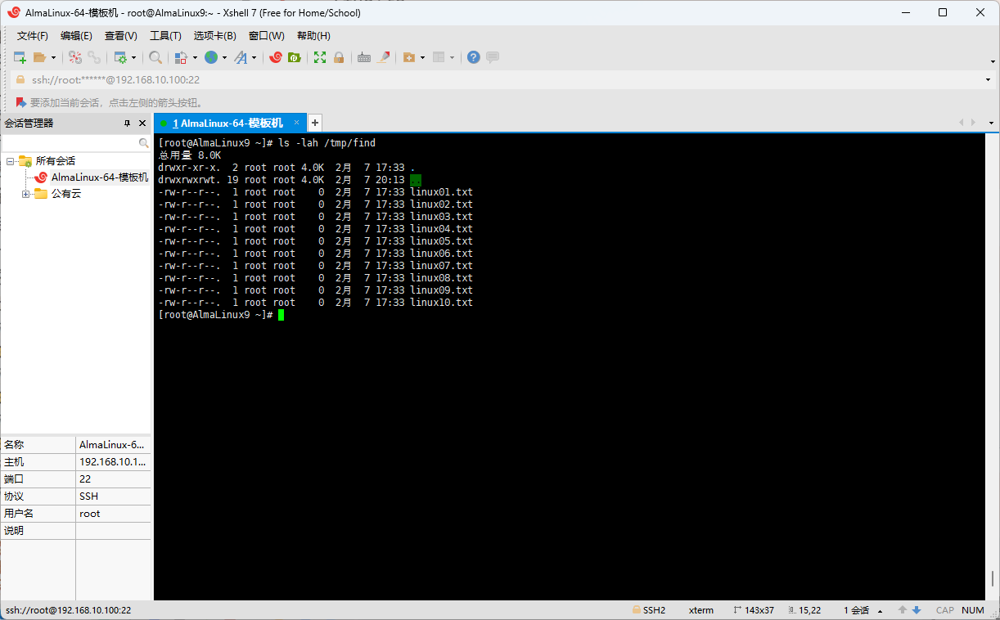

* 也会这么使用，即：

```shell
# 如果文件的路径不写，默认是当前目录，即 .
ls -lah
```


> 注意⚠️：ls 命令默认情况下，是不能读取标准输入的。

* 而 grep 命令的格式是这样的，即：

```shell
grep [-i][-n][-v] '字符串' [文件]...
```

> 注意⚠️：如果没有指定文件，则从标准输入中读取。

* 所以，对于 grep 而言，可以直接使用管道符，即：

```shell
# 因为 grep 可以读取标准输入
ps -ef | grep sshd
```


* 既然，ls 在默认情况下，不能读取标准输入；那么，就可以 xargs 将标准输入转换为命令行参数，即：


* 那么，xargs 的作用是什么？xargs 就是将`管道的标准输入`转换为`某些命令`的`命令行参数`，因为某些命令是不能读取标准输入的，如：ls 命令。
* 可能，你还是不能理解上面的逻辑，可以手动模拟下，即：

```shell
cat > test.txt <<EOF
a b c d e f g
h i j k l m n
o p q
r s t
u v w x y z
EOF
```

```shell
cat test.txt | xargs
```


* 所以，`| xargs` 就是通过这样的方式，将`上一个命令`的`标准输出`通过 `|xargs`转换为`单行 + 空格`的方式`添加到`命令的`参数位置`，进而完成某些命令不支持读取标准流，也能通过管道来使用。
* 默认情况下，管道是没有办法将`上一个命令`的`标准输出`转变为`下一个命令`的`参数`，即：

```
ls -lah '/tmp/find/linux01.txt
/tmp/find/linux02.txt
/tmp/find/linux03.txt
/tmp/find/linux04.txt
/tmp/find/linux05.txt
/tmp/find/linux06.txt
/tmp/find/linux07.txt
/tmp/find/linux08.txt
^Cmp/find/linux09.txt
/tmp/find/linux10.txt'
```

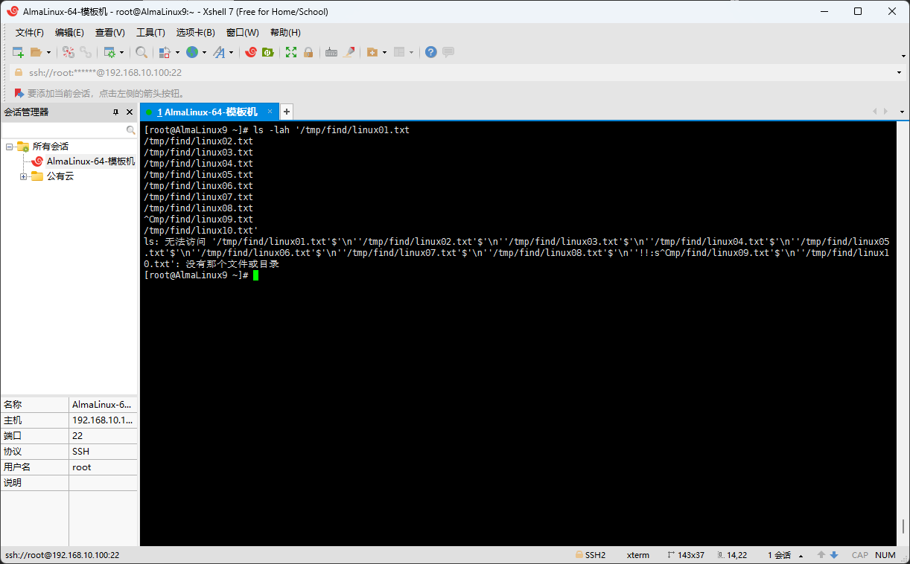

* 会导致传递失败，默认情况下，上一条命输出的内容就被丢弃；所以，就相当于如下的命令，即：

```shell
ls -lah 
```


* 所以，当然会显示`当前目录`下文件的`详细信息`了；解决方案，就是通过 `|xargs`将`上一个命令`的`标准输出`转换为`单行 + 空格`的方式`添加到`命令的`参数位置`，进而完成某些命令不支持读取标准流，也能通过`管道`来使用。

## 2.3 find + 打包压缩命令

* 需求：通过 find 查询 /tmp/find 目录下以 `.txt` 结尾的文件，并通过 tar 命令进行打包。


* 示例：

```shell
tar -zcvf find.tar.gz $(find /tmp/find -type f -name '*.txt')
```


* 示例：

```shell
find /tmp/find -type f -name '*.txt' | xargs tar -zcvf find.tar.gz
```


## 2.4 find + 复制或移动命令

* 需求：通过 find 查询 /tmp/find 目录下以 `.txt` 结尾的文件，并复制到 /tmp 目录下

> 注意⚠️：在使用 find + cp 或 mv 命令的时候，尽量选择 find + cp 组合，防止出现数据丢失等情况。


* 示例：

```shell
cp `find /tmp/find -type f -name '*.txt'` /tmp
```


* 示例：

```shell
find /tmp/find -type f -name '*.txt' | xargs cp -t /tmp
```


# 第三章：别名（⭐）

## 3.1 概述

* Linux 中的`别名`是一种将`常用`或`复杂的命令`简化为`简短名称`的功能：当用户输入`别名`的时候，Linux 会自动将其替换为`完整的命令`。
* 在 AlmaLinux 中，最为常见的别名就是 `ll` ，相当于 `ls -l --color=auto`，即：

```shell
alias ll='ls -l --color=auto'
```

* Linux 中命令的`别名`的应用场景：
  * ① `命令简化`：将`长命令`简化为`短别名`，如：`ls -l` 简化为 `ll`。
  * ② `防止误操作`：为`可能产生严重后果的命令（危险命令）`添加别名，以便`增加`确认步骤，如：`alias rm='rm -i'`。
  * ③ `命令组合`：将`一系列的命令`组合成一个`别名`，以便`快速`执行，如：`alias deploy='git pull && npm install && npm run build'`。
  * ④ `提高工作效率`：`为频繁执行`的命令创建别名，减少重复输入。

> 注意⚠️：
>
> * ① 可以将`别名`理解为`命令`的`昵称`、`爱称`，如：孩子的小名 --- 狗蛋、狗剩，QQ 账号的昵称 --- 天下无敌。
> * ② 在 Linux 中命令的解析顺序是：`别名 > 内部命令 > 外部命令`。这个顺序允许用户通过定义别名来覆盖内置命令的默认行为，或者通过命令的名称来覆盖系统中的外部命令。然而，也正因为这个原因，当不同类型的命令使用相同的名称时，可能会导致意外的行为，所以在定义别名或选择命令名称时需要小心。

* 查看系统已有的别名：

```shell
alias
```


* 查看别名对应的完整命令：

```shell
alias ll
```

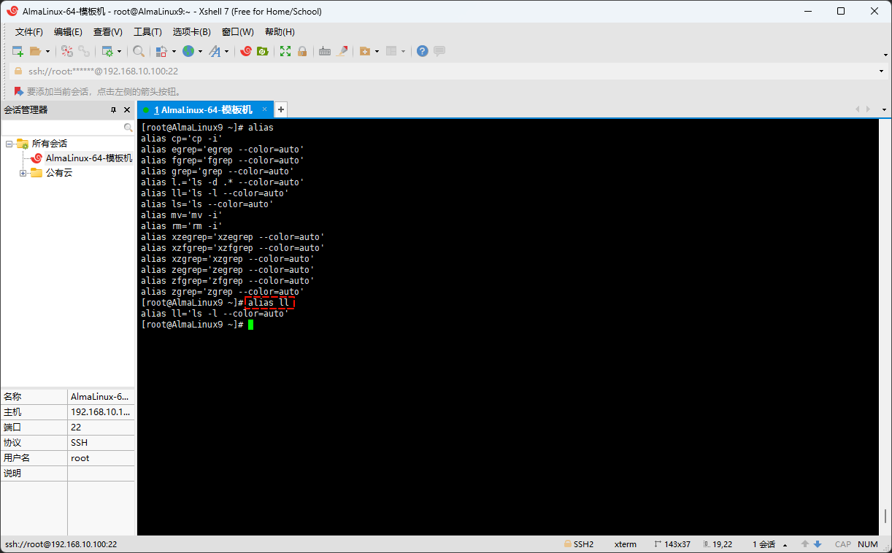

## 3.2 临时设置别名

* 在当前会话中，临时设置别名(重启或重新登录失效)：

```shell
alias 别名='命令'
```

> 注意⚠️：在别名存在的情况下，如果真的想要执行对应的命令，有如下的两种方式
>
> * ① 使用`命令`的`绝对路径`，如：`/bin/rm` 。
> * ② 使用`\别名`，如：`\rm xxx`。


* 示例：

```shell
alias rm='echo rm is not found,please use mv'
```


## 3.3 永久设置别名

* 如果要想别名在每次登录的时候都生效，则需要将其添加到 Shell 对应的配置文件中。

* 永久设置别名的步骤如下：

  * ① 修改配置文件：

  ```shell
  echo "alias rm='echo rm is not found,please use mv'" >>  ~/.bashrc
  ```

  * ② 让配置生效（加载配置）：

  ```shell
  # source /etc/profile
  source ~/.bashrc 
  ```

> 注意⚠️：
>
> * ① 对于 bash 而言，通常是 `~/.bashrc`；对于 zsh 而言，通常是 `~/.zshrc`。
> * ② 可以通过在命令行输入 `echo $SHELL` 查看当前默认的 shell 。
> * ③ `~/.bashrc`仅仅对当前用户有效，而 `/etc/profile` 对全局（所有用户）生效。
> * ④  如果要想`注释`配置文件 `~/.bashrc` 的别名信息，只需要修改此配置文件，在指定的别名前加上 `#`，再重新加载配置文件即可。


* 示例：

```shell
# 备份
cp ~/.bashrc ~/.bashrc.back
```

```shell
# 注释掉 alias rm=‘rm -i’，就是添加 # 
sed -i 's/alias rm/# alias rm/g' ~/.bashrc
```

```shell
# 将配置写入到配置文件中
echo "alias rm='echo rm is not found,please use mv'" >>  ~/.bashrc
```

```shell
# 加载配置文件
source ~/.bashrc
```

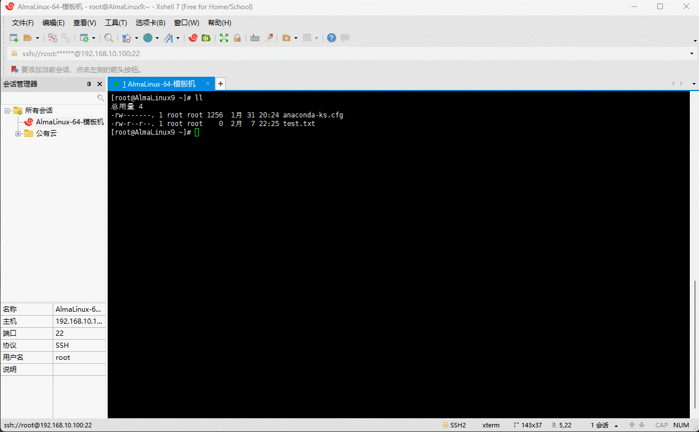

