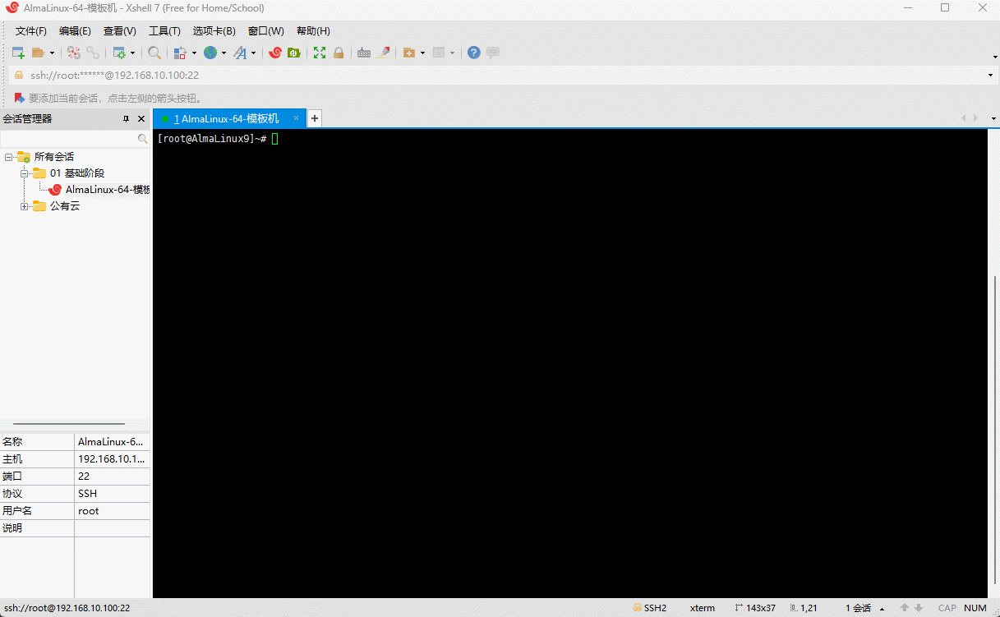
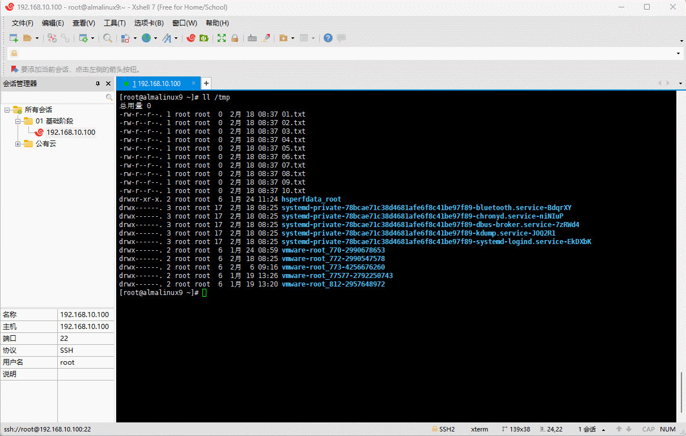

# 第一章：手动搭建 YUM 私有仓库

## 1.1 概述

* 我们借助 httpd 服务器软件来搭建 YUM 仓库，并作为其它服务器的 YUM 源，即：


> 注意⚠️：
>
> * ① Linux 服务器（YUM 仓库）的地址是 192.168.10.120 ，而 Linux 服务器（内网）的仓库是 192.168.10.100 。
> * ② 实际工作中，推荐使用 `nexus3` 来搭建 YUM 仓库。

* 所有的服务器（YUM 仓库和内网）均需关闭防火墙，以防止防火墙干扰实验：

```shell
systemctl disable --now firewalld
```


## 1.2 配置 Linux 服务器（YUM 仓库）

* 前提条件：Linux 服务器（YUM 仓库）需要挂载 CD-DVD （ISO 镜像文件），即：


> 注意⚠️：在实际工作中，无需挂载 CD-DVD ，因为 CD-DVD 已经属于淘汰的技术了，可以将 CD-DVD 中的数据复制到指定的目录中。

* 安装 httpd 服务器：

```shell
dnf -y install httpd
```


* 在 `/var/www/html` 目录下创建 `almalinux/9` 目录：

```shell
cd /var/www/html
```

```shell
mkdir -pv almalinux/9
```


* 查看块设备情况：

```shell
lsblk -f
```


* 将 CD-ROM 挂载到 `/var/www/html/almalinux/9` 中：

```shell
mount /dev/sr0 /var/www/html/almalinux/9
```



* 启动 httpd ：

```shell
systemctl enable --now httpd
```


* 通过浏览器测试访问：

```shell
http://192.168.10.120/almalinux/9
```


* 对于像 extras 这样的 YUM 仓库，在 CD-ROM 中是不存在，可以使用如下的命令，将互联网上的 YUM 仓库下载到本地：

```shell
dnf reposync --repoid=extras --download-metadata -p /var/www/html/almalinux
```

> 注意⚠️：
>
> * ① 之所以这么配置，是因为 `/var/www/html/almalinux/9` 是挂载目录，而挂载目录是只读的，不可以创建和删除内容。
> * ② 上述配置的前提是，本机有 extras 仓库，并且该仓库是开启状态。



* 通过浏览器查看 extras 仓库：

```shell
http://192.168.10.120/almalinux/
```


## 1.3 配置 YUM 源

* 所有的内网服务器配置 YUM 源：

```shell
dnf config-manager --disable \* # 关闭所有的仓库
```

```shell
tee /etc/yum.repos.d/test.repo <<-'EOF'
[test-baseos]
name=AlmaLinux $releasever - test-BaseOS
baseurl=http://192.168.10.120/almalinux/9/BaseOS/
enabled=1
gpgcheck=1
countme=1
gpgkey=http://192.168.10.120/almalinux/9/RPM-GPG-KEY-AlmaLinux-9
metadata_expire=86400
enabled_metadata=1

[test-BaseOS]
name=AlmaLinux $releasever - test-AppStream
baseurl=http://192.168.10.120/almalinux/9/AppStream/
enabled=1
gpgcheck=1
countme=1
gpgkey=http://192.168.10.120/almalinux/9/RPM-GPG-KEY-AlmaLinux-9
metadata_expire=86400
enabled_metadata=1

[test-extras]
name=AlmaLinux $releasever - test-extras
baseurl=http://192.168.10.120/almalinux/extras/
enabled=1
gpgcheck=1
countme=1
gpgkey=http://192.168.10.120/almalinux/9/RPM-GPG-KEY-AlmaLinux-9
metadata_expire=86400
enabled_metadata=1
EOF
```


* 生成缓存：

```shell
dnf makecache
```


* 安装软件进行测试：

```shell
dnf -y install java-21*
```


