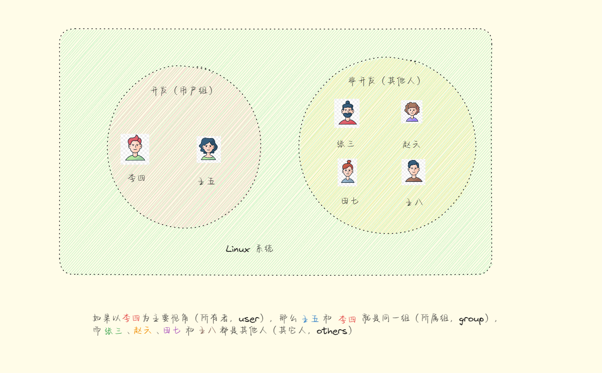
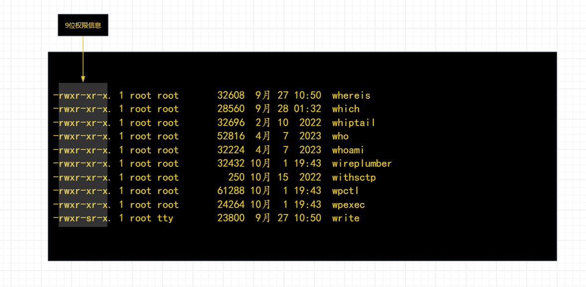
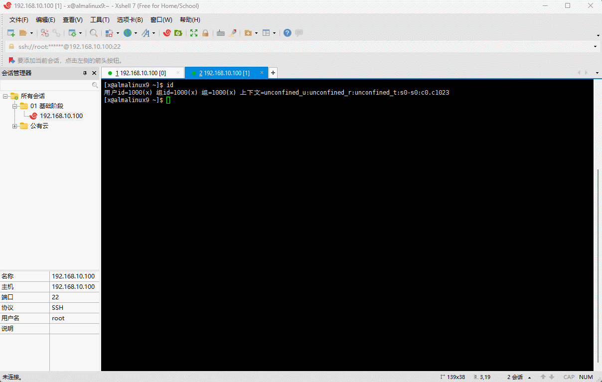
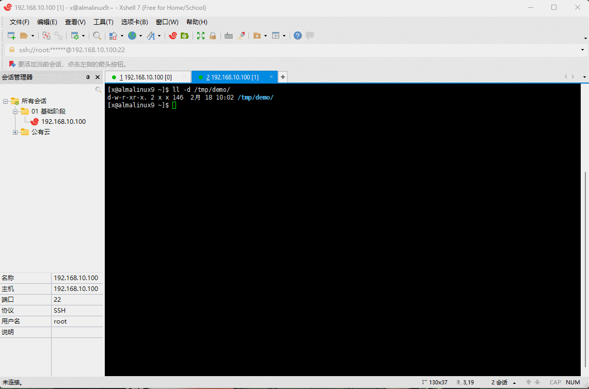
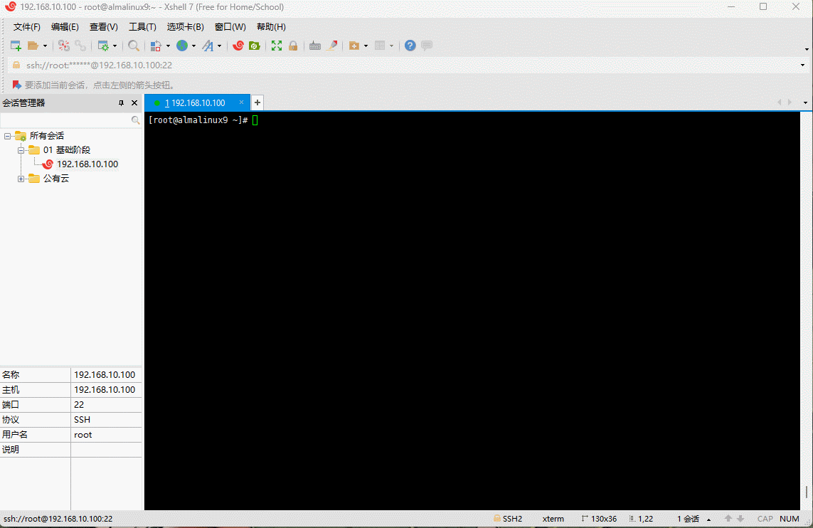
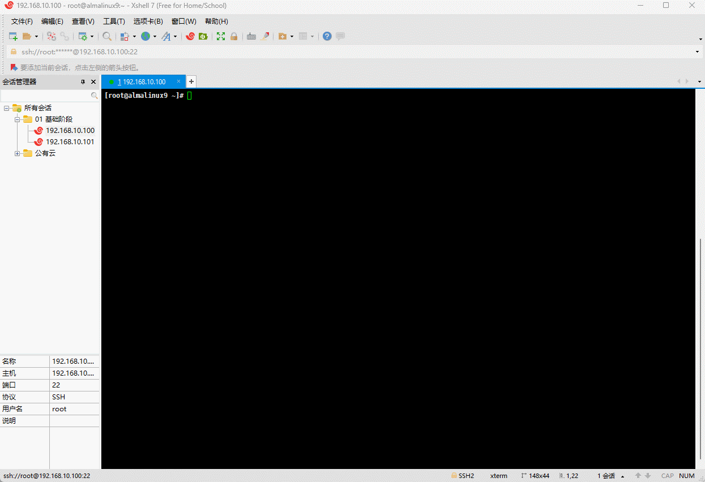
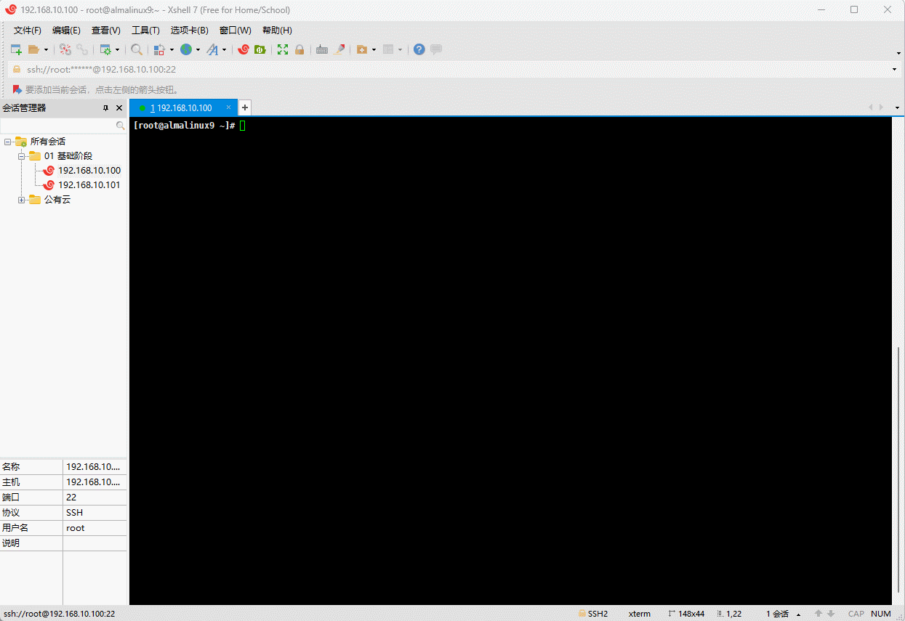
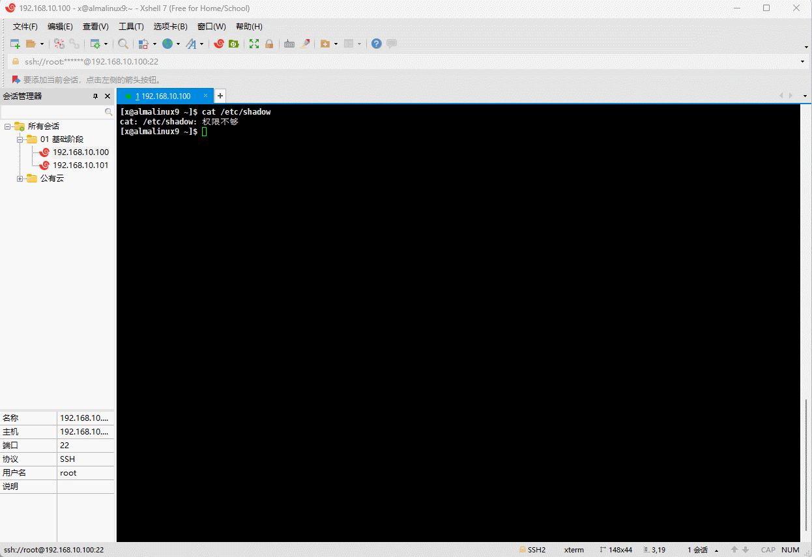
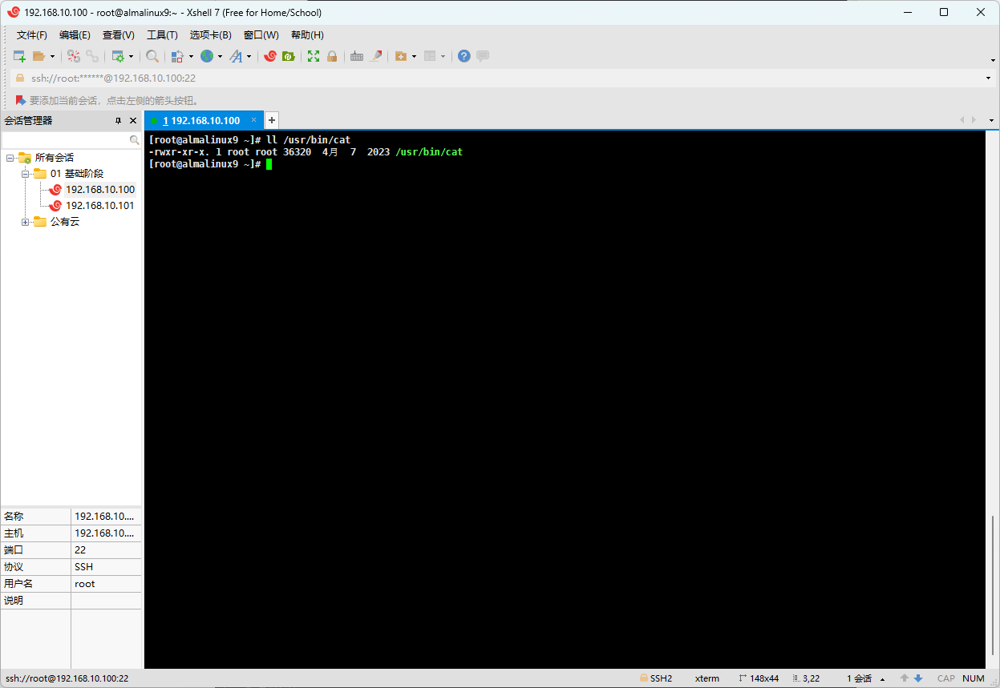
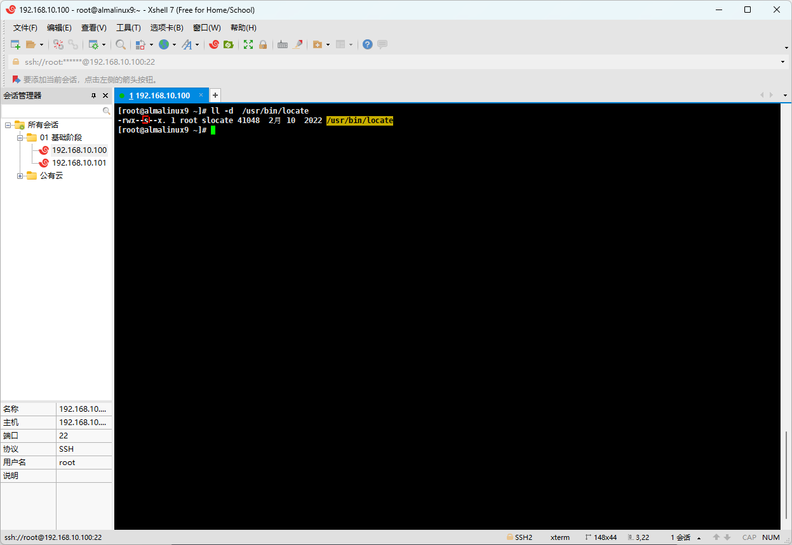

# 第一章：Linux 进程管理概述

## 1.1 程序、进程和守护进程

### 1.1.1 概述

* `程序`（Program）、`进程`（Process）和`守护进程`（Daemon）是计算机科学中的基本概念，它们在`操作系统`和`软件开发`中扮演着重要的角色。

### 1.1.2 程序（Program）

- `程序`是一组指令的集合，这些指令是用`某种编程语言`编写的，用于`完成特定的任务`。
- `程序`是静态的，除非删除，否则可以永久存在，通常`存储`在`磁盘`上，如：`win` 系统上的 `QQ.exe` ，`Linux` 系统上的 `zabbix-agent2-6.0.7-1.el9.x86_64.rpm`。

> 注意⚠️：在实际工作中，我们也称`程序`为`软件包`。

- `程序`本身并不直接参与计算机的运行，而是通过`进程`来实现的。
- 程序可以是任何类型的软件，比如：文本编辑器、游戏、数据库管理系统等。它们在用户需要执行特定功能时被启动。

### 1.1.3 进程（Process）

- `进程`是`程序`在计算机中的`一次执行实例`。它是操作系统分配资源（如：CPU 时间、内存）的基本单位。每个进程都有一个唯一的进程标识符（PID），并且拥有自己的内存空间、数据和代码。
- 在多任务操作系统中（win、Linux 等），用户可以同时运行多个进程。例如：我们可以同时运行一个浏览器、一个音乐播放器和一个文本编辑器，每个都是一个独立的进程。

> 注意⚠️：
>
> * ① 程序是静态的，而进程是动态的。
> * ② 程序是指令的集合，进程是这些指令在执行时的状态。
> * ③ 一个程序可以有多个进程，每个进程可以有自己独立的执行环境。

### 1.1.4 win 中的程序和进程

* 在 win 系统中，我们可以通过任务管理器查看`程序`和`进程`；不过，win 中会将`正在运行的程序`显示因为`应用`。


* 我们也知道，一个程序可能包含多个进程，即：


* 我们也知道，程序是静态的，并且为了方便我们使用，通常开发者都会将程序封装成指定操作系统的安装包，如：win 中的 `*.exe` 等，即：



* 下载到桌面上就是这样的，即：


### 1.1.5 守护进程（Daemon）

- `守护进程`是一种`特殊`的`进程`，它`运行`在`后台`，独立于控制终端。
- 守护进程`通常`在`系统启动`的时候`启动`，并在后台`持续运行`，为系统提供各种服务。守护进程通常不与用户直接交互，而是通过系统调用或其他进程来响应请求。
- 守护进程通常用于管理系统任务，如：网络服务、日志记录、定时任务等。
- 在 Unix 和类 Unix 系统中，守护进程通常以小写字母 `"d"` 结尾的进程名运行。

> 注意⚠️：
>
> * ① 与普通进程相比，守护进程通常不与用户交互，它们在后台运行，不需要用户直接控制。
> * ② 守护进程通常具有更高的权限，以便执行系统级别的任务。
> * ③ 有的时候，我们也称`守护进程`为`后台进程`或`服务`。

### 1.1.6 win 中的守护进程

* 在 win 系统中，我们可以也通过任务管理器查看`守护进程`；只不过，在 `win` 中将`守护进程`称为`后台进程`。



## 1.2 进程的分类（异常进程）

### 1.2.1 概述

* 在 Linux 系统中，一个进程大致会经历如下的生命周期：
  * ① **创建（New）**：进程开始于创建状态，此时操作系统为进程分配资源，如：内存空间、进程控制块（PCB）等。
  * ② **就绪（Ready）**：创建完成后，进程进入就绪状态，等待CPU调度执行。在这个阶段，进程已经准备好运行，但尚未被分配到 CPU。
  * ③ **运行（Running）**：当进程被调度器选中并获得 CPU 时间片时，它进入运行状态。在这个阶段，进程执行其任务。
  * ④ **等待（Waiting）**：如果进程在执行过程中需要等待某些事件（如：I/O操作完成），它将进入等待状态。在这个阶段，进程暂停执行，直到等待的事件发生。
  * ⑤ **挂起（Suspended）**：在某些操作系统中，进程可能会被挂起，这意味着它的执行被暂停，并且其状态信息被保存到辅助存储设备（如：硬盘）。这通常发生在内存不足时，以便为其他进程腾出空间。
  * ⑥ **恢复（Resume）**：当挂起的进程需要恢复执行时，它的状态信息会被重新加载到内存中，然后进入就绪状态，等待再次被调度。
  * ⑦ **终止（Termination）**：进程完成任务或被操作系统终止后，进入终止状态。操作系统回收进程占用的资源，包括：内存、文件描述符等，并释放进程控制块。
* 其对应的流程图如下：


* 但是，Linux 是多用户多任务（多进程）的操作系统（同样，win 也是多用户多任务的操作系统），为了提高程序的执行效率，必然支持多进程，流程如下：
  * ① **父进程创建子进程**：父进程通过系统调用（如：`fork()`）创建一个新的子进程。这个操作会复制父进程的地址空间和资源，创建一个几乎完全相同的子进程。
  * ② **子进程初始化**：子进程在创建后，会执行一些初始化操作，如：设置进程ID（PID）、父进程ID（PPID）、以及其他必要的状态信息。
  * ③ **父子进程执行**：父进程和子进程可以独立执行。子进程通常会执行一些特定的任务，而父进程可能继续执行其他任务或等待子进程完成。
  * ④ **子进程执行结束**：当子进程完成任务后，它会调用`exit()`系统调用来结束自己的执行。此时，子进程的状态变为 “终止”。
  * ⑤ **父进程回收子进程状态**：父进程需要通过`wait()`或`waitpid()`系统调用来回收子进程的状态信息。这包括子进程的退出状态码，以及释放子进程占用的资源。
  * ⑥ **父进程结束**：当父进程`完成任务`或`遇到错误`时，它也会调用`exit()`来结束自己的执行。
  
* 其对应的流程图如下：


### 1.2.2 僵尸进程（Zombie Process，⭐）

* 僵尸进程指的得是一个已经执行完毕，但是其父进程还没有读取其退出状态（exit status）的进程；换言之，`爹不要它了`。
  * 在类 Unix 系统中，当一个进程结束执行后，它的进程描述符（包括进程ID、进程状态等信息）并不会立即被操作系统回收，而是保留在系统中，直到其父进程通过特定的系统调用（如`wait()`或`waitpid()`）来读取这个状态。
  * 僵尸进程保留了进程描述符，但不再执行任务，直到父进程回收其状态。
* 其对应的流程图如下：


> 注意⚠️：
>
> * ① 僵尸进程不会消耗系统资源，如：CPU 时间或内存，但它们会占用进程表中的一个条目，这在系统资源有限的情况下可能会导致问题。
> * ② 如果父进程没有正确处理，僵尸进程可能会累积，导致进程表填满，从而阻止新的进程创建。

* 在 Linux 中，进程是一棵树，可以通过如下命令查看：

```shell
# pstree 属于 psmisc 软件包，通过 dnf -y install psmisc 安装即可！！
pstree -p
```


* 那么，如何查找僵尸进程？其方法如下（任选其一即可）：

```shell
ps aux | grep Z | grep -v grep
```

```shell
top
```

* 如何解决僵尸进程？
  * ① 找出僵尸进程的父进程，结束其父进程即可。
  * ② 如果僵尸进程的父进程是主进程（systemd，pid = 1），则需要重启 Linux 操作系统。

### 1.2.3 孤儿进程（Orphan Process）

* 孤儿进程指的是在其父进程执行完成或被终止后仍继续运行的一类进程；换言之，`爹没了`。
* 其流程图如下：


> 注意⚠️：孤儿进程由系统自动处理，以防止资源浪费和维护系统的稳定。

### 1.2.4 演示僵尸进程

* 编辑模拟僵尸进程的代码：

```shell
vim zombie.c
```

```c
#include <stdio.h>
#include <unistd.h>
#include<stdlib.h>
int main()
{
  pid_t id = fork();
  if(id<0){
  perror("fork");
  return 1;
  }
  else if(id>0){
  printf("father[%d] is sleeping...\n",getpid());
  sleep(600);
  }else{
    printf("child[%d] is begin Z...\n",getpid());
    sleep(1);
    exit(EXIT_SUCCESS);
  }
  return 0;
}
```


* 使用 gcc 来编译 c 代码，生成可执行文件：

```shell
gcc zombie.c -o zombine
```


* 运行僵尸进程的代码：

```shell
./zombine
```


* 使用 top 命令查看是否有僵尸进程：

```shell
top
```


* 过滤出僵尸进程：

```shell
ps aux | grep Z | grep -v grep
```


* 使用 `pstree -p` 查看僵尸进程的父进程：

```shell
pstree -p | grep xxxx（僵尸进程pid）
```



* 直接结束僵尸进程（失败）：

```shell
kill -9 xxx（僵尸进程pid）
```


* 直接结束僵尸进程的父进程（成功）：

```shell
kill -9 xxx（僵尸进程的父进程的pid）
```


# 第二章：进程监控命令（⭐）

## 2.1 概述

* 在 linux 中必会的进程监控的命令，如下：

| 进程监控命令 | 解释说明                                                     | 备注                                                    |
| ------------ | ------------------------------------------------------------ | ------------------------------------------------------- |
| ps           | 显示静态结果，通常用于查看当前某个进程瞬间的状态，一般用于临时检查或取值。 | ps 是 process 的缩写，process  在英文中就是进程的含义。 |
| top          | 显示动态结果，通常用于查看系统的整体状态、负载、僵尸进程、CPU、内存等，类似于 win 中的任务管理器。 | top 是 w、free -h 以及 ps 命令的集合。                  |

> 注意⚠️：在实际工作的时候，还有 htop、glances 等命令，更为直观和高效。

## 2.2 ps 命令

### 2.2.1 概述

* 命令：

```shell
ps [-e|—A][-f] [a][u][x]
```

* 对应的英文：process 。
* 功能：查看当前某个进程瞬间的状态。
* 选项：
  * `-e`，`-A`：所有进程（不区分用户，显示所有用户的进程），对应的英文是 `all processes` 。
  * `-f`：会以全格式显示进程信息，包括进程的父子关系（通过树状结构表示），以及进程的其他详细信息，如启动进程的命令行参数等，对应的英文是 `full format` 。
  * `a`：列出所有终端（TTY）上的进程，包括其他用户的进程，即允许用户查看当前系统上所有活跃的进程，而不仅仅是当前用户或当前终端的进程，对应的英文是 `all processes`。
  * `u`：以用户为主的格式显示进程信息，通常包括进程所属的用户、进程ID（PID）、CPU使用率、内存使用率、进程状态、启动时间以及启动命令等，对应的英文是 `user-oriented format` 。
  * `x`：会显示那些没有终端（TTY）关联的进程，即那些在后台运行的进程，对应的英文是 `processes without controlling ttys`。

> 注意⚠️：ps 通常的搭配是 `ps -ef` 和 `ps aux`，并且  `ps aux`比 `ps -ef` 多了一些 CPU 使用率、内存使用率、占用内存大小、进程状态等信息。

### 2.2.2 ps -ef 

* 查看 `ps -ef` 每一列的含义：

```shell
# 之所以加上 head 就是防止屏幕信息太多，导致刷屏
ps -ef | head
```


* 其内容如下：

```
UID          PID    PPID  C STIME TTY          TIME CMD
root           1       0  0 09:29 ?        00:00:01 /usr/lib/systemd/systemd rhgb --switched-root --system --deserialize 31
root           2       0  0 09:29 ?        00:00:00 [kthreadd]
root           3       2  0 09:29 ?        00:00:00 [rcu_gp]
root           4       2  0 09:29 ?        00:00:00 [rcu_par_gp]
root           5       2  0 09:29 ?        00:00:00 [slub_flushwq]
root           6       2  0 09:29 ?        00:00:00 [netns]
root           8       2  0 09:29 ?        00:00:00 [kworker/0:0H-events_highpri]
root          10       2  0 09:29 ?        00:00:00 [mm_percpu_wq]
root          12       2  0 09:29 ?        00:00:00 [rcu_tasks_kthre]
```

* 对应的每一列的含义：

| 列            | 含义                                                         |
| ------------- | ------------------------------------------------------------ |
| 第1列：UID    | 用户 ID（User ID），表示运行该进程的用户账号的 ID。<br>这通常与`/etc/passwd`文件中的用户 ID 相对应。 |
| `第2列：PID`  | 进程 ID（Process ID），是操作系统分配给每个进程的唯一标识符。 |
| `第3列：PPID` | 父进程 ID（Parent Process ID），表示创建当前进程的父进程的 PID。 |
| 第4列：C      | CPU 使用率（CPU Usage），显示进程占用的 CPU 时间的百分比。<br>这个值是自进程启动以来累计的 CPU 时间，通常以小数形式表示。 |
| 第5列：STIME  | 启动时间（Start Time），表示进程启动的时间。<br/>这个时间通常以系统启动后经过的分钟数来表示。 |
| 第6列：TTY    | 终端类型（Terminal Type），显示进程关联的终端或控制台设备。<br/>对于没有终端关联的进程（如守护进程），这可能会显示为`?`或者`pts/N`（其中`N`是伪终端的编号）。 |
| 第7列：TIME   | 进程占用 CPU 的总时间（Total CPU Time），表示进程自启动以来在 CPU 上运行的总时间。<br/>这个值通常以分钟为单位，但可能会根据系统的不同而有所变化。 |
| 第8列：CMD    | 命令（Command），显示启动该进程的命令行。<br/>这个列包含了启动进程时使用的完整命令，包括所有参数。 |

* 对应的图示，如下所示：


### 2.2.3 ps aux

* 查看 `ps aux` 每一列的含义：

```shell
ps aux | head
```


* 其内容如下：

```
USER         PID %CPU %MEM    VSZ   RSS TTY      STAT START   TIME COMMAND
root           1  0.0  0.4 172384 16512 ?        Ss   09:29   0:01 /usr/lib/systemd/systemd rhgb --switched-root --system --deserialize 31
root           2  0.0  0.0      0     0 ?        S    09:29   0:00 [kthreadd]
root           3  0.0  0.0      0     0 ?        I<   09:29   0:00 [rcu_gp]
root           4  0.0  0.0      0     0 ?        I<   09:29   0:00 [rcu_par_gp]
root           5  0.0  0.0      0     0 ?        I<   09:29   0:00 [slub_flushwq]
root           6  0.0  0.0      0     0 ?        I<   09:29   0:00 [netns]
root           8  0.0  0.0      0     0 ?        I<   09:29   0:00 [kworker/0:0H-events_highpri]
root          10  0.0  0.0      0     0 ?        I<   09:29   0:00 [mm_percpu_wq]
root          12  0.0  0.0      0     0 ?        I    09:29   0:00 [rcu_tasks_kthre]
```

* 对应的每一列的含义：

| 列              | 含义                                                         |
| --------------- | ------------------------------------------------------------ |
| 第1列：USER     | 运行进程的用户名。这通常对应于`/etc/passwd`文件中的用户名。  |
| `第2列：PID`    | 进程 ID（Process ID），是操作系统分配给每个进程的唯一标识符。 |
| `第3列：%CPU`   | 该进程占用的 CPU 百分比（CPU 使用率）。<br>这个值表示进程在最近一次采样时占用的 CPU 时间与总 CPU 时间的比例。 |
| `第4列：%MEM`   | 该进程占用的内存百分比（内存使用率）。<br/>这个值表示进程使用的物理内存（包括共享内存）占系统总物理内存的比例。 |
| 第5列：VSZ      | 虚拟内存大小（Virtual Size），表示进程使用的虚拟内存总量，包括所有已分配的内存空间，无论这些空间是否已经被使用。 |
| 第6列：RSS      | 常驻内存大小（Resident Set Size），表示进程实际使用的物理内存大小，即进程在 RAM 中占用的空间。 |
| 第7列：TTY      | 终端类型（Terminal Type），显示进程关联的终端或控制台设备。<br/>对于没有终端关联的进程，这可能会显示为`?`或者`pts/N`（其中`N`是伪终端的编号）。 |
| `第8列：STAT`   | 进程状态（Process Status），这是一个缩写，表示进程的当前状态。<br>使用`S`、`S+`、`Ss`、`R`、`D`、`T`、`Z`、`Ssl（L）`、`S<`、`SN`等符号表示。 |
| 第9列：START    | 进程启动时间，通常显示为从系统启动以来经过的时间，格式为`HH:MM:SS`。 |
| 第10列：TIME    | 进程占用 CPU 的总时间，通常以`分钟:秒`的形式表示。           |
| 第11列：COMMAND | 启动该进程的命令行。这个列包含了启动进程时使用的完整命令，包括所有参数。 |

* 对应的图示，如下所示：


* 其中，`进程状态 STAT（进程运行中，僵尸进程，正在 IO 的进程，前台或后台进程等）`  由`基本状态`和`符号（附加状态）`组成。
* STAT 基本状态如下：

| STAT 基本状态                            | 解释说明                                                     | 备注                                                         |
| ---------------------------------------- | ------------------------------------------------------------ | ------------------------------------------------------------ |
| `R（running or runnable (on run queue）` | 程正在运行或者已经准备好运行，正在等待 CPU 时间。            | 在多任务操作系统中，多个进程可能在等待 CPU 时间，它们都在运行队列中。 |
| S（interruptible sleep）                 | 进程处于可中断的休眠状态（可以随时停止）。                   | 大部分进程                                                   |
| T(stopped by job control signal)         | 进程被作业控制信号（如`SIGSTOP`）停止。<br>在这种状态下，进程暂停执行，直到接收到`SIGCONT`信号来恢复。 | 进程被暂停(挂起) ，ctrl +z                                   |
| `D（Uninterruptible Sleep）`             | 进程处于不可中断的休眠状态，通常在等待 I/O 操作完成，如：磁盘 I/O。 |                                                              |
| `Z（Zombie）`                            | 僵尸进程，异常进程。                                         |                                                              |

* STAT 符号（附加状态）如下：

| STAT  符号（附加状态）                                       | 解释说明                                                     |
| ------------------------------------------------------------ | ------------------------------------------------------------ |
| s（is a session leader）                                     | 进程是`控制进程`， `Ss` 进程的领导者，`父进程/主进程`        |
| <（high-priority (not nice to other users)）                 | 进程运行在`高优先级`上，`S<` 优先级较高的进程                |
| N（low-priority (nice to other users)）                      | 进程运行在`低优先级`上，`SN` 优先级较低的进程                |
| `+（is in the foreground process group）`                    | 当前进程运行在`前台`，`R+`该表示进程在前台运行               |
| l（is multi-threaded (using CLONE_THREAD, like NPTL pthreads do)） | 进程是`多线程`的，`Sl` 表示进程是以线程方式运行(与程序) 使用多线程可以让服务或软件支持更改的访问，但是需要软件支持。 |

* 常见的进程状态如下：
  * `R+`：在前台运行的进程。
  * R：后台运行的进程。
  * S：可中断的进程（大部分进程）。
  * T：后台挂起的进程。
  * `D`：不可中断的进程（io 进程）。
  * Ss：可中断进程（普通）管理进程。
  * S<：可中断的高优先级进程。
  * `Ssl`：可中断的多线程的管理进程。
  * `Z`：僵尸进程。

## 2.3 top 命令

* top 默认是交互式命令（vi、vim 也是），可以展示系统的负载信息、进程信息、CPU 使用率和内存使用率等，类似于 win 中的任务管理器。
* 查看 `top` 含义：

```shell
top
```


* 其内容如下：

```
top - 14:07:29 up  4:38,  1 user,  load average: 0.01, 0.00, 0.00
Tasks: 160 total,   1 running, 159 sleeping,   0 stopped,   0 zombie
%Cpu(s):  0.0 us,  3.1 sy,  0.0 ni, 96.9 id,  0.0 wa,  0.0 hi,  0.0 si,  0.0 st
MiB Mem :   3616.3 total,   2868.7 free,    597.8 used,    390.1 buff/cache
MiB Swap:   3072.0 total,   3072.0 free,      0.0 used.   3018.6 avail Mem 

    PID USER      PR  NI    VIRT    RES    SHR S  %CPU  %MEM     TIME+ COMMAND
      1 root      20   0  172384  16512  10812 S   0.0   0.4   0:01.18 systemd
      2 root      20   0       0      0      0 S   0.0   0.0   0:00.02 kthreadd
      3 root       0 -20       0      0      0 I   0.0   0.0   0:00.00 rcu_gp
      4 root       0 -20       0      0      0 I   0.0   0.0   0:00.00 rcu_par_gp
      5 root       0 -20       0      0      0 I   0.0   0.0   0:00.00 slub_flushwq
      6 root       0 -20       0      0      0 I   0.0   0.0   0:00.00 netns
      8 root       0 -20       0      0      0 I   0.0   0.0   0:00.00 kworker/0:0H-events_highpri
     10 root       0 -20       0      0      0 I   0.0   0.0   0:00.00 mm_percpu_wq
     12 root      20   0       0      0      0 I   0.0   0.0   0:00.00 rcu_tasks_kthre
     13 root      20   0       0      0      0 I   0.0   0.0   0:00.00 rcu_tasks_rude_
     14 root      20   0       0      0      0 I   0.0   0.0   0:00.00 rcu_tasks_trace
     15 root      20   0       0      0      0 S   0.0   0.0   0:00.01 ksoftirqd/0
     16 root      20   0       0      0      0 S   0.0   0.0   0:00.27 pr/tty0
     17 root      20   0       0      0      0 I   0.0   0.0   0:00.05 rcu_preempt
```

* 对应的图示，如下所示：


> 注意⚠️：
>
> * ① swap 也叫交换分区，在 win 中称为虚拟内存，就是在内存不足的时候，将硬盘划分一小块临时作为内存使用。
> * ② 在后期使用虚拟化技术的时候，会将 swap 分区禁用掉，因为其有性能、不可预测行为等问题。
> * ③ 通常而言，建议系统的`平均负载`在 `70% ~ 80%`。

* 如果我们不想使用 `top` 来`查看`系统的`平均负载`，也可以使用如下的命令：

```shell
w 或 uptime
```


* 如果我们不想使用 `top` 来`查看`系统`内存`的使用情况，也可以使用如下的命令：

```shell
free -h
```


## 2.4 CPU 密集型和 IO 密集型（了解）

### 2.4.1 概述

* CPU 密集型（CPU-bound）和 IO 密集型（I/O-bound）是描述计算机程序或任务对系统资源需求的两种不同类型。
* 它们主要区别在于任务在执行过程中对 CPU 和I/O（输入/输出）资源的依赖程度。

### 2.4.2 如何知道哪些是 CPU 密集型和 IO 密集型？

* 其实，我们可以通过 top 命令的`指标`来判断`一个进程`是否是 CPU密集型还是 IO 密集型，通常而言：

  * top 中的 `%user`、`%sys` 过高，可以推断出是 CPU 密集型。

  

  * top 中的 `wa` 过高，可以推断出是 IO 密集型。

  

### 2.4.3 在实际工作中，如何选择？

* 在实际工作中，选择 `CPU 密集型`或 `IO 密集型`的软件，通常取决于应用的`核心需求`和`性能瓶颈`。
  
* 以下是一些常见的`软件类型`对 `CPU 密集型` 和 `IO 密集型` 的需求：
  * CPU 密集型软件：
    * **科学计算和数据分析**：数值模拟、大数据分析、机器学习、深度学习框架（如：TensorFlow、PyTorch）等，这些应用需要大量的计算资源来处理复杂的数学运算和数据挖掘任务。
    * **图形和视频处理**：3D渲染软件（如Blender、Maya）、视频编辑软件（如Adobe Premiere Pro）、图像处理工具（如：Photoshop）等，这些软件在处理高分辨率图像和视频时需要强大的 CPU 性能。
    * **加密和压缩软件**：文件加密工具、视频压缩软件等，这些任务涉及到大量的数据处理和算法运算。
    * **编译器和开发工具**：GCC、Clang 等编译器，以及某些集成开发环境（IDE），它们在编译代码时需要大量的 CPU 资源。
  * IO 密集型软件：
    * **数据库管理系统**：MySQL、PostgreSQL、MongoDB 等，这些系统在处理大量数据读写操作时，IO 性能是关键因素。
    * **网络服务器和应用**：Web服务器（如：Apache、Nginx）、文件服务器（如：FTP、SFTP服务器）等，这些服务在处理网络请求和文件传输时，IO 性能至关重要。
    * **数据备份和恢复工具**：rsync、Bacula 等，这些工具在备份和恢复大量数据时，IO 速度直接影响任务的完成时间。
    * **虚拟化和容器化平台**：VMware、Docker 等，这些平台在创建和管理虚拟机或容器时，需要高效的磁盘 IO 来保证性能。

* 如果我们的应用主要涉及到大量的计算任务，如：数据分析、图形处理或复杂的算法实现，那么我们应该考虑购买 CPU 密集型的硬件。相反，如果我们的应用主要依赖于快速的数据读写，如：数据库服务或网络服务，那么 IO 密集型的硬件可能更适合。

> 注意⚠️：
>
> * ① 在实际工作中，很多现代应用都是 CPU 和 IO 密集型的结合体，因此，选择硬件时需要平衡两者的性能，例如：一个高性能的数据库服务器可能需要同时具备强大的 CPU 和快速的磁盘阵列。
> * ② 在这种情况下，我们可能需要考虑使用 SSD（固态硬盘）来提高 IO 性能，同时确保 CPU 也足够强大以处理并发查询和复杂的数据库操作。

## 2.5 top 命令的替代方案（了解）

### 2.5.1 概述

* 在实际工作中，htop 或 glances 或许更加适合监控系统，因为其支持键盘和鼠标，更加高效。

### 2.5.2 htop 的使用

* 安装：

```shell
# 需要开启 epel yum 软件源
dnf -y install htop
```


* 使用：

```shell
# q 或 ctrl + c 退出
htop
```


* 可以使用 `/` 搜索进程，使用 `k` 或 `F9` 杀死进程：

```shell
# 搜索进程，输入完快捷键之后，通过 Enter 执行
/ nginx
```

```shell
# 杀死进程，输入完快捷键之后，通过 Enter 执行
k 或 F9
```


### 2.5.3 glances 的使用

* 安装：

```shell
# 需要开启 epel yum 软件源
dnf -y install glances
```


* 使用：

```shell
# q 或 ctrl + c 退出
glances
```


* 使用 Enter 进入搜索模式，使用 k 杀死进程：

```shell
# Enter 搜索
name:.*nginx.*
```

```shell
# 杀死进程
k
```


##  2.6 加餐题

### 2.6.1 案例

* 需求：查询 chronyd 的进程信息。


* 示例：

```shell
ps -ef | grep chronyd | grep -v grep
```


* 示例：

```shell
ps aux | grep chronyd | grep -v grep 
```



### 2.6.2 案例

* 需求：展示进程的树形结果信息。


* 示例：

```shell
pstree -p
```


* 示例：

```shell
pstree -p | grep nginx
```


* 示例：

```shell
pstree -p xxx（pid）
```


### 2.6.3 案例

* 需求：根据指定要求，只显示部分内容。

> 注意⚠️：
>
> * `awk '{print 列}'`：按照指定的列取出数据。
> * `awk '条件{print 列}'`：根据指定的条件取出指定列的数据。
> * `awk 'NR >=1{print 列}'`：取出第2行开始指定列的数据。


* 示例：只显示进程的第 1 列

```shell
ps aux | head | awk '{print $1}'
```


* 示例：只显示进程的第2行开始第1列的数据

```shell
ps aux | head | awk 'NR >=2{print $1}'
```


### 2.6.4 案例

* 需求：显示内存使用率最高的前 5 个。


* 示例：

```shell
ps aux | awk 'NR >=2'| head -n 5 | sort -rnk4
```


### 2.6.5 案例

* 需求：获取 top 命令的结果，要求非交互式。


* 示例：

```shell
top -bn1 | head -n 15
```


# 第三章：前台进程和后台进程

## 3.1 概述

* 前台进程（foreground process）和后台进程（background process）是操作系统中两个不同的进程运行模式，它们在`用户与进程交互`以及`进程控制`方面有所区别。
* 通常，可以通过 `ps aux` 命令查询进程的 `STAT` 状态，即：

```shell 
ps aux | head 
```


> 温馨提示ℹ️：如果 STAT 状态带有 `+` ，就说明是前台进程。

* 但是，直观感觉来说，`前台进程`是`与用户直接交互的进程`。在任何时刻，只有一个进程组可以在前台运行。这个进程组可以从终端接收输入，向终端发送输出。如果一个前台进程正在运行，终端会被阻塞，即用户无法在终端进行其他操作，直到这个前台进程完成，如：Linux 终端的命令。

> 温馨提示ℹ️：通常来讲，前台进程需要在连接（如：xshell）后进行运行和操作，一旦连接被中断，那么操作就会自动结束。

* 而，`后台进程`是`在后台运行`，`不占用用户终端的进程`。它们不会阻塞用户终端，用户可以在同一终端启动新的前台或后台进程。后台进程可以向终端发送输出，但通常不能从终端接收输入，如：nginx 。

> 温馨提示ℹ️：通常来讲，后台进程不会占用用户的终端，即便断开连接，程序依然会持续运行。

* `前台进程`和`后台进程`的区别如下：

| 区别     | 前台进程                                         | 后台进程                             |
| -------- | ------------------------------------------------ | ------------------------------------ |
| 用户交互 | 前台进程需要用户交互，如：Linux 命令。           | 后台进程不需要用户交互，如：nginx。  |
| 终端占用 | 前台进程会占用终端。                             | 后台进程不会占用终端。               |
| 进程控制 | 前台进程的控制（如暂停、恢复）通常通过终端进行。 | 后台进程可以通过特定的命令进行控制。 |

* 如何将一个`前台进程`转变为`后台进程`，有如下的四种方案：

| `前台进程`转变为`后台进程`方法                               | 解释说明                                               | 应用场景                                                     |
| ------------------------------------------------------------ | ------------------------------------------------------ | ------------------------------------------------------------ |
| ① `命令 &`                                                   | 常用的后台运行方法。                                   | 大部分时候可以使用这个。                                     |
| ②  `nohup 命令 &`                                            | 和 ① 相似，但是会有日志记录，默认记载到 nohup.out 中。 | 开发人员通常喜欢这个，如：`nohup java -jar spring-boot-demo.jar > springboot.log 2 > &1 &` <br>nohup 是 no hang up 的缩写，即不挂断。 |
| ③ 先运行命令，然后按 ctrl + z （后台挂起、后台暂停），bg（放到后台运行） | 先后台挂起，再后台运行。                               | 一般较少使用。                                               |
| ④ screen 命令                                                | 通过创建虚拟窗口，并让命令在该虚拟窗口中运行。         | 稳定性最高。                                                 |

## 3.2 命令 &

* 命令：

```shell
命令 &
```


* 示例：让 sleep 命令后台运行 

```shell
sleep 9999 & 
```


* 示例：查询指定进程

```shell
ps aux | grep sleep | grep -v grep 
```




* 示例：查询正在运行的作业（进程）

```shell
# 有些时候，我们并不能确定到底哪个进程正在后台运行，就可以通过 jobs -l 查看
jobs -l
```


## 3.3 nohup 命令 &

* 命令：

```shell
nohup 命令 &
```

* 功能：保留输出到指定文件中，默认是 nohup.out 文件。


* 示例：

```shell
nohup ping www.baidu.com &
```



## 3.4 ctrl + z

* 步骤：
  * ① 输入命令，通过 `ctrl + z` 快捷键，让当前运行的命令或服务进入到`后台挂起`或后台`暂停状态`。
  * ② 通过 `bg` 快捷键，转为`后台运行`状态。
  * ③ 通过 `fg` 快捷键，转为`前台运行`状态。


* 示例：

```shell
# ctrl + z --> 后台挂起，bg --> 后台运行，bg --> 前台运行
ping www.baidu.com
```




# 第四章：进程杀手三剑客（⭐）

## 4.1 概述

* Linux 中杀死进程有如下的三种方式：

| 命令           | 解释说明                                     | 备注                                                      |
| -------------- | -------------------------------------------- | --------------------------------------------------------- |
| kill [-9] pid  | 根据`进程的 pid` 结束进程，常用！！！        | -9 表示强制杀死进程，不要用于结束数据库等。               |
| killall 进程名 | 根据`进程的名称`来结束进程，`精确`查找！！！ | 相当于 ps - ef \| grep 进程名 找出 pid ，然后 kill pid 。 |
| pkill 进程名   | 根据`进程的名称`来结束进程，`模糊`查找！！！ | 慎用！！！                                                |

> 注意⚠️：pkill 进程名，是根据进程的名称来模糊查找，并杀死进程，可能会杀错，慎用！！！

## 4.2 kill 

* 命令：

```shell
kill [-9] pid
```

> 注意⚠️：`-9` 表示强制杀死，对于数据库等需要谨慎使用！！！


* 示例：

```shell
ps -ef | grep nginx
```

```shell
kill -9 xxx(pid)
```



## 4.3 killall

* 命令：

```shell
killall 进程名
```

> 注意⚠️：killall 进程名相当于以下的步骤
>
> * ① ps -ef | grep 进程名获取进程的 pid 。
> * ② kill -9 pid 杀死进程。


* 示例：

```shell
killall nginx
```


# 第五章：Linux 系统平均负载（⭐）

## 5.1 概述

* Linux 中的`平均负载`可以通过 `top` 命令来查看：



* 当然，我们也可以通过 `glances` 等，更加直观：



* Linux 中的`平均负载`指标是用来衡量`系统繁忙程度`的指标；并且，`平均负载`的值和 `CPU 的核心数`有关，越接近 CPU 的核心数表明系统的负载越高。

> 注意⚠️：
>
> * ① 在实际工作中，建议设置平均负载达到 CPU 核心数的 70% - 80% 的时候，就自动报警。
> * ② 所谓的`平均负载`指的是`单位时间`内（1分钟、5分钟、15分钟）内，系统处于`可运行状态（R，S）`和`不可中断状态（D）`的平均进程数，即平均活跃进程数。
> * ③ 换言之，`负载`主要衡量的是`可运行状态`（R，S，即：`占用 CPU`）和`不可中断状态`（D，即：`IO`）。

## 5.2 负载高如何排查？

* ① 通过监控软件自动报警，发现系统负载高，如：


> 注意⚠️：目前，没有监控软件，可以使用 top 、w、uptime 等查看系统的平均负载，当然也可以使用 glances 来查看。

* ② 判断是 CPU 导致的负载高，还是 io 导致的负载高？

  * cpu 高：glances 中的 `user`（用户占用的 CPU 导致的负载高）和 `system`（系统占用的 CPU 导致的负载高）。
  * io 高：glances 中的 `iowait`（磁盘 io 导致的负载高）。


* ③ 如果是 CPU 导致的，就需要排查是哪个进程导致的，可以通过如下的命令过滤出占用 CPU 较高的进程：

```shell
# 根据 CPU 排序之后，通常找前 5 个，即 TOP 5
ps aux | awk 'NR>=2' |  sort -rnk 3 | head -n 5
```


* ④ 如果是 IO 导致的，就需要排查是哪个进程导致的，可以通过如下的命令过滤出占用 IO 较高的进程：

```shell
iotop -o
```


* ⑤ 未完待续...

## 5.3 详细的排查流程

* 详细的排查流程如下：


