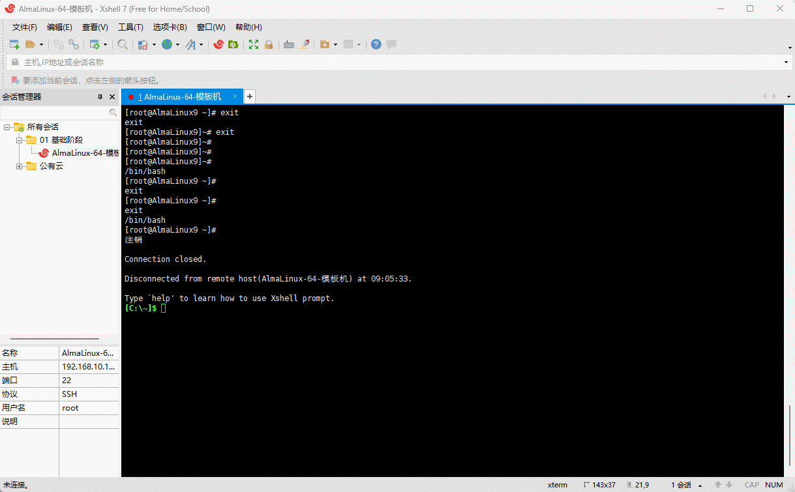
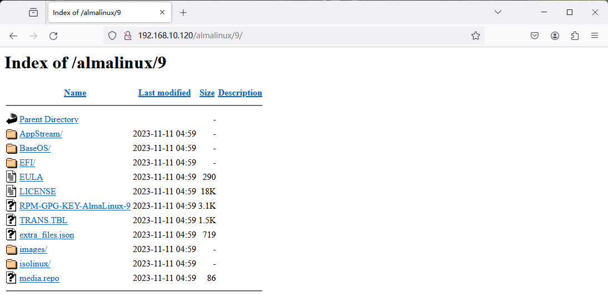
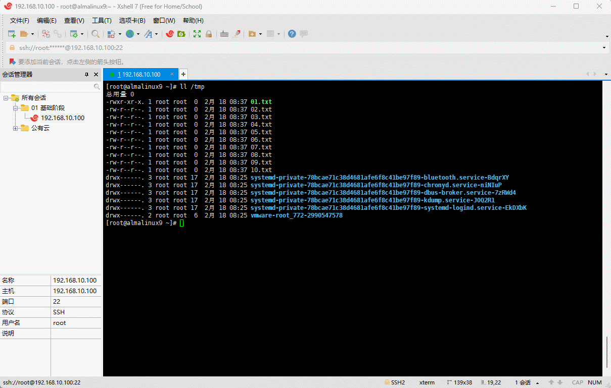
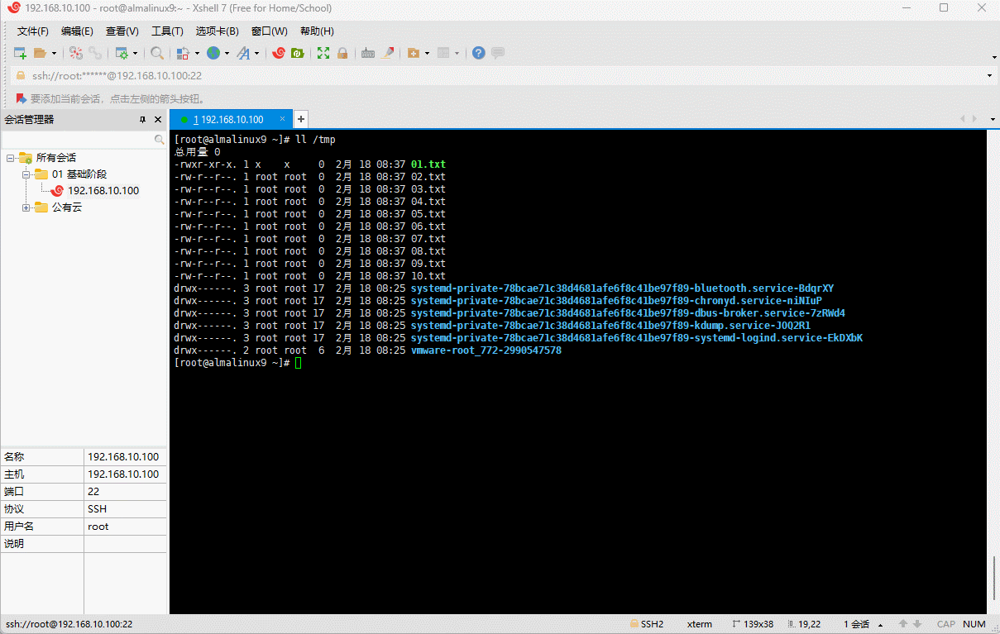
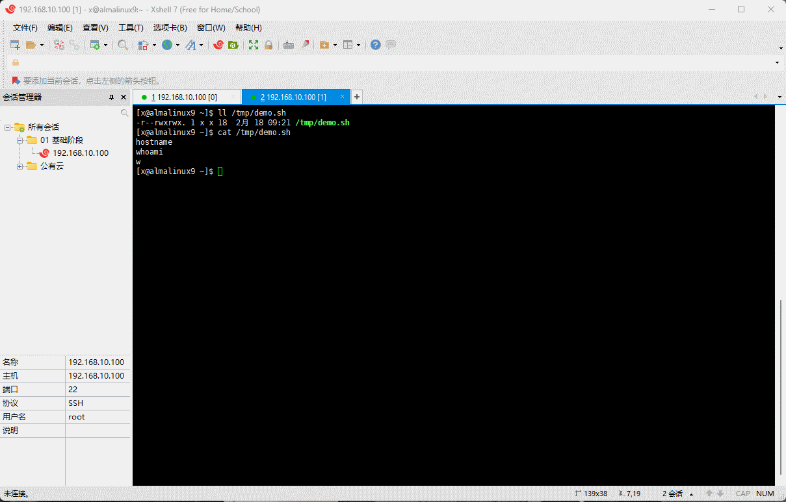
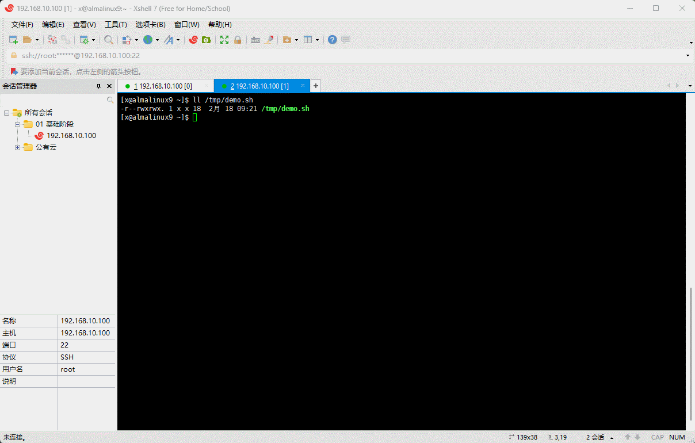
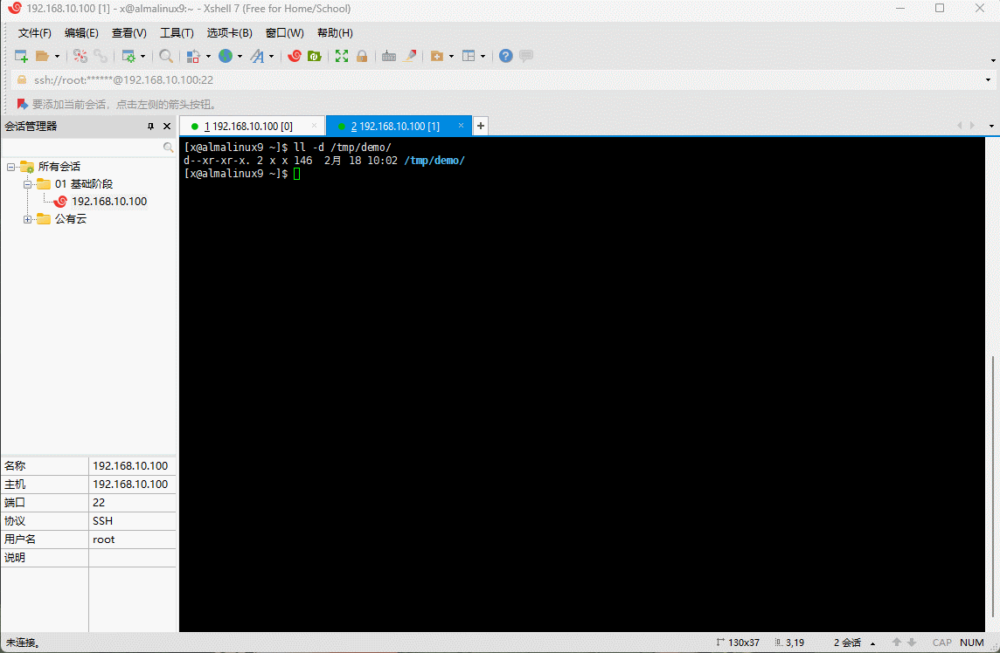

# 第一章：手动搭建 YUM 私有仓库

## 1.1 概述

* 我们借助 httpd 服务器软件来搭建 YUM 仓库，并作为其它服务器的 YUM 源，即：


> 注意⚠️：
>
> * ① Linux 服务器（YUM 仓库）的地址是 192.168.10.120 ，而 Linux 服务器（内网）的仓库是 192.168.10.100 。
> * ② 实际工作中，推荐使用 `nexus3` 来搭建 YUM 仓库。

* 所有的服务器（YUM 仓库和内网）均需关闭防火墙，以防止防火墙干扰实验：

```shell
systemctl disable --now firewalld
```


## 1.2 配置 Linux 服务器（YUM 仓库）

* 前提条件：Linux 服务器（YUM 仓库）需要挂载 CD-DVD （ISO 镜像文件），即：


> 注意⚠️：在实际工作中，无需挂载 CD-DVD ，因为 CD-DVD 已经属于淘汰的技术了，可以将 CD-DVD 中的数据复制到指定的目录中。

* 安装 httpd 服务器：

```shell
dnf -y install httpd
```


* 在 `/var/www/html` 目录下创建 `almalinux/9` 目录：

```shell
cd /var/www/html
```

```shell
mkdir -pv almalinux/9
```



* 查看块设备情况：

```shell
lsblk -f
```


* 将 CD-ROM 挂载到 `/var/www/html/almalinux/9` 中：

```shell
mount /dev/sr0 /var/www/html/almalinux/9
```


* 启动 httpd ：

```shell
systemctl enable --now httpd
```


* 通过浏览器测试访问：

```shell
http://192.168.10.120/almalinux/9
```



* 对于像 extras 这样的 YUM 仓库，在 CD-ROM 中是不存在，可以使用如下的命令，将互联网上的 YUM 仓库下载到本地：

```shell
dnf reposync --repoid=extras --download-metadata -p /var/www/html/almalinux
```

> 注意⚠️：
>
> * ① 之所以这么配置，是因为 `/var/www/html/almalinux/9` 是挂载目录，而挂载目录是只读的，不可以创建和删除内容。
> * ② 上述配置的前提是，本机有 extras 仓库，并且该仓库是开启状态。


* 通过浏览器查看 extras 仓库：

```shell
http://192.168.10.120/almalinux/
```



## 1.3 配置 YUM 源

* 所有的内网服务器配置 YUM 源：

```shell
dnf config-manager --disable \* # 关闭所有的仓库
```

```shell
tee /etc/yum.repos.d/test.repo <<-'EOF'
[test-baseos]
name=AlmaLinux $releasever - test-BaseOS
baseurl=http://192.168.10.120/almalinux/9/BaseOS/
enabled=1
gpgcheck=1
countme=1
gpgkey=http://192.168.10.120/almalinux/9/RPM-GPG-KEY-AlmaLinux-9
metadata_expire=86400
enabled_metadata=1

[test-BaseOS]
name=AlmaLinux $releasever - test-AppStream
baseurl=http://192.168.10.120/almalinux/9/AppStream/
enabled=1
gpgcheck=1
countme=1
gpgkey=http://192.168.10.120/almalinux/9/RPM-GPG-KEY-AlmaLinux-9
metadata_expire=86400
enabled_metadata=1

[test-extras]
name=AlmaLinux $releasever - test-extras
baseurl=http://192.168.10.120/almalinux/extras/
enabled=1
gpgcheck=1
countme=1
gpgkey=http://192.168.10.120/almalinux/9/RPM-GPG-KEY-AlmaLinux-9
metadata_expire=86400
enabled_metadata=1
EOF
```



* 生成缓存：

```shell
dnf makecache
```


* 安装软件进行测试：

```shell
dnf -y install java-21*
```


# 第二章：编译（源码）安装

## 2.1 安装 cmatrix

* 下载源码：

```shell
wget https://github.com/abishekvashok/cmatrix/releases/download/v2.0/cmatrix-v2.0-Butterscotch.tar
```


* 安装依赖：

```shell
dnf -y install gcc make autoconf ncurses-devel
```


* 解压到指定目录：

```shell
tar -xvf cmatrix-v2.0-Butterscotch.tar -C /usr/local/src
```


* 配置：

```shell
cd /usr/local/src/cmatrix
```

```shell
./configure --prefix=/usr/local/cmatrix
```


* 查看 CPU 核数：

```shell
lscpu 
```



* 编译和安装：

```shell
make -j 2 && make install
```



* 使用软链接将 cmatrix 命令链接到 /usr/local/bin 目录下：

```shell'
ln -sv /usr/local/cmatrix/bin/cmatrix /usr/local/bin
```


* 查看 cmatrix 的命令帮助路径：

```shell
tree /usr/local/cmatrix/
```


* 配置 cmatrix  命令帮助手册：

```shell
vim /etc/man_db.conf
```

```shell {4}
MANDATORY_MANPATH                       /usr/man
MANDATORY_MANPATH                       /usr/share/man
MANDATORY_MANPATH                       /usr/local/share/man
MANDATORY_MANPATH                       /usr/local/cmatrix/share/man  # 增加
```


* 测试 cmatrix  命令帮助手册是否配置成功：

```shell
man cmatrix  
```


## 2.2 安装 httpd

* 关闭防火墙和 SELinux：

```shell
# 查看 SELinux 是否开启
getenforce
# 查看 SELinux 是否开启
cat /etc/selinux/config
# 永久关闭 SELinux ，需要重启
sed -i 's/enforcing/disabled/' /etc/selinux/config
# 关闭当前会话的 SELinux ，重启之后无效
setenforce 0
# 查看 SELinux 是否开启
cat /etc/selinux/config
```

```shell
systemctl disable --now firewalld
```


* 查看系统是否安装有 httpd ：

```shell
dnf list --installed | grep httpd
```


* 卸载系统自带的 httpd ：

```shell
dnf -y remove httpd* 
```


* 查看是否卸载成功：

```shell
dnf list --installed | grep httpd
```


* 删除默认的系统用户（服务用户）：

```shell
useradd -r apache
```


* 下载源码：

```shell
wget -P /usr/local/src https://dlcdn.apache.org/httpd/httpd-2.4.59.tar.gz
```


* 安装依赖：

```shell
dnf -y install gcc make apr-devel apr-util-devel pcre-devel openssl-devel redhat-rpm-config
```


* 解压：

```shell
cd /usr/local/src/
```

```shell
tar -xvf httpd-2.4.59.tar.gz
```


* 配置：

```shell
cd httpd-2.4.59
```

```shell
./configure --prefix=/usr/local/apache2 --enable-ssl
```


* 编译和安装：

```shell
make -j 2 && make install
```


* 创建指定的用户，并以该用户运行 httpd ：

```shell
useradd -r -s /sbin/nologin -u 48 -c Apache apache
```

```shell
vim /usr/local/apache2/conf/httpd.conf
```

```shell
User apache # 167 行
Group apache # 167 行
```


* 使用软链接将 httpd 命令链接到 /usr/local/bin 目录下：

```shell
ln -sv /usr/local/apache2/bin/httpd /usr/local/bin
```


* 配置 httpd 命令帮助手册：

```shell
vim /etc/man_db.conf
```

```shell
MANDATORY_MANPATH                       /usr/man
MANDATORY_MANPATH                       /usr/share/man
MANDATORY_MANPATH                       /usr/local/share/man
MANDATORY_MANPATH                       /usr/local/apache2/man  # 增加
```


* 配置 systemd ：

```shell
tee /usr/lib/systemd/system/httpd.service <<'EOF'
[Unit]
Description=The Apache HTTP Server
Wants=httpd-init.service
After=network.target remote-fs.target nss-lookup.target httpd-init.service
Documentation=man:httpd.service(8)

[Service]
Type=simple
Environment=LANG=C

ExecStart=/usr/local/bin/httpd  -k start -DFOREGROUND
ExecReload=/usr/local/bin/httpd  -k graceful
ExecStop=/usr/local/bin/httpd  -k graceful-stop
# Send SIGWINCH for graceful stop
KillSignal=SIGWINCH
KillMode=mixed
PrivateTmp=true
OOMPolicy=continue

[Install]
WantedBy=multi-user.target
EOF
```


* 启动 httpd ：

```shell
systemctl daemon-reload
```

```shell
systemctl enable --now httpd
```



* 浏览器测试访问：

```shell
http://192.168.10.100:80
```


# 第三章：Ubuntu 软件包管理（⭐）


