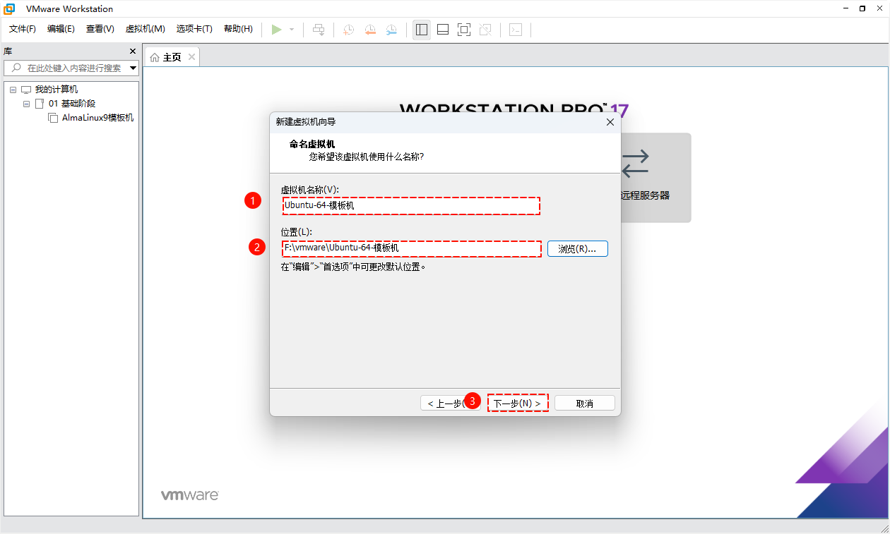
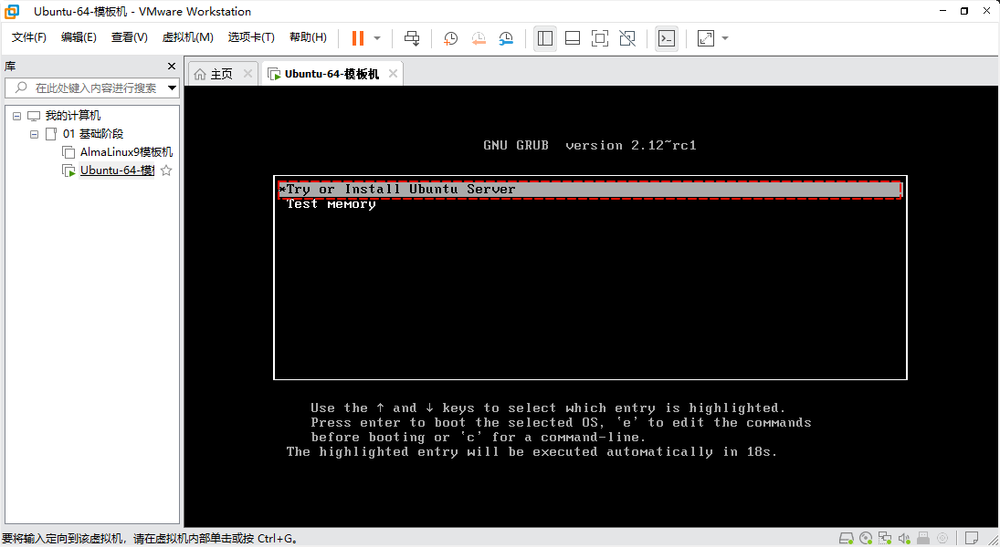
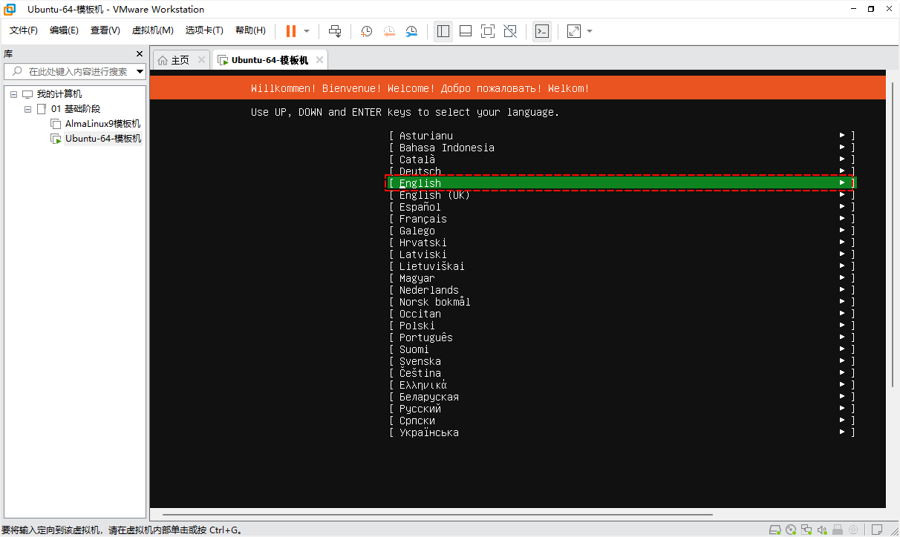

# 第一章：服务管理命令（⭐）

## 1.1 概述

* 在 RHEL 7 + 之后，主要使用 `systemctl` 来管理服务，其融合了之前 service 和 chkconfig 的功能于一体。
* systemctl 管理服务的功能如下：
  * ① 开机自动启动或禁止开机自动启动。
  * ② 管理正在运行的服务。

## 1.2 systemctl 常用功能和选项

### 1.2.1 概述

* systemctl 常用功能和选项：



### 1.2.2 查看服务状态

* 命令：

```shell
systemctl status 服务名1 服务名2 ...
```


* 示例：查看防火墙状态

```shell
systemctl status firewalld
```


### 1.2.3 开启服务、关闭服务、重启服务

* 命令：

```shell
# 开启服务
systemctl start 服务名
```

```shell
# 关闭服务
systemctl stop 服务名
```

```shell
# 重启服务
systemctl restart 服务名
```


* 示例：关闭防火墙

```shell
systemctl stop firewalld
```


* 示例：启动防火墙

```shell
systemctl start firewalld
```


* 示例：重启防火墙

```shell
systemctl restart firewalld
```


### 1.2.4 服务开机自启、禁止服务开机自启

* 命令：

```shell
# 服务开机自启
systemctl enable 服务名
```

```shell
# 禁止服务开机自启
systemctl disable 服务名
```

> 注意⚠️：有的时候，可能会看到如下的写法
>
> * ① `systemctl enable --now 服务名` 和 `systemctl enable 服务名 以及 systemctl start 服务名` 是等价的。
> * ② `systemctl disable--now 服务名` 和 `systemctl disable 服务名 以及 systemctl stop 服务名` 是等价的。


* 示例：设置防火墙禁止开机自启

```shell
systemctl enable firewalld
```


* 示例：设置防护墙开机自启

```shell
systemctl disable firewalld
```


### 1.2.5 查看所有服务运行状况（启动、关闭等）

* 命令：

```shell
systemctl list-units
```


* 示例：

```shell
systemctl list-units
```


### 1.2.6 查看所有开机服务（开机自启、禁止开机自启）

* 命令：

```shell
systemctl list-unit-files
```


* 示例：

```shell
systemctl list-unit-files
```


## 1.3 利用 systemctl 添加自定义服务

### 1.3.1 概述

* systemd 有`系统服务`和`用户服务`之分，其中：
  * 系统服务文件通常都在 `/usr/lib/systemd/system/` 目录中。
  * 用户服务文件通常在 `/etc/systemd/system/` 目录中。

> 注意⚠️：
>
> * ① 服务文件都是以 `xxx.service` 命名。
> * ② 如果自定义，通常建议存放在`用户服务文件目录`中，即：`/etc/systemd/system/` 目录中。

* 查看系统服务文件：

```shell
 ll /usr/lib/systemd/system/ | head -n 20
```


* 查看用户服务文件：

```shell
ll /etc/lib/systemd/system | head -n 20
```


### 1.3.2 查看 nginx 的服务配置文件

* 安装 nginx ：

```shell
dnf -y install nginx
```


* 查看 nginx 的相关文件：

```shell
rpm -ql nginx
```


* 查看 nginx 服务配置文件内容：

```shell
cat /usr/lib/systemd/system/nginx.service
```


* 内容如下：

```
[Unit]
Description=The nginx HTTP and reverse proxy server # 服务的剪短描述
After=network-online.target remote-fs.target nss-lookup.target # 定义了服务启动的顺序，有 After 和 Before ，其中 After 表示在 xxx 服务之后启动
Wants=network-online.target # 服务的 "弱依赖"，即 Nginx 服务希望在 network-online.target 启动后启动，但如果 network-online.target 没有启动，Nginx 仍然可以启动。

[Service]
Type=forking # 定义了服务的类型，forking 表示服务会启动一个子进程，然后退出。这通常用于传统的守护进程。
PIDFile=/run/nginx.pid # 指定了服务进程 ID (PID) 文件的位置
# Nginx will fail to start if /run/nginx.pid already exists but has the wrong
# SELinux context. This might happen when running `nginx -t` from the cmdline.
# https://bugzilla.redhat.com/show_bug.cgi?id=1268621
ExecStartPre=/usr/bin/rm -f /run/nginx.pid # 在启动服务之前执行的命令
ExecStartPre=/usr/sbin/nginx -t # 在启动服务之前执行的命令
ExecStart=/usr/sbin/nginx # 实际启动服务的命令
ExecReload=/usr/sbin/nginx -s reload # 用于重新加载服务配置的命令
KillSignal=SIGQUIT # 定义了停止服务时发送的信号
TimeoutStopSec=5 # 定义了服务停止操作的超时时间
KillMode=mixed # 定义了停止服务时的行为。mixed 表示同时发送 SIGTERM 和 SIGKILL 信号。
PrivateTmp=true # 为服务创建一个独立的临时文件空间，以提高安全性。

[Install]
WantedBy=multi-user.target # 定义了服务应该链接到哪个目标（target）。multi-user.target 是一个标准的目标，表示多用户运行级别。将服务链接到这个目标意味着在系统进入多用户模式时，Nginx 服务将自动启动。
```

> 注意⚠️：
>
> * ① 在实际工作中，如果软件包是编译（源码）安装的方式，我们就可以参考 nginx 的 服务配置文件，来让 systemctl 来管理服务的状态。
> * ② 在编写完服务配置文件之后，需要先执行 `systemctl daemon-reload` 刷新配置，然后才能通过 `systemctl start|stop|restart` 等命令来管理服务。


# 第二章：运行级别

## 2.1 概述

* 在 RHEL7 之前，`运行级别（run levels）`是一组预定义的`系统启动和运行状态`，它们定义了哪些服务和进程应该在系统启动时运行。运行级别通常用于控制多用户环境的类型，如：

| 运行级别（run levels） | 备注                                               |
| ---------------------- | -------------------------------------------------- |
| 0                      | 关机。                                             |
| 1                      | 单用户模式，只允许一个用户登录，通常用于系统维护。 |
| 2                      | 多用户模式，没有网络支持。                         |
| 3                      | 多用户模式，有网络支持，但无图形界面。             |
| 4                      | 未使用，待开发使用。                               |
| 5                      | 多用户模式，有网络支持，并且启动图形界面。         |
| 6                      | 重启（reboot）模式，系统重启。                     |

* 但是，随着时间的推移，开发者觉得上述的划分实在是太繁琐了，于是就使用`目标（target）`来取代`运行级别`的概念，并且`目标（target）代表了系统的一种状态`，如下：

| 运行级别（run levels） | 目标（target）    | 备注           |
| ---------------------- | ----------------- | -------------- |
| 0                      | poweroff.target   | 关机           |
| 1                      | rescue.target     | 救援模式       |
| 2                      | multi-user.target | 多用户模式     |
| 3                      | multi-user.target | 多用户模式     |
| 4                      | multi-user.target | 多用户模式     |
| 5                      | graphical.target  | 图形化界面模式 |
| 6                      | reboot.target     | 重启模式       |

* 可以通过如下的命令来查看：

```shell
ll /usr/lib/systemd/system/runlevel*.target
```


> 注意⚠️：之所以是软链接，是为了兼容之前的版本（RHEL 7 之前，如：CentOS 6.x）。

## 2.2 相关命令

* 查看当前系统的运行级别：

```shell
systemctl get-default
```

* 修改运行级别：

```shell
systemctl set-default graphical.target #multi-user.target
```

> 注意⚠️：在实际工作中，不会修改为图形化界面。

* 临时切换运行级别：

```shell
init 0 # 关机
```

```shell
init 6 # 重启
```


# 第三章：Linux  启动流程

* Linux 的启动流程如下：
  * ① **通电**：当按下电源按钮，计算机开始通电。
  * ② **BIOS/UEFI 启动**：
    * BIOS（或 UEFI）固件开始执行，进行硬件自检（POST）。
    * 这个过程检查计算机的硬件设备，如：内存、硬盘、键盘、鼠标等是否正常工作。
  * ③ **引导加载器（Bootloader）**：
    * 如果硬件自检成功，BIOS/UEFI 会查找可启动的设备，如：硬盘、USB 设备或光盘。
    * 它将加载引导加载器（如 GRUB 或 systemd-boot）到内存中。
    * 引导加载器负责加载 Linux 内核和初始 RAM 磁盘（initrd 或 initramfs）。
  * ④ **内核加载和初始化**：
    * 引导加载器将控制权交给 Linux 内核。
    * 内核开始加载，初始化硬件设备，设置内存空间，创建进程和线程结构。
    * 内核还会挂载根文件系统（如果配置了启动加载器的自动挂载）。
  * ⑤ **init 进程（PID 1）**：
    * 内核初始化完成后，它会启动 init 进程，这是系统中的第一个用户空间进程，PID 为 1。
    * 在 System V init 系统中，init 进程会读取 `/etc/inittab` 文件来决定进入哪个运行级别。
    * 在 systemd 系统中，init 进程被 systemd 所取代，systemd 会根据配置的目标（target）来启动服务（目前的 Linux 版本大多数都是这种）。
  * ⑥ **读取运行级别**：init 进程（或 systemd）会读取当前的运行级别或目标（通过读取`/etc/systemd/system/default.target`文件）。
  * ⑦ **系统初始化**：设置主机名、开启网络，自动挂载等（通过读取 `/usr/lib/systemd/system/sysinit.target`文件 实现）。
  * ⑧ **并行启动各种服务**：通过读取 `/usr/lib/systemd/system/` 目录下的`系统服务文件`以及 `/etc/systemd/system/`目录下的`用户服务文件`，并行启动各种服务。
  * ⑨ **用户登录**：
    * 服务启动完成后，系统通常会进入多用户目标（multi-user.target），这时用户可以通过控制台或远程登录到系统。
    * 在图形界面（graphical.target）的情况下，显示管理器（如： GDM 或 SDDM）会启动，允许用户登录到图形桌面环境。
    * 通过读取 `/usr/lib/systemd/system/getty.target` 服务文件实现。
  * ⑩ **用户空间操作**：
    * 用户登录后，可以开始运行应用程序、执行命令和进行各种操作。
    * 用户空间的进程由 init 进程（System V）或 systemd（systemd 系统）管理。

* 其对应的流程图，如下所示：


# 第四章：root 密码忘记如何解决？

* ① 重启 Linux ：


* ② 在 grub 菜单，选择当前使用的内核（默认是最新的，即第 1 个），根据提示，按住 `e` 来编辑内核：


* ③ 在含有 `ro`（只读权限）的所在行，输入 `END` 键到该行的末尾，输入 `rw init=/bin/bash`：


* ④ 修改完毕之后，执行 `ctrl + x` 启动系统，进入救援模式：



* ⑤ 用户是否对安装了操作系统的文件系统具有读写访问权限：

```shell
mount | grep -w /
```


* ⑥ 修改 root 密码，并重启：

```shell
# 明文修改密码
echo '123456' | passwd --stdin root
```

```shell
# 创建隐藏文件 /.autorelabel , 让 selinux 重新打标签
touch /.autorelabel
```

```shell
# 重启
exec /sbin/init
```



